# Spring源码深度解析

- [ ] 书籍作者: 
- [ ] 笔记时间: 2021.02.12

## 第 1 部分 核心应用

### 第 1 章 Spring 整体架构和环境搭建

#### 1.1 Spring 的整体架构

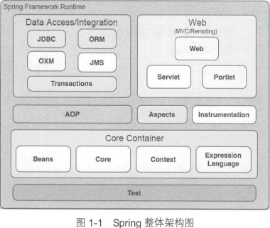

1. Core Container

   Core 和 Beans 是框架的基础部分,提供IoC和DI.基础概念是BeanFactory,提供对 Factory 模式的经典实现来消除对程序’性单例模式的需要 。

   - Core 框架核心工具类,其他模块都要用到.
   - Beans模块是所有应用都要用到,包含配置文件,IoC/DI.
   - Context模块块在两者之上,提供类似JNDI注册器的框架式对象访问方法.添加了国际化,事件传播,资源加载的支持.

2. Data Access/Integration

   - JDBC模块提供了JDBC抽象曾,消除冗余JDBC编码.
   - ORM模块为 对象-关系 映射API
   - OXM模块提供了对 Object-XML 映射实现的抽象,包括 JAXB,Castor等
   - JMS 包含制造和消费消息的特性
   - Transaction 模块支持编程和声明性的事务管理

3. Web

   建立在Context模块之上.简化请求和参数绑定.

   - Web模块.提供了基础的面向 Web 的集成特性 . 例如,多文件上传 、使用 servlet listeners
     初始化 IoC 容器以及一个面向 Web 的应用上下文 。
   - Web - Servlet模块:该模块包含 Spring 的 model-view-controller ( MVC)实现 。
   - Web-Porlet模块,提供用于Portlet环境和Web-Servlet模块的MVC实现.

4. AOP

   提供了一个AOP实现,可以定义方法拦截器和切点,并且提供了事务管理服务.

   - Aspects 模块提供了对 AspectJ 的集成支持 。
   - Instrumentation 模块提供了 class instrumentation 支持和 classloader 实现, 使得可以在特
     定的应用服务器上使用 。

5. Test

#### 1.2 环境搭建

使用github拉取项目,用gradle导入idea.

需要安装好gradle和aspectJ环境.

--- 以上是书籍搭建环境方法------

参考 https://blog.csdn.net/aaron0797/article/details/104424462进行搭建:

1. 下载gradle 的all版本,版本不用太高,配置环境变量和加速

2. 下载spring源码并修改 build.gradle,添加仓库,注释注释configurations.all 

3. ` gradlew :spring-oxm:compileTestJava` 

4. 导入idea,修改gradle.properties

   ```properties
   org.gradle.daemon=true
   org.gradle.jvmargs=-Xmx2048m -XX:MaxPermSize=512m -XX:+HeapDumpOnOutOfMemoryError -Dfile.encoding=UTF-8
   org.gradle.parallel=true
   org.gradle.configureondemand=true
   ```

5. setting.gradle

   ```gradle
   # 在第一行插入,这一行要删掉
   pluginManagement {
   	repositories {
   		maven { url "https://maven.aliyun.com/repository/public" }
   		gradlePluginPortal()
   		maven { url 'https://repo.spring.io/plugins-release' }
   	}
   }
   ```

   

### 第 2 章 容器的基本实现

#### 2.1 容器基本用法

定义一个bean,在xml中指定,获取bean的上下文就可以得到对象.

这里使用的是BeanFactory

#### 2.2 功能分析

- 读取配置文件 -- ConfigReader(读取并验证配置文件) 
- 找到类并实例化 -- ReflectionUtil,用于根据配 直文件中的自己直进行反射实例化
- 调用实例化对象 -- App 将完成逻辑串联

这里用三个类来表示,但是真的就这么简单码?

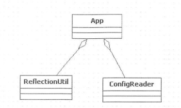

#### 2.3 工程搭建

功能实现在 org.springframework.beans 里面

#### 2.4 Spring的结构组成

##### 2.4.1 beans包的层级结构

跟maven结构没什么差别

##### 2.4.2 核心类介绍

1. DefaultListableBeanFactory

   XmlBeanFactory 继承向 DefaultListableBeanFactory，而后者是整个 bean 加载的核心部分，是 Spring 注册及加载 bean 的默认实现.前者实现了定制的BeanDefinitionReader.
   
   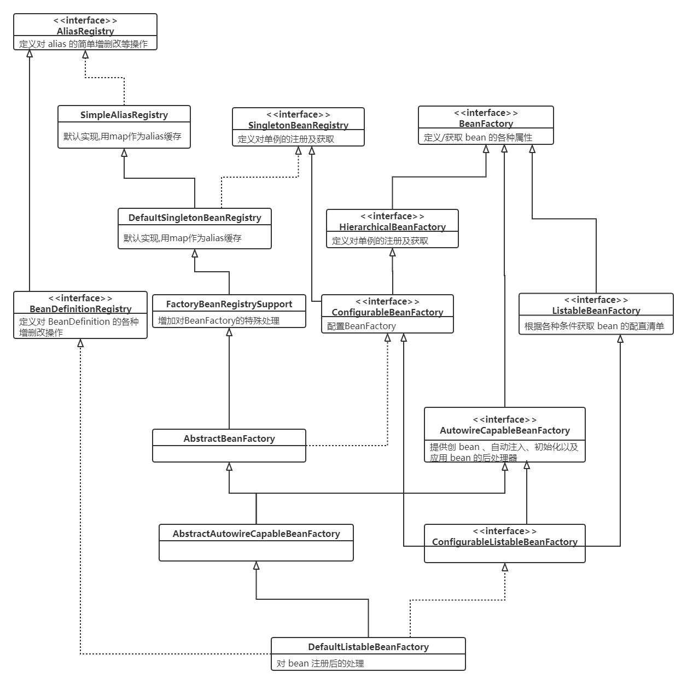

2. XmlBeanDefinitionReader

   XML配置文件的读取
   
   - ResourceLoader ：定义资源加载器
   - BeanDefinitionReader ：主要定义资源文件读取并转换为 BeanDefinition 的各个功能
   - DocumentLoader ：定义从资源、文件加载到转换为 Document 的功能
   - BeanDefinitionDocumentReader ：定义读取 Docuemnt 并注册 BeanDefinition 功能
   
   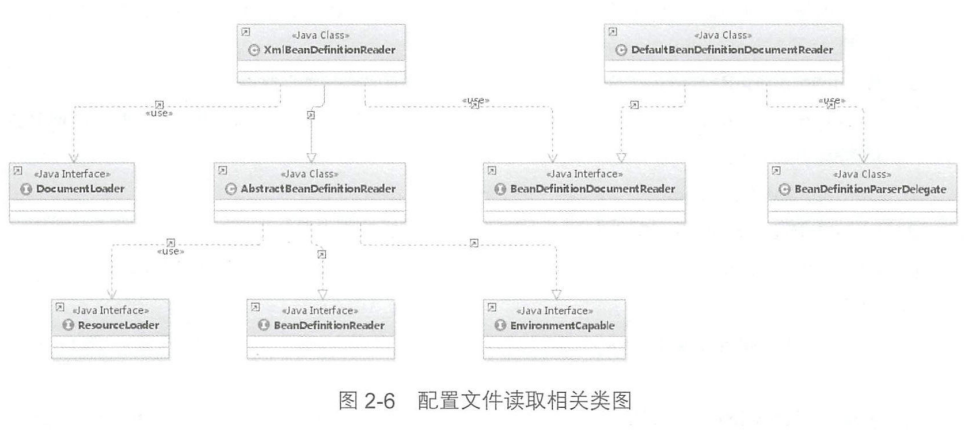

可以推断出处理步骤:

1. 使用ResourceLoader将资源文件路径转为对应的Resource文件.(AbstractBeanDefinitionReader)

2. 通过DocumentLoader 对 Resource 文件进行转换

3. DefaultBeanDefinitionDocumentReader 对Document 进行解析

    BeanDefinitionParserDelegate 对element 进行解析

#### 2.5 容器的基础XmlBeanFactory

```java
BeanFactory bf = new XmlBeanFactory(new ClassPathResource ("beanFactoryTest.xml"));
```

##### 2.5.1 配置文件封装

Java利用URL进行抽象不同资源,通过不同的handler(URLStreamHandler)进行处理.但是没有默认的Classpath等,需要自定义进行解析.所以Spring使用自己的Resource 接口封装底层资源.

InputStreamSource 任何能返回 InputStream 的类.

Resource 接口抽象了所有 Spring 内部使用到的底层资源： File , URL , Classpath 等

通过这两者就可以获取任意文件流了

```java
Resource resource=new ClassPathResource ( "beanFactoryTest .xml ");
InputStream inputStream=resource.getinputStream();
-------底层实现也是比较简单的-----------
if (this.clazz != null ) { 
	is = this.clazz.getResurceAsStream(this.path)
}else { 
	is= this.classLoader.getResourceAsStream(this.path} ;    
}
```

----

已经获得Resource,接下去看XmlBeanFactory如何初始化.

```java
//  XmlBeanFactory 源码
// 先调用父类方法
ignoreDependencyInterface(); //主要功能是忽略给定接口的自动装配功能
this.reader.loadBeanDefinitions(resource); // 这里才是真正的加载
```

##### 2.5.2 加载 Bean

1. 封装资源文件

   > 使用EncodedResource封装Resource,主要体现在getReader(),使用编码;

2. 获取输入流

   > 从Resource获取输入流并包装成 org.xml.sax.InputSource ;
   >
   > 进入 doLoadBeanDefinitions();

3. 进入逻辑核心部分

   > 获取对 XML 文件的验证模式
   >
   > 加载 XML 文件，并得到对应的 Document
   >
   > 根据返回的 Document 注册 Bean 信息

#### 2.6 获取XML的验证模式

常用的验证模式有两种： DTD XSD

##### 2.6.1 DTD与XSD区别

DTD ( Document Type Definition ）即文挡类型定义,属于 XML 文件组成的一部分。一个 DTD 文档包 ：元素的定义规 ，元素间关系的定义规则 ，元素可使用 属性， 可使用的实体或符号规则

XML Schema XSD ( XML Schemas Definition ).XML Schema 本身是 XML 文档 它符合 XML 语法结构 可以用通用的 XML 解析器解析它.使用时候需要声明名称空间并且指定对应的XML Schema文档存储位置.

##### 2.6.2 验证模式的读取

优先使用指定的模式,如果没有就检测模式.Spring 来检测验证模式的办法就是判断是荷包 DOCTYPE ，如果含就是 DTD ，否则就 XSD

#### 2.7 获取Document

委托给了 DocumentLoader 接口去执行，而 正调用的 DefaultDocumentLoader

通过 SAX 解析 XML 文档的套路大致都差不多,需要注意的是EntityResolver

##### 2. 7 .1 EntityResolver 用法

如果 SAX 应用程序自定义处理外部实体，则必须实现此接口并使用 setEntityResolver方法向 SAX 驱动器注册一个实例--也就是需要先读取声明,找到DTD定义,以便验证.默认使用网络,通过自定义方式可以在本地查找DTD.

Spring 使用 DelegatingEntityResolver 类为 EntityResolver 实现类， 

- 加载 DTD 类型的 BeansDtdResolver resolveEntity 是直接截取 systemld 最后的 xx.dtd,然后去当前路径下寻找，
- 加载 XSD 类型的 PluggableSchemaResolver 类的 resolveEntity 是默认到 META-INF/Spring.schemas 文件巾找到 systemid 所对应的 XSD 文件并加载

#### 2.8 解析及注册BeanDefinitions

提取及注册 bean的处理类是 BeanDefinitionDocumnentReader,默认是先是DefaultBeanDefinitionDocumentReader,工作之一就是提取root.

doRegisterBeanDefinitions 算是真正开始进行解析

主要步骤 处理profile,专门处理解析,解析前置处理,解析处理,解析后置处理 其中前后置处理可以通过子类覆盖实现.

##### 2.8.1 profile属性的使用

注册 bean 的最开始是对 PROFILE_ATTRIBUTE 属性的解析,profile用于切换不同环境.

首先程序会获取 bean 节点是否定义了profile 属性，如果定义了则会需要到环境变量去寻找

##### 2.8.2 解析并注册BeanDefinition

对于根节点或者子节点如果是默认命名空间的话 采用 parseDefaultElement 方法进行解析，否则使用delegate.parseCustomElement 方法对自定义命名 间进行解析

node.getNamespaceURI（）获取命名空间，并与 Spring 中固定的命名空间 http://www.springframework.org/scherna/beans 进行比对,一致则是默认.

### 第3章 默认标签的解析

默认标签是在 parseDefaultElement 函数中进行,处理四种不同标签(import,alias,bean和beans) 

#### 3.1 bean标签的解析及注册

processBeanDefinition()

1. 委托给BeanDefinitionDelegate 类的 parseBeanDefinitio nE lement 方法进行元素解析，返回 BeanDefinitionHolder 类型的实例 bdHolder
2. bdHolder 不为空的情况下存在默认标签子节点下再有自定义属性,需要再次对自定义标签进行解析
3. 解析完成委托给BeanDefinitionReaderUtils的 regiserBeanDefinition 方法
4. 发出响应事件,通知相关监视器.

##### 3.1.1 解析BeanDefinition

BeanDefinitionDelegate 类的 parseBeanDefinitionElement 方法

1. 提取id 和 name 属性.
2. 进一步解析并封装到GenericBeanDefinition 类型的实例中
3. 如果没检测到beanName,则自动生成beanName
4. 将获取的信息封装到BeanDefinitionHolder实例

第2步详解:

1. 创建用于属性承载的 BeanDefinition

   > 默认有三种实现,对应bean标签,属性一一对应.
   >
   > RootBeanDefinition 是最常用的实类，它对应 般性的\＜bean\＞元素标签
   >
   > GenericBeanDefinition是2.5以后加入的bean文件配置属性定义类,是一站式服务类
   >
   > Spring使用BeanDefinition对应bean标签,注册到BeanDefinitonRegistry中,主要用map保存(就像Spring配置信息的内存数据库),后续都是从BeanDefinitonRe istry读取配置信息.

2. 解析各种属性

   > parsBeanDefinitionAttributes,完成对所有bean属性的解析,比如 singleton,lazy-init 等.

3. 解析子元素 meta

   > 不会体现在具体bean实例的属性中,而是可以通过过 ea Defin on ge ute(key）方法进行获取.

4. 解析子元素 lookup-method

   > 称它为获取器注入.Spring in Action : 获取器注入是 种特殊的方法注入，它是把一个方法声明为返回某种类型的 bean ，但实际要返回的 bean 是在配置文件里面配置的，此方法可用在设计有些可插拔的功能上，解除程序依赖

5. 解析子元素 replaced-method

   > 不但可以动态地替换返回实体 bean ，而且还能动态地更改原有方法的逻辑
   >
   > 无论是 look-up rep laced-method 是构造了 MethodOvem ，并最终记录在了 AbstractBeanDefin ition 中的 methodOverrides 属性中

6. 解析子元素 constructor-arg

   > 非常有用,也非常复杂.
   >
   > 提取完必要的属性后（ index type name)进行以下操作:
   >
   > 1. 解析constructor-arg子元素,封装解析出来的子元素(使用 ConstructorArgumentValues. ValueHolder)
   >
   > 2. index指定的情况下,添加至当前BeanDefinition的constructorArgumentValues indexedArgumentValues 属性中;
   >
   >    否则,genericArgumentValues 属性中
   >
   > 对构造函数中属性元素的解析，经历了以下几个过程
   >
   > 1. 略过description 或者 meta
   > 2. 提取 constructor-arg的ref和value属性,以便验证正确性.以下情况不存在
   >    - ref和value同时存在
   >    - 存在ref或者value属性 且又有子元素
   > 3. ref处理,使用RuntimeBeanReference 
   > 4. value 属性的处理 使用 TypedSpringValue 
   > 5. 子元素处理.parsePropertySubElement 中实现了对各种子元素处理

7. 解析子元素 property

   > arsePropertyElement 函数完成了对 property 属性的提取，与构造函数注入方式不同的是将返回值使用 PropertyValues 进行封装，并记录在了 BeanDefinition 中的 propertyValues 属性中

8. 解析子元素 qualifier

   > Spring 器中匹配的候选 Bea 数目必须有且仅有1个.多个匹配时候需要使用qualifier指定.

##### 3.1.2 AbstractBeanDefinition属性

大部分通用属性都保存在了 bstractBeanDefinition中.

##### 3.1.3 解析默认标签中的自定义标签元素

```java
bdHolder = delegate.decorateBeanDefinitionlfRequired(ele, bdHolder);
```

如果需要的话就对 beanDefinition 进行装饰.Spring 中的 bean 使用的 默认的标签配置，但是其中的子元素却使用了 自定义的配置时，就需要进行该代码了.

1. 对于程序默认标签的处理其实是直接略过
2. 自定义的标签或者 bean 的定义属性,寻找自定义标签和命名空间处理器,进一步解析.

##### 3.1.4 注册解析的BeanDefinition

```java
BeanDefinitionReaderUtils.RegisterBeanDefinition(bdHold,getReaderContext().getRe istry());
```

1. 通过beanName注册BeanDefinition 
   1. AbstractBeanDefinition 的校验,针对methodOverrides属性
   2. 对beanName已经注册的情况处理,默认覆盖,如果不允许就报错
   3. 加入map缓存,请求之前留下的beanName缓存
2. 通过别名注册BeanDefinition
   1. alias与beanName相同情况处理,名称相同则不处理并删除原有alias
   2. alias覆盖.aliasName 经使用井已经指向了另 beanName 需要用户的设置进行处理
   3. alias循环检查.如果A->B存在,出现A->B->C抛异常.
   4. 注册alias

##### 3.1.5 通知监听器解析及注册完成

目前没有做逻辑处理,只是为了扩展,监听注册BeanDefinition事件完成.可通过注册监听器方式并将处理逻辑写入监听器.

#### 3.2 alias标签的解析

除了使用id指定名称,还可以通过alias指定多个,而所有的这些名称都指向同一个 bean

都是将别名与 beanName 组成对注册至 register 中

#### 3.3 import标签的解析

import允许分模块进行配置.

1. 获取 resource 属性所表示的路径
2. 解析路径中的系统属性，格式如“$｛user.dir }”。获取location
3. 判定 location 是绝对路径还是相对路径
4. 如果是绝对路径则递归调用 bean 的解析过程，进行另一次的解析
5. 如果是相对路径则计算出绝对路径并进行解析
6. 通知监听器，解析完成

#### 3.4 嵌入式beans标签的解析

递归调用 beans 的解析过程

### 第4章 自定义标签的解析

```java
delegate.parseCustomElement(root）;
```

#### 4.1 自定义标签使用

简单可配置化 -> Spring的标准Bean 

复杂配置 -> 自定义XML进行解析,转为配置对象,繁琐,负担大.

折中方案 -> 扩展Spring自定义标签

1. 创建一个需要扩展的组件

   > 创建一个POJO,用来接收配置文件

2. 定义一个 XSD 文件描述组件内容

3. 创建一个文件，实现 BeanDefinitionParser 接口，用来解析 XSD 文件中的定义和组件定义

4. 创建一个 Handler 文件，扩展自 NamespaceHand erSupport ，目的是将组件注册到Spring容器

5. 编写 Spring.handlers Spring.schemas 文件

   > 默认位置是在工程的 META-INF／文件夹下

#### 4.2 自定义标签解析

根据对应的 bean 获取对应的命名空 ，根据命名空间解析对应的处理器,根据对应处理器进行解析

##### 4.2.1 获取标签的命名空间

已经提供实现的方法了,直接调用即可.在 org.w3c.dom.Node 中

##### 4.2.2 提取自定义标签处理器

默认处理器是  DefaultNamespaceHandlerResolver,

如果要使用自定义标签，那么其中必不可少的操作就是在 Spring.handlers 文件中配置命名空间与命名空间处理器的映射关系

getHandlerMappings 主要功能就读取 Spring.handlers 件并将配置文件缓存在 map中

##### 4.2.3 标签解析

解析过程中首先是寻找元素对应的解析器，进而调用解析器中的 parse 方法

解析后的 AbstractBeanDefinition 转化为 BeanDefinitionHolder 并注册的功能，而真正去做解析的事情委托给了函数 parselntemal,首先准备了各种信息(Class,scope,lazy-init 等),带调用自定义函数.

总结: 整体流程跟默认标签处理一致,通过暴露一些接口让用户自定义处理.

### 第5章 bean的加载

1. 转换对应 beanName 

   > - 去除FactoryBean修饰符 &
   > - 取指定alias的最终beanName

2. 尝试从缓存中加载单例

   > 会有循环依赖问题,Spring创建bean原则:不等bean创建完成就会将创建bean的ObjectFactory提早加入缓存,需要以来时候直接使用ObjectFactory

3. bean的实例化

   > 如果从缓存中得到了 bean 的原始状态，则需要对 bean 进行实例化,缓存得到的是原始状态,需要处理:比如得到的是工厂bean,就需要初始化得到工厂方法返回的bean

4. 原型模式的依赖检查

   > 只有在单例情况下才会尝试解决循环依赖

5. parentBeanFactory

   > 检测如果当前加载的 XML 置文件中不包含 beanName 所对应的配置,只能到父类工厂尝试加载.

6. 将存储 XML 配置文件的 GernericBeanDefinition 转换为 RootBeanDefinition

   > 如果父类 bean 不为空的话，则会一并合并父类的属性

7. 寻找依赖

8. 针对不同的 scope 进行 bean 的创建(默认singleton)

9. 类型转换

#### 5.1 FactoryBean的使用

一般情况下使用反射机制实例化bean.复杂情况可以使用FactoryBean来定制实例化bean逻辑.自带七十多个实现,并且支持泛型.

当\<bean\>的class属性实现类是FactoryBean时,FactoryBean#getObject（）代理了 getBean （）方法.(提一下bean标签的属性是通过对应名称的setter进行设置的)

如果需要工厂本身,在bean名字前面加上 &

#### 5.2 缓存中获取单例bean

首先尝试从缓存中加载，然后再次尝试尝试从 singletonFactories 中加载

- singletonObjects: 保存BeanName和创建bean实例之间的管理
- singletonFactories: 用于保存 BeanName 和创建 bean 的工厂之间的关系
- earlySingletonObjects ：也是保存 BeanName 和创建 bean 实例之间的关系,区别在于一个单例放进此处后,当bean还在创建过程中,就可以通过getBean()取到,用于检测循环引用
- registeredSingletons ：用来保存当前所有巳注册的 bean

#### 5.3 从bean的实例中获取对象

无论是从缓存中获得 bean 还是根据不同的 scope 策略加载 bean,getObjectForBeanl nstance 是个高频率使用的方法

1. 对FactoryBean正确性进行验证
2. 对非 Factory Bean 不做任何处理
3. bean 进行转换
4. 将从 Factory 中解析 bean 托给 getObjectFromFactoryBean

跟踪进入 4 的方法可得到以下结论:

- 权限验证后直接调用工厂的getObject()方法
- 调用后处理器, postProcessObjectFromFactoryBean 

- Spring获取bean的规则之一: 尽可能保证bean初始化后都会调用注册的BeanPostProcessor的postProcessA erlnitialization 方法进行处理

#### 5.4 获取单例

如果缓存中没有单例,就需要从头开始加载.

1. 检查缓存中是否加载过
2. 若没有加载，则记 beanName 的正在加载状态
3. 加载单例前记录加载状态
4. 通过调用参数传入的 ObjectFactory 的 getObject() 方法实例化 bean
5. 加载单例后的处理方法调用(移除状态)
6. 将结果记录至缓存并删除加载 bean 中所记录的各种辅助状态
7. 返回结果

#### 5.5 准备创建bean

真正干活的是以do开头的函数.createBean()又做了什么?

1. 根据设置的 class 属性或者根据 classname 来解析 Class
2. 对override 属性进行标记及验证(针对之前的lookup-method 和 replace-method 属性)
3. 应用初始化前的后处理器
4. 创建Bean

##### 5.5.1 处理override属性

AbstractBeanDefinition 类的 prepareMethodOverrides 方法

实现原理其实是在 bean例化的时候如果检测到存在 method Overrides 属性，会动态地为当前 bean 生成代理并使用对应的拦截器为 bean 做增强处理.

##### 5.5.2 实例化的前置处理

方法 resolveBeforelnstantiation()对BeanDefinition中的属性做些前置处理,处理保证扩展性还有一个短路判断.

当经过前置处理后返回的结果如果不为空，那么会直接略过后续 bean 的创建而直接返回结果.AOP 功能就是基于这里的判断的(两个方法: 实例化前后处理器的调用)

1. 实例化前的后处理器应用

   > 将 sractBeanDefinition 转换为 BeanWrapper 前的处理,给一个机会修改BeanDefinition

2. 实例化后的后处理器应用

   > 由于缓存获取单例不会再经历普通bean创建过程,所以只能在这里调用后置处理器.

#### 5.6 循环依赖

##### 5.6.1 什么是循环依赖

循环引用,除非有终止条件,否则就是死循环.

##### 5.6.2 Spring如何解决循环依赖

1. 构造器循环依赖

   > 表示通过构造器注入构成的循环依赖， 此依赖是无法解决的 ，只能抛出 BeanCurrentlylnCreationException 异常表示循环依赖
   >
   > Spring将每一个正在创建的bean标识符放在一个"当前创建bean池",如果创建bean过程中发现自己在池里,就跑出异常.创建万里的bean将从池里去掉.

2. setter 循环依赖

   > 通过Spring容器提前暴露刚完成构造器注入但未完成其他步骤的bean完成,只能解决单例作用域的bean循环依赖.

3. prototype 范围的依赖处理

   > 对于“prototype ”作用域 bean, Spring 容器无法完成依赖注入，因为 Spring 容器不进行缓存“prototype ”作用域的 bean ，因此无法提前暴露一个创建中的 bean

#### 5.7 创建bean

1. 如果是单例需要先清除缓存

2. 实例化bean,将Bean Definition转为BeanWrapper

   - 如果存在工厂方法就使用工厂方法初始化
   - 根据参数锁定构造器初始化
   - 都没有使用默认构造器

3. MergedBeanDefinitionPostProcessor 的应用

   > Autowired注解通过此方法实现诸如类型的预解析

4. 依赖处理

   > 是通过放入缓存中的ObjectFactory 来创建实例

5. 属性填充

6. 循环依赖检查

   > 只对单例有效,prototype若出现循环依赖会抛异常

7. 注册 DisposableBean

8. 完成并返回.

##### 5.7.1 创建bean的实例

优先使用工厂方法,如果没有就用构造器初始化实例(默认访问缓存)

1. autowireConstructor 

   1. 构造参数确定

      - 根据据 explicitArgs 参数判断
      - 从缓存中获取,有可能需要转换
      - 配置文件中获取

   2. 构造函数的确定

      根据参数个数进行匹配(先对构造函数优先参数个数排序再匹配确认);

      参数名称可以通过注解获得;工具类 ParameterNameDiscoverer 也可以获取

   3. 根据确定的构造函数转换对应参数类型

   4. 构造函数不确定性的验证

   5. 跟据实例化策略以及得到的构造函数及构造函数参数实例 Bean 

2. instantiateBean 

   直接调用实例化策略进行实例化就可以了

3. 实例化策略

   - 判断如果 beanDefinition.getMethodOverrides 为空也就是用户没有使用 replace 或者 lookup 配置方法，那么直接使用反射的方式
   - 否则必须要使用动态代理的方式将包含两个特性所对应的逻辑的拦截增强器设置进去

##### 5.7.2 记录创建bean的ObjectFactory

doCreate 函数中

- earlySingletonExposure 从字面的意思理解就是提早曝光的单例
- this.allowCircularReferences ：是否九许循环依赖,通过硬编码可以设置
- isSingletonCurrentlylnCreation(beanName）：该 bean 是否在创建中

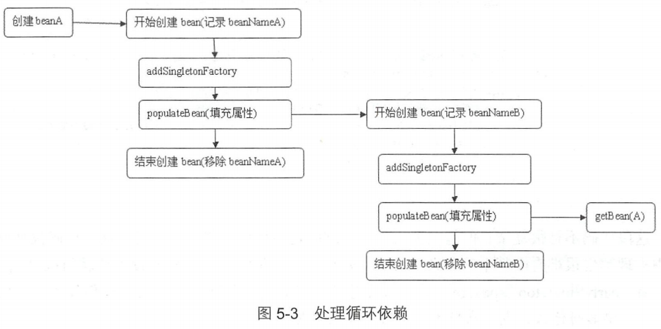

##### 5.7.3 属性注入

populateBean方法中提供这样的流程:

1. InstantiationAwareBeanPostProcessor 的 postProcessAfterinstantiation()控制是否继续填充
2. 根据注人类型（ Name/byType ），提取依赖的 bean ，并存入 PropertyValues
3. 应用 InstantiationAwareBeanPostProcess 理器的 postProcessProperlues 方法,对属性获取完毕填充前堆属性再次处理
4. 将所有 PropertyValu 属性填充至 BeanWrapper

实现细节分析

1. autowireByName

   > 在传人的 中找出已 ea 并递 例化 ，进而加 pvs

2. autowireByType

   1. 寻找需要依赖注入的属性.遍历这些属性并 找类型匹配的 bean 其中最复杂的就是 找类型匹配的 bean(支持注解方式)
   2. 把所有与 Test 匹配的类 找出来并注入到 tests 属性中
   3. 寻找类型匹配执行顺序,首先尝试解析器解析;之后对不同类型进行不同处理

3. applyPropetyValues

   获取的 PropertyValues 形式存在的，还并没有 用到已经实例化的 bean,注入在此处

##### 5.7.4 初始化bean

bean 中有 init-method 的属性,在此时处理,initializeBean()

1. 激活 Aware 方法

   实现Aware接口可以在bean初始化后,取得一些资源

2. 处理器的应用

   大部分继承自 BeanPostProcessor

3. 激活自定义的 init 方法

   自定义的 bean实现 InitializingBean 接口

   init method afterPropertiesSet 都是在初始 bean 时执行，执行顺序是 fterPropertiesSet先执行，而 init-method 后执行。

##### 5.7.5 注册DisposableBean

 用户还可以注册后处理DestructionAwareBeanPostProcessor 处理 bean 的销毁方法

### 第6章 容器的功能扩展

Application Context 包含 BeanFactory 的所有功能,用于扩展.

跟之前的 XmlBeanFactory 相对应的是 ClassPathXmlApplicationContext,对其分析.

可以传入若干个配置文件位置,对数组进行解析并加载.

#### 6.1 设置配置路径

setConfigLocations() 用于解析路径数组,如果包含通配符等特殊符号,也会进行替换.

#### 6.2 扩展功能

refresh 中包含了几乎 ApplicationContext 提供的全部功能

1. 初始化前的准备工作,如系统变量等准备和验证
2. 初始化 BeanFactory 并进行 XML 文件读取.
3. BeanFactory 进行各种功能填充. autowire注解在此处理
4. 子类覆盖方法做额外处理
5. 激活各种 BeanFactory 处理器
6. 注册拦截 bean 创建的 bean 处理器， 真正的调用是在 getBean 时候
7. 为上下文初始化 Message 源，即对不同语 的消息体进行国际化处理
8. 初始化应用消息广播器，并放入"applicationEventMulticaster" bean中
9. 留给子类来初始其他的 bean
10. 在所有注册的 bean中查找 listener bean 注册到消息广播器
11. 初始化剩下的单实例(非单例)
12. 完成刷新过程，通知生命周期处理器 lifecycleProcessor 刷新过程，同时发出 ContextRefreshEvent 通知别人

#### 6.3 环境准备

prepareRefresh 函数

1. initPropertySources 是空实现,用户可以重写进行个性化属性处理和设置

   > 比如写入自定义的系统变量,变量存在提前校验等

2. validateRequiredProperties 则是对属性进行验证

#### 6.4 加载BeanFactory

 obtainFreshBeanFactory 正是实现 BeanFactory 的地方

1. 创建DefaultListableBeanFactory
2. 制定序列化ID
3. 定制BeanFactory
4. 加载BeanDefinition
5. 全局变量 BeanFactory 类实例

##### 6.4.1 定制BeanFactory

增加了是否允许覆盖是否允许扩展的设置并提供了注解＠Qualifier 和＠Autowired 的支持

Spring 使用了 QualifierAnnotationAutowireCandidateResolver ，设置了这个解析器后 pring 就可以支持注解方式的注入了

#### 6.4.2 加载BeanDefinition

需要 XmlBeanDefinitionReader 来读取 XML,完全是开始BeanFactory的套路.

#### 6.5 功能扩展

prepareBeanFactory扩展在此展开

##### 6.5.1 增加SpEL语言的支持

Spring Expression Language,只依赖于core模块.此处是指注册解析器,解析是在bean初始化时候的属性填充,调用 AbstractAutowireCapableBeanFactory类的applyPropetyValues来完成。属性解析的时候也完成对SpEL的解析.

##### 6.5.2 增加属性注册编辑器

情况: 属性注入的时候,一些类型无法识别

1. 使用自定义属性编辑器

   > - 通过继承 PropertyEditSupport ，重写 setAsText 方法
   >
   > - 将自定义属性编辑器注册到 Spring

2. 注册 Spring 自带的属性编辑器 CustomDateEditor

   > - 定义属性编辑器,并注册到spring

在 bean的初始化后会调用 ResourceEditorRegistrar 的 registerCustomEditors 方法进行批 的通用属性编辑器注册

Spring 中用于封 bean 的是 BeanWrapper 

##### 6.5.3 添加ApplicationContextAwareProcessor处理器

 bean 实例化的时候，也就是 pring 激活 bean 的 init-method 的前后,会调用后处理器.

对于postProc ssAfterlnitialization 方法,没有处理.

postProcessBeforelnitialization 方法中调用了 invokeAwarelnterfaces,实现这些Aware接口的bean可以在初始化后取得一些资源.

##### 6.5.4 设置忽略依赖

比如Aware类

##### 6.5.5 注册依赖

工厂类,上下文类等.

#### 6.6 BeanFactory的后处理

针对BeanFactory做了大量扩展.

##### 6.6.1 激活注册的BeanFactoryPostProcessor

允许容器实例化本和其他bean之前读取配置元数据,并可能修改它

1. 例子: PropertyPlaceholderConfigurer

   > 允许分散配置,当 Spring加载任何实现这BeanFactoryPostProcessor接口的配置时,都会在bean工厂载入所有bean的配置之后执行postProcessBeanFactory 方法

2. 使用自定义 BeanFactoryPostProcessor
3. 激活 BeanFactoryPostProcessor
   - BeanDefinitionRegis 类型的处理类的处理
     1. 硬编码注册的后处理器处理.addBeanFactoryPostProcessor
     2. 记录后处理器主要使用3个List完成.
     3. 对三种List统一调用方法postProcessBeanFactory
     4. beanFactoryPostProcessor中非BeanDefinitionRegis PostProcessor统一调用方法
     5. 普通beanFactory处理

##### 6.6.2 注册BeanPostProcessor

真正的调用在bean实例化阶段.

这里代码和6.6.1很相似,后者要区分硬编码和配置文件,前者不用

##### 6.6.3 初始化消息资源

国际化处理.initMessageSource 中的方法功能是提取配置中定义的 messageSource，并将其记录在Spring容器中.使用了硬编码的方式硬性规定了子定义资源文件必须为 message

##### 6.6.4 初始化ApplicationEventMulticaster

initApplicationEventMulticaster 方式比较简 ，

- 优先使用自定义事件广播器
- 默认是ApplicationEventMulticaster

当产 spring 事件的时候 默认使用 SimpleApplicationEventMulticaster 的 multicastEvent 来广播事件，遍历所有监昕器，并使用监 器中的 onApplicationEvent 方法来进行监昕器的处理

##### 6.6.5 注册监听器

#### 6.7 初始化非延迟加载单例

完成 BeanFactory 的初始化 作， 中包括 Conve ionS ervice 的设置、 非延迟加载的 bean 的初始化工作.

1. ConversionService 的设置 -- 自定义类型转换,可用于前面的案例
2. 冻结配置 -- bean定义不被修改
3. 初始化非延迟加载 -- 默认行为就是在启动时将所有单例 bean 提前进行实例化;

#### 6.8 finishRefresh

Spring 提供了 Lifecycle 接口， 通常用来配置后台程序,跟生命周期相关.

1. initlifecycleProcessor

   ApplicationContext 启动或 止时，它 通过 lifecycleProcessor 与所有声明的bean的 周期做状态更新，而在 LifecycleProcessor 的使用前 需要初始化

2. onRefresh

   启动所有 Lifecycle 接口的 bean

3. publishEvent 

   当完成 pplicationContext 初始化的时候，要通过 pring 中的 件发布机制来发出 ContextRefreshedEvent 事件，以保证对应的监听器可以做进 步的逻辑处理

### 第7章 AOP

OOP的补充,允许为多个不相关的类引入同一个公共行为,比如日志 安全检测等

#### 7.1 动态AOP使用示例

还是要使用xml开启AOP

#### 7.2 动态AOP自定义标签

在解析配置文件的时候， 旦遇到 aspectj-autoproxy 解时就 使用解析器AspectJAutoProxyBeanDefinitionParser 进行解析

##### 7.2.1 注册 AnnotationAwareAspectJAutoProxyCreator

1. 注册或者升级 AnnotationAwareAspectJAutoProxyCreator

   > 它可以根据 Point 解定义的切点来自动代理相匹配的 bean,使用自定义配置帮助自动注册.会根据优先级判定优先使用哪个

2. 处理 proxy-target-class 以及 expose-proxy 属性

   > useC!assProxyinglfNecessary()实现.
   >
   > - proxy-target-class: Spring AOP 部分使用 JDK 动态代理或者 CGLIB 来为目标对象创建代理（建议尽量使用 JDK 的动态代理）
   > - IDK 动态代理：其代理对象必须是某个接口的实现
   > - CG LIB 代理：实现原理类似于 IDK 动态代理，只是它在运行期间生成的代理对针对目标类扩展的子类.底层时ASM操作字节码,性能较好
   > - expose-proxy ：有时候目标对内部的自我调用将无法实施切面中的增强

#### 7.3 创建AOP代理

父类 AbstractAutoProxyCreator 的 postProcessA erlnitialization 中

1. 获取增强方法/增强器
2. 根据获取的增强进行代理

对bean增强一定是包括 获取增强以及找所有增强中适用于 bean 增强并应

##### 7.3.1 获取增强器

是AnnotationAwa.reAspectJAutoProxyCreator 类完成

1. 取所有 beanName，这一步骤中所 beanFacotry 册的 bean 会被提取 来。

2. 遍历所 beanName 找出 Aspect 注解，进行进一步的处理

3. 对标记为 Aspect 注解进行强器的提取

4. 将提取结果 入缓存

增强器提取详解:

1. 普通增强器的获取 

   > 通过getAdvisor(),实现步骤包括对切点的注解的获取以及根据注解信息生成增强
   >
   > 1. 切点信息的获取,各种表达式
   > 2. 切点信息生成增强 所有的增强都由 Adv so 的实现类 Ins antiati onMo AwarePo intcutAdvisorlmpl统一封装的.
   > 3. 根据注解中的信息初始化对应的增强器就是在instantiateA ic 函数中 现的
   >
   > 前置增强，大致的结构是在拦截器链中放 MethodBeforeAdvic Interceptor ，而在 MethodBeforeAdviceinterceptor 又放置了AspectJMethodBeforeAdv ，并在调用 invoke 首先串联调用 但是在后置增强的时候却不样，没有提供中间的 ，而是直接 拦截器链中使用了中间的 AspectJAfter Ad vice

2. 增加同步实例化增强器

   > 如果寻找的增强器不为空而且又配置了增强延迟初始化，那么就需要在首位加入同步实例增强器

3. 获取 DeclareParents 注解

   > 主要用于引介增强的注解形式的实现，而其实现方式与普通增强很 ，只不过使用 DeclareParentsAdv sor 对功能进行封装

##### 7.3.2 寻找匹配的增强器

findAdvisorsThatCanApply()中.

引介增强与普通增强处理不一样的 所以分开处理 而对于真正的匹配在 canApply()实现.

##### 7.3.3 创建代理

对于代理类的创建及处理， Spring 托给了 ProxyFactorγ 去处理，而在此函数中主要是对Proxy Factory 的初始化操作 ，进而对真正的 代理做准备

1. 获取当前类中的属性

2. 代理接口

3. 封装 sor 并加入到 ProxyFactory

4. 设置 代理的类

5. 当然在 Spr ng 中还为子类提供了定制的函数 customizeProxyFactory ，子 可以在此函数中进行对 ProxyFactory 的进 步封装

6. 进行获取代理操作

解析最重要的一步就是代理的创建与获取

1. 创建代理

   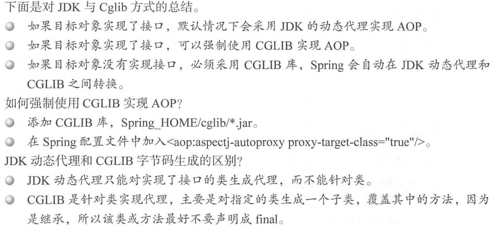

2. 获取代理

   - Spring AOP 实现其实也是用了 Proxy 和 InvocationHandle

     > 主要作用就是创建了拦截器链，并使用 ReflectiveMethodlnvocation类进行了链的封装.该类维护了链接调用的计数器，记录着当前调用链接的位置

   - CGLIB AOP

     > CGLIB 中对于方法的拦截是通过将自定义的拦截器（实现 Met odlnterceptor 接口）加入 Ca llb ack 中并在调用代理时直接激活拦截器中的 intercept 方法来实现的

#### 7.4 静态AOP使用示例

加载时织入（ Load-Time Weavi吨， LTW ）指的是在虚拟机载入字节码文件时动态织入AspectJ 切面.

1. Spring 全局配置文件的修改，加 LWT 开关
2. 加入 aop.xml.class 目录下的 META-INF（没有则自己建立） 文件夹下建立aop.xml
3. 加入启动参数。

#### 7.5 创建AOP静态代理

##### 7.5.1 Instrumentation使用

java.lang.instrument ，可以由此实现一个 Java agent ，通过此 agent 来修改字节码即改变一个类.

1. 写 ClassFileTransformer 类 和 agent 类
2. 打包agent 和 应用

##### 7.5.2 自定义标签

ContextNamespaceHandler 中注册了 load-time-weaver 对应的解析器.

1. 是否开启AspectJ

2. 将 org.Springframework.context.weaving.AspectJWeavingEnaber 装在 BeanDefinition注册

   > 当 Spring 解析到＜context: load-time weaver\>的时候也会产生 bean,id 为loadTimeWeaver, class 为org.Springframework.context.weaving.DefaultContextLoadTime Weaver
   >
   > 但是  只有注册了 LoadTime WeaverAwareProcessor 才会激活 AspectJ 的功能

##### 7.5.3 织入

LoadTimeWeaverAwareProcessor 实现 BeanPostProcessor 方法

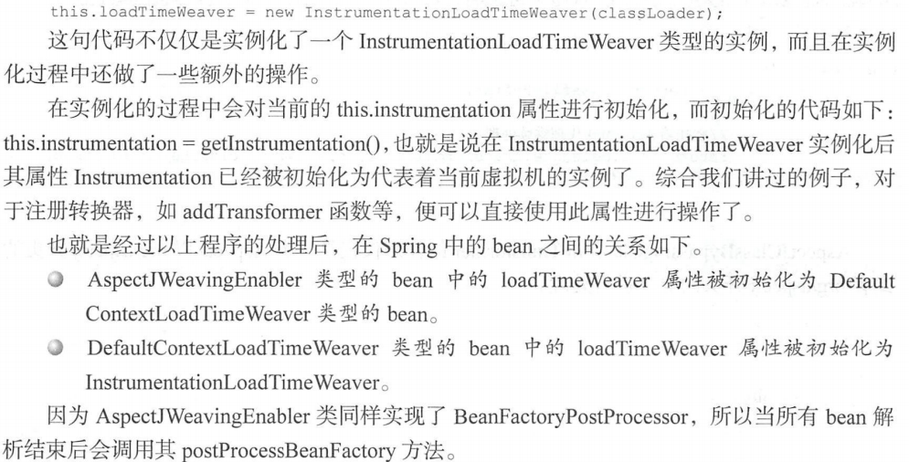

## 第 2 部分 企业应用

### 第8章 数据库连接JDBC

使用流程应该懂的.(添加jar,添加驱动,获取连接,sql查询,关闭连接)

#### 8.1 Spring连接数据库程序实现（JDBC）

做了大量封装,消除冗余代码,使得开发量大大减小.

大概步骤: 配置数据源 - 创建RowMapper实现映射(需要现有实体类) - service层使用JdbcTemplate

#### 8.2 save/update功能的实现

对于保存一个实体类而言,spring 使用ArgTypePreparedStatementSetter 参数与参数进行封装，同时使用 SimplePreparedStatementCreator 对 SQL 语句进行封装.最后使用execute执行.

##### 8.2.1 基础方法execute

execute 作为数据库操作入口,将数据库操作统一封装,个性化操作使用参数 PreparedStatementCallback 进行回调

1. 获取数据库连接

   > 并非直接使用 dataSource.getConnection()方法那么简单.Spring考虑的是关于事务方面的处理基于事务处理的特殊性，Spring 要保证线程中的数据库操作都是使用同一事务

2. 应用用户设定的输入参数

   > setFetchSize 要是为了 少网络交互次数设计的,一次取得若干行数据

3. 调用回调函数

4. 警告处理

   > SQLWaming 提供关于数据 访问 告信息的异常.试图在已经关闭的连接上 告将导致抛出异常.警告可能会出现数据错误,而不一定导致程序终止.

5. 资源释放

   > 直接使用 ConnectionHolder 中的 released 进行连接数 一， 而不是真正的释放连接

##### 8.2.2 Update中的回调函数

PreparedStatementCallback 作为 个接口,只有一个方法.

- 所有操作都是 pss.setValues(ps) 为人口的,pss的类 gPreparedStatement Setter

#### 8.3 query功能的实现

在回调类 PreparedStatementCallback 的实现中使用的是 ps.execut Query （）执行查询操作，而且在返回方法上也做了一些额外的处理.rse .extractData(rsToUse ）方法负责将结果进行封装并转换至 POJO, rse 当前代RowM perResultSetExtractor 

另一种情况是不带有“？”的， pring 使用的是另一种处理方式.最大的不 少了参数及参数类型的传递.直接使用 connection 创建，而带有参数 SQL 使用的是 PreparedStatementCreator 类来 建的

#### 8.4 queryForObject

提供了多种query.最大的不同还是对于 RowMapper 的使用

### 第9章 整合MyBatis

#### 9.1 MyBatis独立使用

#### 9.2 Spring整合MyBatis

#### 9.3 源码分析

树的最顶层是类型为 org.mybatis.Spring.Sq Sess onFactoryBean bean

##### 9.3.1 sqlSessionFactory创建

- Init li ingBea 实现此接口的 bean 会在初始化时调用其 afterPro pertiesS 方法来进行bean 逻辑初始化
- Factory Bean ：一旦某个 bean 实现次接口，那么通过 getBean 方法获取 bean 其 实是获取此类的 getObject（）返回的 实例

1. SqlSessionFacto yBean 的初始化

   > 完全取消可以配置 configLocation 属性 ，而把 中的属性直接写 SqlSessionFactoryBean中

2. 获取 SqlSessionFactoryBean 实例

##### 9.3.2 MapperFactoryBean的创建

MyBatis 在获取映射的过程中根据配置信息为 UserMapper 类型动态创建了代理类

1. MapperFacto yBean 的初始化

   > 为实现了 Initiali ingBean 接口， Spring 会保证在 bean 初始化时 先调用 afterPropertiesSet方法来完成其初始化逻辑
   >
   > DAO 配置的验证:
   >
   > - 父类中对 sq!Session 不为空的验证
   > - 映射接 口的验证
   > - 映射文件存在性验证

2. 获取 MapperFactoryBean 的实例

   > MapperFactoryBean 现了 FactoryBean 接口，

##### 9.3.3 MapperScannerConfigurer

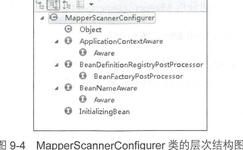

分析 MapperScannerConfigurer 提供的逻辑实现

1. processPropertyPla eHolders 属性的处理

   > BeanDefinitionRegistries 会在应用启动的时候调用，并且会早于 BeanFactory PostProcessors 的调用，这就 PropertyResourceConfigurers 还没有被加载所有对于属性文件的引用将会失效为避免此种情况发生，此方法手动地找出定义的 PropertyResourceConfigurers 并进行提前调用以保证对于属性的引用可以正常工作
   >
   > 1. 找到所有已经注册的 PropertyRe so urceConfigurer 类型的 bean
   > 2. 模拟 Spring 中的环境来用处理器

2. 根据配置属性生成过滤器

   > 1. annotationClass 属性处理
   > 2. markerlnterface 属性处理
   > 3. 全局默认处理
   > 4. package-info.java 处理
   >
   > 控制扫描文件 Spring 通过不同的过滤器完成，这些定义的过滤器记录在了 includeFilters 和 excludeFi lters 属性中

3. 扫描 Java 文件

   > ​	ClassPath.MapperScanner 型的实例 scanner 中的 scan 方法完成
   >
   > ​	MapperScannerConfigurer 类型的 bean 目的是不需 我们对于每个接口都注册一个.在扫描的过程中通过编码的方式动态注册
   >
   > ​	findCandidateComponents 方法根据传人的包路径信息并结合类文件路径拼接成文件的绝对路径，同时完成了文件的扫描过程并且根据对应的文件生成了对应的 bean ，使用ScannedGenericBeanDefinition 类型的 bean 承载信息， bean 中只记录了 resource source 信息

### 第 10章 事务

#### 10.1 JDBC方式下的事务使用示例

Service 接口上声明事务,可以指定传播级别

#### 10.2 事务自定义标签

TxNamespaceHandler类中,指明标签 annotation-drive 对应的解析器为 AnnotationDrivenBeanDefinitionParser 类;默认使用AOP,,可以指定mode为AspectJ.

##### 10.2.1 注册InfrastructureAdvisorAutoProxyCreator

进入 AopAutoProxyConfigurer 的 configureAutoProxyCreator:

1. 注册了三个bean.

   > ​	其中的两个 bean 被注册到名为 advisorDef bean 中， advisorDe 使用BeanFactoryTransactionAttributeSourceAdvisor 作为其 class 属性

   

   > InfrastructureAdvisorAutoProxyCreator 间接实现了SmartlnstantiationAwareBeanPostProcessor ，将封装工作委托给wraplfNecessary 函数
   >
   > - 找出指定 bean 对应的增强器
   >
   > - 根据找出的增强器创建代理

##### 10.2.2 获取对应class/method的增强器

1. 寻找候选增强器

   > findCandidateAdvisor 函数
   >
   > 通过 BeanFactoryUtils 类提供的工具方法获取所有对应 Advisor.class 类

2. 候选增强器中寻找到匹配项

   > 首先获取对应类的所有接口并连同类本身 起遍历，遍历过程中又对类中的方法再次遍历 一旦匹配成功便认为这个类适 于当前增强器

3. 提取事务标签

   > 在 computeTrans actionAttr ibut 函数中搭了框架(方法-类-接口寻找声明	)

#### 10.3 事务增强器

Transactionlnterceptor 支撑着整个 务功能的架构,invoke 方法开始

1. 获取事务的属性
2. 加载配置文件中的 transactionManager
3. 不同的事务处理方式使用不同的逻辑
4. 在目标方法执行前获取 务井收集事务信息

5. 执行目标方法

6. 旦出现异常，尝试异常处理.并不是所有异常， Spring 都会将其回滚，默认只对 RuntimeException 回滚

7. 提交 务前的事务信息清除

8. 提交事务

##### 10.3.1 创建事务

对于 createTransactionltNecessar 函数主要做了这样几件事情:

1. 使用 DelegatingTransactionAttribute 封装传人的 TransactionAttribute实例

2. 获取事务

   > getTransaction 来处理事务的准备工作
   >
   > 1. 获取事务
   >
   >    DataSourceTransactionManager 中的 doGetTransaction方法 ，创建基于 JDBC 事务实例
   >
   > 2. 如果当先线程存在事务 则转向嵌套事务的处理
   >
   > 3. 事务超时设置验证
   >
   > 4. 事务 propagationBehavior 属性的设 验证
   >
   > 5. 构建DefaultTransactionStatus
   >
   > 6. 完善transaction ，包括设 connectionHolder 隔离级别、timeout ，如果是新连接，则绑定到当前线程
   >
   >    1. 尝试获取连接
   >    2. 设置隔离级别以及只读标识
   >    3. 更改默认的提交设置
   >    4. 设置标志位，标识当前连接已经被事务激活
   >    5. 设置超时时间
   >    6. connectionHolder 绑定 线程
   >    7. 事务信息记录在当前线程

   > 处理已经存在的事务
   >
   > - PROPAGATION＿阻QUIRES NEW 表示当前方法必须在它自己的事务里运行,如果有一个事务正在运行,该事务会被挂起.
   > - PROPAGATION NESTED,可并行运行

3. 构建事务信息

   > 准备事务信息
   >
   > 所有的事务信息统一记录在Transactionlnfo 型的实例,Spring 会通过 Trasactionlnfo 类型的实例中的信息来进行回滚等

##### 10.3.2 回滚处理

1. 回滚条件

   > 默认情况下 Spring 中的事务异常处理机制只对 Runti rneException Error 两种’情况感兴趣

2. 回滚处理

   > 1. 首先是自定义触发器的调用
   > 2. 真正的回滚逻辑处理
   >    - 当之前已经保存的 事务信息 中有保存点信息的时候，使用保存点信息进行回滚。常用于嵌入式事务，对于嵌入式的事务的处理，内嵌的事务异常并不会引起外部事务的回滚
   >    - 当之前已经保存的 务信息中的事务为新事务，那么直接回滚
   >    - 当前事务信息中表明 存在事务的，又不属于以上两种情况，多数用于 JTA ，只做回滚标识，等到提交的时候统一不才是交
   > 3. 回滚后的信息清除
   >    - 设置状态是对事务信息作完成标识以避免重复调用
   >    - 如果当前事务是新的同步状态，需要将绑定到当前 程的事务信息清除
   >    - 如果是新事务需要做些清除资源的工作
   >    - 如果在事务执行前有事务挂起，那么当前事务执行结束后需要将挂起事务恢复

##### 10.3.3 事务提交

在真正提交之前需要做个判断.判断回滚标识;

- 嵌套事务不在 Spring 的管理范围 内， 或者无法设置保存点,禁止提交(嵌套事务由外层提交)

符合以下条件才提交:

- 当事务状态中有保存点信息的话不会去提交事务
- 当事务非新事务的时也不会去提交事务操作

### 第 11章 SpringMVC

DispatcherServlet 来封装其核心功能实现

默认的处理程序是非常简单的 Controller 接口，只有一个方法 ModelAndView handleRequest(request, response)

#### 11.1 SpringMVC快速体验

1. 配置 web.xml

   > 关键是指明 Spring配置文件位置 和 DispatchherServlet

2. 创建 Spring 配置文件 applicationContext.xml

   > 配置视图解析器

#### 11.2 ContextLoaderListener

ServletContextListen 中的核心逻辑便是初始化 WebApplicationContext 实例并存放至ServletContext

##### 11.2.1 ServletContextListener的使用

实现接口并注册到web.xml即可

##### 11.2.2 Spring中的ContextLoaderListener

1. WebApplicationContext 存在性的验证

   > 配置中只允许 一次 ServletContextListener

2. 创建 WebApplicationContext实例

   > 在初始化的过程中，程序首先会 ContextLoader 的同目录下的属性文件 ContextLoader properties ，并根据其中的配 提取将要实现 WebApplic tionContext接口的类，并根据这个实现类通 反射的方式进行实例的创建。

3. 将实例记录在servletContext中

4. 映射当前的类加载器与创建的实例到全局变 currentContextPerThread中

#### 11.3 DispatcherServlet

真正的逻辑 其实是在 DispatcherServlet 中进行

1. 初始化阶段

   > servlet 容器加载 servlet 类,创建一个 ServletConfig 对象,创建一个 se let 对象,调用 servlet 对象的 init 方法进行初始化

2. 运行阶段

   > servlet 容器接收到一个请求时， servlet 容器会针对这个请求创建 servletRequest 或者 servletResponse 对象，然后调用 servic巳方法

3. 销毁阶段

   > We 应用被终止时 serv let 容器会先调用 serv let 象的 destrory 方法，然后再销毁 serv let对象

servlet 的框架是由两个 Java 包组成： javax.servlet 和 javax.servlet.http

##### 11.3.1 servlet的使用

##### 11.3.2 DispatcherServlet的初始化

1. 封装及验证初始化参数

   > Serv letConfigProperty Values 除了封装属性外还有对属性验证的功能
   >
   > 针对 servlet 中配置的 \<init-param\> 中配置的封装

2. 将当前 se vlet 实例转化成 BeanWrapper 实例

3. 注册相对于 Resource 的属性编辑器

4. 属性注入

5. servletBean 的初始化

##### 11.3.3 WebApplicationContext的初始化

1. 寻找或创建对应的 WebApplicationContext 实例

   > 1. 通过构造函数的注入进行初始化
   >
   > 2. 通过 contextAttribute 进行初始化
   >
   >    默认为 WebApplicationContext.class.getName() ROOT”为key
   >
   > 3. 重新创建 We ApplicationContext 实例

2.  configureAndRefreshWebApplicationContext 

   > stractApplicationContext 提供的 refresh（）进行配置文件加载

3. 刷新

   > 用于 Spring Web 功能 现中所必须使用的全局变量。
   >
   > 1. 初始化 MultipartResolver
   >
   >    Multipar esolver 主要用来处理文件上传,默认没有对应处理,需要添加解析器
   >
   > 2. 初始化 LocaleResolver
   >
   >    - 基于 URL 数的配置
   >    - 基于 session 配置
   >    - 基于 cookie 的国际化配置
   >
   > 3. 初始化ThemeResolver
   >
   > 4. 初始化 HandlerMappings
   >
   >    默认情况下， SpringMVC 将加载当前系统中所有 现了 HandlerMapping 接口的 bean
   >
   > 5. 初始 HandlerAdapters -- 默认有三个
   >
   > 6. 初始化 HandlerExceptionResolvers
   >
   > 7. 初始化 RequestToViewNameTranslator
   >
   > 8. 初始化 ViewResolvers
   >
   > 9. 初始化 FlashMapManager

#### 11.4 DispatcherServlet的逻辑处理

1. 为了保证当 线程的 LocaleContext RequestAttributes 在当 请求后还能恢复,提取 线程的两个属性

2. 跟据当前 request 建对应的 LocaleContext RequestAttributes ，并绑定当前线程

3. 委托 doService 进一步处理

4. 处理结束后恢复线程到初始始状态

5. 请求处理结束后无论成功与否发出事件通知

doDispatch 函数中展示了 spring 请求处理所涉及的主要逻辑

##### 11.4.1 MultipartContent 类型的request 处理

对于请求的处理，spring 首先考虑 是对于 Multipart 的处理 ,如果是 MultipartContent类型的request ，则转换 request 为MultipartHttpServletRequest 型的 request.

##### 11.4.2 根据request信息寻找对应的Handler

1. 根据 request 查找对应的 Handler

   > 通过将 Handler 参数形式传入，井构建 HandlerExecutionChain实例，加入了两个拦截器

2. 加入拦截器到执行链

##### 11.4.3 没找到对应的Handler的错误处理

每个请求都应该对应着一个Handler,如果连默认Handler都没有设置,就会通过response返回错误信息.

##### 11.4.4 根据当前Handler寻找对应的HandlerAdapter

默认情况下普通的 We 请求会交给 impleControllerHandlerAdapter 处理

##### 11.4.5 缓存处理

Last-Modified 缓存机制

1. 客户端第一次输入 URL 时， 服务器端会返回内容和状态码 200 ，表示请求成功，同时会添加一个“Last-Modified ”的响应头，表示此文件在服务器上的 后更新时间，
2. 二次请求此 URL 时，客户端 向服务器发送请求头“IιModified Since ”，询问服务器该时间之后当前请求内容是否有被修改过,如果没有则自动返回 HTTP 304 状态码（只要响应头，内容为空，这样就节省了网络带宽）

Spring支持 Last-Modified 机制,只需要实现 LastModified 接口

##### 11.4.6 HandlerInterceptor的处理

SpringMVC 你通过处理拦截 Web 求，进 前/后置处理.实现 HandlerInterceptor接口.

##### 11.4.7 逻辑处理

通过适配器中转调 handler 并返回视图

##### 11.4.8 异常视图的处理

这里 spring 主要的工作就是将逻辑引导至HandlerExceptionResolver 类的 resolveException 方法

##### 11.4.9 根据视图跳转页面

1. 解析视图名称

   > 在 resolveView Name 中完成.
   >
   > - 基于效率的考虑，提供了缓存的支持
   >
   > - 提供了对 redirect:xx forward:xx 前缀的支持
   >
   > - 添加了前缀及后 ，并向 View 中加入了必 的属性设

2. 页面跳转

   > 将要用到的属性放 request 中，以便在 他地方可以 接调用，而解析这些属性的工作就是在 createMergedO tputMode 函数中完成的

### 第 12章 远程服务

#### 12.1 RMI

##### 12.1.1 使用示例

##### 12.1.2 服务端实现

在配置文件里用到了 org.Springframework remoting.RMI RMIServiceExporter

其中afterPropertiesSet 方法是  RMIServiceExporter 功能的初始化人口

1. 验证 service

   > 配置中类型为 RMIServic eExporter servic 属性

2. 处理用户自定义的 SocketFactory 属性

   > 提供4 个套接字工厂配置

3. 根据配 参数获取 Registry
4. 构造对外发布的实例

5. 发布实例

   > 1. 获取 registry
   >
   >    Spring考虑到registry可能在别的机器,所以会尝试远程获取;如果本地的话,就需要在本地创建 RMI Registry实例了
   >
   > 2. 初始化将要导出的实体对象
   >
   >    当请求某个 RMI 服务的时候， RMI 会根据注册的服务名称，将请求引导远程对象处理类中，这个处理类便是使 getOb ectToExport（）进行创建
   >
   > 3. RMI 服务激活调用

##### 12.1.3 客户端实现

1. 通过代理拦截井获取 stub

   > 父类的 afterPropertie sSet 方法中完成了对 serviceUrl 的验证.获取stub有两种方式:
   >
   > - 自定义 套接字工厂
   > - 直接使用 RMI 提供 标准方法

2. 增强器进行远程连接

   > 在初始化时，建了 代理 并将本身作为增强器 加入了代理中
   >
   > - 获取的 stub RMIInvocationHandler 类型的，从服务端获取的 stub RMIInvocationHandler ，就意味着服务端也同样使用 Spring 去构建，
   > - 否则按照普通方式处理RMI,也就是反射.

#### 12.2 HttpInvoker

Httplnvoker 是一个新的远程调用模型，作为 Spring框架的 部分，来执行基于 HTTP 的远程调用，并使用 Java 的序列化机制

##### 12.2.1 使用示例

##### 12.2.2 服务端实现

人口类应该为 org.Spring amework.remoting.httpinvoker.HttpInvokerServiceExporter

1. 创建代理

   > 最关键 目的是加入了RemotelnvocationTracelnterceptor 增强器

2. 处理来自客户端的 request

   > 当有 Web 请求时， 根据配置中的规则路径会把路径匹配的访问放入对应 HttpRequestHandler
   >
   > 1. 从quest 中读取序列化对象
   >
   >    主要是 HttpServletRequest 取相 息
   >
   > 2. 执行调用
   >
   >    根据反序列 方式得到的 Remotelnvocation 象中的信息，进行方法调用
   >
   > 3. 将结果的序列化对象 入输出流

##### 12.2.3 客户端实现

一个比较重要的任务就是构建 Remotelnvocati on例，并传送到服务端

根据实现的InitializinBean 接口分析初始化过程中的逻辑:

HttplnvokerProxyFactory Bean 类型 bean在初始化过程中创建了封装服务接口的代理,并使用自身作为增强拦截器，然后又因为实现了Factory Bean 口，所以获取 Bean 的时 返回的其实是 的代理.增强器invoker方法分析:

1. 构建 Remotelnvocation 实例

2. 远程执行方法

   > doExecuteRequest 方法中真正实 了对远程方法 构造与通信
   >
   > 1. 创建 Http Post
   > 2. 设置 RequestBody
   > 3. 执行远程方法
   > 4. 远程相应验证
   > 5. 提取晌应信息
   > 6. 提取返回结果

3. 提取结果

### 第 13章 Spring消息

#### 13.1 JMS的独立使用

#### 13.2 Spring整合ActiveMQ

#### 13.3 源码分析

##### 13.3.1 JmsTemplate

接口 InitializingBean，接口方法实现在JmsAccessor 类中.JmsTemplate发送方法:

1. 通用代码抽取

   > execute 封装了 Connection 以及Session创建操作.

2. 发送消息的实现

   > 回调函数 dolnJms

3. 接收消息

##### 13.3.2 监听器容器

消息监听器容器是一个用于查看 JMS 目标等待消息到达的特殊 bean ，一旦消息到达它就可以获取到消息，并通过调用 onMessage（）方法将消息传递给一个 MessageListener 实现

消息监昕器允许创建 Session MessageConsumer 来接收消息 。具体的个数由concurrentConsumers 属性指定,根据其建立对应数量线程

核心的处理就是调用 invokeListener 来接收消息并激活消息监昕器,分两种情况处理,原因是考虑到在无限制循环接收消息的情况下，用户可以通过设置标志位 running来控制消息接收的暂停与恢复，并维护当前消息监昕器的数量

isRunnin （）用来检测标志位 this running 态进而判断是否需要进入 while 循环 由于要维护当前线程激活数量， 所以引入了 wasWaiting 变量， 用来判断线程是否处于等待状态 如果线程首次进入等待状态， 需要减少线程来激活数量计数器

**消息接收的处理:**

最终提取监听器 使用 listener.onMessage(message ）对监听器进行了激活

完成消息服务的提交，涉及两个事务,

### 第 14章 Spring Boot体系原理

由 Pivotal 团队提供的全新框架，其设计目的是用来简化新 Spr ng 应用的初始搭建以及开发过程

#### 14.1 Spring Boot源码安装

#### 14.2 第 一个Starter

关键点 ，在 Spring 的跟路径下建 META-INF/spring.factories 文件 ，并声明配置项路径

#### 14.3 探索SpringApplication启动Spring

##### 14.3.1 SpringContext创建

有个关键的判断， this.webEnvironment 会成为启动tomcat的关键点.

##### 14.3.2 bean的加载

看到 BeanDefinitonLoader 这个类

##### 14.3.3 Spring扩展属性的加载

仅仅是使用 refresh 激活下

##### 14.3.4 总结

按照约定大于配置的原则，内置了Spring 原有的启动 并在启动的时候启动及刷新

#### 14.4 Starter自动化配置原理

Enable AutoConfiguration注解是关键.EnableAutoConfigurationimportSelector 作为 Starter 自动 导人的关键.

##### 14.4.1 spring.factories的加载

定位到了 AutoConfigurationimportSelector 类的方法,调用了 isEnabled方法

在启动中有一个硬编码的逻辑就是会扫描各个包中的对应文件，并把配置捞取出来，

##### 14.4.2 factories调用时序图

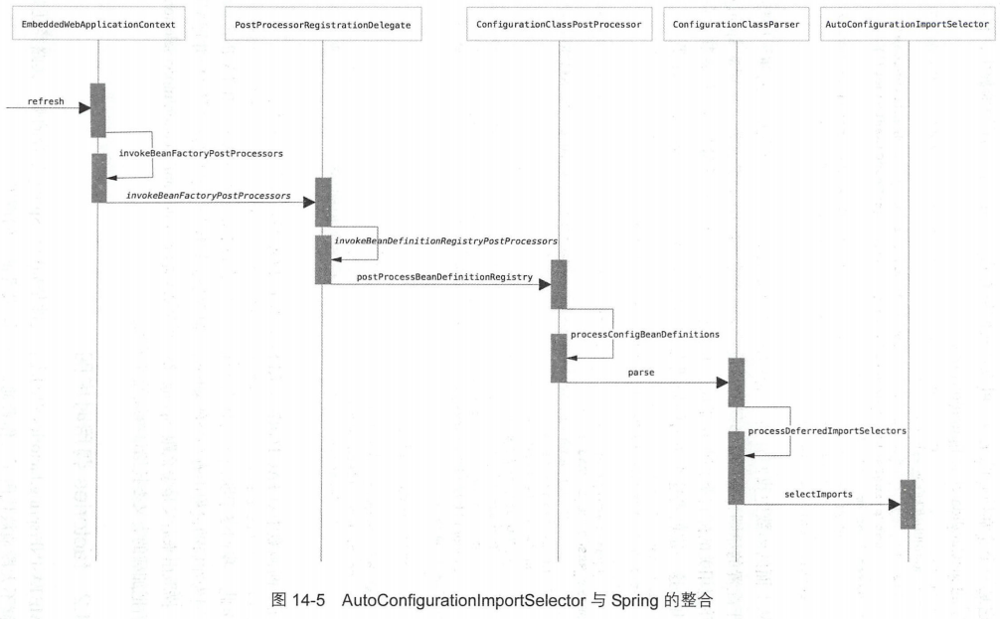

##### 14.4.3 配置类的解析

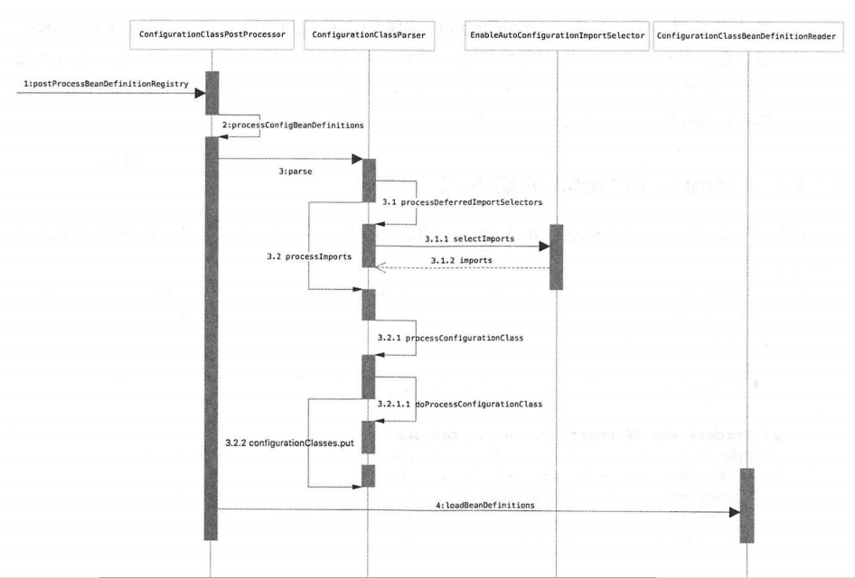

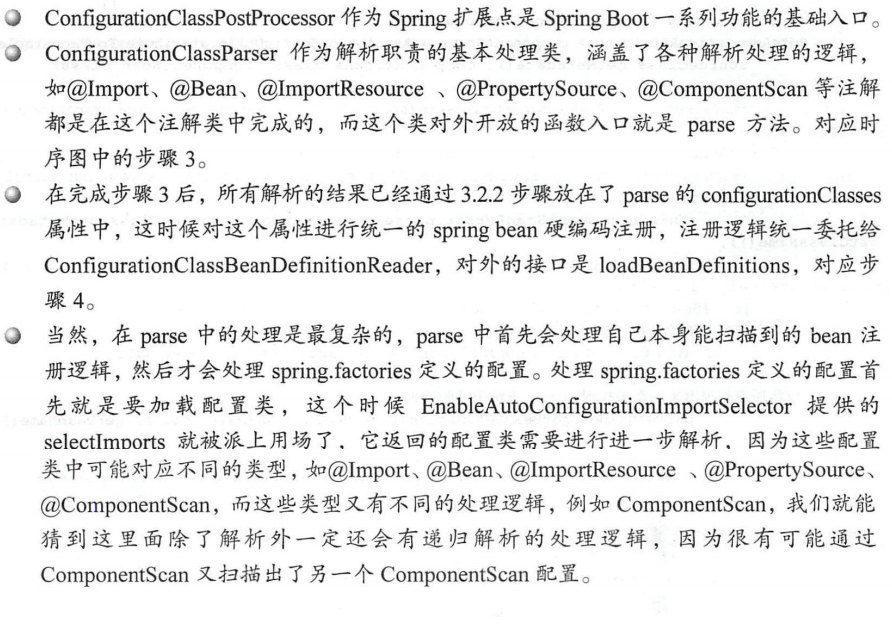

##### 14.4.4 Componentscan的切入点

 doProcessConfiguratioClass 函数,关注 ComponentScan 现逻辑，

最为核心的解析工具类 ClassPathBeanDefinitionScanner 就是 Spring 原生的解析类，这是 Spring 核心解析类，它通过字节码扫描的方式，效率要 比通常我们用的反正机制效率要高很多

#### 14.5 Conditional机制实现

##### 14.5.1 Conditional使用

##### 14.5.2 Conditional原理

调用都出现在 OnPropertyCondition 中,getMatchOutcome 方法中的nomatch属性很重要.

不匹配有两种情况 missingProperties 对应属性缺失 情况；nonMatchingProperties 对应不匹配 情况

这个函数 试使用 PropertyResolver 来验证对应的属性是否存在， 果不存在 验证不通过，因为 ropertyResolv er 中包含了所有的配置属性信息

##### 14.5.3 调用切入点

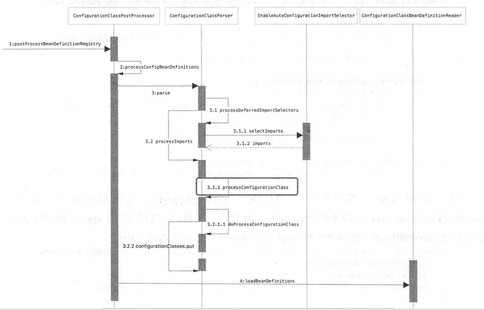

#### 14.6 属性自动化配置实现

##### 14.6.1 示例

@Vlaue 的使用

##### 14.6.2 原理

进入 QualifierAnnotationAutowireCandidateResolver类

- 替换的逻辑是在 resolveEmbeddedValue 方法

  > 初始化逻辑以实现 PropertySourcesPlac holder Co urer 类的postProcessBeanFactory 函数作为入口
  >
  > 1. 初始化 MutablePrope ySources

  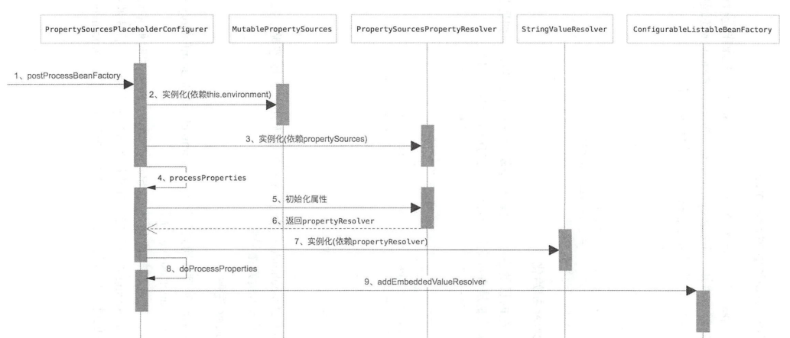

  > 2. 初始化 PropertySourcesPropertyResolver
  >
  > 3. StringValueResolver 初始化
  >
  > 4. StringValueResolve 「注册
  >
  >    涉及我们经常使用的 profile 机制 的实现，

#### 14.7 Tomcat启动

EmbededWebApplicationContext 类对于 Tomcat 嵌入的一个关键点就是 onRefres （）函数

EmbeddedServletContainerFactory 服务器启动的上层抽象，发现 EmbeddedServletContainerAutoConfig ration 这个类进行了调用

