# Unix环境高级编程

- [ ] 书籍作者：Richard Stevens

- [ ] 笔记时间：2021.8.9

- [ ] 说明：只有标题，没有正文的表示该部分是作者自己实现的函数/软件

  -----

  重读时间: 2022.12.1

## 第 1 章 UNIX基础知识

### 1.1 引言

- 操作系统为程序提供服务

### 1.2 UNIX体系结构

- 操作系统可定义为软件，控制硬件，提供程序运行环境。这种软件称为内核（kernel）。
- 内核的接口称为系统调用，公用函数库构建在系统调用之上。shell是一个特殊应用程序，为其他程序提供一个接口。
- 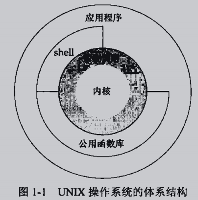

### 1.3 登录

- 登录名可以在/etc/passwd中查看，可以查看用户名，uid，家目录，shell等信息。至于加密口令在别的文件里。
- 登录后一般是启动shell，不同操作系统可能默认shell不一样。

### 1.4 文件和目录

- 文件系统的起点是根目录，stat和fstat函数返回包含所有文件属性的一个结构
- 文件名只有斜杠和空格不能使用，可以使用引号把文件名抱起来

### 1.5 输入和输出

- 文件描述符( file descriptor) 通常是一个小的非负整数，内核用以标识一个特定进程正在访问的文件。
- 标准输入、标准输出和标准错误默认都是shell
- 函数 open read write lseek close 提供了不带缓冲的IO
- 熟悉的printf是带缓冲的

### 1.6 程序和进程

- 程序是一个存储在磁盘上的可执行文件，内核使用exec函数将程序读入内存并执行
- 程序的执行实例称为进程，每个进程都会分配一个唯一ID，一般是非负整数。
- 进程控制的主要函数 fork exec 和 waitpid 

### 1.7 出错处理

- UNIX函数出错时候通常返回一个负数，文件\<errno.h\>列出，该文件定义了errno，这些常量以字符E开头，UNIX系统手册通常在errno（3）列出。
- strerror函数将errnum映射为一个出错消息字符串，perror会打印errno值

### 1.8 用户标识

- 用户id用于标识不同用户，用于权限检查等，组ID也是类似功能（/etc/group 可以查看），后来出现了附属组ID，也就是一个用户可以同时属于多个组。

### 1.9 信号

- 用于通知进程发生了某种情况，处理方式可以是默认处理，回调或者直接忽略
- 键盘产生信号可以通过中断键或者退出键，函数的话调用kill
- 需要调用signal函数，指定信号和处理函数

### 1.10 时间值

- 日历时间，基于UTC以来的秒数，类型time_t
- 进程时间，CPU时间，类型clock_t
- UNIX系统为一个进程维护了三个时间，time命令可以查看
  - 时钟时间，进程运行的时间总量
  - 用户CPU时间是执行用户指令所用的时间量
  - 系统CPU时间是为该进程执行内核程序经历的时间

### 1.11 系统调用和库函数

- 操作系统提供多种服务的调用接口，该接口称为系统调用
- 库函数可能会调用多个系统调用，但是并不是系统调用，总的来说系统调用更底层

## 第 2 章 UNIX标准及实现

### 2.1 引言

### 2.2 UNIX标准化

- ISO C -- 1989年意图提供可移植性
- IEEE POSIX -- 指的是可移植操作系统接口

- Single UNIX Specification -- 是POSIX.1 的一个超集
- FIPS -- 美国政府要求，不用考虑

### 2.3 UNIX系统实现

- SVR4 -- AT&T的UNIX系统实验室产品，实现了POSIX
- BSD 
- FreeBSD 
- Linux
- Mac OS X，核心操作系统称为"Darwin"
- Solaris 
- 还有很多。。。

### 2.4 标准和实现关系

- 不同程度符合POSIX标准

### 2.5 限制

- UNIX 定义了很多幻数和常量，编译时限制可在头文件定义，运行时限制需要调用函数获取

- ISO C限制，编译时限制全都在 limits.h 头文件
- POSIX 限制，被分为七类常量，一些值在现在看来已经不适用
- sysconf pathconf fpathconf 确定运行时限制
- 不确定的运行时限制
  - 路径名，如果常量PATH_MAX存在则没有为题，不存在需要调用pathconf
  - 最大文件打开书，常量 NOFILE，

### 2.6 选项

- POSIX 定义了3种处理选项的方法
  - 编译时选项定义在 unistd.h
  - 用 sysconf 判断
  - pathconf / fpathconf判断

### 2.7 功能测试宏

- 常量 \_POSIX\_C\_SOURCE 和 \_XOPEN\_SOURCE 称为该功能测试宏，用来排除任何实现专有的定义

### 2.8 基本系统数据类型

- sys/types.h 里面定义

### 2.9 标准之间的冲突

- 整体而言，标准之间配合很好
- clock 返回值，ISO C没有POSIX严

## 第 3 章 文件I/O

### 3.1 引言

- 该节讨论的是不带缓冲的IO，不属于ISO C组成部分，而是POSIX和SUS的组成

### 3.2 文件描述符

- 对于内核而言，所有打开的文件都通过文件描述符引用，描述符是一个非负整数。UNIX系统shell把 0 与进程标准输入关联，1标准输入管理，2是标准错误关联，定义在 unistd.h 头文件，上限是OPEN_MAX-1

### 3.3 函数 open 和 openat

- 返回的文件描述符是最小未使用的数值。

### 3.4 函数creat

- 以只写方式打开

### 3.5 函数close

- 关闭文件会释放记录锁，进程终止自动关闭文件

### 3.6 函数lseek

- 指定访问偏移量，可以用来测试是否设定了偏移量，测试返回值是否等于-1，od命令可以查看

### 3.7 函数read

- 从文件当前偏移量开始，返回实际读取字节数

### 3.8 函数write

- 像打开文件写入数据，返回值通常与参数指定的长度相同，否则表示出错。

### 3.9 I/O效率

- 大多数文件系统都采取某种预读技术，所以buf大小跟一个块大小差不多就不能明显提高速度了

### 3.10 文件共享

- 内核使用三种数据结构表示打开文件
  - 进程在进程表里有一个记录想，包含一张打开文件描述符表，每项含有文件描述符标志和一个执行文件表项指针
  - 内核为所有打开文件维持一张文件表，表项包含文件状态标志，偏移量，指针
  - 每个打开文件都一个v节点，该节点包含文件类型和对文件操作的指针。Linux使用i节点。
  - 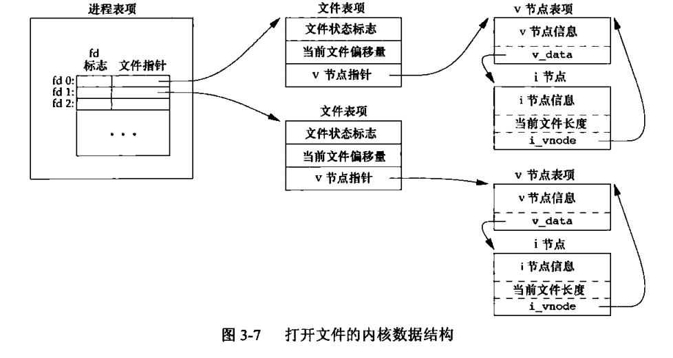
- 多个进程操作同一文件可能发生竞态

### 3.11 原子操作

- open 的O_APPEND选项，以前需要lseek再写，就会发生问题。
- pread 和 pwrite 

### 3.12 函数dup和dup2

- 文件指针指向同一个文件节点，是原子操作

### 3.13 函数sync、fsync和fdatasync

- 默认数据是延迟写，当需要保证一致性时，可以使用这三个函数。
- sync将修改过的块缓冲区写入队列就返回，由update守护进程调用sync函数
- fsync只对由文件描述符fd指定的一个文件起作用，并且等待写磁盘操作结束才返回。

### 3.14 函数fcntl

- 改变已经打开文件属性，比如复制/设置描述符，设置异步IO所有权，设置记录锁
- 设置之前需要先检测文件状态

### 3.15 函数ioctl

- 可以说是杂物箱 

- | 类别     | 常量名  | 头文件              | ioctl数 |
  | -------- | ------- | ------------------- | ------- |
  | 盘标号   | DIOxxx  | \<sys/disklabel.h\> | 4       |
  | 文件IO   | FIOxxx  | \<sys/filio.h\>     | 14      |
  | 磁带IO   | MTIOxxx | \<sys/mtio.h\>      | 11      |
  | 套接字IO | SIOxxx  | \<sys/sockio.h\>    | 73      |
  | 终端IO   | TIOxxx  | \<sys/ttycom.h\>    | 43      |

### 3.16 /dev/fd

- 打开/dev/fd/n 等效于复制描述符 n
- 某些系统路径名 /dev/stdin 相当于 /dev/fd/0
- 主要有shell使用

## 第 4 章 文件和目录

### 4.1 引言

### 4.2 函数 stat、fatat、fstatat和lstat

- 返回命名文件有关的信息结构、描述符打开文件有关信息、链接文件有关信息

### 4.3 文件类型

- 普通文件
- 目录文件
- 块特殊文件/字符特殊文件 ，都是设备文件
- FIFO，进程通信用的文件，称为命名管道
- 套接字，进程间网络通信
- 符号链接，指向另一个文件
- 在 \<sys/stat.h\> 中定义相关的常量

### 4.4 设置用户ID和组ID

- 可以在文件模式字中设置一个特殊标志，含义是"当执行此文件时，将进程的有效用户ID设置为文件拥有者的用户ID"，默认有效用户ID就是实际用户ID。

### 4.5 文件访问权限

- st_mode值包含了对文件的访问权限位，每个文件有9个。
- 每次打开、创建、删除文件，内核都要进行文件访问权限测试，测试具体如下：
  - 进程有效用户ID为0（root用户），允许访问
  - 有效ID时拥有者ID，允许访问
  - 进程有效组符合，允许
  - 其他访问权限打开，允许访问。

### 4.6 新文件和目录的所有权

- 默认进程有效用户ID就是新文件的用户ID
- 新文件的组ID可以实进程的有效组ID或者它所在目录的组ID

### 4.7 函数access和faccessat

- 按照实际ID和组ID进行权限测试，比如切换到root用户后仍希望测试其他用户权限。

### 4.8 函数umask

- 为进程设置文件模式创建屏蔽字，设置文件创建的默认权限。

### 4.9 函数chmod、fchmod和fchmodat

- 更改现有文件访问权限，更新的是i节点更改时间，而不是内容修改时间

### 4.10 黏着位

- 如果一个可执行文件该位设置，那么当第一次执行，终止时程序的正文副本仍保存在交换区，常量S_ISVTX。如见大多是使用虚拟存储系统和快速文件系统，已经不用了。
- 目录/tmp和 /var/tmp是设置粘着位的典型。（已被扩展，只有满足条件才能删除目录下文件）

### 4.11 函数chown、fchown、fchownat和lchown

- 更改用户ID和组ID，一般只有超级用户能改，拥有者可以更改到有效组ID，附属组ID

### 4.12 文件长度

- stat 结构的st_size 表示以字节为单位的文件长度，大多数UNIX系统提供块长度和块数。
- 文件空洞 -- 由所设置的偏移量超过文件末尾并写入数据造成的。

### 4.13 文件截断

- truncate 和 ftruncate

### 4.14 文件系统

- 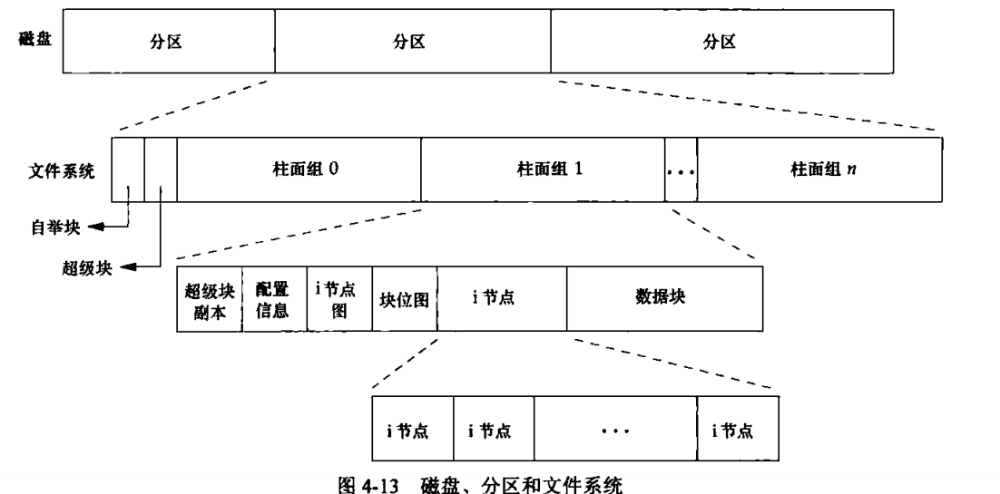
- 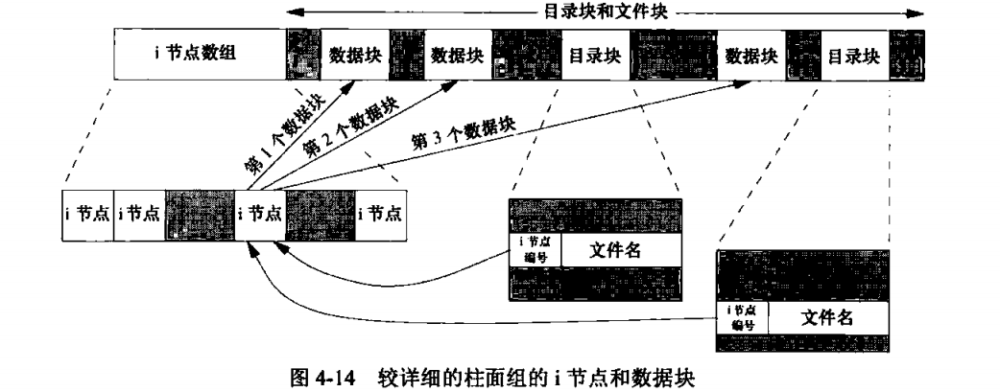

- 每个i节点都有链接计数，只有为0才能输出该文件。
- 默认目录的链接计数是2（当前目录和上级目录），加上自身就至少3个。

### 4.15 函数link、linkat、unlink、unlinkat和remove

- link创建一个指向现有文件的链接

### 4.16 rename和renameat

- 重命名不能对 . 和 .. 操作，

### 4.17 符号链接

- 是对一个文件的间接指针，硬链接直接指向文件的i节点。
- 可以跨文件系统，本身没有目录项，也就是没有i节点，可能会造成循环引用。

### 4.18 创建和读取符号链接

- symlink 或 symlinkat 创建，不要求文件存在
- readlink 或 readlinkat 可以读取链接中的名字

### 4.19 文件时间

- | 字段    | 说明              | 例子           | ls   |
  | ------- | ----------------- | -------------- | ---- |
  | st_atim | 文件最后访问时间  | read           | -u   |
  | st_mtim | 文件最后修改时间  | write          | 默认 |
  | st_ctim | i节点最后修改时间 | chmod \| chown | -c   |

### 4.20 函数futimens、utimensat和utimes

- 指定文件访问和修改时间为纳秒级时间精度

### 4.21 函数mkdir、mkkdirat和 rmdir

- 目录通常至少设置一个执行权限位，以允许访问该目录的文件名

### 4.22 读目录

- 具有访问 权限的任意用户都可以读该目录，只有内核才能写目录，函数有opendir、readdir，telldir等，返回的是DIR结构。

### 4.23 函数chdir、fchdir和getcwd

- 只影响当前进程，应当调用shell的内置命令 

### 4.24 设备特殊文件

- 存储设备由主设备、次设备号表示。数据类型是dev_t，st_dev是文件系统设备号，只有字符/块特殊文件才有st_rdev值，包含 真是设备设备号。

## 第 5 章 标准I/O库

###  5.1  引言

### 5.2 流和FILE对象

- 第三章围绕文件描述符，本章围绕流。标准I/O流可用于单/多字节字符集，流的定向可以通过函数改变。
- 返回的是文件指针，FILE*

### 5.3 标准输入、输出和错误

- 已经定义在 \<stdio.h\>

### 5.4  缓冲

- 尽量少使用read和write调用次数，具有三种类型
  - 全缓冲，在填满IO缓冲区才进行实际操作
  - 行缓冲，遇到换行符进行刷写。长度有限，遇到流需要刷写。引用终端设备一般是行缓冲。
  - 不带缓冲，标准错误是不带缓冲的。

### 5.5 打开流

- fopen 打开指定文件，freopen在指定刘尚打开指定文件
- fdopen 读取一个已有文件描述符

### 5.6 读和写流

- 输入  
  - getc 、getchar、fgetc 读取一个字符，必须使用feeror/feof区分EOF类型 。
  - clearerr可以清除标志。
  - 使用ungetc压入一个字符，配合getc可以实现查看 

- 输出
  - putc 、fputc 、putchar

### 5.7 每次一行I/O

- gets/fgets ，后者需要制定长度，总是以null结尾。不推荐使用gets（1988因特网蠕虫时间）
- puts/fputs 输出一行，后者以null结尾而不输出null。

### 5.8 标准I/O效率

- exit退出会自动关闭
- 效率在单行较高，减少了系统调用次数。

### 5.9 二进制I/O

- fread/fwrite 可以一次性写入结构，同一台机器读写当然没问题。跨系统传输需要使用互认规范格式

### 5.10 定位流

- ftell / fseek
- ftello / fseeko 文件偏移量不必一定使用长整型
- fgetpos / fsetpos 使用fpost_t记录位置

### 5.11 格式化I/O

- printf / sprintf / fprintf / dprintf / snprintf，标准输出/写入数组/写入流/写入文件描述符/长度限制

- scanf / fscanf / sscanf ，输入

### 5.12 实现细节 

- 调用fileno函数可以获得描述符

### 5.13 临时文件

- tmpnam/tmpfile，后者是创建临时二进制文件，程序结束自动删除。

### 5.14 内存流

- fmemopen允许调用该这提供缓冲区用于内存流。
- open_memstream / open_wmemstream创建面向单字节/多字节的流

### 5.15 标准I/O的替代软件

- 效率不高，fgets 通常需要两次数据复制，内核与缓冲区，缓冲区与 用户程序行缓冲
- fio  / ASI 等 

## 第 6 章 系统数据文件和信息

### 6.1 引言

### 6.2  口令文件

- \<pwd.h\> 定义password结构，口令文件是 /etc/passwd，将登录设备设置为 /dev/null阻止登录，nobody用户登录是人人 可以查看的 文件
- finger可以查看注释字段信息
- getpwuid / getpwnam 查看登录名用户id，getpwent 查看整个文件

### 6.3 阴影口令

- 使用MD5/SHA-1等算法，只有root和少数几个程序可以访问。
- getspnam / getspent 访问

### 6.4 组文件

- 包含在 \<grp.h\>的group结构里。
- getgrgid / getgrnam / getgrent

### 6.5 附属组ID

- 用户可以属于多个组，getgroups / setgroups / initgroups

### 6.6 实现区别

- 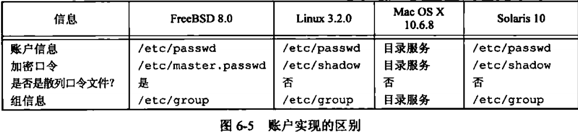

### 6.7 其他数据类型 

- 一般由 get / set /  end三个函数。
- 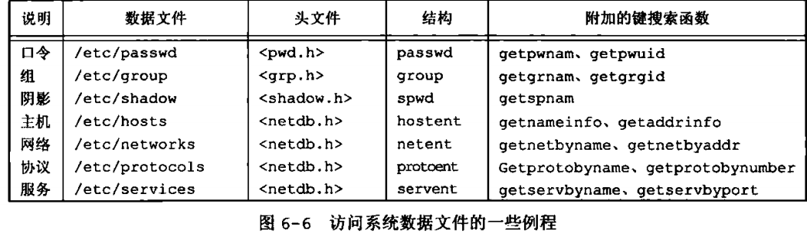

### 6.8 登录账户记录

- utmp记录当前登录到系统的各个用户，wtmp记录登录和注销事件

### 6.9 系统标识

- 函数uname，使用utsname结构记录，字符串都是以null结尾。

### 6.10 时间和日期例程

- UNIX时间是基于UTC，类型time_t进行表示，函数clock_gettime获取指定时间，精度更高
- 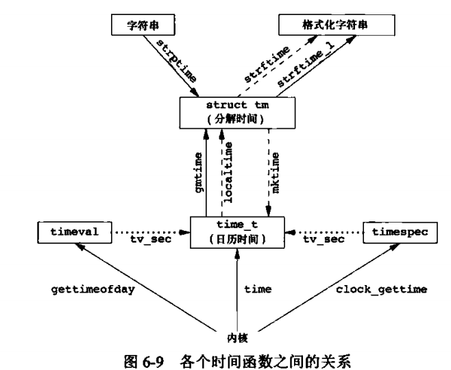

## 第 7 章 进程环境

### 7.1 引言

### 7.2 main函数

- 内核执行C程序（使用exec）之前会调用特殊的启动例程，程序将例程指定为起始地址，例程从内核取得命令参数和环境变量

### 7.3 进程终止

- 正常：main返回 / exit / \_exit /最后一个线程返回 / 最后一个线程调用 pthread_exit

- 异常： abort / 接到一个信号 / 最后一个线程响应取消请求

- 例程可能是这么写的

  ```c
  exit(main(argc,argv));
  ```

- 退出函数 -- 立即进入内核（带下划线），exit则进行清理工作后进入内核

- 函数atexit 可以注册终止处理程序，由exit自动调用

- 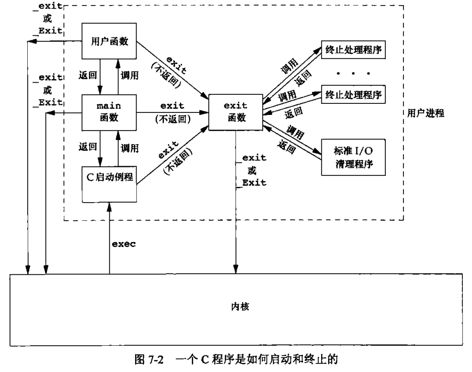

### 7.4 命令行参数

### 7.5 环境表

- 每个程序都接收到一张环境表，是一个字符指针数组，null结尾的字符串，环境指针 environ 可以获取。

### 7.6 C程序的存储空间布局

- 正文段，CPU执行的机器指令部分。共享、只读
- 初始化数据段
- 未初始化数据段，bss段
- 栈，自动变量，函数调用时保存的信息
- 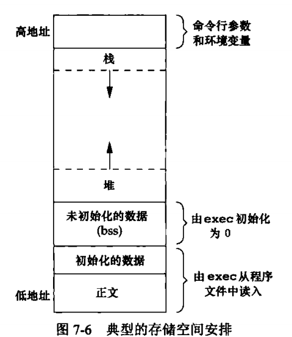

### 7.7 共享库

- 使得可执行文件不再需要包含公用库函数，只需要所有进程都可引用的存储区保存库例程的一个副本。

### 7.8 存储空间分配

- malloc 分配不初始化，calloc 分配初始化为0，realloc 增加/减少分配长度，通常用sbrk（2）系统调用实现
- 替代的存储空间分配程序
  - libmalloc
  - vmalloc
  - quick-fit
  - jemalloc
  - TCMalloc
  - alloca

### 7.9 环境变量

- 内核不查看，取决于应用程序。函数 getenv 可以获得，putenv / setenv / unsetenv

### 7.10 函数setjmp 和 longjmp

- 跨越函数的跳跃，通过跳跃栈帧实现。全局变量、静态变量和易失变量不受优化影响。
- 为了避免混乱，应该在全局存储空间静态/动态为数组databuf分配空间

### 7.11 函数 getrlimit 和 setrlimit

- 查询/修改资源限制，任何进程都可将软限制<=硬限制，印相纸可下降，只有root用户进程才可以提高硬限制值。

## 第 8 章 进程控制

### 8.1 引言

### 8.2 进程标识

- 进程ID唯一，是可以复用的。

- ID为0时调度进程，称为交换进程，内核的一部分；

  ID为1时init进程，自举过程结束时内核调用，负责启动UNIX。所有孤儿进程的父进程。

  ID为2是页守护进程，负责虚拟存储系统的分页操作

- getpid / getppid / getuid / geteuid / getgid / getegid

### 8.3 函数fork

- 创建新进程，调用一次返回两次。子进程的返回值是0，父进程的返回值是子进程ID。
- 子进程是父进程副本，获得数据空间、堆栈副本，共享正文段。
- 经常fork之后跟着exec，使用写时复制技术。

- 文件共享，重定向时候会复制文件描述符，还共享同一个文件偏移量。要么其中一者等待要么关闭不需要的文件。
- spawn就是fork之后exec

### 8.4 函数vfork

- 创建新进程，目的是exec新程序。保证子线程先运行

### 8.5  函数exit

- 不管进程如何终止，最终都会对应同一段代码，关闭所有打开文件，释放使用的存储器。
- 父进程可以使用wait/waitpid获取终止状态。如果父进程先于子进程终止，那么它们的父进程都会改变为init进程，也就是PID为1。如果子进程终止，父进程没有进行善后处理 ，该子进程才成为僵尸进程，状态为Z。

### 8.6 函数wati和waitpid

- 当一个进程终止时，内核向父进程发送SIGCHLD信号，属于异步事件。默认动作时忽略。
- 调用wait/waitpid 
  - 所有子进程还在运行，父进程阻塞
  - 如果有一个子进程终止，取得终止状态立即返回
  - 没有任何子进程，报错返回会。
- 如果一个进程fork，但不要它等待子进程终止，也不希望子进程处于僵尸状态，调用fork两次。

### 8.7 函数waitid

- 允许一个进程指定要等待的子进程

### 8.8 函数 wait3 和wait4

- 功能多一个，返回父子进程的使用资源概况，如CPU时间、缺页次数等

### 8.9 竞争条件

- UNIX使用 信号进行IPC。

### 8.10 函数exec

- 调用exec时，使用新程序替换继承的程序。有七种exec函数

- 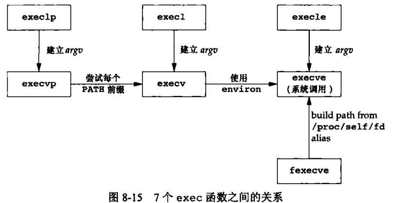

### 8.11 更改用户ID和更改组ID

- 设计时候一般使用最小特权模型，可以使用setuid设置实际用户ID和有效用户ID
- 只有root用户进程可以改变实际用户ID（由login程序设置）。
- 仅当对程序文件设置用户ID位，exec才设置有效用户ID，保存的设置用户ID是由exec复制有效用户ID得到的。
- 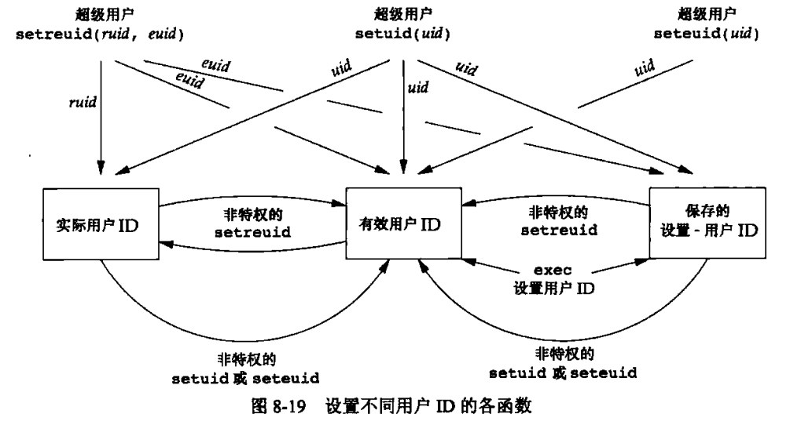

### 8.12 解释器文件

- 文本文件，sh开头的第一行 `#!/bin/bash`，exec函数可以处理

- 用于隐藏脚本，效率较低，可以使用别的shell执行

### 8.13 函数system

- 底层调用了fork exec waitpid
- 设置用户ID程序调用system，是一个安全流动

### 8.14 进程会计

- 每当进程结束时内核产生一个会计记录，一般有命令名，CPU时间，ID，启动时间等。
- \<sys/acct.h\>定义了相关结构，只有终止进程才会写入，记录顺序对应终止顺序。

### 8.15 用户标识

- 函数getlogin 获取用户名，用getpawnam可以在口令文件查看相关记录，quedingshell。

### 8.16 进程调度

- 调整优先级nice，值越小优先级越高，getpriority获取优先级。

### 8.17 进程时间

- times函数

## 第 9 章 进程关系

### 9.1 引言

### 9.2 终端登录

- 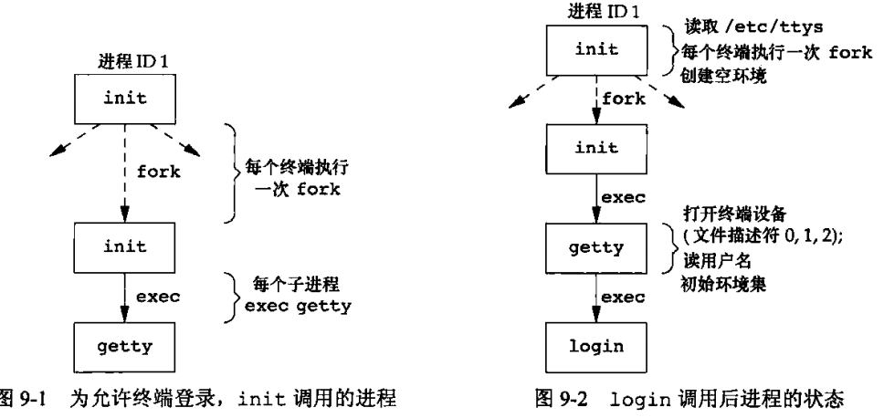

### 9.3 网络登录

- 系统使用伪终端处理终端登录和网络登录
- BSD有一个inetd进程 ，等待连接 ，连接到达一次fork一次。
- 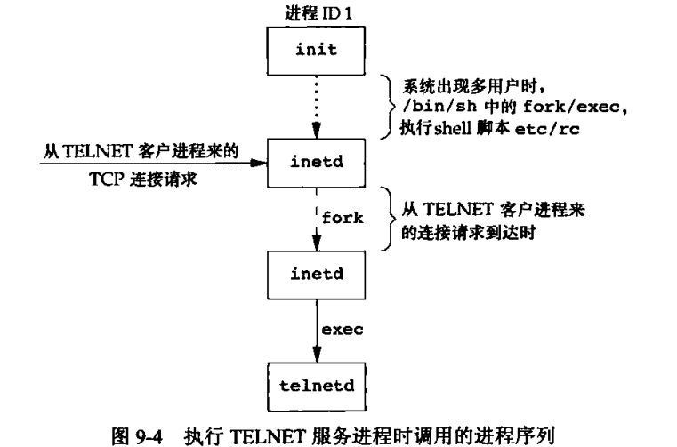

### 9.4 进程组

- 同一组的进程接收来自同一终端的信号。getpgrp可以获取进程组ID。和进程组ID相同的进程ID，就是组长进程。

### 9.5 会话

- 一个或者多个进程组的集合，可能由管道生成。getsid可以获取会话ID
- 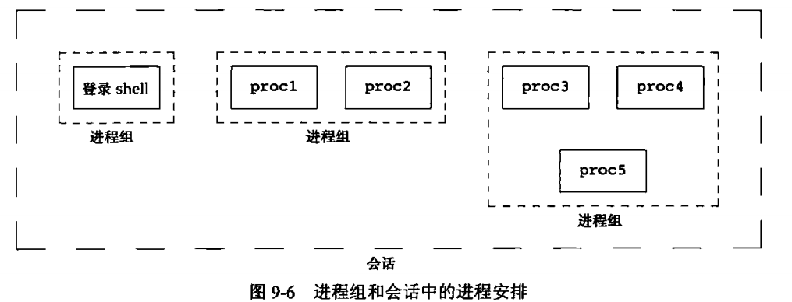

### 9.6 控制终端

- 一个会话可以有一个控制终端，控制终端连接的首进程称为控制进程，中断/退出信号发送到前台
- 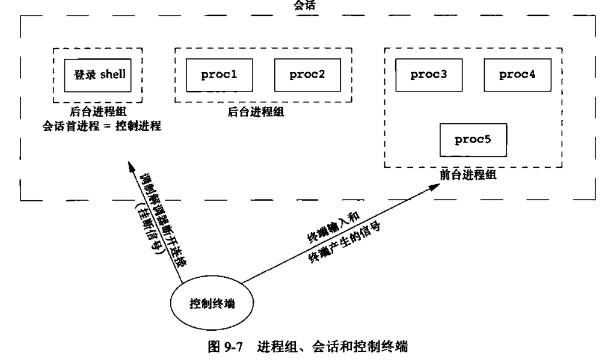

### 9.7 函数tcgetpgrp、tcsetpgrp和tcgetsid

- 通知内核哪个进程组是前台进程组

### 9.8 作业控制

- 作业时几个进程的集合，通常是进程管道
- ctrl-z 挂起，ctrl-\ 退出，ctrl-c 中断，fg %n可以把后台作业变为前台
- 

### 9.9 shell执行程序

- 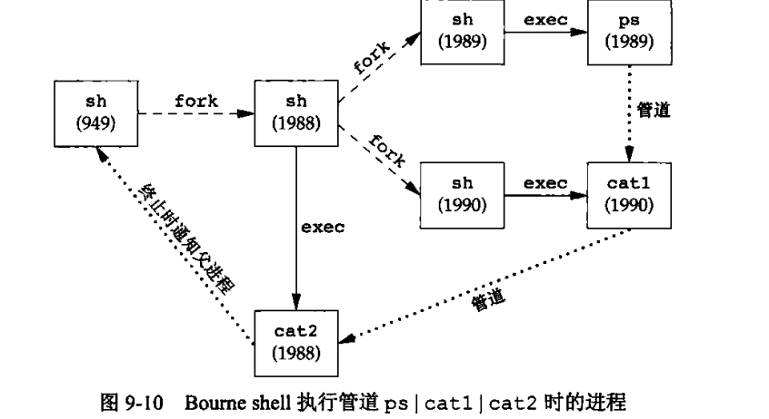

### 9.10 孤儿进程组

- 每个成员的父进程要么是组员，要么不是该组所属会话的成员。

### 9.11 FreeBSD实现

- 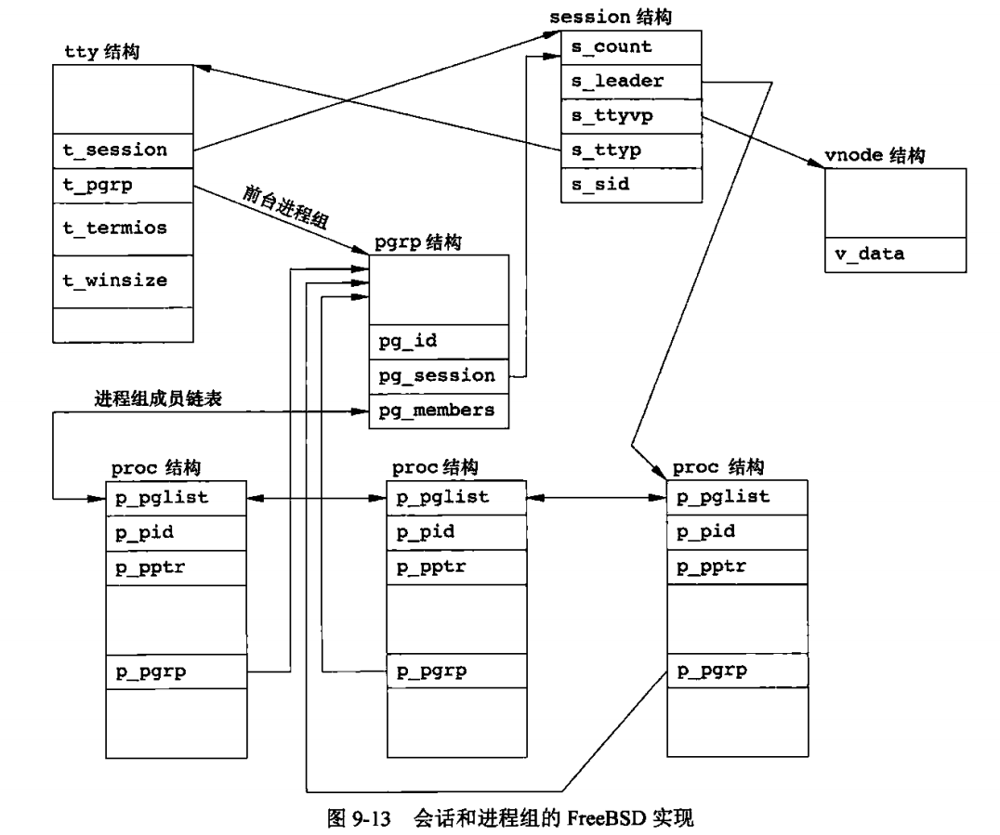

## 第 10 章 信号

### 10.1 引言

### 10.2 信号概念

- 定义在\<bits/signum.h\>中，以SIG开头。系统默认动作"终止+core"表示在 进程当前工作目录的core文件中复制了该进程 的内存映像

### 10.3 函数signal

- 最好使用sigaction替代，可以设置回调函数。
- kill函数/命令只是发送信号
- 程序启动，所有信号状态都是默认动作。进程创建后信号捕捉才是有意义的

### 10.4 不可靠的信号

- 信号可能会丢失，没有幂等性

### 10.5 中断的系统调用 

- 低速系统调用是可能会使进程永远阻塞的一类调用，比如读写文件，pause函数，ioctl操作等。

- BSD引入某些被终端系统调用的自动重启动。ioctl，read，writ，wait等

### 10.6 可重入函数

- 可重入函数称为异步信号安全的 ，会阻塞任何引起不一致的信号发送。

### 10.7 SIGCLD

- SIGCHLD子进程状态改变后产生 

### 10.8 可靠信号术语和语义

- 在信号产生和递送之间的时间间隔称信号是未决的
- 如果为进程产生一个阻塞信号，且动作时默认/捕捉，则为该进程将信号保持为未决状态。

- 多个信号发送的话会排队，每个进程都有一个信号屏蔽字，归档要阻塞递送到该进程的信号集。

### 10.9 函数kill和raise

- kill发送信号给进程，raise允许进程向自身发送。

### 10.10 函数alarm和pause

- alarm设置一个定时器，产生SIGALRM信号，每个进程只能有一个。会被alarm擦除之前，需要设置新倒计时，可能导致超时
  - 使用setjmp
  - 使用sigprocmask和 sigsuspend

### 10.11 信号集

- 告诉内核不允许发生的信号，sigemptyset 和 sigfillset

### 10.12 sigprocmask

- 可以检测或更改信号屏蔽字

### 10.13 函数sigpending

- 返回信号集 ，调用进程而言，信号是阻塞不能递送的。

### 10.14 函数sigaction

- 检查/修改与指定信号相关联的处理动作，替代signal。

### 10.15 函数sigsetjmp和siglongjmp

- longjmp捕捉到一个信号，进入信号捕捉函数，阻止后来产生信号中断该信号处理程序。
- 信号处理程序非局部转移使用这两个函数

### 10.16 函数sigsuspend

- 更改进程信号屏蔽字可以阻塞所选择的信号或者解除对它们的 阻塞。

- 可以用信号实现父子进程同步

### 10.17 函数abort

- abort不会返回到其调用者，调用exit或者longjmp

### 10.18 函数system

- 信号处理的system
- system返回值，是shell终止状态

### 10.19 函数sleep、nanosleep和clock_nanosleep

- 实际事件会比较久，

### 10.20 函数sigqueue

- 使用sigaction函数安装信号处理程序时指定SA_AIGINFO，提供信号处理程序

### 10.21 作业控制信号

- 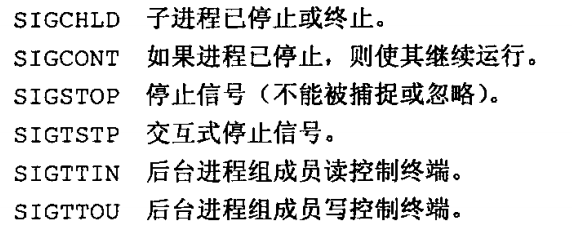

### 10.22 信号名和编号

- psignal可以打印

## 第 11 章 线程

### 11.1引言

### 11.2 线程概念

- 包含有执行环境必须信息，如ID，寄存器，堆栈，信号屏蔽字，私有数据等，称为POSIX线程。。

### 11.3 线程标识

- \<pthread.h\> 定义结构，pthread_equal可以比较两个线程id。pthread_self获取自身xianchengid

### 11.4 线程创建

- 进程默认只有一个线程，通过 pthread_create 可以创建，传入函数。

### 11.5  线程终止

- 任意线程调用exit都会导致进程终止。不退出进程可以使用
  - 线程返回
  - 被其他线程取消
  - 调用pthread_exit
- pthread_join 调用线程将一直阻塞，直到指定线程退出

- 使用pthread_cancle取消其他线程
- 线程清理函数可以由pthread_cleanup_push进行注册
- 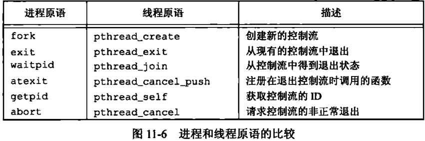

### 11.6 线程同步

- 互斥量 pthread_mutex_t 必须先初始化，可以调用 pthread_mutex_init初始化，动态分配还需要回收 pthread_mutex_destroy
  - pthread_mutex_lock 、 pthread_mutex_unlock 、pthread_mutex_trylock
  - 互斥量允许绑定线程阻塞时间 pthread_mutex_timedlock
  - 避免死锁，如果对同一个互斥量枷锁两次的话就会发生，可以使用trylock轮询。

- 读写锁允许更高的并行性。必须初始化和回收，pthread_rwlock_init 和 pthread_rwlock_destroy。
  - 锁住/解锁 pthread_rwlock_rdlock 、pthread_rwlock_wrlick、pthread_rwlock_unlock也有对应的try版本
  - 也有超时的版本

- 条件变量本身由互斥量保护，pthread_cond_t也是需要初始化和回收
  - 等待pthread_cond_wait，由对应的定时版本
  - 唤醒 pthread_cond_signal/pthread_cond_broadcast

- 自旋锁
  - 接口和互斥量类似，把mutex替换成spin即可

- 屏障 barrier
  - 也是要初始化和回收，接口和条件变量相似，cond替换barrier，只需要wait函数

## 第 12 章 线程控制

### 12.1 引言

### 12.2 线程限制

- sysconf定义了一些相关限制和，比如进程可以创建的线程数等

### 12.3 线程属性

- 线程初始化函数可以使用pthread_attr_t修改默认属性，使用pthread_attr_getstack和pthread_attr_setstack进行线程栈属性管理。

### 12.4 同步属性

- 互斥量属性 pthread_mutexattr_t结构表示，pthread_metexattr_getshared 可以获得共享属性
- 读写锁属性与互斥量类似

- 条件变量支持共享属性，具有时间属性
- 屏障也有属性，只有共享属性

### 12.5 重入

- 后缀加_r标识可重入，比如getlogin\_r等

### 12.6 线程特定数据

- pthread_key_ create创建一个key，可以被所有线程使用，但是每个线程把这个key与不同的县城特定数据地址进行关联。
- pthread_key_delete 取消管理，但是不会激活析构函数
- pthread_once 保证线程key初始化只调用一次，pthread_getspecific可以获取特定数据地址

### 12.7 取消选项

- pthread_setcancelstate 设置可取消状态，线程运行到某个取消点才检查取消。

- pthread_testcancel测试取消状态，

### 12.8 线程信号

- 线程都有自己的信号屏蔽字，但是信号处理时线程共享的。信号是地送到单个线程的，如果信号与硬件故障相关，一般发送到线程，其他信号则发送到任意一个线程。
- 线程使用pthread_sigmask阻止信号发送。通过sigwait等待信号。使用pthread_kill发送信号给线程，kill发送信号给进程。

### 12.9 线程和fork

- 子进程内部只有一个线程，父进程中调用fork的线程，如果父进程占有锁，子进程也会占有锁。如果马上调用exec，就会丢弃旧地址，锁的状态就无关紧要。
- 通过pthread_atfork建立fork处理程序

### 12.10 线程和I/O

- 线程共享文件描述符，pread和pwrite就派上用场。

## 第 13 章 守护进程

### 13.1 引言

- 守护进程常常在系统引导装入时启动

### 13.2 守护进程的特征

- 系统进程依赖于操作系统实现，父进程ID为0的各进程通常是内核进程，存在于系统生命周期，无控制终端，无命令行。
- 使用kthreadd的特殊内核进程创建

### 13.3 编程规则

- 调用umask将文件模式创建屏蔽字设置为已知值（一般为0）
- 调用fork，然后使父进程exit
- 调用setsid创建新会话。然后成为新会话的首进程，成为组长 ，没有控制终端。

- 将当前目录更改为根目录
- 关闭不需要的文件描述符

### 13.4 出错记录

- 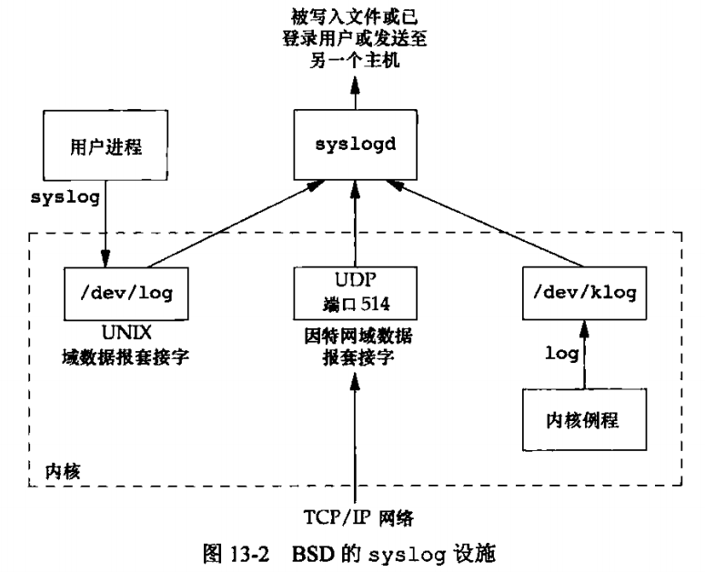

- 通常，syslogd守护进程读取所有三种格式的日志消息，配置文件在/etc/syslog.conf。日志接口在\<syslog.h\>

### 13.5 单实例守护进程

- 比如cron，文件和记录锁机制提供了基础。

### 13.6 守护进程的惯例

- 所文件一般在/var/run，名字 进程名.pid
- 配置文件通常在/etc，文件名 进程名.conf
- 可用命令行启动，通常由系统初始化脚本启动，

### 13.7 客户进程-服务进程模型

- 一般syslogd进程为服务进程，用户进程用UNIX域数据报套接字发送消息。
- 服务进程调用fork然后exec另一个程序提供响应。最好让子进程文件描述符打开

## 第 14 章 高级I/O

### 14.1  引言

### 14.2 非阻塞I/O

- 调用I/O操作，并使这些操作不会永远阻塞，错误立即返回。
  - 调用open获得描述符，可指定O_NONBLOCK标志
  - 已经打开的描述符调用fcntl，由该函数指定标志

### 14.3 记录锁

- 更合适的说法是字节范围锁
- fcntl记录锁，对字节范围添加读写锁，有死锁可能

- 锁的自动继承和释放
  - 锁和进程文件两者相关联。进程结束，锁自动释放，文件关闭，锁也释放。
  - fork产生的子进程不继承父进程的锁
  - exec可以继承原来的锁。
  - 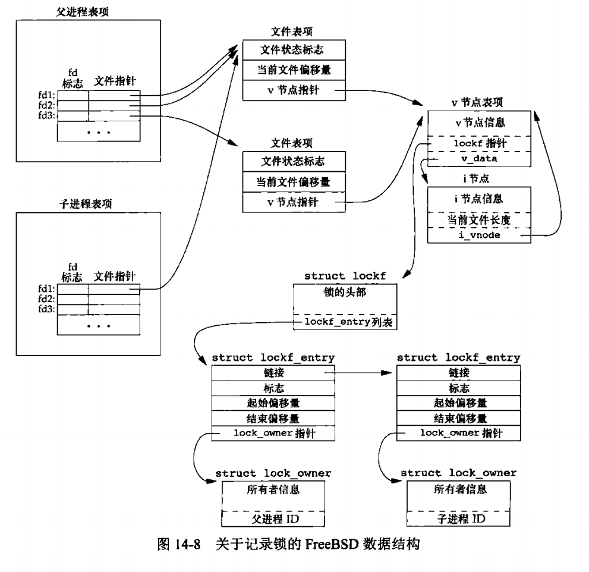

- 强制性锁会让内核检查每一个open/read/write

### 14.4 I/O多路转接

- 非阻塞I/O的典型应用，轮询。消耗大部分时间空转。
- multiplexing，需要一张描述符表，调用函数直到其中一个文件准备好IO才返回。
  - select/pselect，给定描述符条件，返回时内核会通知描述符总量，哪些描述符准备好。描述符到达结尾会返回可读。
  - poll，可用于任何类型描述符，构造pollfd数组，指定兴趣条件。可以区分挂断和文件结尾，可以指定是否可重启

### 14.5 异步I/O

- 使用信号通知进程实现异步，不能知道准确描述符；异步代价在于 错误产生地方更多，涉及大量额外设置和处理规则

- SystemV异步I/O信号是SIGPOLL，只对STREAMS设备起作用。调用ioctl启动异步I/O，设置I_SETSIG。

- BSD异步I/O是SIGIO和SIGURG组合

- POSIX异步I/O提供一套标准。使用AIO控制块描述I/O操作，aiocb结构定义了AIO控制块

  - aio_filed 字段标识文件描述符（打开的），读写从指定偏移量开始，会读到缓冲区

  - 异步I/O必须指定偏移量

    - 使用aio_read读，函数返回时，操作会放入等待队列

    - aio_fsync强制等待的异步操作不等待而写入持久化存储

      aio_error获得异步操作完成状态

      aio_return 操作完成之前需要小心不要调用

      aio_suspend 阻塞进程

      aio_cancel取消异步操作

### 14.6 函数readv和writev

- 用于一次函数调用中读写多个非连续缓冲区

### 14.7 函数readn和writen

- 读写指定n字节数据，并处理返回值小于要求的情况

### 14.8 存储映射I/O

- 将磁盘文件映射到缓冲区，函数nmap实现。
- 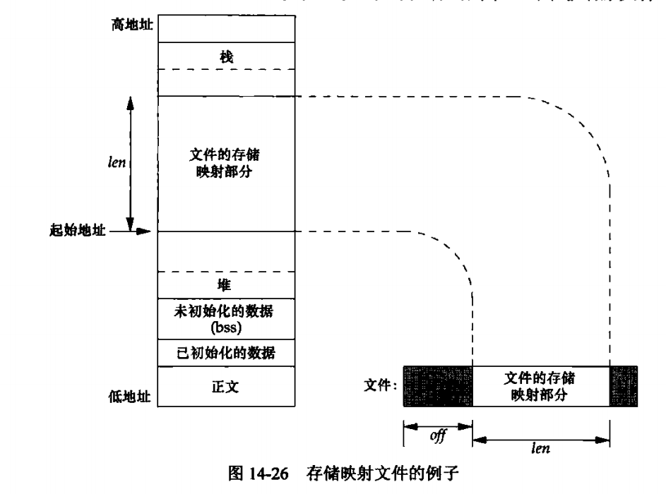

- 调用 mprotect 可以更改映射权限

  msync刷写

  munmap  解除映射

## 第 15 章 进程间通信

### 15.1 引言

### 15.2 管道

- 半双工，通常由一个进程创建，父子进程间使用；

  pipe函数创建

- 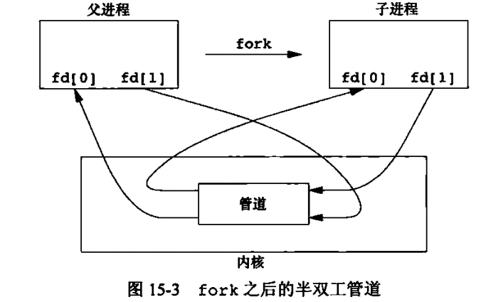

- 关闭不需要的端，读一个写端被关闭的管道，数据读取后，read返回0；

  写读端关闭的管道，产生 信号SIGPIPE，write返回-1

### 15.3 函数popen和pclose

- 创建一个连接到另一个进程的管道，函数实现的是：创建管道，fork子进程 ，关闭未使用管道端，执行shell命令

### 15.4 协同进程

- 当一个过滤器即产生某个过滤输入，又读取过滤输出，它就变成了协同进程。

### 15.5 FIFO

- 命名管道，是一种文档类型，使用mkfifo/mkfifoat创建。使用open打开
- 用途：shell命令使用FIFO将数据从一条管道传送到另一条，无需创建中间临时文件；C-S进程通信，用作汇聚点
- 比如tee命令的实现

### 15.6 XSI IPC

- 共同点（消息队列、信号量、共享存储器）
  - IPC结构都用一个非负整数标识符加以引用
  - IPC结构关联了ipc_perm结构
  - 结构都有内置限制，可以通过配置内核来改变
  - 范围起作用，没有引用计数

### 15.7 消息队列

- 消息的链表，存储在内核，简称队列，由消息队列标识符标识。
- msgget 创建/打开现有队列，msgsend添加消息到尾部，msgrcv取消息。msqid_ds结构关联到一个队列。

### 15.8 信号量

- 它是一个计数器，提供多个进程对共享数据的访问
- 常用信号量为二元信号量，初始值为1。有一个致命缺点，创建和初始化不是一起的。
- semid_ds结构关联一个信号量，semget获取信号量ID，smctl包含多种信号量操作。

### 15.9 共享存储

- 允许进程共享一个给定的存储区，速度很快。通常，信号量用于同步共享存储访问。
- 内核为共享存储区维护一个结构 shmid_ds，shmget获取共享存储标识符，shmctl包含多种操作，shmat连接到地址空间

### 15.10 POSIX信号量

- 3中IPC机制之一，有无命名差异在于创建和销毁的形式上。
- sme_open创建/使用新信号量，sem_close关闭信号量，如果没有调用，内核会自动关闭，sem_unlink 删除信号量名字。
  - sem_wait操作，计数0的时候阻塞，有time和try版本
  - sem_post信号量加一，sem_getvalue获取值

### 15.11 客户进程-服务器进程属性

- 客户进程fork → exec服务器进程，可以构建一个open服务器进程，为客户进程打开文件。缺点在于某些特殊文件不能工作，比如块设备文件。
- 服务进程是一个守护进程，客户进程通过IPC进行联系，需要使用命名IPC，如 FIFO/消息队列。

## 第 16 章 网络IPC：套接字

### 16.1 引言

### 16.2 套接字描述符

- socket是通信端点的抽象，被当成一种文件描述符。
- socket 创建套接字，通信域以AF开头，通信时双向的，shutdown关闭套接字。

### 16.3 寻址

- 大端小端，网络协议制定了字节序，TCP/IP默认大端。字节序和网络字节序转换函数在\<arpa/inet.h\>中声明了。
- 地址格式，一个地址标识一个特定通信域的套接字端点。通用地址结构sockaddr，\<stdint.h\>定义了相关类型和位数。

- 地址查询，gethostent找到主机信息，在\<netdb.h\>中有相关函数。

  getservent顺序烧苗服务数据库，getservbyport将一个端口映射到服务名

  getaddrinfo返回链表，允许将主机名和服务ing映射到一个地址。

- 套接字与地址关联可以通过bind函数，一般时一对一。getsockname可以发现绑定到套接字的地址。

  getpeername 找到对象的地址

### 16.4 建立连接 

- connect 函数，在\<sys/socket\>中声明，注意需要处理失败的场景，一般可以使用指数补偿算法。

- 还可以用于无连接的网络服务，使用listen函数接收连接请求。backlog标识入队未完成连接请求数量。

  accept函数获取连接请求并连接，返回的是套接字描述符

### 16.5 数据传输

- 可以使用read/write交换数据。有6个套接字数据传输函数
- send函数，可以指定标志位改变传输方式。还有sendto和sendmsg。
- recv函数接收数据，以及recvfrom和 recvmsg

### 16.6 套接字选项

- 套接字机制提供了两个接口，setsockopt可以设置套接字选项。

### 16.7 带外数据

- 允许更高优先级的数据传输，可选功能，TCP支持，UDP不支持。
- TCP将带外数据称为紧急数据，仅支持一字节，多个字节只取最后 一个。通过fcntl看可以获取
- TCP支持紧急标记的概念，通过sockatmart可以判断是否已经到达紧急标记。

### 16.8 非阻塞和异步I/O

- 步骤：建立套接字所有权 → 通知套接字当I/O操作不会阻塞时发信号
- 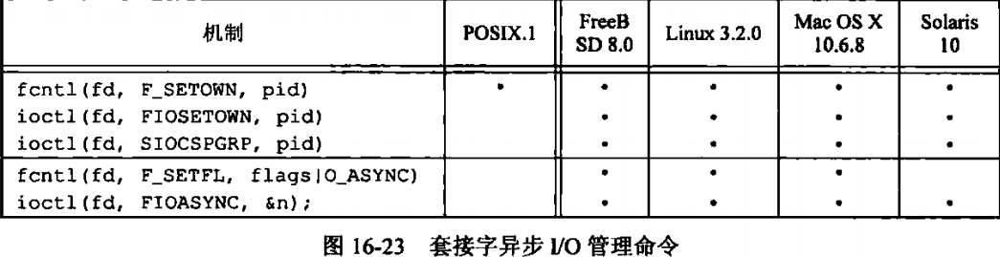

## 第 17 章 高级进程间通信

### 17.1 引言

### 17.2 UNIX域套接字

- 用于在同一台计算机进程间通信，效率更高，仅仅复制数据，无需报头/校验和/确认报文等

- 提供流和数据包两种接口，像是套接字和管道的混合。

  socketpair用来创建一对UNIX域套接字。

  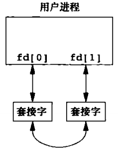

- XSI 消息队列不能和poll或者select一起使用，因为关联不到文件描述符。然而，套接字可以。对每个消息队列使用一个线程，每个线程都会在msgrcv调用中阻塞。
- 命名UNIX域套接字，格式会随实现而变化。由sockaddr_un结构表示。

### 17.3 唯一连接

- 服务器进程可以使用bind、listen和accept函数，为客户端进程安排一个唯一域连接。

### 17.4 传送文件描述符

- 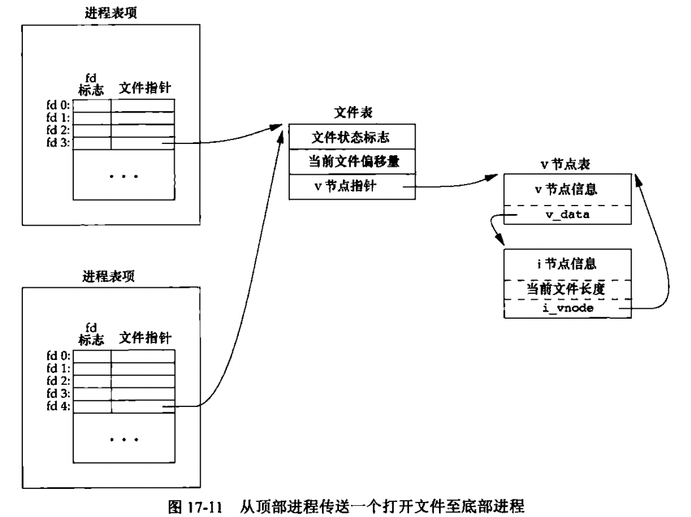

- 函数 send_fd、send_err、recv_fd，还可以发送证书

### 17.5 open服务器进程第一版

### 17.5 open服务器进程第二版

## 第 18 章 终端I/O

### 18.1 引言

### 18.2 综述

- 两种工作模式：规范模式输入处理，以行为单位；非规范模式处理。
- 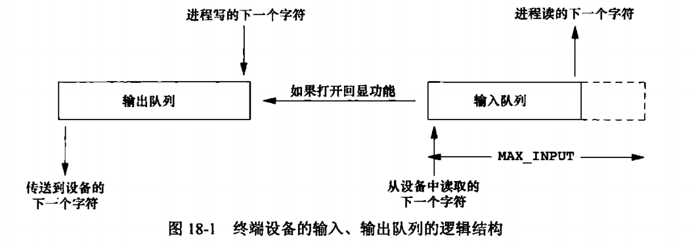

- 大多UNIX系统在 终端行规程 进行 规范处理，定义在 \<termios.h\>

- 

  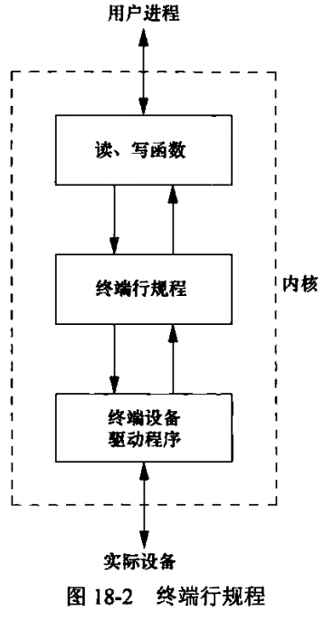

- 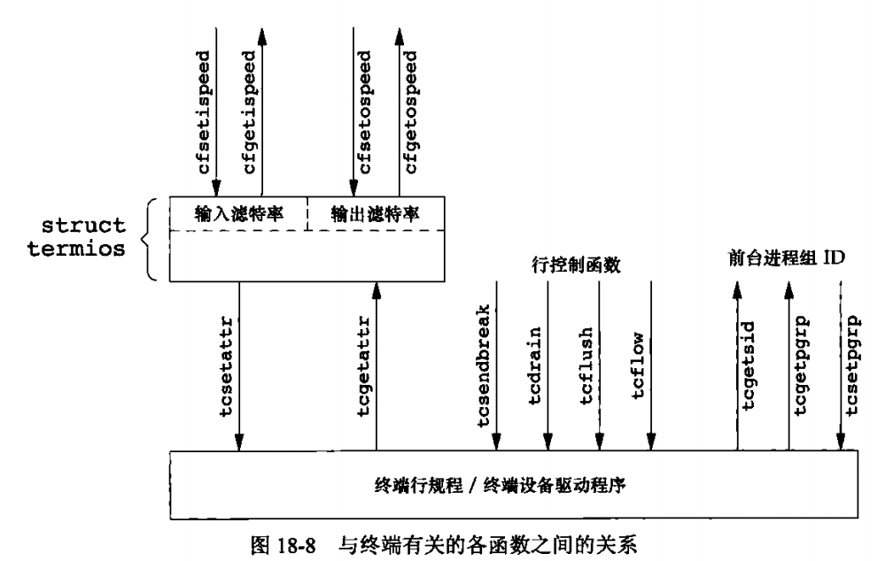

### 18.3 特殊输入字符

- 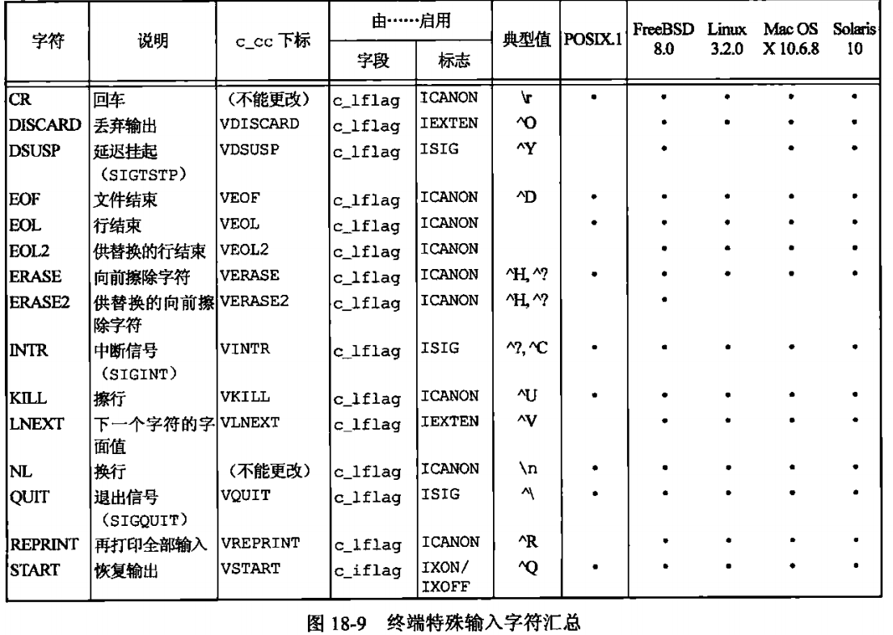

### 18.4 获得和设置终端属性

- tcgetattr 和 tcsetattr 函数可以操作。

### 18.5 终端选项标志

### 18.6 stty命令

- 命令行中使用，-a显示选项

### 18.7 波特率函数

- 指的是 bit/second，只要硬件许可，就能设置为两个不同的值。

  函数 cfgetispeed、cfgetospeed

### 18.8 行控制函数

- 函数tcdrain 等待所有输出都被传递

  tcflow 对IO进行控制

  tcflush 刷新缓冲区

  tcsendbreak 发送连续0值位流

### 18.9 终端知识

- 名字一直是/dev/tty，通过ctermid可以获取终端名

### 18.10 规范模式

- 发送一个读请求，当一行已经输入后，终端驱动程序立即返回  
  - 请求字数已读到
  - 读到行定界符
  - 捕捉到信号，不自动重启

### 18.11 非规范模式

- 通过关闭termios结构的c_lflag字段 的ICANON标志指定非规范模式

- 当读了指定量数据或者超过给定量时间后，通知系统返回。

### 18.12 终端窗口大小

- 内核为终端维护了一个winsize结构，通过ioctl可以设置，窗口可以重绘。

### 18.13 termcap、terminfo 和  curses

- termcap是为了支持vi编辑器，包含各种终端的说明，技术不完善

- terminfo和curses库是为了修正termcap，易于快速定位

## 第 19 章 伪终端 

### 19.1 引言

- 登录请求通过网络连接到达，终端行规程并不是自动加载到网络连接和shell之间的，使用伪终端设备驱动程序，用于提供终端语义。

### 19.2 概述

- 似是而非，因为不是真正终端，所以波特率，中断符等将被忽略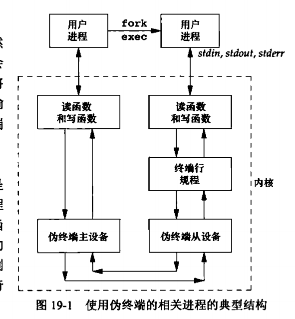

- 典型
  - 网络登录服务器  telnetd和rlogind服务器。
  - 窗口终端模拟器
  - script程序
  - expect程序
  - 协同进程
  - 观看长时间运行程序输出
  - 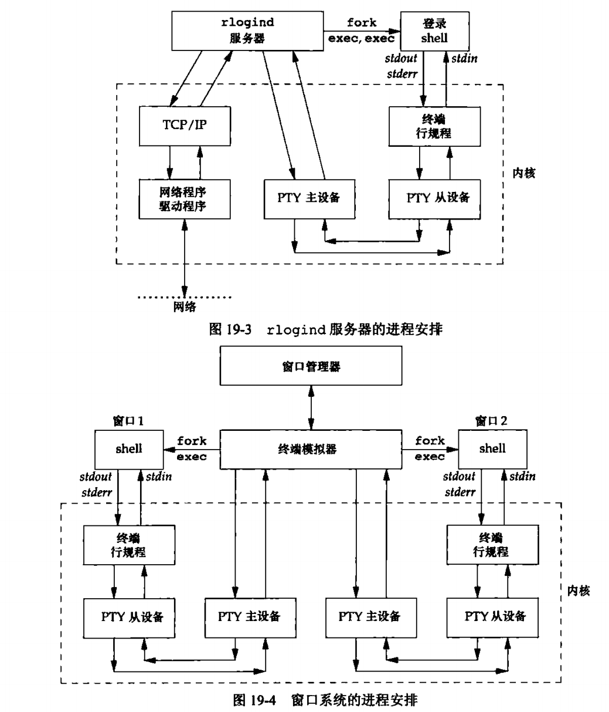

### 19.3 打开伪终端设备

- 跟打开物理终端一样，第一次打开需要初始化。posix_openpt可以打开。
- grantpt更改权限，unlockpt允许应用打开该设备，ptname返回PTY从设备名

### 19.4 函数pty_fork 

### 19.5 pty 程序

### 19.6 使用pty

### 19.7 高级特性

- 打包模式：使pty主设备了解pty从设备状态变化
- 远程模式：pty可以用命令将从设备设置成远程模式
- 窗口大小变化
- 信号发生

## 第 20 章 数据库函数库

### 20.1 引言

### 20.2 历史

- dbm时unix中流行的数据库函数库，使用了动态散列结构，后来称为ndbm。

### 20.3 函数库

### 20.4 实现概述

## 第 21 章 与网络打印机通信

### 21.1 引言

### 21.2  网络打印协议
