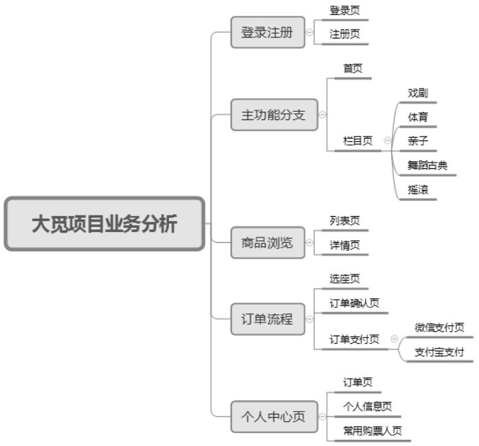
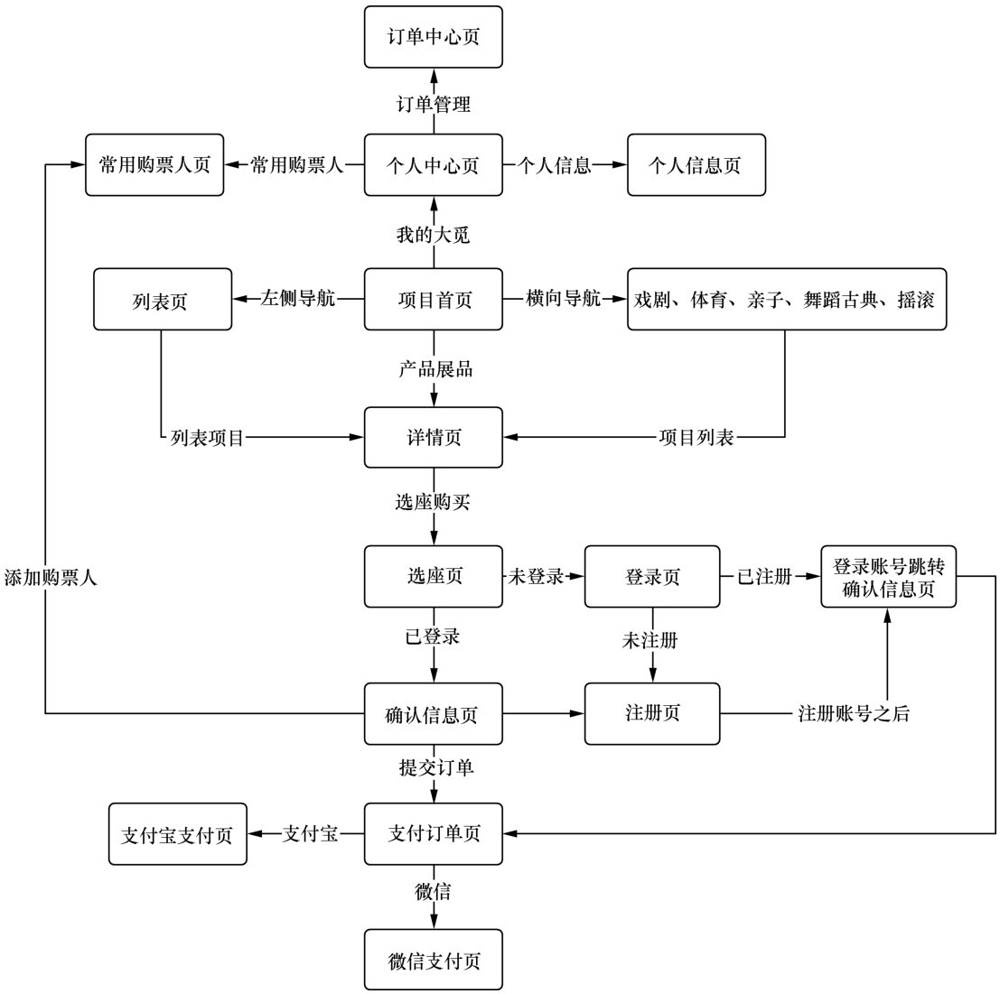
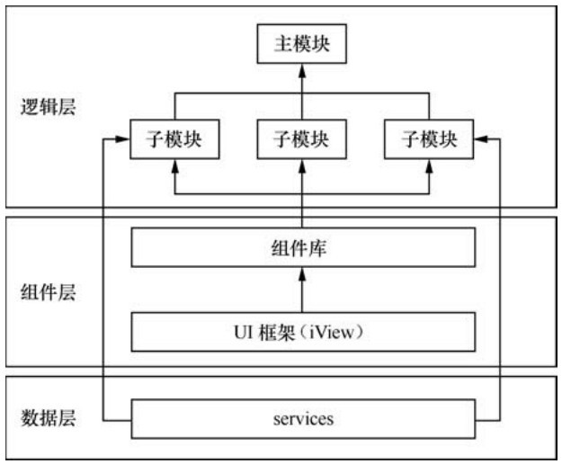

# Vue企业开发实战
- [ ] 书籍作者:肖睿 龙颖
- [ ] 笔记时间:2021.8.20

## 第1章 大觅项目架构设计

### 任务1 大觅项目业务场景

- 网上电影售票

#### 1.1.1 大觅项目业务分析

- 

#### 1.1.2 大觅项目业务梳理

- 

#### 1.1.3 大觅项目技术栈选型

- 有前端自动化工具（Gulp、Grunt），前端组件化框架（Vue.js、React.js）、前端工程化（这是一套技术思想）、前端模块化（SeaJS、RequireJS、ECMAScript），简称四个“现代化

### 任务2 大觅项目环境搭建

#### 1.2.1 Node.js的介绍

- 基于Chrome V8引擎的JS环境，非阻塞、事件驱动

#### 1.2.4 Vue-cli脚手架

- 单页面应用（Single Page Web Application，SPA），从服务器加载的富客户端，公共资源只需要加载一次，局部刷新资源
- 多页面应用（Multi-Page Application，MPA），公共资源选择性重新加载

- |              | 单页面应用                 | 多页面应用              |
  | ------------ | -------------------------- | ----------------------- |
  | 组成         | 一个外壳页面、多个页面片段 | 多个完整页面            |
  | 刷新         | 局部                       | 整页                    |
  | url          | a.com/#/pageone            | a.com/pageone.html      |
  | 用户体验     | 流畅                       | 较慢                    |
  | 搜索引擎优化 | 困难，不利于SEO检索        | 可利用服务器渲染SSR优化 |


### 任务3 前端架构设计

#### 1.3.1 分层架构&模块化

- 

#### 1.3.2 分离方式

- 不分离：前后端公用项目目录，很复杂
- 部分分离：比如JSP，沟通成本高
- 完全分离：分离开发集成部署和分离开发分离部署

#### 1.3.3 Visual Studio Code免费跨平台编辑器

#### 1.3.4 UI框架

- 快速搭建项目原型，精细化要求不是特别高
- 选择组件丰富，API完整，社区活跃
- iView 基于Vue.js的开源UI组件库，使用--save选项上线时需要依赖，而--save-dev只是开发时依赖
  - 说明：笔记时间 iView4.0已经不维护了，改用 [view-design](https://iviewui.com/docs/guide/install)，根据官网步骤安装即可
  - 借助组件 babel-plugin-import  按需引入

#### 1.3.6 构建工具Webpack

- 解决js和css依赖问题，加载顺序导致找不到变量等
- 性能优化 -- 文件压缩，文件合并
- 效率提升 -- 自动处理兼容性问题

## 第2章 大觅项目中ES6的使用

### 任务1 let和const命令

#### 2.1.1 let命令

- 作用域是代码块，不支持变量提升，for循环支持块作用域了

#### 2.1.3 const命令

### 任务2 变量的解构赋值

- ES6 允许按照一定模式从数组和对象中提取值，再对变量赋值，这被称为解构（Destructuring）

#### 2.2.1 数组的解构赋值

- ```js
  let [a,b,c] = [1,2,3]
  // 允许嵌套和使用默认值
  ```

#### 2.2.2 对象的解构赋值

- ```js
  // 键名需要对应
  let {first:f} = {"first":"tom"}
  ```

### 任务3 使用箭头函数

#### 2.3.1 箭头函数起因

- JS默认作用域是函数，一不小心就会定义到全局。比如回调函数，通常需要保存this

  箭头函数可以解决该问题

- 箭头函数不绑定arguments，需要使用剩余参数语法

#### 2.3.4 箭头函数不适用场景

- 对象的方法，箭头函数绑定的this是声明它的函数，对象并不能限制作用域
- 作为构造函数和原型方法

### 任务4 Map数据结构

#### 2.4.1 Map数据结构的特点

- ES6提供了Map结构，不限定于字符串

#### 2.4.2 如何创建Map

- ```js
  new Map([
      ['name':'tom'],
      ['age':'11']
  ])
  // 常用属性
  size get set has delete 
  // 遍历
  keys values entries forEach
  ```

### 任务5 Module的语法

#### 2.5.1 概述

- ES6之前，社区制定了一些模块加载方案，最主要的有CommonJS和AMD两种。前者用于服务器，后者用于浏览器。

#### 2.5.2 export、import命令

- 一个模块就是一个独立的文件，文件内部的所有变量外部无法获取。

#### 2.5.3 export default命令

- 引入时候不用大括号

### 任务6 Promise对象

#### 2.6.1 Promise的含义

- Promise对象状态不受外界影响，只有pending，fulfilled和rejected三种。
- 状态一旦改变就不会再变
- 缺点：无法取消，需要设置错误处理函数

#### 2.6.2 基本用法

- resolve 和 reject 由系统提供，将Promise状态设置为对应状态

## 第3章 大觅项目的路由配置

### 任务1 什么是前端路由

#### 3.1.1 什么是路由

- 根据不同url展示不同内容

#### 3.1.2 前端路由

- 技术实现上不一样，但原理是一样的。H5之前通过hash实现，需要带上#号，使用 window.location.hash 可以读取到url
- history是H5的api，更加方便

#### 3.1.3 前端路由的使用场景

- 前后端分离开发，AJAX请求，浏览器前进后退

### 任务2 Vue Router基本使用

#### 3.2.1 安装路由

- vue-router

#### 3.2.2 建立路由模块

- 再 router/index.js 照抄即可

#### 3.2.3 启动路由器

- main.js  作为启动文件，使用 import 语法引入路由模块，再App.vue中可以看到 router-view 标签，组件都会替代它的位置。

#### 3.2.4 路由重定向

- 配置路由时候，设置redirect属性，可以是方法

#### 3.2.5 路由懒加载

- 结合Vue的异步组件和Webpack的代码分割功能，可以轻松实现路由组件的懒加载。
  - 异步组件：Vue支持使用工厂函数，异步解析组件定义，使用返回Promise工厂
  - 代码分割：使用动态import

#### 3.2.6 \<router-link\>

- 支持用户在具有路由功能的应用中单击导航，to 可以指定目标地址

- 相对于a标签优势，无论是HTML5 history模式还是hash模式，它们的表现行为一致；

  history模式下，会守卫单击事件，不会重新加载页面

#### 3.2.7 路由对象属性

- $toute.path总是解析为绝对路径
- $route.params 包含了动态片段和全匹配片段
- $route.query 表示URL查询参数。
- $route.hash当前路由的hash值（不带#）
- $route.fullPath完成解析后的URL
- $route.matched一个数组，包含当前路由的所有嵌套路径片段的路由记录

### 任务3 页面间导航

#### 3.3.1 router.push

- 导航到不同的URL，则使用router.push方法。该方法会向history栈添加一个新的记录，当用户单击浏览器的后退按钮时，回到之前的 URL。

#### 3.3.2 router.replace

#### 3.3.3 router.go

## 第4章 初识Vue.js

### 任务1 Vue.js是什么

- 渐进式（progressive）是指可以一步一步、阶段性地来使用 Vue.js
- 使用MVVM模式

### 任务2 Vue实例与数据绑定

### 任务3 class与style绑定

- v-bind指令的主要用法是动态更新HTML元素上的属性。

## 第5章 大觅项目中与服务端通信

### 任务1 connect-mock-middleware工具的使用

- connect-mock-middleware是一个非常方便、实用的mock模拟工具

### 任务2 Mock.js语法

- Mock.js是一个模拟数据生成器，可以使前端独立于后端开发
- 语法有数据模板和占位符模板，

### 任务3 snail mock工具使用

- snailmock能够模拟服务器的功能，生成接口的url服务地址供调用。

### 任务4 Axios的安装及配置

- Axios是一个基于Promise、用于浏览器和node.js的HTTP客户端

## 第6章 Vue.js指令

### 任务1 条件渲染指

### 任务2 列表渲染v-for指令

### 任务3 方法与事件

### 任务4 v-model与表单

## 第7章 组件详解

## 第8章 计算属性和侦听器

## 第9章 大觅项目中插件的使用

### 任务1 百度地图插件

- [doc](https://lbsyun.baidu.com/jsdemo.htm#aCreateMap)

### 任务2 状态管理与Vuex

- 全局数据共享，跨组件

### 任务3 二维码插件

- QRCode插件使用
