# WPF编程宝典

- [ ] 书籍作者: Mattew MacDonald
- [ ] 笔记时间: 2021.05.14

# 第一部分 基础知识

## 第1章 WPF概述 

### 1.1 Windows图形演化 

- User32 提供熟悉的Windows外观
- GDI/DDI+ 文本/图像提供绘图支持,较为复杂

#### 1.1.1 DirectX：新的图形引擎 

为Windows平台开发游戏的工具包,注重速度.后来支持显卡,拥有硬件加速.WPF底层就是DirectX.

#### 1.1.2 硬件加速与WPF 

WPF即使是集成显卡也是尽量采取硬件优化的

### 1.2 WPF：高级API 

类似Web的布局,动画,文本,视频等

### 1.3 分辨率无关性 

当DPI不同时候,一个组件大小显示可能会大小不同.

#### 1.3.1 WPF单位 

物理单位尺寸 = 设备无关单位尺寸 (默认 1/96 英寸)* 系统DPI

#### 1.3.2 系统DPI 

某些应用支持高DPI,Windows可以通过设置修改

#### 1.3.3 位图和矢量图形 

WPF最好使用矢量图,即使很小的位图图标可能在DPI变化的时候模糊

### 1.4 WPF体系结构 

- PresentationFramework.dll 包含WPF顶层类型和抽象，比如窗口、控件、面板等常见类型
- PresentationCore.dll 基础类型的实现，比如UIElement类和Visual类
- WindowsBase.dll 更多基本元素，比如依赖属性和DispatcherObject类
- milcore.dll WPF渲染核心。所有绘图内容都是由Direct3D完成
- WindowsCodecs.dll 是一套提供图像支持的低级API
- Direct3D是一条低级API，WPF图形渲染由它负责
- User32决定哪些程序实际占有桌面的那一部分

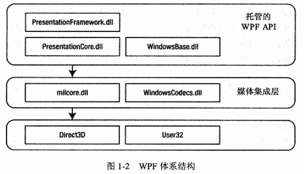

---

- System.Threading.DispatcherObject WPF是单线程的,由协调程序调度管理.
- System.Windows.DependencyObject 依赖属性(更改通知,默认值继承等)
- System.Windows.Media.Visual WPF窗口显示的元素都是Visual对象，该类对象都可以绘制，如果需要轻量对象可以使用（封装了绘图、命中测试等基本功能）
- System.Windows.UIElement 本质特征支持，焦点，路由事件等
- System.Windows.FrameworkElement 提供UIElement支持的更多属性，比如布局位置，样式，动画等

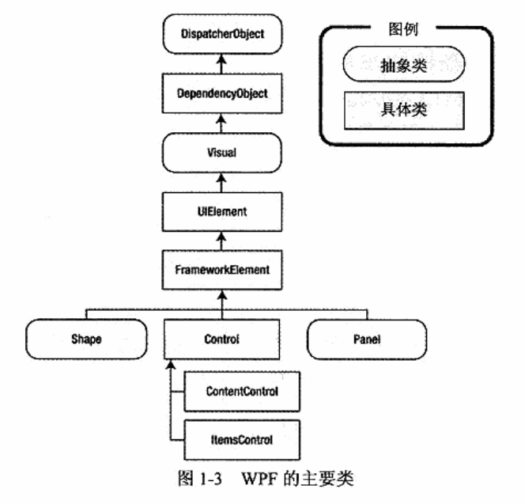

### 1.5 WPF 4.5 

#### 1.5.1 WPF工具包 

WPF新特性会放到工具包,需要自己下载

#### 1.5.2 Visual Studio 2012 

- 多目标 低版本.NET程序可以运行在高版本环境里
- XAML 设计器,可以使用blend辅助设计

## 第2章 XAML 

### 2.1 理解XAML 

#### 2.1.1 WPF之前的图形用户界面 

代码和图像深度耦合

#### 2.1.2 XAML变体 

- WPF XAML 描述WPF图形
- XSP 
- Silverlight 浏览器插件
- WF 

#### 2.1.3 XAML编译 

BAML是XAML的二进制形式,嵌入到dll/exe里面

### 2.2 XAML基础 

三个顶级元素 Window Application Page

#### 2.2.1 XAML名称空间 

使用xmlns标记名称空间让程序定位到类.看起来像URI,实际上是为了和标记不重复.

#### 2.2.2 代码隐藏类 

```xaml
<Windows x:Class="WindowsApplication1.Window1"></Windows>
这个标签会在编译时自动生成继承Windows的类,名字叫Window1.
```

1. InitializeComponent() 

   十分重要,自动生成,假如有其他构造器记得调用.作用就是从程序集提取BAML并构建用户界面

2. 命名元素

   标签有些没有Name属性,可以通过x:Name进行标记

#### 2.3 XAML中的属性和事件 

#### 2.3.1 简单属性与类型转换器 

- XAML 解析器必须执行类型转换,会检查属性是否有TypeConverter

#### 2.3.2 复杂属性 

- 提供属性元素语法,利用标签的方式设置,可能产生很深的嵌套

#### 2.3.3 标记扩展 

```xaml
<Button ... Foreground="{x:Static SystemColors.ActiveBrush}"></Button>
格式{扩展标记类型 参数},Static 是 StaticExtension 的缩写
```

扩展标记类都是继承自 System.Windows..Markup.MarkupExtension类,具有ProvideValue() 方法。该方法只是获取值并设置。

#### 2.3.4 附加属性 

常用于空间布局,格式为 定义类型.属性名,实际上是静态方法调用.

```xaml
<Button ... Grid.Row="2"></Button>
实际上会变为 Grid.SetRow(obj,2);
实际上控件实现了 DependecyObject
```

#### 2.3.5 嵌套元素 

- 如果父元素实现了 IList / IDictionary 接口,会调用对应的 Add() 方法
- 如果父元素使用 ContentProperty 特性修饰,解析器将使用子元素设置对应的属性.

#### 2.3.6 特殊字符与空白 

- 字符实体替代转义字符
- xml:space="preserve" 可以保留标签文本的空格

#### 2.3.7 事件 

#### 2.3.8 完整的Eight Ball Answer示例 

### 2.4 使用其他名称空间中的类型 

为使用未在WPF名称空间定义的类,需要将.NET名称空间映射到XAML名称空间

```xmal
xmlns:Prefix="clr-namespace:Namespace;assembly=AssemblyName"
```

### 2.5 加载和编译XAML 

#### 2.5.1 只使用代码 

#### 2.5.2 使用代码和未经编译的XAML 

使用XamlReader进行文件的加载和解析

#### 2.5.3 使用代码和编译过的XAML 

编译后在 bin/Debug 下会有对应的 名字.baml 和 名字.g.cs 文件

#### 2.5.4 只使用XAML 

## 第3章 布局 

### 3.1 理解WPF中的布局 

#### 3.1.1 WPF布局原则 

- WPF窗口只能包含单个元素. Window类继承ContentControl类

- 容器可以添加多个元素.尽量使用相对位置,可调,可嵌套.

#### 3.1.2 布局过程 

- 测量 遍历容器元素得到尺寸
- 排列 合适位置放置

#### 3.1.3 布局容器 

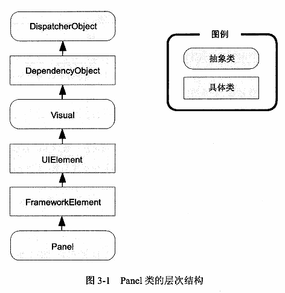

### 3.2 使用StackPanel面板进行简单布局 

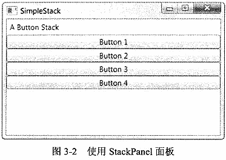

#### 3.2.1 布局属性 

继承自 FrameworkElement 类,主要是宽高对齐等设置

#### 3.2.2 对齐方式 

#### 3.2.3 边距 

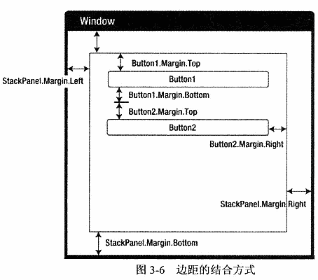

#### 3.2.4 最小尺寸、最大尺寸以及显式地设置尺寸 

单独设置很麻烦,可以利用样式统一设置.

#### 3.2.5 Border控件 

可以设置圆角

### 3.3 WrapPanel和DockPanel面板 

#### 3.3.1 WrapPanel面板 

换行用

#### 3.3.2 DockPanel面板 

吸附,自动调整大小

#### 3.3.3 嵌套布局容器 

将前面的Panel组合使用.

### 3.4 Grid面板 

ShowGridLines 可以设置边界可见.可以设置行列进行布局.

#### 3.4.1 调整行和列 

- 行列可以设置为 绝对值 | 百分比 | 自动均分

#### 3.4.2 布局舍入 

像素含有小数的处理,WPF会使用抗锯齿模糊边界,使用 UseLayoutRounding 可以对齐到最近的像素

#### 3.4.3 跨越行和列 

Grid.RowSpan 可以跨行,列同理.

#### 3.4.4 分割窗口 

GridSplitter 可以用于分割,可以预留一行/列用于放置该对象

#### 3.4.5 共享尺寸组 

使独立的Grid控件具有相同的尺寸比例

#### 3.4.6 UniformGrid面板 

格子固定均分,用于刻板

### 3.5 使用Canvas面板进行基于坐标的布局 

没有任何布局,十分灵活

#### 3.5.1 Z顺序 

叠加时候优先级,数值越大越优先

#### 3.5.2 lnkCanvas元素 

派生于 FrameworkElement 类,目的接收手写输入

具有非常多的事件,比如 输入 选择 擦除等

### 3.6 布局示例 

#### 3.6.1 列设置 

#### 3.6.2 动态内容 

#### 3.6.3 组合式用户界面 

## 第4章 依赖项属性 

### 4.1 理解依赖项属性 

WPF依赖属性使用.NET属性过程进行封装.依赖属性支持WPF的样式设置、数据绑定、继承、动画，以及默认值，让XAML使用起来跟标签语言一样，同时还可以节省内存。

#### 4.1.1 定义依赖项属性 

只能为 DependencyObject 的对象设置依赖属性

- 定义表示属性的对象,是 DependencyProperty 对象,因为需要子类元素共享,所以定义为 公共静态只读对象.

#### 4.1.2 注册依赖项属性 

DependencyProperty 不能直接实例化,需要调用静态方法进行注册.在静态构造器进行.

- 创建 FrameworkPropertyMetadata 对象,指示依赖属性的主要功能(数据支持,动画等)
- 调用 DependencyProperty.Register() 

#### 4.1.3 添加属性包装器 

使用传统.NET属性封装WPF属性,使用 DependencyObject 的 GetValue/SetValue 进行设置返回.不应当在这里进行校验.可以通过DenpendencyProperty 回调函数进行校验

#### 4.1.4 WPF使用依赖项属性的方式 

- 更改通知 依赖属性发生变化不会自动引发事件,会触发 OnPropertyChangedCallback() 方法,
- 动态值识别 按照优先级识别(默认值 继承值 主题 项目 本地值)
  - 属性值决定步骤 确定基本值 表达式解析 动画属性 CoerceValueCallback回调函数修正

#### 4.1.5 共享的依赖项属性 

通过调用 DependencyProperty.AddOwner() 可以重用属性

#### 4.1.6 附加的依赖项属性 

附加属性被应用的类并非定义它的类

- 跟普通依赖属性一样,调用的是 RegisterAttachment()
- 不用.NET属性封装器,而是直接 GetValue/SetValue 

### 4.2 属性验证 

- CoerceValueCallback 方法有机会修改提供的值
- 激活 ValidateValueCallback方法,不可以访问其他属性
- 两者通过触发 PropertyChangedCallback 方法

#### 4.2.1 验证回调 

Register 时候可以传入回调函数,一次只能验证一个属性.

#### 4.2.2 强制回调 

FrameworkPropertyMatadata对象可以设置,直接修改属性值

优先级高到低如下 Minimum Maximum Value

## 第5章 路由事件 

控件可接收来自其他控件的事件

### 5.1 理解路由事件 

#### 5.1.1 定义、注册和封装路由事件 

路由事件也是 只读静态字段,静态构造器注册,通过.NET事件定义封装

#### 5.1.2 共享路由事件 

#### 5.1.3 引发路由事件 

引发不是通过.NET事件封装器,而是使用RaiseEvent()引发.

#### 5.1.4 处理路由事件 

控件的事件绑定

### 5.2 事件路由 

#### 5.2.1 RoutedEventArgs类 

该参数可以获取事件源

#### 5.2.2 冒泡路由事件 

阻止冒泡可以将 e.Handled 设置为true

#### 5.2.3 处理挂起的事件 

有一种方法可以处理被标记处理过的事件,AddHandler()的重载版本.

#### 5.2.4 附加事件 

不是所有控件都支持Click事件,但是可以通过 Button.Click 进行绑定,这样子元素的Button可以响应

事件处理程序可以确定是哪个控件触发

#### 5.2.5 隧道路由事件 

名称是 PreviewMouseUp,方向和冒泡处理相反

### 5.3 WPF事件 

#### 5.3.1 生命周期事件 

- Initialized 
  - 当创建窗口时,会自下而上初始化,初始化完成就会触发下一阶段
- Loaded Unloaded
  - 自上而下,如果只需要一次初始化触发 可以是 Windows.Loaded 事件

#### 5.3.2 输入事件 

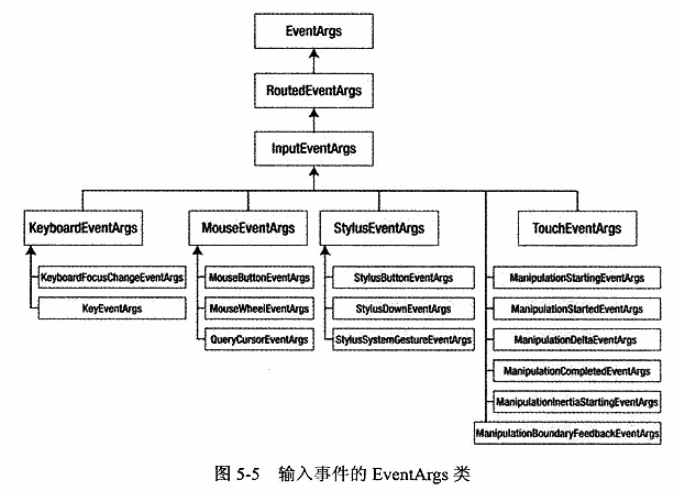

### 5.4 键盘输入 

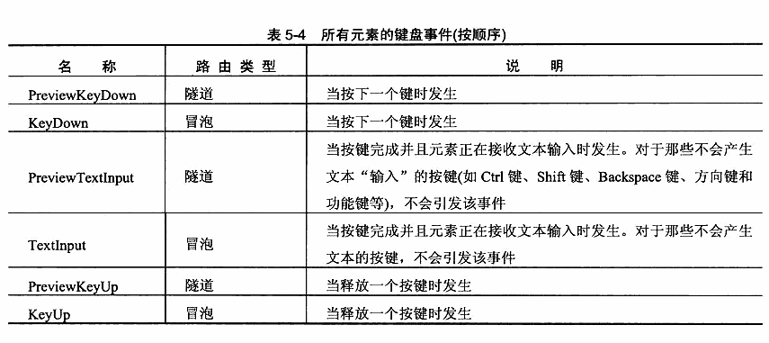

#### 5.4.1 处理按键事件 

- PreviewKeyDown KeyDown PreviewKeyUp KeyUp
- PreviewTextInput TextInput

#### 5.4.2 焦点 

- 必须将 Focusable 设置为 true,是在 UIElement 中定义的

#### 5.4.3 获取键盘状态 

- KeyBoardDevice 属性提供了键盘的所有键信息

### 5.5 鼠标输入 

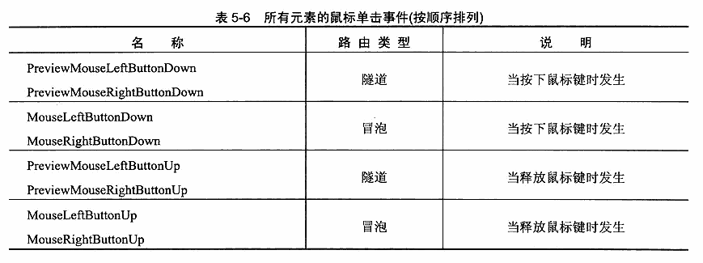

#### 5.6 多点触控输入 

#### 5.6.1 多点触控的输入层次 

#### 5.6.2 原始触控 

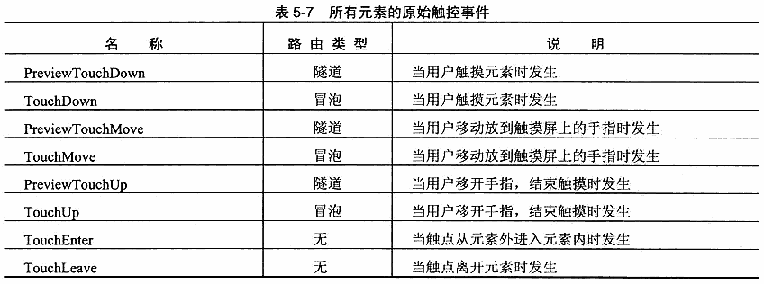

#### 5.6.3 操作 

- ManipulationStarting ManipulationStarted ManipulationDelta ManipulationCompleted 可以使用移动/旋转来缩放/旋转图像
- 重点是 Delta 里面对图像的操纵

#### 5.6.4 惯性 

- 只需处理 ManipulationInertiaStarting 事件

# 第二部分 进一步研究WPF

## 第6章 控件 

### 6.1 控件类 

全部继承自 System.Windows.Control 类,支持内容对齐,Tab键,背景,边框等

#### 6.1.1 背景画刷和前景画刷 

- 代码 可以通过工具类Colors等,也可以从Argb自定义画刷
- XAML 可以直接用颜色代码 #aarrggbb

#### 6.1.2 字体 

- 字体可以继承,可以多选备选
- 嵌入字体 添加字体文件 => Build Action 设置为 Resource => 使用前缀 "./#"
- WPF使用特殊的URI语法定位 
- TextFormattingMode 属性适合小文本

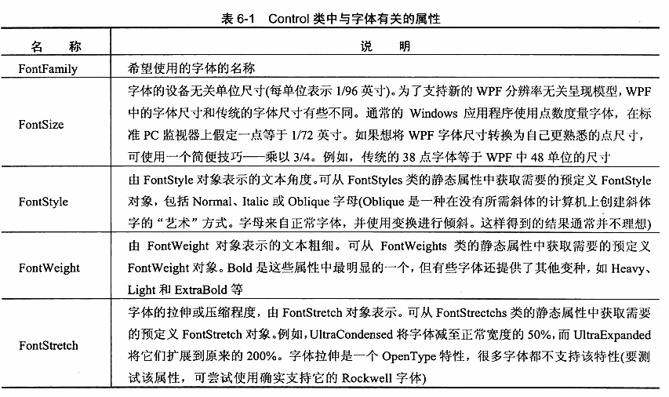

#### 6.1.3 鼠标光标 

支持自定义,.cur文件，Mouse.OverrideCursor 覆盖每个元素的鼠标指针。

```c#
Cursor cur = new Cursor(Path.Combine(appDir,"my.ani"));
this.Cursor = cur;
######### 可以采用如下方式处理URI   #########
StreamResourceInfo sri = Application.GetResourceStream(new Uri("my.ani",UriKind.Relative));
new Cursor(sri.Stream);
....
```


### 6.2 内容控件 

只能包含一个元素

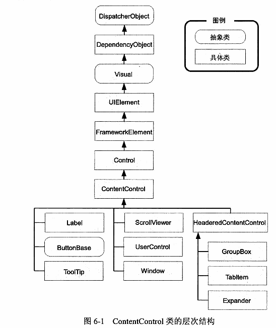

### 6.2.1 Content属性 

- 未继承 UIElement 调用 ToString() 获取文本
- 继承则调用 OnRender() 进行显示

#### 6.2.2 对齐内容 

#### 6.2.3 WPF内容原则 

减少位图的使用,尽量使用矢量图或者直接绘画

#### 6.2.4 标签 

支持记忆符,能够为链接的控件设置焦点的快捷键

#### 6.2.5 按钮 

- Button 支持Esc快捷键,建议设置
- ToggleButton RepeatButton
- CheckBox 控件 
- RadioButton 可以使用GroupName进行分组

#### 6.2.6 工具提示 

- 设置ToolTip属性,悬停时间,位置等
- 设置附加属性 ToolTipService
- Popup 控件,不会一直显示,可接受焦点,显示手动处理

### 6.3 特殊容器 

继承自 HeaderContentControl，具有标题栏

#### 6.3.1 ScrollViewer 

滚动内容,VerticalScrollBarVisibility=Hidden可以通过方向键进行翻页

- 代码滚动 通过增添按钮进行滚动控制,比如上一页
- 自定义滚动 实现 IScrollView 接口的元素

#### 6.3.2 GroupBox 

#### 6.3.3 TabItem 

TabControl 的一页

#### 6.3.4 Expander 

可以折叠的控件

### 6.4 文本控件 

- TextBox 边界可能溢出,可以通过Wrap属性设置.支持滚动条；可以使用拼写检查，需要字典
- SelectedText 文本快速选择, 拼写检查 开启SpellCheck.IsEnable 即可
- PasswordBox 纯文本,加密存储

### 6.5 列表控件 

继承 ItemsControl 类,需要数据绑定

- ListBox 长度可变列表选择一个
- ComboBox 自动改变自身尺寸,其余和ListBox相同

### 6.6 基于范围的控件 

继承 RangeBase 类

- ScrollBar 通常使用更高级的ScrollView
- Slider 滑动条
- ProgressBar 进度条

### 6.7 日期控件 

- Calendar 日历,表格图样控件
- DatePicker 短格式日历

##  第7章 Application类 

### 7.1 应用程序的生命周期 

- 起点是 App.xaml ,编译以后生成对应的窗口类
- 关闭模式有三种,通过ShutdownMode属性可以设置
  - OnLastWindowClose
  - OnMainWindowClose
  - OnExplicitShutdown 除非调用Application.Shutdown() 否则不会结束
- 应用程序事件(开始 激活等) 可以关联事件处理程序也可以,重写响应方法

### 7.2 Application类的任务 

- 添加图像 - Solution选择图像 - BuildAction修改成SplashScreen

- 命令行参数可以通过 StartupEventArgs.Args 属性获取,响应Startup事件

- Application.current 获取引用,App可以拥有多个窗口

- 单例App程序,通过Startup事件查看已有实例,

  1. 添加Microsoft.VisualBasic.dll 引用,继承 WindowsFormsApplicationBase
  2. IsSingleInstance 设置 true; OnStartup() 重写并创建WPF应用程序; OnStartupNextInstance() 显示新窗口
  3. 注册文件类型 .testDoc 结尾,用对应的exe程序打开 或者 运行编辑注册表代码

  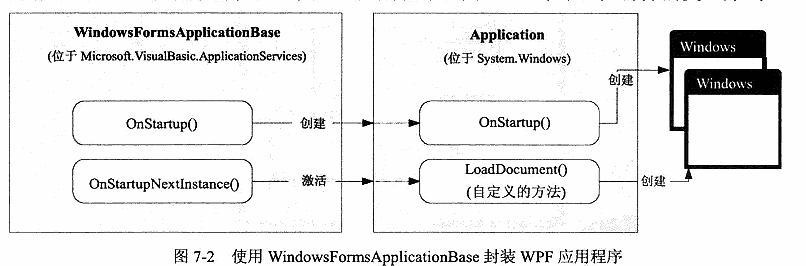

### 7.3 程序集资源 

资源嵌入到 exe / dll 文件里,不同点在于引用寻址系统

- 添加资源 - BuildAction 设置为 Resource .
  - 当采用文件夹形式,不可以设置为 EmbeddedResource
  - 编译完成资源会变为 AssemblyName.g.resources 
- 使用资源
  - 低级方式 StreamResourceInfo 对象,Application.GetResourceStream() 可以加载
  - 使用 Uri 进行定位
- pack URI 寻址
  - uri === pack://application:,,,/uri
  - 其他程序集的资源  pack://application:,,,/AssemblyName;component/uri
- 内容文件
  - BuildAction 使用 Content，选择复制到目录，可以使用相对URI引用，便于资源的替换

### 7.4 本地化

- 资源不是嵌入程序,而是保存在 附属程序集
- 控件不要硬编码长度宽度
- 准备工作
  - 修改 .csproj ,添加 \<UICulture\>en-US\</UICulture\>
  - 标记需要本地化的元素,使用Uid进行标记
  - 提取本地化内容,使用LocBaml工具
  - 生成附属程序集,也是 LocBaml 工具,使用 /generate 参数

## 第8章 元素绑定 

- 创建的是System.Windows.Data.Binging类的对象，使用Path进行属性指定，假如使用附加属性则需要在圆括号里面设置属性
- 通过设置Binding 的Mode 属性可以实现双向绑定,多绑定；默认是单向绑定，只读模式
- 通过类 BindingOperations 可以动态获取，删除，增加绑定
- 也可以使用代码实现动态绑定,UpdateSourceTrigger 可以控制更新级别 ; 延迟绑定可以通过修改Bingding对象的Delay属性；默认是失去焦点进行更新。
- WPF数据绑定基础结构不能获取私有信息或者公有字段
  - Source 绑定数据对象，可以是静态XAML代码对象，也可以是动态对象
  - RelativeSource 可以执行父子元素，设置层级，相对复杂。
  - DataContext 会根据元素树往上找，直到找到的第一个。用于提取公共绑定
- 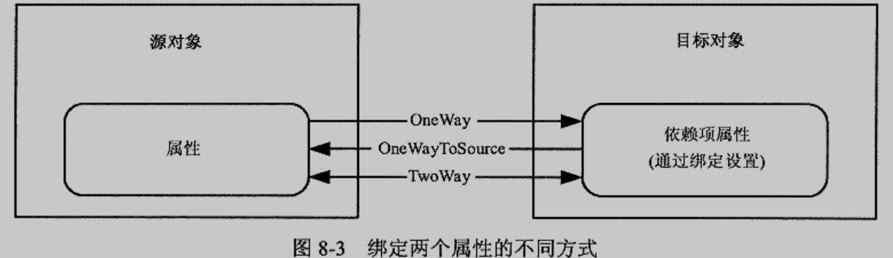

## 第9章 命令 

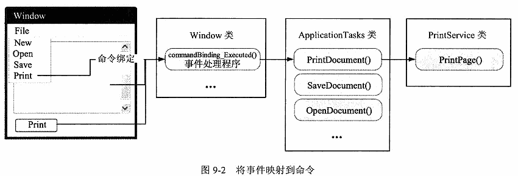

- 命令模型
  - 命令 表示应用程序任务,并且跟踪任务执行.ICommand接口定义,RoutedCommand类实现了接口,不包含任何程序逻辑，经常用到的是RoutedUIcommand
  - WPF已经内置了基本命令库，放在五个静态类里面，ApplicationCommands、NavigationCommands、EditingCommands、ComponentCommands、MediaCommands
  - 命令绑定 命令连接到相关的应用程序逻辑,需要处理命令触发执行的操作,命令是否起作用,命令何处起作用
  - 命令源 命令源触发命令,关联实现了ICommandSource的控件.多命令使用命令层,菜单具有自动提取命令功能
  - 命令目标 在其中执行命令的元素
- 执行命令
  - 取消命令 CommandManager.InvalidateRequerySuggested()
  - 高级命令 自定义命令实例化RoutedUICommand对象,自定义命令需要添加名称空间映射
  - 命令参数 CommandParameter 属性可以设置
  - 反转命令 

## 第10章 资源 

- 每个元素都有 Resource 属性,子元素可以访问父元素的资源,WPF在元素树递归查找(子类再父类),直到 Application 和 系统资源
- 动态资源每次都会去获取(场景 主题,皮肤,尽量少用除非必要),静态只获取一次；通过设置好x:Shared特性可以关闭共享行为
- 代码获取资源可以通过 FrameworkElement.FindResource() 方法进行，可以沿着元素树查找，最后一站是系统资源。
- 当使用资源字典收可以将 BuildAction 设置为 Page,Resource也是可以的.为了共享可以将资源写入类库,使用的时候引入名称空间

## 第11章 样式和行为 

- 作用同 CSS ,标签也是 Style.可以使用 TargetType 指定应用的类型.可以关联事件处理器，具有五个属性
  - Setters -- 事件设置器很少用，字体。前景色、打开、可见具有继承，尽量不要用继承。
  - Triggers -- 属性触发器，事件触发器
  - Rsources BasedOn TargetType
- 自动样式会应用到指定的每个控件,但是增加复杂度
- 触发器 System.Windows.TriggerBase 的派生类实例,可以使用 MultiTrigger 进行设置多个条件满足时才触发
  - 事件触发器 通常用于动画
- 行为 让不同控件具有相同的行为
  - 需要安装 expression blend 或者 SDK 获取支持.重要程序集 System.Windows.Interactivity.dll 和 Microsoft.Expression.Interactions.dll
  - 可以使用nuget进行安装对应的SDK

# 第三部分 图画和动画

## 第12章 形状、画刷和变换 

- 继承 FrameworkElement 类,Canvas控件不能自动改变大小,ViewBox可以，ViewBox属性可以设置图片局部。
- 变换具有平移、旋转等，设置RenderTransform，RenderTransformOrigin="0.5,0.5"表示旋转中心为图形中心。容器内部则使用LayoutTransform，便于自动布局。
- 透明度设置具有 Opacity、RGBA、画刷的Alpha通道、透明掩码
- Line 没有fill 属性,必须设置Stroke，Polyline 折线图也是。
- 像素对齐 默认开启抗锯齿导致边缘模糊的情况,可以设置 SnapsToDevicePixels 
- 画刷 可以各种渐变,图片等,BitmapCacheBrush明显停顿,适合大量动画情况
- 透明 本身可以透明,也可以蒙版透明

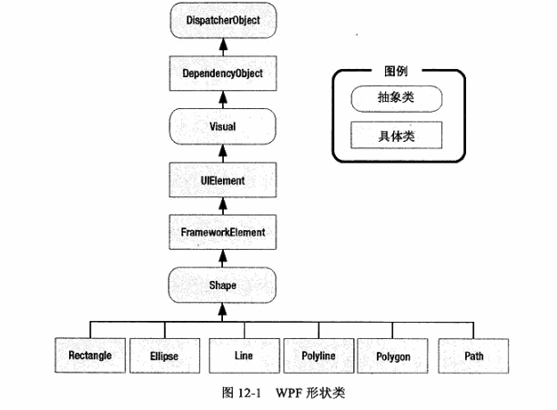

## 第13章 几何图形和图画 

- Path 类,需要提供路径数据,用于绘图.图形组合具有先后关系
  - GeometryGroup可以通过FillRule设置镂空
  - CombinedGeometry 用于组合多个图形,交集等，只能合并两个，支持嵌套
  - PathGeometry 用于绘制直线 弧线,属性是各种segment
- 微语言 一系列命令的长字符串
- 集合图形进行裁切 最主要的是Clip属性
- 图画
  - GeometryDrawing 等继承 Drawing 类

## 第14章 效果和可视化对象 

- 可视化对象 用于大量元素或者矢量图形,开销很小.使用继承自 Visual 类的子类对象
  - 通过将背景设置为纯色可以拦截所有点击事件，透明则不会。
  - DrawingVisual 可视化对象需要借助WPF元素显示,添加到可视化树中,重写VisualChildrenCount() 和 GetVisualChild() 方法
  - 命中测试 使用VisualTreeHelper.HitTest() 进行判断
- 效果 继承自 Effect 类,可以实现模糊 阴影等
  - 拾色器可以使用现成的控件
- WriteableBitmap 可以用于生成像素图,编辑等

## 第15章 动画基础 

### 15.1 基本动画

- WPF动画 
  - 基于时间 时间触发器-修改-重绘
  - 基于属性(只有依赖属性可以动态通知) 通过修改各种Animation类的属性
    - string和引用类型使用关键帧技术，WPF动画全都支持。DoubleAnimationUsingKeyFrames
    - 数值类型动画采用线性插值方式。DoubleAnimation
    - 还有一种基于路径的动画，更加专业。DoubleAnimationUsingPath
  - Animation主要控制三个属性，默认60帧/秒,属性主要有 From,To,Duration; 
    - From属性，变化的开始值，可以不设置，但是需要硬编码的值，否则会出现NaN。
    - To属性，变化的目标值，可以不设置
      - By属性，变化的步长，只是简单的附加到To属性而已。
    - Duration，本身是类型，支持TimeSpan和额外的Forever等。

  - 生命周期
    - 单项动画结束后会保持动画状态，假如要返回初始的属性值，可以通过结束动画完成。
      - 绑定 动画的Completed事件，将动画置空即可。
      - 也可以创建不带To的动画，不推荐
      - AutoReverse设置为True或者FillBehavior设置为Stop，不推荐。

  - Timeline 类可以通过属性进行加速/减速播放
    - AccelerationRatio 加速比，前1/N时间加速播放
    - RepeatBehavior 控制重复次数。
  - 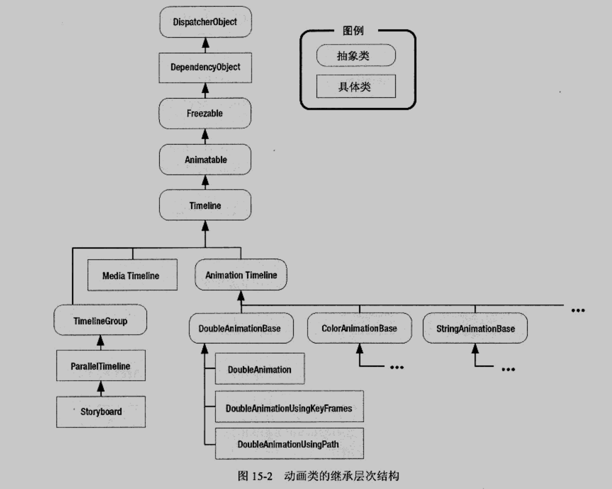

### 15.3 故事板

- 故事板 Storyboard 增强时间线
  - 配合 事件触发器进行故事板的初始化工作和启动，退出触发器可以重置属性。需要在控件里面先设置属性值，否则会报错找不到。
    - 多个动画触发器需要在同一处声明
  - 重叠动画 利用HandoffBehavior可以在运行过程中替换掉原有的动画。性能消耗较大，最好手动释放。
  - 每触发一次都会更新故事板属性,可以利用这个进行显示进度条
  - 缓动函数 设置 EasingFunction 属性
  - 帧率尽量不要动,甚至需要降低,因为动画很耗性能 故事板的 Timeline.DesigerdFrameRate 可以设置
  - 位图缓存 通知WPF将当前图像复制到显卡内存,频繁重绘

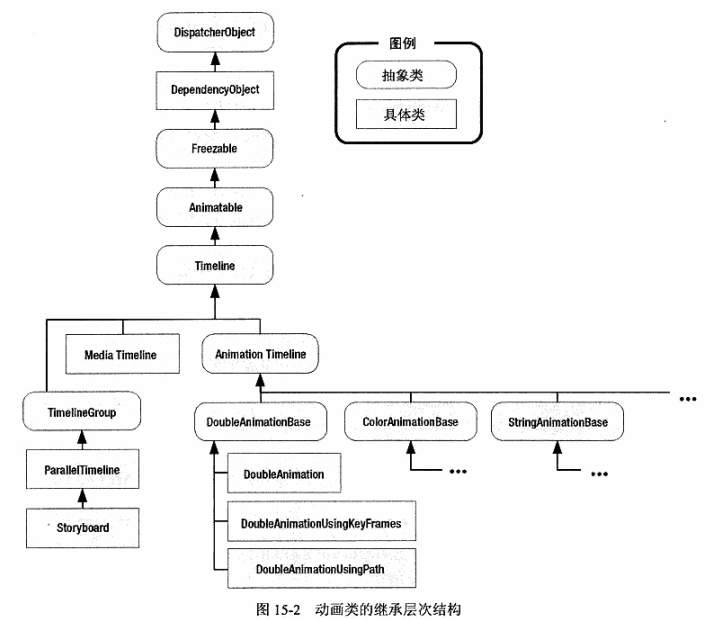

## 第16章 高级动画

- 一些指导原则
  - 显示消失 使用 透明度，而不是修改Visibility
  - 元素位置变化 使用 Canvas 的属性
  - 渲染变换 使用 对应的Transform类
  - 动态改变元素表面 使用 ColorAnimation，可以使用VisualBrush实现动画效果
- 关键帧动画 由许多段组成,类似GIF,可以在间隙添加平滑过渡,缓动,不操作等
  - 具有连续和离散两种类型关键帧
  - 缓动关键帧支持缓动动画
  - 样条关键帧（Spline）影响三次贝塞尔曲线
- 基于路径的动画 DoubleAnimationUsingPath 配合PathGeometry
- 基于帧的动画 响应静态的 CompositionTarget.Rendering 事件
- 使用代码创建故事板 
  - 创建 故事板 和 动画
  - 动画添加到故事板
  - 启动故事板,结束响应 Storyboard.Completed 事件
- 定时器使用 DispatcherTimer

# 第四部分 模板和自定义元素

## 第17章 控件模板 

- 逻辑树 我们操作的是逻辑树；可视化树 逻辑树扩展版本，具有更多细节
  - 样式改变的是可视化树，控件模板修改的也是很可视化树节点。
  - WPF提供操作两棵树的工具，LogicalTreeHelper 和 VisualTreeHelper
- 控件模板 控件具有一个内置方法,用于确定如何渲染
  - 还有数据模板和面板模板。数据模板用于从对象中提取数据，并在内容控件或者列表控件中显示。面板模板用于控制列表控件中各项的布局，完全可以在一个控件中组合使用。
  - 修饰类 Microsoft.Windows.Themes 名称空间下,作用是渲染窗口细节
  - 可以定义为 资源 里面的元素,模板绑定与普通的数据绑定类似(当属性不起作用的时候可以考虑)
  - 使用触发器改变属性,替换元素,设置过渡动画等
- 组织模板资源
  - 使用资源字典更合适
  - 将颜色等设置使用样式分离出来
  - 可以自动应用资源模板,实现一键换肤.利用ResourceManager 可以选择皮肤
- 复杂模板
  - 嵌套模板 修改样式可以使用
  - 滚动条重绘样式不改变功能
  - 可视化状态，基于触发器模型实现过渡显得笨拙
    - 是同  TemplateVisualState 特性指示支持的可视化状态

## 第18章 自定义元素 

- 通常使用 WPF 创建 Custom Control Library 类型项目,便于共享
  - 添加用户控件,创建依赖属性,和属性封装器,回调函数
  - 定义路由事件,添加标记  是由 EventManager进行注册，可以重用委托 RoutedEventHandler
  - 使用需要映射程序集和命名空间
- 命令支持
  - 添加控件连接到指定命令的命令链接  使用类注册命令，CommandManager.RegisterClaasCommandBinding
- 创建无外观控件 
  - 继承 Control 类,调用 OverrideMetadata() 方法用于通知WPF正在提供新样式
  - 样式放在 generic.xaml 的资源字典,在 Theme 文件夹下
  - 精简控件模板 在控件初始化使用绑定表达式
    - 添加名称,PART_ 开头
    - 操作模板部件,OnApplyTemplate() 方法
  - 应当为模板部件添加 Template 特性
- 支持可视化状态，特性命名不用以PART_开头，
  - VisualStateManager，可以利用不同的可视化状态隐藏/显示某些部件。
- 自定义面板
  - 重写 测量阶段 和 排列阶段,MeasureOverride() 和 ArrangeOverride() 方法
- 自定义绘图元素 
  - 重写 OnRender() 方法，利用InvalidateVisual()引起重绘。不要
  - 自定义装饰元素是为了不在控件中自定义绘图，继承Decorator类可以给控件增加一些新样式。

# 第五部分 数据

## 第19章 数据绑定 

- 可以绑定到对象,集合,ADO.NET对象,LINQ表达式

  - 数据绑定（控件意识到数据发生改变）实现方式，
    1. 依赖属性 
    2. 实现 PropertyNameChanged 事件 
    3. 实现 INotifyPropertyChanged 接口，ObservabOleCollection本身实现了该接口
  - 绑定到ADO.NET对象的话，不可以直接绑定 DataTable 对象，而是使用 DataView
  - LINQ 也是将结果使用ToList() 或者 包装为 ObservabOleCollection 进行绑定

- 大列表性能
  - 虚拟化,可以只显示若干条。没有支持ListBox或ItemsControl类，而是硬编码到VirtualizingPanel容器。
    - ComboBox需要提供 ItemsPanelTemplate 进行支持，而 ListBox、ListView 、DataGrid默认使用。
    - TreeView支持虚拟化，通过一个属性就可以开启。VirtualizingStackPanel.IsVirtualizing
    - 被破坏的情况：ScrollViewer放置控件；改变列表控件的模板没有使用ItemsPresenter；不适用数据绑定。
  - 容器循环滚动
    - 复用ListBoxItem，只用启动 VirtualizingStackPanel.VirtualizationMode ，设置为   Recycling
  - 缓存长度
    - VirtualizingStackPanel.CacheLengthUnit
  - 延迟滚动
    - ScrollViewer.IsDegerredScrollingEnabled ,一般来说，基于项的滚动更清晰，基于像素滚动更流畅
  
- 验证
  - ExceptionValidationRule 验证规则
  
    - 在 Binding.ValidationRules 里面设置 ExceptionValidationRule.
  
    - 自定义控件模板中使用 AdornedElementPlaceholder 用于指定装饰控件放置位置。
  
      Validation.Error可以指定错误响应事件
  
    - 验证失败过程：
  
      1. 控件的 Validation.HasError 设置为 true；
      2. 将 ValidationError 对象加入 Validation.Errors  集合里面；
      3. 如果 Binding.NotifyOnError设置为True，引发Validation.Error事件。
  
  - INotifyDataErrorInfo 接口，来利用异常引发错误处理
  
    - 接口还有一个是 IDataErrorInfo
  
  - 验证多个值
  
    - 绑定组，是指 将验证规则附加到外部容器，从而对整个数据对象进行 项级别验证
  
- 数据提供者（不用DataContext 和 ItemsSource 绑定的另一种方式）

  - ObjectDataProvider 作为资源可以被引用，风险在数据模型、用户界面代码耦合在一起，不适合访问数据库和文件的情景。使用用户过滤、排序等情况
  - ObjectDataProvider 可以异步工作，调用另一个类的方法获取数据。
  - XmlDataProvider 方便提取xml文件，只读打开，支持XPath


## 第20章 格式化绑定的数据

- 数据转换

  - 字符串格式化，通过设置 Binding.StringFormat 进行处理，处理日期、字符串、数字等

    - 比如`{}{0:C}`表示使用货币展示数字，第一个花括号表示转义。列表设置 ItemStringFormat 可以对项格式化

  - 值转换器，转换为特定类型对象

    - 实现IValueConverter接口，添加ValueConversion特性，指定目标数据类型

      数据对象  -> Converte() -> 控件属性

    - 可以利用converter对背景颜色分类等

  - 使用MultiBinding绑定多个数据源

- 样式

  - ListBoxItem  设计其 Template 可以自定义展示格式，AlternationCount指定序列想的数量 ，AlternationIndex指定是否使用交替样式

  - 样式选择器 继承StyleSelector，可以根据属性用代码返回不同样式；

    没有动态更新，只能粗暴的将样式选择器置空并重新赋值

- 数据模板

  - 一般需要绑定数据，可以利用Tag传递额外的标识信息。通过空Binding对象，可以传入当前数据对象。
  - 改变模板可以使用数据触发器、值转换器、模板选择器（缺点在于某些情况下需要重复的模板）
    - 使用 ItemContainerStyle为选择项设置不通过北京，避免模板选择器背景颜色混乱
  - 使用数据触发器替代普通触发器是应为需要评估的属性在祖先原色中，访问它的唯一方法时使用数据绑定表达式。
  - 通过设置ItemsPanelTemplate可以改变布局，但是会导致不使用VirtualizingStackPanel

- ConboBox

  - 提示内容可以通过设置 TextSearch.TextPath 进行指定

## 第21章 数据视图

- View 视图继承自CollectionView 类，具有两个特殊实现 ListCollectionView  和 BindingListCollectionView

  - 如果数据源实现了IBindingList接口，会自动创建第二个视图
  - 实现了IList接口，会自动创建第一个视图
  - 实现了IEnumerable接口，创建基本的CollectionView视图
  - 利用CollectionViewSource.GetDefaultView可以获取绑定到列表的产品集合视图

- 视图导航

  - 利用 MoveCurrentToNext() 可以选择下一项

  - 利用ItemsControl.IsSynchronizedWithCurrentItem项目会自动同步，也可以利用SelectionChanged 更新视图

  - 可以通过声明式创建视图，需要注意SortDescription需要引入别的名称空间

    ` System.ComponentModel`，程序集是 `WindowsBase`，直接当数据源使用

    并不会节省代码量和工作

- 过滤、排序、分组

  - 可以给定多个视图，过滤设置视图属性Filter，是一个Predicate 委托。使用 view.Refresh() 对视图 进行更新
  - DataView使用的是BindingListCollectionView不支持Filter属性，只支持CustomFilter属性，接收过滤字符串
  - 排序直接使用  SortDescription 类进行注册
  - 分组使用 PropertyGroupDescription，会为数据源创建隐藏的GroupItem对象，需要使用自定义模板进行显示
    - ItemsControl.GroupStyle可以简化，绑定的是Name等PropertyGroupDescription的属性
  - 利用值转换器根据某些属性进行分组、排序
  - 分组是很消耗性能的操作，配合虚拟化需要进行性能分析。VirtualizingStackPanel.IsVirtualizingWhenGrouping可以设置

- 实时成型
  - 数据对象实现INotifyPropertyChanged，集合 实现ICollectionViewLiveShaping实现，明确开启实时成型 。
  - 如 View开启 IsLiveFiltering，设置LiverFilteringProperties.Add() ，可以自动刷新


## 第22章  列表、树和网格

- ListView增加对于列的支持，专门针对统一数据不同视图。目前只提供了GridView，可以继承 ViewBase 进行自定义
  - 列宽度不能用户自定义，唯一选择是重写 列模板，并且不能同时设置DisplayMenber和CellTemplate属性
  - 自定义视图重写DefaultStyleKey 和 IteContainerDefaultStyleKey 属性。
    - 继承ViewBase，重写属性，返回指定样式（ComponentResourceKey 进行构造）

- TreeView 完全支持数据绑定
  - HierarchicalDataTemplate 可以绑定嵌套属性，并且可以分解放到资源
  - 将DataSet绑定到TreeView，使用DataRelation对象名称作第二层的ItemsSource
  - 即时创建节点

- DataGrid
  - CanXxxXxx 属性可以设置 单元格编辑、拖拽、排序等功能
  - FrozenColumnCount可以令前n列不动，SizeToCells增加宽度适应头部
  - 列支持多种类型（文本、复选框、超链接等，也可以自定义）
  - LoadingRow事件可以在行显示的时候触发，RowDetailesTemplate 可以定制行显示细节
  - DataGridTemplateColumn.CellTemplate 是展示样式，DataGridTemplateColumn.CellEditingTemplate是编辑时候样式，如果要一致，两者都要设置一样

# 第六部分 窗口、页面和富控件

## 第23章 窗口

- Windows 继承自 ContentControl 
  - 调用Show() 或者 ShowDialog()就可以显示。前者创建非模态窗口，不会阻止用户访问其他窗口；需要注意同步问题。
  - 窗口定位，工作区等都可以设置，数据可以存储到Properties里面，使用注册表进行访问
  - 模态方式显示的窗口就是对话框，通过贵DialogResult可以获取返回值，最常见的是MessageBox
- 非矩形窗口
  - 利用透明不可选中的特性将Window的允许透明打开，设置样式为None
  - 绘制自定义图形充当背景，可以设定控件左键按下事件来设定窗口的拖拽。WIndow.DragMove()开启拖动模式
  - 利用透明矩形实现，通过捕捉鼠标位置，重新设置窗口宽度可以用于窗口大小改变

- 自定义跳转列表需要在App.xaml添加JumpList节点，指定跳转文件的路径和打开方式；当然也可以代码实现
  - 利用JumpTask的Arguments设置为应用程序的特殊识别编码 ；在OnStartupNextInstance方法中接受命令行参数，执行任务；引发Application.Exit 事件时候删除任务

- 改变任务栏图标和预览
  - 只需要TaskbarItemInfo类，可以通过代码设置缩略图坐标
  - 支持缩略图按钮，设置ThumbButtonInfos
  - 进度通知设置ProcessValue和ProgressState属性
  - 重叠图标需要使用一个很小的具有透明背景的图片文件

## 第24章 页面和导航

- 基于页面的程序顶级容器是Page，跟普通控件一样使用，窗口类使用NavigationWindow 
  - Page宽高由外部容器决定，显示另一个页面使用导航的方式
  - Hyperlink 节点支持导航，甚至支持网站
  - 页面的嵌入可以使用Frame类 ，使用 JournalOwnership 和 NavigationUIVisibility 可以隐藏导航控件
  - 实际上导航URI使用的是相对URI，使用 pack格式，最终是 pack://application:,,,/page1.xaml 这种格式，所以在跨程序集的时候URI可以使用/PageLibrary;component/Page1.xaml这种格式。
  - 可以通过设置日志标志让WPF保存页面相关信息，防止页面销毁后数据消失。依赖属性的初始化过程顺便将 FrameworkPropertyMetadata.Journal  设置为 True
- 导航
  - NavigationService.GetNavigationService可以操纵跳转等各种导航动作。
  - 提供了导航事件，导航是异步的，使用事件进行处理
  - 日志管理只能添加和删除日志项目，但是可以添加自定义日志项实现前后移动，需要继承CustomContentState类
  - PageFunction类
- XAML浏览器应用程序
  - XBAP可以使用 IE 和 FireFox 启动，这一部分感觉跟Java Servlet一样很鸡肋，应该也是会被抛弃，尤其是HTML5的崛起
  - 目前 SilverLight（播放器插件）、IE  、Expression  Studio 已经被自家抛弃了

## 第25章 菜单、工具栏和功能区

- Menu 和 ContextMenu
  - Menu一般停靠在窗口顶部，可以自定义展示方式，跟ListBox一样操作，Alt可以提供指示当设置 IsMainMenu 时，
  - ContextMenu 只能放置在元素里面
  - Separate对象将菜单进行分割
- ToolBar
  - 放置其中的按钮样式会进行变化
  - ToolBarTray可以对ToolBar进行管理
  - StatusBar 窗口左下角和右下角的提示信息

- 功能区
  - 逐步替代调ToolBar，使用RibbonWindow，需要添加引用
  - 跟工具栏没什么差别，可以改变功能区大小，还有快速访问工具栏

## 第26章 声音和视频

- 音频

  - 音频使用SoundPlayer只能播放wav格式，不支持pack语法，可以使用Stream

  - SoundPlayerAction可以配合触发器

  - MediaPlayer 播放MP3或者MPEG视频。MediaElement是相应的WPF元素，但是不会抛出异常

    支持MediaFailed事件

    - 配合触发器和故事板可以播放音频
    - 多个故事板可以播放多个音频
    - 配合关键帧 和 音频实现酷炫效果，不要再MediaTimeline前面运行关键帧动画

- 视频
  - 使用比较简单，但是会让CPU负担加大
- 其他
  - 语音支持合成语音和语音识别，放在 System.Speech.Synthsis空间下

## 第27章 3D绘图

- 视口
  - ViewPort3D 只应用于复杂的3D编程，Camera定义3D观察场景，Children定义对象。
  - ModelVisual3D -> GeometryModel3D ->MeshGeometry3D （定义3D对象）
    - MeshGeometry3D 定义网格对象，属性有顶点、三角形、法向量、贴图
    - GeometryModel3D 定义3D形状和 表面 
    - 光源可以配置点、平行光源，相机需要正确放置

- 绘图
  - 定义三角形时候以逆时针顺序定义，从而使它们前面向前
  - WPF计算到达顶点的管线数量，会引起伪影问题。所以需要定义法线并且不共享顶点。或者多次声明顶点。
  - 视频也可以映射到图形表面
- 交互
  - Transform3DGroup
  - 可以通过移动摄像机实现视图变化 TrackBallDecorator
  - 命中测试完整支持

# 第七部分 文档和打印

## 第28章文档

- 固定文档是排好版准备打印的，如PDF；流文档是为了便于查看的
- 流文档适合阅读，HTML也是流式布局；流内容继承自ContentElement和FrameworkContentElement，还提供了内联元素
- 使用 FlowDocumentPageView会显示缩放滑动条

## 第29章 打印

# 第八部分 其他

## 第30章 与Windows窗体进行交互

- WPF可以直接添加WinForm窗体
- 启用可视化风格，调用调用Application.EnableVisualStyle()

## 第31章 多线程

- 具有线程关联性，继承自DispatcherObject
- Dispatcher类
  - 拥有应用程序线程，管理工作队列。坚持一个用户界面线程和一个调度程序。
- DispacherObject类
  - 由三个属性 Dispatcher  CheckAccess和VerifyAccess
  - 需要调用Dispatcher.BeginInvoker对UI线程进行更新
- BackgroundWorker
  - 支持进度和取消，不需要加锁

## 第32章 插件模型

- MAF和MEF
