# WebGL编程指南

- 书籍作者：[美]Kouichi Matsuda
- 笔记时间：2021.9.8

## 第 1 章 WebGL概述

- 允许用户在网页绘制/渲染三维图形

- 优势：编写环境简单，发布简单，大量资料

- WebGL起源：PC机用的最多的渲染技术是Direct3D和OpenGL，

  着色器使用一种类似C的语言

  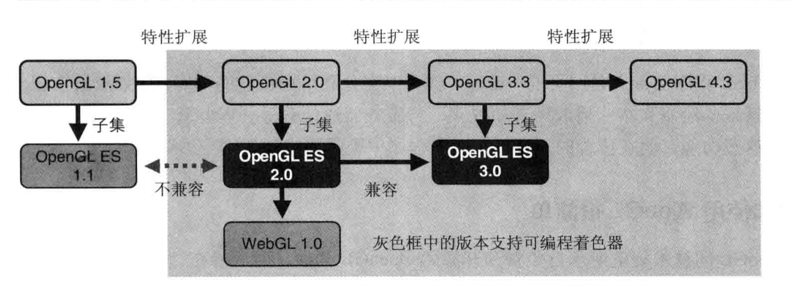

  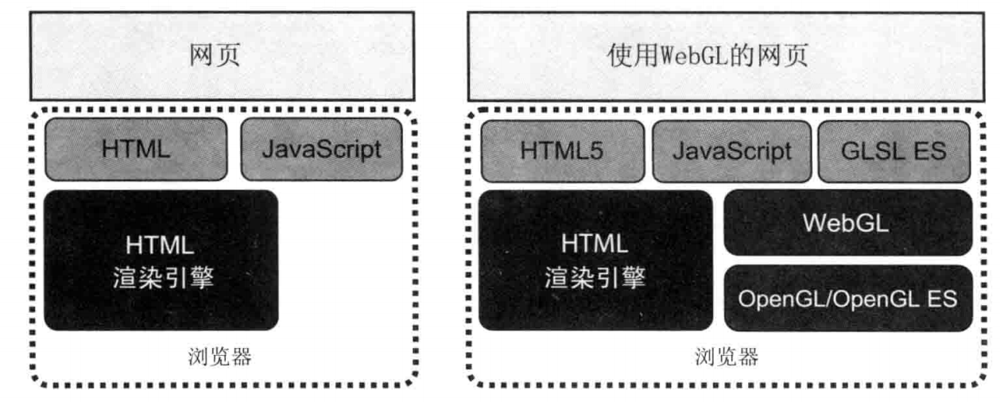

## 第 2 章 WebGL入门

- Canvas允许动态绘制
- 使用步骤和canvas有些区别。
  - 获取上下文，设置样式，刷新 缓存
  - 用到更底层的数据
- 清空绘图区，clear 方法清空颜色缓冲区（缓冲区还有 模板缓冲区，深度缓冲区）
- 绘制一个点
  1. 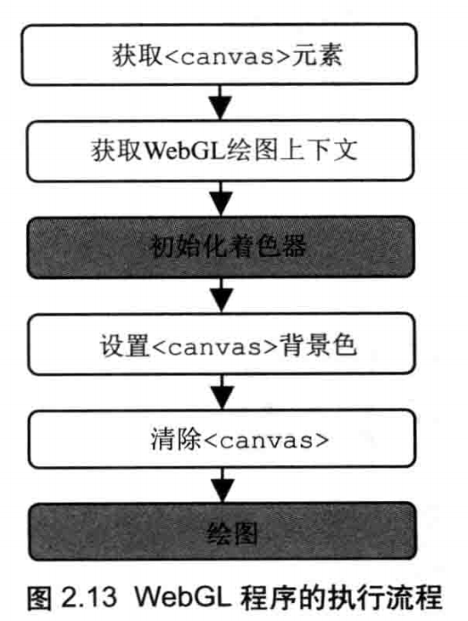

- GLSL ES语言

  - vec4 由四个浮点数组成的向量(称为齐次坐标，可以访问分量），内置变量 gl_Position gl_PointSize
  - 片元就是显示在屏幕的一个像素点（包含位置，颜色，其他信息），内置变量 gl_FragColor

  - 坐标是右手坐标系 z轴由屏幕向外。此外，坐标取值范围0~1，都是百分比，需要转换才能变成绝对值。中心点在屏幕中间而不是左上角。
  - 使用 attribute 变量，由外部传入数据（通常跟顶点相关的数据），
    1. 需要先向WebGL请求存储位置 getAttribLocation 可以获取
    2. 对该位置传入数据 通过vertexAttrib3f 传入，vertexAttrib4fv 可以传入向量
  - 使用 uniform 变量，由外部传入数据（通常跟无点相关的数据），比如颜色

- 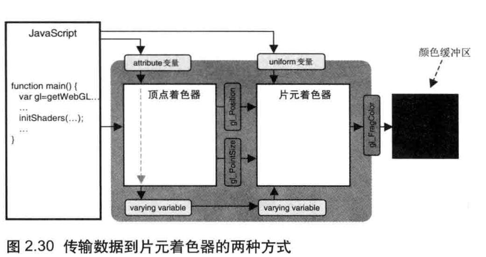

## 第 3 章 绘制和变换三角形

- 缓冲区对象可以一次性填充大量顶点数据
  1. 创建并绑定缓冲区
  2. 写入数据，使用到了 类型数组
  3. 将缓冲区分配个一个attribute对象，并开启该对象

- 绘制图形时候去掉 gl_PointSize ，drawArray的时候可以指定绘制三角形，不仅如此，支持线段、三角带等
- 仿射变换需要一些数学知识
  - 齐次向量坐标的第四个分量总和必须为1，才能凑成三维坐标。假如大于一会让图形缩小，反之放大
  - 向量平移就是两个向量相加的结果
  - 向量旋转需要指定 旋转轴 旋转方向 旋转角度，需要使用变换矩阵4*4，最后一维是常数项；
  - 类型是 mat4，是列主序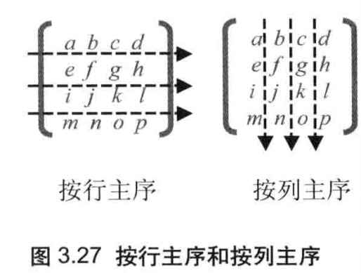

## 第 4 章 高级变换与动画基础

- 使用矩阵进行处理，多个矩阵可以进行复合运算，不满足交换律

- 动画也是利用 requestAnimationFrame 进行擦除和重绘。

  - 不采用 setInterval原因，浏览器支持多个标签，每个标签都具有单独的js运行环境，而该函数不支持多标签。
  - requestAnimationFrame 在未激活的标签页不会运行动画

  - 同时两次调用并不是均匀的，所以最好采用时间差来确定更新角度

## 第 5 章 颜色与纹理

- 每种数据都可以通过数组形式传入，比如顶点的大小，颜色等
- 使用多个缓冲区适合数据量不大的情况。当数据量较大，可以采用打包到同一个缓冲区对象，通过某种机制处理不同数据。数据写入的时候指定偏移，顶点之间字节数等
- 顶点着色器可以使用 varying 类型变量改变颜色
- 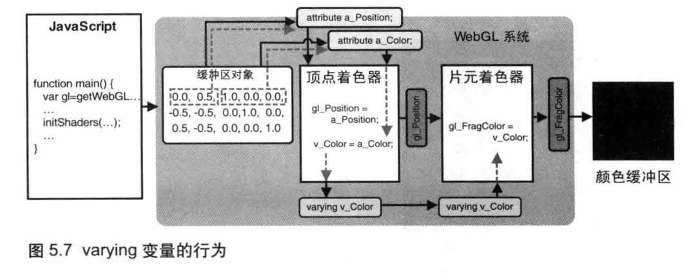

- 执行流程
  - 装配过程称为图元装配过程，图形称为图元。图元转化为片元，称为光栅化。片元着色器会被调用若干次（取决于片元数量）
  - 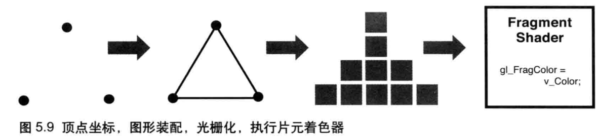
  - 会自动计算颜色值，称为内插过程。
  - 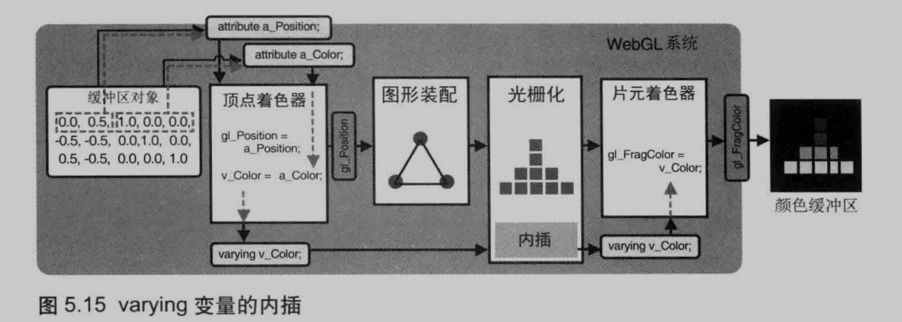
- 纹理映射
  - 组成纹理图像的像素称为 纹素
  - 步骤：主备纹理图像 → 配置映射方式 → 加载纹理 → 赋值给片元
  - 需要注意坐标系的差别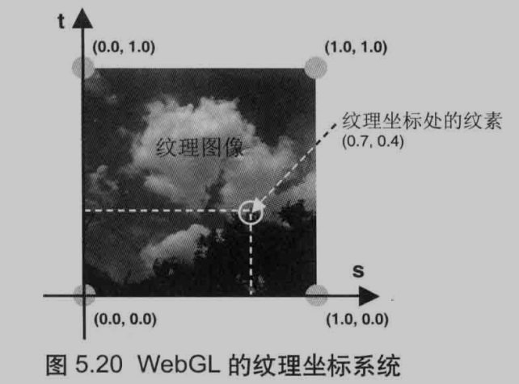

## 第 6 章 ES着色器语言（GLSL ES）

- 支持数值类型和布尔类型，int float bool
- 矢量类型 [ib]vec[234] ，矩阵类型 mat[234]，构造函数不需要new
- 矩阵是列主序，可以传入多个参数进行初始化。xyzw获取坐标分量，rgba获取颜色分量，stpq获取纹理坐标分量 
  - 可以同时取出多个分量，称为混合
- 支持结构体，不用typedef定义结构体
- 支持一维数组，长度必须是整型常量，用 const 修饰
- 取样器（纹理用），sampler2D 和 samplerCube 两种
- 支持分分支和循环，多了一个discard，放弃处理当前片元
- 函数和c一样，参数可以限定in out。具有一些内置函数和全局变量
- 支持预处理指令 
- 可以通过  precision mediump float；限定精度，支持三种精度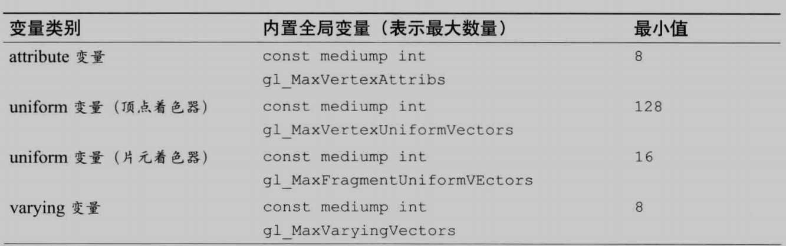

## 第 7 章 进入三维世界

- 观察者所处位置称为视点，沿视点观察方向出发的射线称为视线。
- 通过视点 观察目标点 上方向可以确定观察者状态，可以用一个矩阵表示，称为视图矩阵
- webgl除了定义可视范围还定义了可视空间（看的多远）
  - 盒装空间由正射投影 产生
  - 金字塔可视空间，由透视投影产生
  - 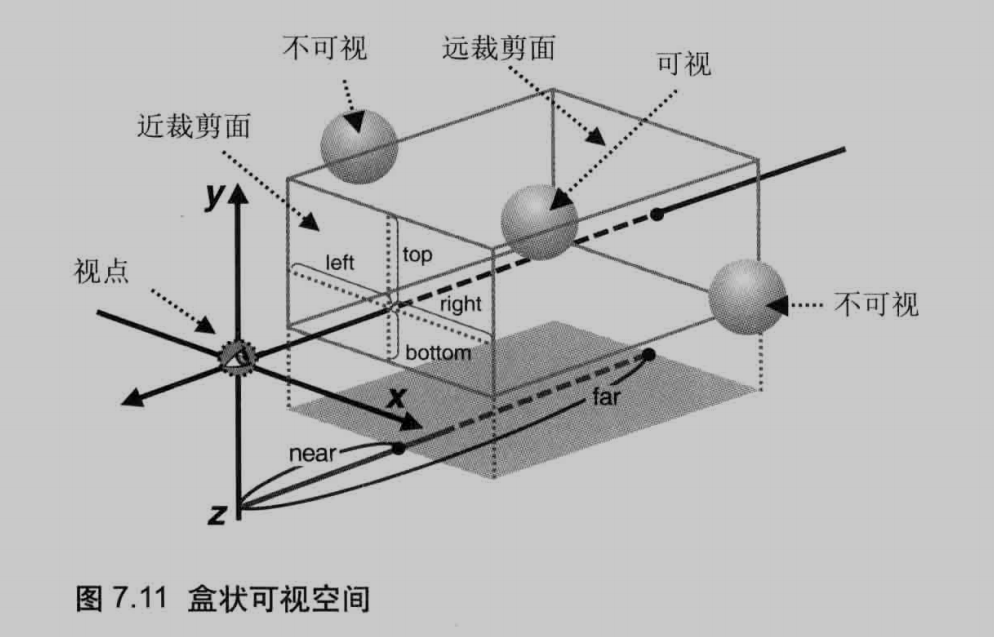

- 透视模型，在可视矩阵基础上加上投影矩阵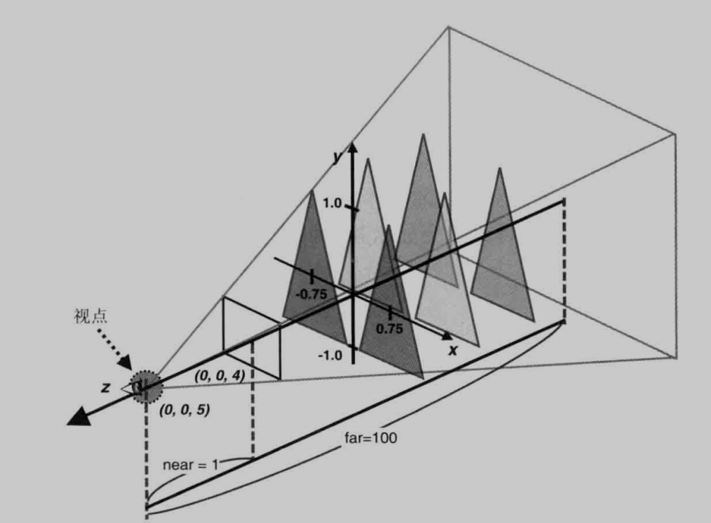

- 隐藏面消除，可以消除被挡到的物体。需要用到深度缓冲区。

  当两个物体十分接近会出现深度冲突，WebGL提供 了多边形x偏移接解决该问题

  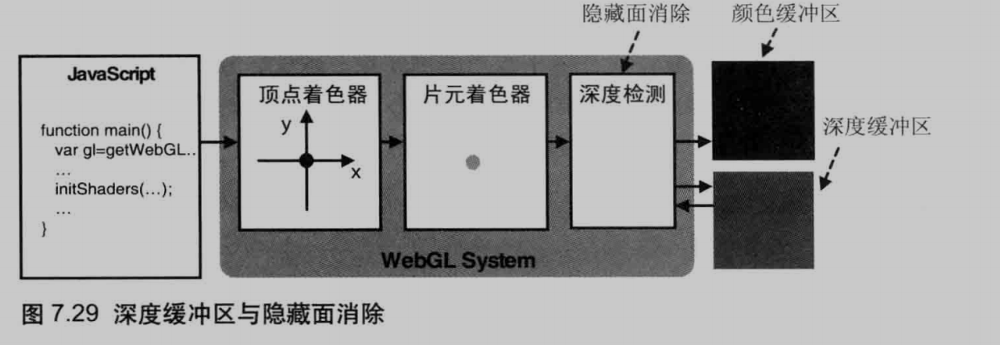

## 第 8 章 光照

- 光源具有 点光 平行光 环境光（漫反射和环境反射），可以使用向量乘法，右手法则确定法向量
  - 漫反射光颜色 = 入射光颜色 * 表面基地色 * cosθ
  - 环境反射光颜色 = 入射光颜色  * 表面基地色
  - 表面反射光颜色 = 漫反射光颜色 + 环境反射光颜色

- 法向量的确定
  - 平移不会改变
  - 旋转和缩放会改变，只需要 原来的法向量  乘以  模型矩阵的逆转置矩阵 即可求出变化后的  法向量 
- 逐片元设置光线需要颜色叠加

## 第 9 章  层次模型

- 单关节模型，可以由连接逻辑逐个绘制，当施加变换时，可以同时乘以变换矩阵

- 多关节模型

  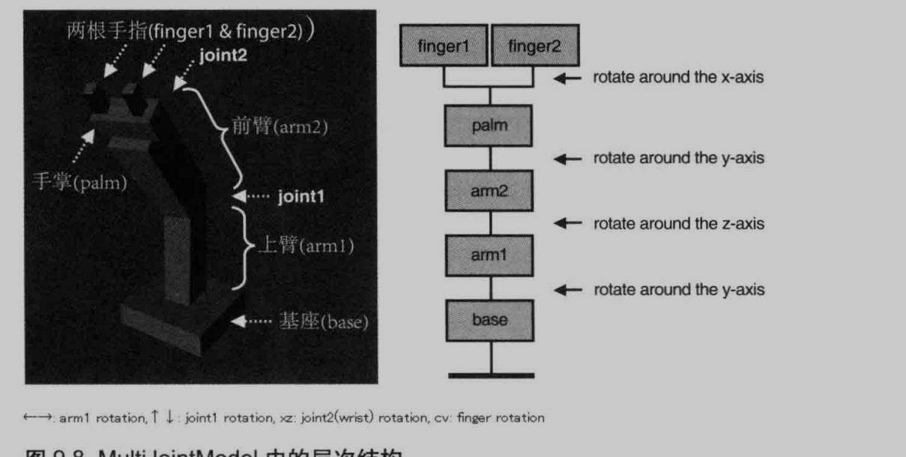

## 第 10 章 高级技术

- 物体旋转 -- 利用模型视图投影矩阵变换顶点坐标，同时需要修改纹理坐标 

- 选中物体 -- 鼠标点击 → 物体重绘为单一颜色 → 读取指针像素颜色 → 物体颜色还原 →  颜色为单一颜色则选中

- 选中表面 -- 将像素属于哪个面写入α颜色分量里，利用上面的方法判断

- HUD（平行显示器） -- 利用两个canvas叠加，2d的覆盖在3d的上面

- 雾化 -- 雾化因子=（终点-当前点与视点的距离）/（终点-起点）

  片元颜色 = 物体表面颜色 * 雾化因子 + 雾的颜色 * （1 - 雾化因子）

  利用w分量进行优化

- 绘制圆形的点 -- 

- α混合 -- 开启混合功能，指定混合函数，可以实现半透明效果 
- 实现多个着色器进行切换，在useProgram可以指定并切换
- 。。。。
