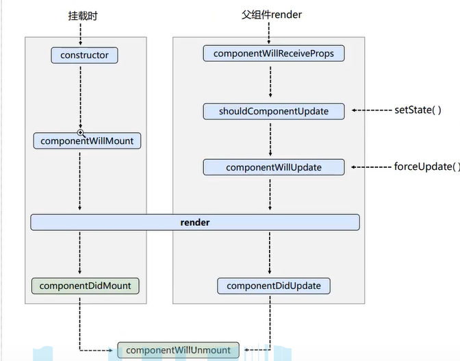

# React学习

- [ ] 笔记时间：2021.06.25

## 1.简介

- 专注MVC的V框架，负责渲染
- 假如使用JSX语法，利用babel进行转变为js代码

### 1.1 简单使用

- 创建虚拟DOM，渲染虚拟DOM
- VDOM 本身是js对象，是object实例，作用类似JSP的使用
- JSX语法注意，只能有一个根标签，样式/内联需要变化。标签小写寻找html标签，大写开头自动寻找组件
  - 只能用表达式，可以使用对应的方法，当使用组件时候，可以使用标签名指定类型
  - 类式组件需要继承 React.Component ,重写 render 方法
    - 具有 state 属性，是一个对象，修改需要调用方法 setState，属于合并。可以使用箭头函数赋值。类似于数据绑定自动更新。
    - props 可以通过构造器自动注入。属性值注入可以通过标签的属性进行注入。可以对其进行属性限制，指定类型等，是类的属性
      - 函数式组件可以使用props，用于参数接收，参数的限制/默认值需要放在函数外面，
    - refs 可以使用 ref 替代 id
      - 直接使用string类型，不推荐
      - 使用回调函数，参数就是该对象，可以保存到组件对象实例里。内联形式的回调，调用 render 会调用两次的问题。
      - 使用API， React.createRef()，会自动存入该容器

### 1.2 组件

- 非受控组件 ，现用现取；受控组件，利用状态实时改变

- 生命周期

  - mount 第一次渲染，
  - componentDidMount() 组件挂载完毕
  - componentWillUnmount() 组件将要被卸载
  - unmount 删除组件 React.unmountComponentAtNode()

  
