# Maven 实战 笔记

- [ ] 书籍作者: 许晓斌

- [ ] 笔记时间: 2020.12.27

## 第 01 章 Maven简介

### 1.1 何为Maven

直译"知识的积累",跨平台项目管理工具

#### 1.1.1 何为构建

构建(build): 编译,运行单元测试,生成文档,打包,部署等工作就是构建

#### 1.1.2 Maven是优秀的构建工具

- 消除构建的重复,标准化构建
- 抽象构建的生命周期()
- 插件支持

#### 1.1.3 Maven不仅仅是构建工具

依赖管理和项目管理工具

约定由于配置(Convention Over Configuration)

### 1.2 为什么需要Maven

Maven不是构建管理的唯一解决方案

#### 1.2.1 组装pc和品牌pc

后者就是Maven

#### 1.2.2 IDE不是万能的

主要负责写代码测试,大量依赖手工操作,很难统一配置

#### 1.2.3 Make

由 Makefile 脚本驱动,不跨平台

#### 1.2.4 Ant

Another Neat Tool,Java 版本的Make.属于过程式,需要手工定义操作,容易重复(通过Ivy依赖管理)

Maven 属于声明式,自带依赖管理

#### 1.2.5 不重复发明轮子

### 1.3 Maven与极限编程

极限编程(XP) 是敏捷开发方法,强调拥抱变化,

Maven几乎能够很好支持任何软件开发方法

### 1.4 被误解的Maven

## 第 02 章 Maven的安装和配置

### 2.1 在Windows安装Maven

#### 2.1.1 检查JDK安装

#### 2.1.2 下载Maven

#### 2.1.3 本的安装

解压设置环境变量即可

#### 2.1.4 升级Maven

以上步骤再走一遍

### 2.2 基于UNIX系统安装Maven

#### 2.2.1 下载和安装 

建议目录旁边平行创建一个符号连接,M2_HOME指向它

#### 2.2.2 升级Maven

### 2.3 安装目录分析

#### 2.3.1 M2_HOME

指向  maven 安装目录

- bin: 包含mvn运行脚本,用于配置Java命令,准备好classpath和相关的Java系统属性,然后执行Java命令

- boot: 只有一个文件,是一个类加载器框架
- conf: 配置

- lib: Maven运行时需要的类库

#### 2.3.2 ~/.m2

```shell
mvn help:system
```

打印所有Java系统属性和环境变量

插件和依赖都会下载到这里,可以把conf/settings.xml 放到 .m2/settings.xml

### 2.4 设置HTTP代理

修改settings.xml

### 2.5 安装m2eclipse

### 2.6 安装NetBeans Maven插件

### 2.7 Maven安装最佳实践

#### 2.7.1 设置MAVEN_OPTS环境变量

这里设置Java的运行参数 -Xms128m -Xmx512m (因为构建项目需要比较多的内存)

#### 2.7.2 配置用户范围的settings.xml

#### 2.7.3 不要使用IDE内嵌的Maven

## 第 03 章 Maven使用入门

### 3.1 编写POM

Project Object Model,定义了项目基本信息,描述项目如何构建,声明项目依赖等

- project  是所有pom.xml的根元素,声明了一些命名空间和xsd元素,让第三方工具帮助我们快速编辑pom文件
- modelVersion  只能是4.0.0,表明POM模型版本
- GAV指定坐标 
  - groupId 指定公司的项目
  - artifactId 指定当前maven项目在G里的唯一ID
  - version 顾名思义

- name 提供友好的项目名称

POM没有任何Java代码,很好的跟实际代码解耦

### 3.2 编写主代码

项目主代码默认  src/main/java 目录下

包结构尽量与GA保持一致,更加清晰和符合逻辑

```shell
mvn clean compile
```

- clean: 清理输出目录 target/
- compile: 编译项目主代码

### 3.3 编写测试代码

src/test/java 下,添加依赖JUnit

单元三步骤:

- 准备数据和测试类
- 执行测试行为
- 检查结果

maven测试之前会有 编译等动作优先执行

Maven的核心插件之一 compile 插件默认支持持编译Java 1.3配置支持当前版本的Java

pom添加以下代码(也可以在settings修改)

```xml
<build>
    <plugins>
    	<plugin>
        	<groupId>org.apache.maven.plugins</groupId>
            <artifactId>maven-compiler-plugin</artifactId>
            <configuration>
            	<source>1.8</source>
                <target>1.8</target>
            </configuration>
        </plugin>
    </plugins>
</build>
```


### 3.4 打包和运行

默认 jar 类型,执行以下命令完成 打包 和 安装到本的库

```
mvn clean package
mvn clean install
```

为了生成可执行的jar文件,配置插件:

maven-jar-plugin 即可,操作查看文档

### 3.5 使用Archetype生成项目骨架

```shell
mvn archetype:generate # maven3自动解析稳定版本
```

实际上是 maven-archetype-plugin 

## 第 04 章 背景案例

### 4.1 简单的账户注册服务

账号的ID 和 Email的址都可以唯一标识某个账户,输入两次密码,前往邮箱激活账户,需要输入验证码

### 4.2 需求阐述

#### 4.2.1 需求用例

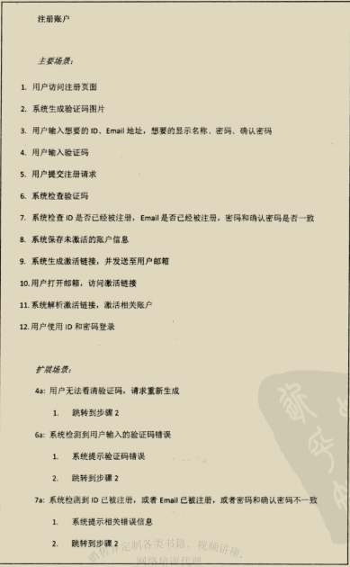

#### 4.2.2 界面原型 

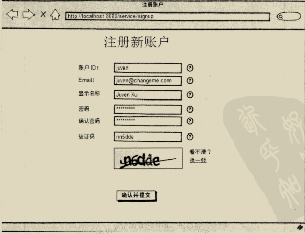

### 4.3 概要设计

#### 4.3.1 接口

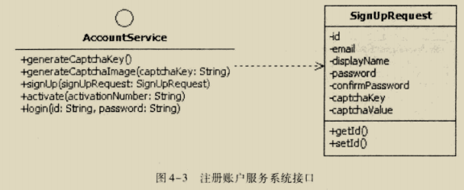

#### 4.3.2 模块结构

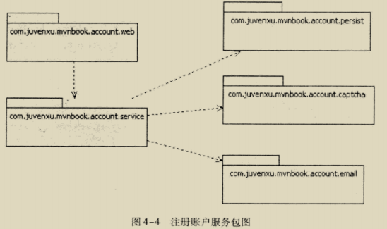

- service: 核心,封装下层细节
- web: 控制层
- persist: 持久层,基于数据库/文件
- captcha: 验证码功能
- email: 邮件服务配置

## 第 05 章 坐标和依赖

### 5.1 何为Maven坐标

Coordinate,唯一标识一个点(在中央仓库中唯一标识一个项目)

### 5.2 坐标详解

任何一个构件都必须明确定义自己的坐标

- groupId: 对应于一个项目,比如spring-core等
- artifactId: 对应一个模块 比如nexus-indexer等
- version: 
- packaging: jar war pom 方式
- classifier: 用来帮助定义构建输出的一些附属构建

### 5.3 account-email

用spring实现的,查看源码即可

安装以后就可以给其他模块使用了

### 5.4 依赖的配置

### 5.5 依赖范围

前置知识:

1. Maven在编译项目的时候使用一套classpath
2. Maven在编译和执行测试的时候使用另一套classpath
3. 最后运行的时候使用另一套classpath

依赖范围就是用来控制依赖与这三种class path的关系:

| 级别     | 编译 | 测试 | 运行 |
| -------- | ---- | ---- | ---- |
| compile  | √    | √    | √    |
| test     |      | √    |      |
| provided | √    | √    |      |
| runtime  |      | √    | √    |
| system   | √    | √    |      |

### 5.6 传递性依赖

#### 5.6.1 何为传递性依赖


#### 5.6.2 传递性依赖和依赖范围

假设A依赖于B,B依赖于C,

- 那么 A对于B是第一直接依赖,

- B对于C是第二直接依赖

- A对于C是传递性依赖

  第三个范围由前两个决定

  表5-2的第一列是 第一直接依赖  第一行是第二直接依赖

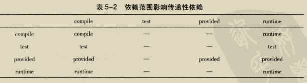

### 5.7 依赖调解

- 路径最近者优先
- 第一声明者优先(POM里面)

### 5.8 可选依赖

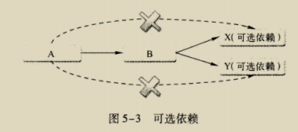

依赖声明使用 optional,不会传递,很少使用

### 5.9 最佳实践

#### 5.9.1 排除依赖

使用 exclusion 

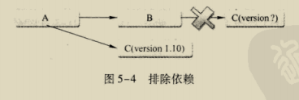

#### 5.9.2 归类依赖

定义属性 使用 properties 进行设置版本等,用${}可以使用自定义属性

#### 5.9.3 优化依赖

```shell
mvn dependency:list # 显示所有已解析依赖
mvn dependency:tree # 依赖树显示
mvn dependency:analyze # 帮助分析依赖,比如未使用依赖等
```

## 第 06 章 仓库

### 6.1 何为maven仓库

构件: 任何一个依赖,插件或者项目构建的输出

### 6.2 仓库的布局

可以查看 maven 本的仓库进行验证

org\springframework\spring-core\2.5.6\spring-core-2.5.6.jar

1. 基于构件的groupId,把 . 转换成  /
2. 基于构件的artifactId,在 1 的基础上加上该路径
3. 使用版本信息,基于前面的基础上,加上该路径
4. 依次加上 artifactId,构件分隔符,version
5. 如果有classfier,就加上构件分隔符和classfier
6. 检查构件的extension,若存在则加上 . 和extension

### 6.3 仓库分类

本的仓库优先,之后才会尝试远程仓库

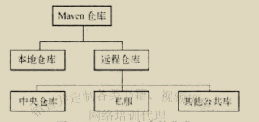

#### 6.3.1 本的仓库

默认在 .m2/repository 下,可以在settings.xml 指定仓库位置

#### 6.3.2 远程仓库

可以配置多个

#### 6.3.3 中央仓库

默认远程仓库,在 $M2_HOME/lib/maven-model-builder-3.0.jar里面访问org/apache/maven/model/pom-4.0.0.xml可以看到中央仓库的址

#### 6.3.4 私服

局域网的仓库服务,代理远程仓库

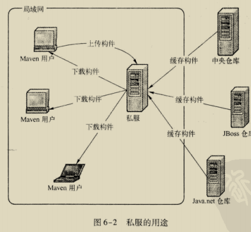

- 节省外网带宽
- 加速Maven构件
- 部署第三方构件
- 提高稳定性,增强控制
- 降低中央仓库的复合

### 6.4 远程仓库配置

```xml
<repositories>
	<repository>
    	<id></id>
        <name></name>
        <url></url>
        <releases>
        	<enabled></enabled>
        </releases>
        <snapshots>
        	<enabled></enabled>
        </snapshots>
    </repository>
</repositories>
```

#### 6.4.1 远程仓库认证

大部分无需认证,认证信息必须配置在settings.xml里面

```xml
<settings>
...
    <servers>
    	<server>
    		<id></id>    
            <username></username>
            <password></password>
        </server>
    </servers>
</settings>
```

#### 6.4.2 部署至远程仓库

```xml
<project>	
    <distributionManagement>
        <repository>
            <id></id>
            <name></name>
            <url></url>
        </repository>
        <snapshotRepository>
            <id></id>
            <name></name>
            <url></url>
        </snapshotRepository>
    </distributionManagement>
</project>    
```

部署时候往往需要认证,方法同上

```shell
mvn clean deploy
```

### 6.5 快照版本

默认情况下,Maven每天进行一次检查更新,快照机制会在模块发布过程中自动打上时间戳,有了该时间戳,构建新模块时候会自动检查快照构件最新版本

### 6.6 从仓库解析依赖的机制

1. 当依赖范围是system,直接从本的文件系统解析构件
2. 根据依赖坐标进行计算路径,尝试获取构件,发现则解析成功
3. 如果本的不存在
   1. 如果是显示发布版本,遍历所有远程仓库,发现下载使用
   2. 如果是RELEASE/LATEST,基于更新策略读取所有远程仓库的元数据 groupId/artifactId/maven-metadata.xml,将其与本的合并,得到最新值,重复 2 - 3
   3. 如果是SNAPSHOT,还是利用元素据得到最新值,重复2-3
4. 如果最后解析得到是时间戳格式的快照,复制其时间戳格式的文件至非时间戳格式

### 6.7 镜像

如果仓库X可以提供仓库Y的所有内容,那么可以认为X是Y的一个镜像

可以把私服设置为镜像

```xml
<settings>
	<mirrors>
    	<mirror>
        	<id></id>
            <name></name>
            <url></url>
            <mirrorOf></mirrorOf>
        </mirror>
    </mirrors>
</settings>
```

### 6.8 仓库搜索服务

#### 6.8.1 Sonatype Nexus

可以直接搜索需要的构件

#### 6.8.2 Jarvana

#### 6.8.3 MVNbrowser

#### 6.8.4 MVNrepository

## 第 07 章 生命周期和插件

### 7.1 何为生命周期

maven的生命周期就是为了对所有的构建过程进行统一和抽象

包含 清理 初始化 编译 测试 打包 集成测试 验证 部署 站点生成

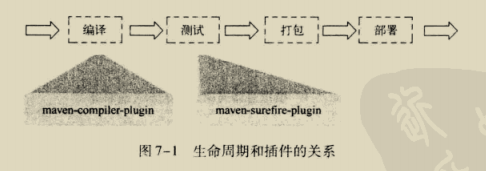

### 7.2 生命周期详解

三套生命周期: clean default site 三者互相独立

#### 7.2.1 clean生命周期

目的 清理项目,三个阶段

1. pre-clean 执行一些清理前的工作
2. clean 清理上次构建生成的文件
3. post-clean 清理后需要完成的工作

#### 7.2.3 default生命周期

核心部分

- validate
- initialize
- generate-sources-----------------------------------------主目录
- process-sources 处理项目主资源文件. 一般是对 src/main/resources 目录内容进行变量替换等工作后,复制到项目输出的主classpath目录中
- generate-resources
- process-resources
- compile 编译项目主源码至主class path里
- process-classes------------------------------------------主目录结束
- generate-test-sources-----------------------------------test目录
- 步骤基本同上,只是换成test目录
- process-test-class----------------------------------------test目录结束
- test 单元测试
- prepare-package-----------------------------------------打包开始
- package 接受编译好的代码,打包成可发布的格式
- pre-integration-test---------------------------------------集成测试
- integration-test
- post-integration-test
- verify
- install
- deploy

#### 7.2.4 site生命周期

目的 建立和发布项目站点

- pre-site 执行一些潜质工作
- site 生成项目站点文档
- post-site
- site-deploy

#### 7.2.5 命令行和生命周期

### 7.3 插件目标

plugin goal 插件的每个功能就是一个插件目标,任务执行者是插件

所以使用的时候用 : 进行分割功能 比如 dependency:tree

### 7.4 插件绑定

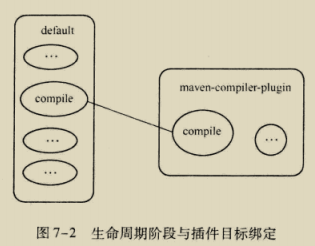

#### 7.4.1 内置绑定

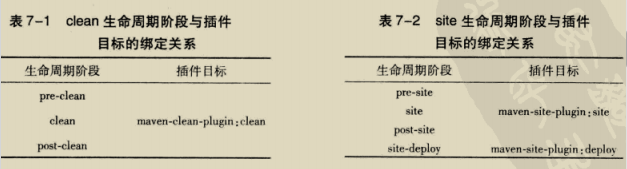

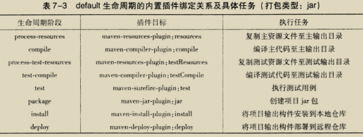

#### 7.4.2 自定义绑定

可以选择将某个插件目标绑定到生命周期的某个阶段

比如将源码打包成jar包  maven-source-plugin 可以帮我们完成

```xml
<plugin>
	<groupId>org.apache.maven.plugins</groupId>
    <artifactId>maven-source-plugin</artifactId>
    <version>2.1.1</version>
    <executions>
    	<execution>
        	<id>attach-sources</id>
            <phrase>verify</phrase>   
            <goals>
            	<goal>jar-no-fork</goal>
            </goals>
            <configuration>
            </configuration>
        </execution>
    </executions>
</plugin>
```

### 7.5 插件配置

#### 7.5.1 命令行插件配置

-DKey=value

#### 7.5.2 POM中插件全局配置

在 plugin里面使用 configuration 进行处理

#### 7.5.3 POM中插件任务配置

### 7.6 获取插件信息

#### 7.6.1 在线插件信息

去 http://maven.apache.org/plugins/index.html 或者 http://mojo.codehaus.org/plugins.html

#### 7.6.2 使用maven-help-plugin描述插件

```shell
mvn help:decribe -Dplugin=org.apache.maven.plugins:maven-compiler--plugin:2.1
mvn help:describe -Dplugin=compiler -Dgoal=compile
```

### 7.7 从命令行调用插件

```shell
mvn -h
```

可以看到使用方式

### 7.8 插件解析机制

#### 7.8.1 插件仓库

插件仓库使用 pluginRepository

#### 7.8.2 插件的默认groupId

如果是Maven官方插件,可以省略,不推荐

#### 7.8.3 解析插件版本

1. 超级POM为核心插件指定了版本
2. 未指定默认最新版本,最好自己指定一个

#### 7.8.4 解析插件前缀

插件前缀 artifactId是一一对应的,这里的仓库元数据为 groupId/maven-matadata.xml,这里的默认groupId是 org.apache.maven.plugins 和 org.codehaus.mojo两个. 可以设置 settings.xml进行配置

## 第 08 章 聚合与继承

### 8.1 account-persist

#### 8.1.1 POM

多了一些依赖,没什么特殊的

#### 8.1.2 主代码

看看源代码就可以

#### 8.1.3 测试 代码

### 8.2 聚合

使用 pom 的打包方式进行聚合

```xml
<modules>
	<module></module>
</modules>
```

使用父子关系符合逻辑

使用平行的目录结构需要修改相对路径

### 8.3 继承

#### 8.3.1 account-parent

本身pom打包方式不需要src目录

子类pom配置如下

```xml
<parent>
	<groupId></groupId>
    <artifactId></artifactId>
    <version></version>
    <relativePath></relativePath>
</parent>
```

#### 8.3.2 可继承的POM元素

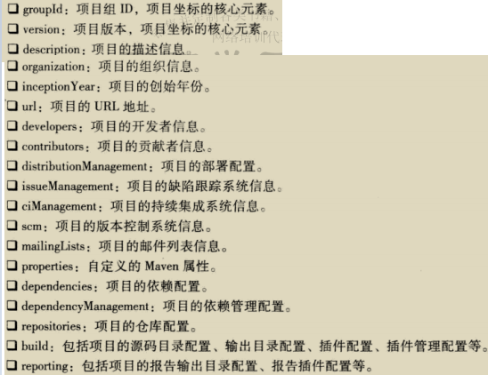

#### 8.3.3 依赖管理

dependencyManagement 元素技能让子模块继承到付模块的依赖配置,又能保证子模块以来使用的灵活性.

它可以约束依赖使用,但是不会引入实际依赖

import 依赖范围只有在该标签下才有效,通常指向一个pom,作用是将目标pom的dependencyManagement合并到当前pom

#### 8.3.4 插件管理

pluginManagement 也是不会引入实际插件

### 8.4 聚合与继承的管理

前者为了快速构件项目,后者为了消除重复配置

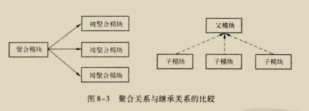

一个POM可以充当两者,一般来说没有什么问题

### 8.5 约定优于配置

可以自定义,但是不建议

超级POM 里面内容就是约定的配置

$MAVEN_HOME/lib/maven-model-builder-x.x.x.jar中的 org/apache/maven/model/pom-4.0.0.xml

### 8.6 反应堆

Reactor 是指所有模块组成的一个构建结构

#### 8.6.1 反应堆的构建顺序

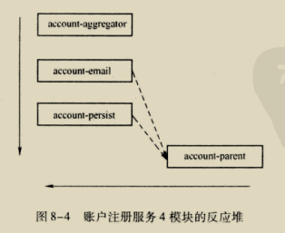

#### 8.6.2 裁剪反应堆

mvn 参数可以支持裁剪

- -am 同时构件所列模块的依赖模块
- -amd 同时构件依赖于模块的模块
- -pl 构建制定的模块
- -rf 从指定模块恢复反应堆构建

## 第 09 章 使用Nexus创建私服

仓库服务软件

#### 9.3.2 Nexus仓库分类的概念

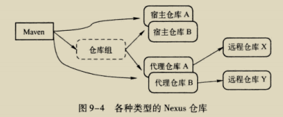

## 第 10 章 使用Maven进行测试

### 10.1 account-captcha

POM,代码等查看源码

### 10.2 maven-surefire-plugin 简介

maven不测试,而是通过插件来执行junit来测试.test阶段与该插件的test目标绑定

该插件test目标会自动执行测试源码路径下所有符合一组明明模式的测试类:

- \*\*/Test\*.java
- \*\*/\*Test.java
- \*\*/\*TestCase.java

### 10.3 跳过测试

- 参数 -DskipTests
- 参数 -Dmaven.test.skip=true 跳过编译和测试

- 都可以通过配置插件进行调过

### 10.4 动态指定要运行的测试用例

```shell
# className 支持通配符,可以用逗号进行分割
mvn test -Dtest=className
```

### 10.5 包含与排除测试用例

​	配置 surefire 插件,可以配置包含/排除某些类

### 10.6 测试报告

#### 10.6.1 基本的测试报告

surefire 插件会在项目的 target/surefire-reports 目录下生成两种格式的错误报告:

- 简单文本格式
- 与JUnit兼容的XML格式(可以使用插件打开)

#### 10.6.2 测试覆盖率报告

```shell
mvn cobertura:cobertura
```

### 10.7 运行TestNG测试

删除JUnit,添加依赖

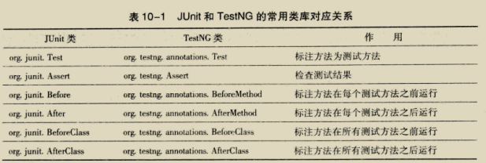

### 10.8 重用测试代码

可以配置 jar 插件进行打包,有两个目标

- jar ,内置绑定在default生命周期的package,主代码打包
- test-jar,测试代码打包

## 第 11 章 使用Hudson进行持续集成

敏捷实践核心之一 持续集成(Continuous Integration)

### 11.1 持续集成的作用 过程和优势

持续集成就是**快速**且**高频率**的**自动构建**项目的**所有源码**,并为项目成员提供丰富的**反馈**信息

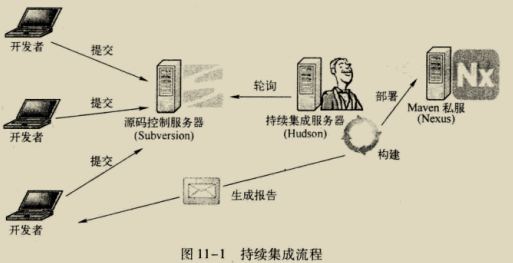

完整的集成包括以下六个步骤:

1. 持续编译: 所有正式的源代码都应该提交到源码控制系统中,持续集成服务器按一定频率检查源码控制系统(清除旧的,编译新源码)
2. 持续数据库集成: 源码不仅仅Java代码,还有SQL脚本等
3. 持续测试: JUnit使得自动化测试成了可能
4. 持续审查: 使用checkstyle可以帮我们生成各类报告
5. 持续部署: 有些错误只有在部署才能发现
6. 持续反馈: 通常是一封邮件

### 11.2 Hudson简介

开源持续集成工具,和主流构建工具,版本控制工具,自动化测试框架都能很好集成

### 11.3 安装Hudon

下载war包,直接命令行启动(也可以部署到服务器)

### 11.4 准备Subversion仓库

版本控制工具 与git差不多,git本的仓库

### 11.5 Hudson的基本系统设置

JDK 和 Maven 需要先配置.

### 11.6 创建Hudson任务

freestyle

#### 11.6.1 Hudson任务的基本配置

#### 11.6.2 Hudson任务的源码仓库配置

#### 11.6.3 Hudson任务的构建触发配置

设置周期轮询仓库

#### 11.6.4 Hudson任务的构建配置

### 11.7 监视Hudson任务的状态

首页可以查看各种状态

### 11.8 Hudson用户管理

建议看文档,配置 conf/svnserve.conf 的 general 进行用户权限限制

### 11.9 邮件反馈

### 11.10 Hudson 工作目录

## 第 12 章 使用Maven构架Web应用

### 12.1 Web项目的目录结构

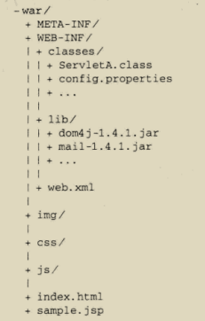

至少 META-INF WEB-INF两个,前者元素据信息,后者WAR包核心

- web.xml 资源表述文件
- classes 包含类,lib 依赖的jar包 (运行时候都会加入类路径)

POM打包方式修改为 war

web项目的maven结构

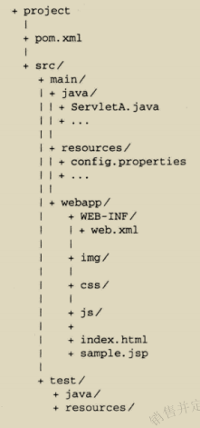

使用war方式会根据pom从本的仓库复制相应的jar文件

### 12.2 account-service

代码看源码

### 12.3 account-web

#### 12.3.1 POM

finalName 可以指定最终 war 包名

#### 12.3.2 代码

配置是基于xml的,现在基本使用注解了

### 12.4 使用jetty-maven-plugin

手动的Web测试必不可少,但是不至于使用浏览器测试整个应用,更应该使用单元测试.使用jetty(Web容器)可以省去打包和部署的步骤.

添加maven插件

```xml
<plugin>
        <groupId>org.mortbay.jetty</groupId>
        <artifactId>jetty-maven-plugin</artifactId>
        <version>8.1.16.v20140903</version>
        <configuration>
            <scanIntervalSeconds>10</scanIntervalSeconds>
            <webApp>
                <contextPath>/test</contextPath>
            </webApp>
        </configuration>
    </plugin>
```

为了可以直接 运行  mvn jetty:run 需要配置 settings.xml

```xml
<settings>
	<pluginGroups>
    	<pluginGroup>org.mortbay.jetty</pluginGroup>
    </pluginGroups>
</settings>
```

更多配置看官网

### 12.5 使用Cargo试下自动化部署

帮助用户操作Web容器的工具,jetty是日常快速开发和测试,cargo是自动化部署进行功能测试

#### 12.5.1 部署至本的Web容器

#### 12.5.2 部署至远程Web容器

可以和Tomcat协同工作,配置插件看源码或文档

## 第 13 章 版本管理

版本管理(Version Management): 项目版本的演变过程管理

版本控制(Version Control):借助工具追踪代码的每一个变更

### 13.1 何为版本管理

项目开发过程中使用 快照版本 ,向外发布时候应该使用稳定版本 发布版

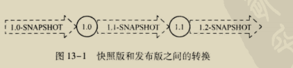

- 所有自动化测试应当全部通过
- 无快照版本依赖
- 无快照版本插件
- 代码全部提交到版本控制系统

满足以上条件才能更新为 发布版

### 13.2 Maven的版本号定义约定

主版本 . 此版本 . 增量版本 - 里程碑版本

- 主版本: 重大架构变更 JUnit4 和 JUnit3的差别
- 此版本: 较大范围功能增加,架构不变
- 增量版本: bug修复
- 里程碑版本 : 不稳定

### 13.3 主干 标签与分支

- 主干(Trunk) 项目开发代码的主体,从项目开始直到当前都处于活动状态
- 分支(Branch)从主干分离出来的代码拷贝
- 标签(Tag) 标识主干/分支的某个点的状态,一代表项目的某个稳定状态

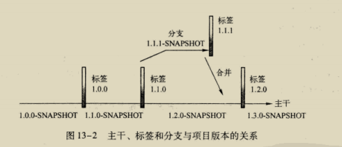

### 13.4 自动化版本发布

maven-release-plugin主要有三个目标:

- prepare 准备版本发布
  - 检查是否有未提交代码,快照版本依赖
  - 根据输入将快照升级为发布版
  - POM中的SCM信息更新为标签的址
  - 执行POM的maven构建并提交变更
  - 基于用户输入为代码打标签
  - 将代码从发布版升级为新的快照版
  - 提交POM变更
- rollback 回退上面的操作
- perform 执行发布版本.

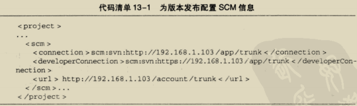

默认发布时候会启用 performRelease ,生成相应的jar文件

### 13.5 自动化创建分支

maven-release-plugin:release可以自动化操作:

- 检查有无未提交代码
- 更改POM版本
- SCM更新为分支的址
- 提交更改
- 将主干代码复制到分支
- 修改分支代码使其回退到分支前版本
- 提交本的更改

### 13.6 GPG签名

PGP (pretty good privacy) 用于验证文件是否被修改过

#### 13.6.1 GPG及其基本使用

GnuPG 是PGP的一个免费实现,可以生成签名,管理密钥,验证签名

#### 13.6.2 Maven GPG Plugin

配置插件 之后就可以自动化

可以配置到profiles里面,当 performRelease 激活的时候才启用 

## 第 14 章 灵活的构建

### 14.1 Maven属性

- 内置属性 ${basedir} 项目根目录 ${version} 项目版本
- POM属性 ${project.groupId}等
- 自定义属性 \<properties\> 自定义属性 ${} 进行引用
- Settings 属性 引用settings.xml的xml值 ${settings.localRepository}
- Java系统属性 ${user.home},使用mvn help:system 查看系统属性
- 环境变量属性 ${env.JAVA_HOME},查看同上

### 14.2 构建环境的差异

### 14.3 资源过滤

\<profiles\> 定义\<profile\>,在里面定义属性

资源文件处理其实是 maven-resources-plugin 做的事,可以配置令其解析Maven属性

```xml
<resources>
	<resource>
    	<directory>${project.basedir}/src/main/resources</directory>
        <filtering>true</filtering>
    </resource>
</resources>
```

使用mvn 加上 -Pdev 进行限定profile

### 14.4 Maven Profile

#### 14.4.1 针对不同环境的profile

#### 14.4.2 激活profile

- 命令行

- settings 文件显示激活 

  ```xml
  <activeProfiles>
  	<activeProfile>dev</activeProfile>
  </activeProfiles>
  ```

- 系统属性激活 

- 操作系统环境激活

- 文件存在与否激活

- 默认激活

#### 14.4.3 profile的种类

- pom.xml 只对当前项目有效
- settings.xml  对本机Maven项目有效(用户限定与否取决于是不是全局的settings.xml)

### 14.5 Web资源过滤

资源文件位于resources下,编译后处于WEB-INF/class下

另一类 位于webapp下,位于WAR包的根目录,一般不会过滤

配置profile 和 maven-war-plugin 对 webapp/进行过滤

```xml
<plugin>
	gav
    <configuration>
    	<webResources>
        	<resource>
            	<filtering>true</filtering>
                <diretory>src/main/webapp</diretory>
                <includes>
                	<include>**/*.css</include>
                </includes>
            </resource>
        </webResources>
    </configuration>
</plugin>
```

### 14.6 在profile中激活集成测试

TestNG 中组的概念能够很好的支持单元测试和集成测试的分类标记

首先配置 maven-surefire-plugin 执行unit测试组,如果想执行集成测试,需要激活full profile,在这个profile配置了unit 和 integration两个测试组

## 第 15 章 生成项目站点

### 15.1 最简单的站点

使用maven-site-plugin插件

> 可能会报错 java.lang.NoClassDefFoundError: org/apache/maven/doxia/siterenderer/Document
>
> 增加插件 maven-project-info-reports-plugin

site生命周期中的斯特阶段绑定 该插件的site目标,deploy绑定deploy目标

### 15.2 丰富项目信息

maven-project-info-reports-plugin 生成很多项目信息连接,为了生成完整项目信息,需要配置POM,细节查看源码

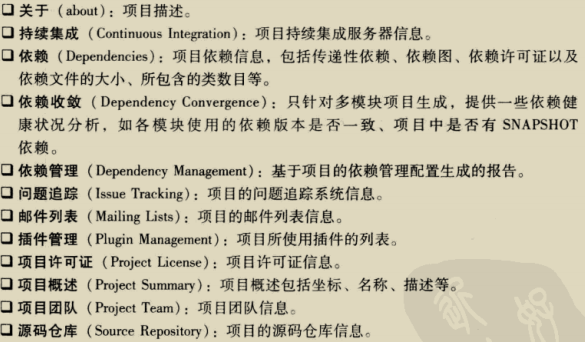

### 15.3 项目报告插件

报告插件在 \<project\> \<reporting\> \<plugins\>下配置

#### 15.3.1 JavaDocs

maven-javadoc-plugin在生成站点是可以得到源码的JavaDocs文档

#### 15.3.2 Source Xref

maven-jxr-plugin 能以web页面形式展现Java源码,配置 aggregate 可以聚合所有模块源码

#### 15.3.3 CheckStyle

检查编码规范,可以自定义

#### 15.3.4 PMD

Java源码分析工具-优化,bug,重复等的检查

#### 15.3.5 ChangeLog

maven-changelog-plugin 能够给予版本控制系统中就进变更记录生成三分报告

- Change Log 基于提交的变更报告
- Developer Activity 基于作者的变更报告
- File Activity 基于文件的变更报告

#### 15.3.6 Cobertura

生成覆盖率报告

### 15.4 自定义站点外观

#### 15.4.1 站点描述符

创建 site.xml 置于src/site 下

#### 15.4.2 头部内容及外观

标题来自project 的 name属性

bannerLeft 自定义左部横幅图片,路径在src/site/resources/下

#### 15.4.3 皮肤

可以选择皮肤构件 如GoogleCode 的 fluido-skin

#### 15.4.4 导航边栏

编辑 body 的menu元素

### 15.5 创建自定义页面

APT(almost plain text)一种类似维基的文档格式,必须位于src/site/apt下

FML(FAQ Markup Language)创建FAQ(Frequently Asked Questions)格式的XML文档格式,位于 src/site/fml下 

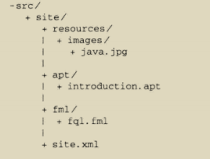

### 15.6 国际化

统一UTF-8编码

配置site 使用utf-8读取和呈现文档和源码,最后指定locales为简体中文zh_CN

### 15.7 部署站点

在 distributionManagement里面配置site,通常需要server认证,配置settings的server元素

## 第 16 章 m2eclipse

## 第 17 章 编写Maven插件

### 17.1 编写Maven插件的一般步骤

1. 创建一个maven-plugin项目,packing必须是maven-plugin,可以使用maven-archetype-plugin 快速搭建
2. 编写目标,Mojo(与POJO(plain old java object)对应)必须集成AbstractMojo
3. 提供配置点 使用@parameter标注
4. 编写代码实现目标
5. 错误处理及日志
6. 测试插件

### 17.2 案例: 代码行统计的插件

每个目标类必须继承AbstractMojo并实现execute()方法,提供@goal标注(注解写在注释里)

### 17.3 Mojo标注

- @goal \<name\> 唯一必须声明的标注
- @phrase \<phrase\> 阶段绑定
- ....

### 17.4 Mojo参数

```java
/**
*	@parameter alias="uid"
*/
private String uniqueIdentity
```

对应的配置如下:

```xml
<uid>juven</uid>
```

###  17.5 错误处理和日志

execute 可以抛出两种异常

- MojoFailureException 显示 "BUILD FAILURE"标识运行时发现预期错误
- MojoExecutionException 显示"BUILD ERROR",表示运行时发现未预期异常

getLog方法可以获取日志对象

### 17.6 测试插件

maven-invoker-plugin

## 第 18 章 Archetype

快速搭建骨架

### 18.1 Archetype使用再叙

#### 18.1.1 Maven Archetype Plugin

2.x 和 1.x 差别甚大,不用旧的

#### 18.1.2 使用Archetype一般步骤

```shell
mvn archetype:generate
```

会得到一个archetype-catalog.xml的文件,列出选项

#### 18.1.3 批处理使用Archetype

-B 显示指定GAV坐标

#### 18.1.4 常用Archetype介绍

1. maven-archetype-quickstart 

   - 包含JUnit的POM
   - 有一个App的输出"Hello World!"的类
   - AppTest的JUnit测试用例

2. maven-archetype-webapp

   Maven war 项目模板

   - 带有Hello World页面

3. AppFuse Archetype

   集成很多开源工具的项目

   - appfuse-*-jsf:基于JSF展现层框架的Archetype
   - appfuse-*-spring: 基于SpringMVC展现层的Archetype
   - ....

   每种都有三个 light basic modular

### 18.2 编写Archetype

Archetype 主要包括以下部分:

- pom.xml : 本身也是maven项目
- src/main/resources/archetype-resources/pom.xml:基于该Archetype生成项目的POM原型
- src/main/resouces/META-INF/maven/archetype-metadata.xml: Archetype的描述符文件
- src/main/resources/archetype-resources/**: 其他需要包含在Archetype 的内容

1. 本体是很简单的maven项目

2. Archetype所包含的项目骨架信息

   > GAV等采用属性声明,可以添加依赖和插件

3. 描述符文件

   > 1. 声明哪些目录及文件应该包含在Archetype下
   > 2. Archetype使用哪些属性

### 18.3 Archetype Catalog

#### 18.3.1 什么是 Archetype Catalog

用户以不指定Archetype坐标方式使用 maven-archetype-plugin 时候会得到一个选择列表,来源于 archetype-catalog.xml文件

#### 18.3.2 Archetype Catalog的来源

- internal: archetype 插件内置
- local: ~/.m2/archetype-catalog.xml
- remote: 指向了Maven中央仓库的 Archetype Catalog
- file://...  可以自己指定
- http://...  可以自己指定

#### 18.3.3 生成本地仓库的Archetype Catalog

archetype 提供了一个名为 crawl 的目标,默认会遍历localRepository,并且在该仓库的根目录下生成 archetype-catalog.xml

#### 18.3.4 使用 nexus-archetype-plugin

能够给予Nexus仓库索引实时地生成 archetype-catalog.xml 文件