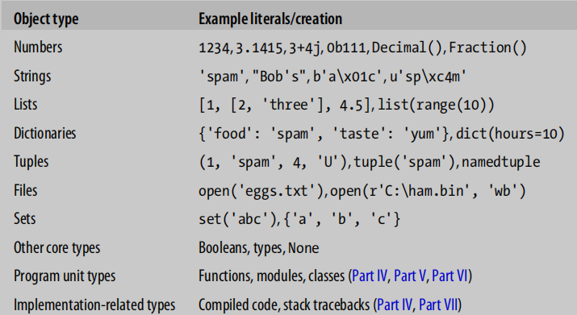
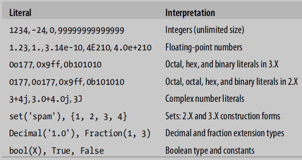
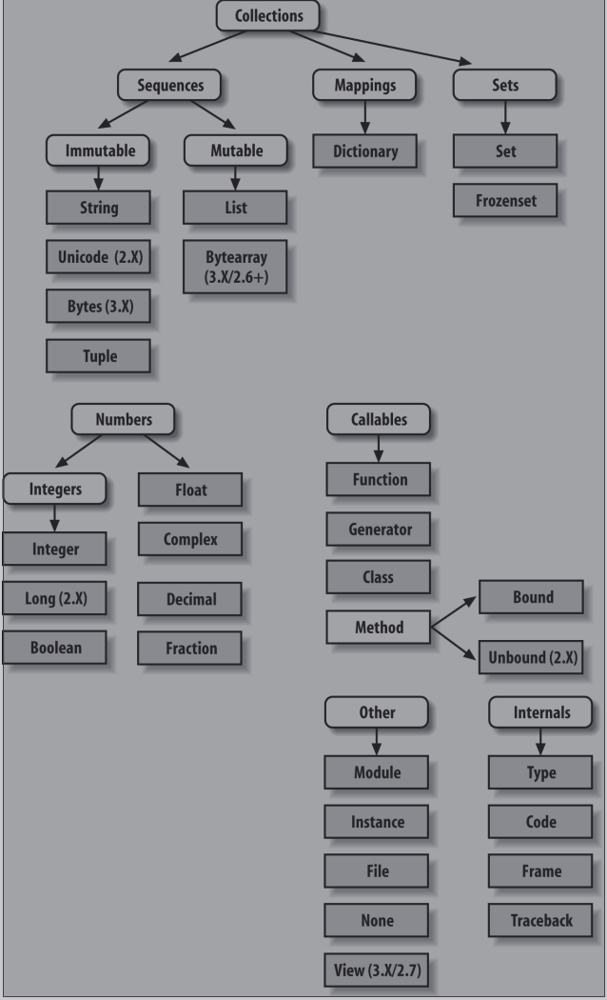
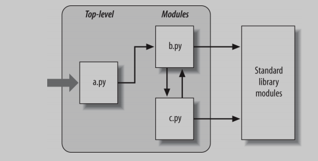

# Python学习手册

- [ ] 书籍作者：Mark Lutz
- [ ] 笔记时间：2021.9.22

## 第一部分 基础

### 第一章 Python问答环节

- 为什么学习Python？可读性，体积小，跨平台，依赖库丰富等等

- python是脚本语言吗？python不止是脚本，这只是其中的一个角色

- 缺点：效率低，但是只有在要求很高的情况下才体现，平时和C/C++是没有差别的。

  可以通过将任务交给c/c++执行，因为python本身也有“胶水语言”的角色。

### 第二章 Python如何运行程序

- Python解释器
  - 只需要安装解释器和相关的库就可以开始编写代码了，一般系统会自带
  - 编写 py 结尾的脚本，即可开始执行

- 执行流程
  1. 编译为字节码，对用户隐藏 ，并且执行速度会快得多，以pyc结尾（只有import相应文件才会出现）。具有版本差异，可以部分编译优化速度
  2. PVM（python虚拟机），执行字节码（pyc文件）。在Python中真正拥有的只是运行时——根本没有初始编译时阶段，而且一切都是在程序运行时发生的。这甚至包括诸如创建函数和类以及模块的链接等操作。
- Python实现版本
  - 目前至少有五种，CPython, Jython, IronPython, Stackless, and PyPy .默认CPython是标准实现。
  - CPython：标准的Python实现，可以使用 C 的库，完整健壮。
  - Jython：编译成 Java  字节码，可以和Java的类一起用，应用范围较小。
  - IronPython：.NET平台，可以用到COM、NET技术
  - Stackless：面向并发的标准CPython实现
  - PyPy：另一个标准的CPython重新实现，专注于性能。拥有Python和JIT（将部分字节码编程二进制代码）
- FrozenBinaries：将程序文件的字节代码、以及PVM（解释器）和程序需要的任何Python支持文件捆绑在一个单一的包中，能够直接安装运行。

### 第三章 如何运行程序

- 交互模式：控制台直接输入 python 即可开始，代码调试和模块测试的好地方
- 缩进很严格，乱用可能导致代码执行错误
- 复合语句需要空行来终止

- 以 py 结尾的一个文件，就是一个模块，可以通过导入使用，使用 from imp import reload，利用 reload 方法进行加载
  - 引入之后可以使用内部变量和方法
  - 可以使用 exec 来执行模块，exec不需要在文件更改后重新加载模块

## 第二部分 类型和操作

### 第四章 对象类型

- 

- Number类型，两个\*表示指数

- 字符串，字符数组，支持正负索引，会有越界判断。可以使用切片语法 [begin​\:end\:step]，左闭右空。

  \*表示连接若干次，数字、字符串和元组是不可变的；""" 表示多行字符串

  利用 dir ，可以查看类型可用方法和属性；通过 help 可以查看方法的简要说明

  re模块可以使用模式匹配

- List类型，中括号表示，可以使用索引，切片语法。

  ```python
  col=[row[0] for row in M] 		#列表理解表达式，提取M矩阵的第一列
  [[x, x / 2, x * 2] for x in range(−6, 7, 2) if x > 0] 	#复杂表达式
  ```

- 字典，花括号表示，元素是键值对

  ```python
  D={}
  value = D['x'] if 'x' in D else '0'						#提前测试存在性
  ```

- 元组，小括号表示，不能更改的列表

- 文件， create/read/write/append 四种模式。二进制文件表示为特殊字节字符串，不受更改

  ```python
  for line in open("data"):print(line)					#逐行读取
  codecs.open('unidata.txt', encoding='utf8').read()		#打开utf-8
  ```

- 集合，花括号表示，元素是单个类型

  ```python
  x = {1,2,3,6}										#
  y = {6,7,8}
  x&y  x|y x-y
  ```

- 还有其他类型，比如 decimal、fraction、bool等，利用 type 函数可以检测类型

### 第五章 数字类型

- 整型、浮点型、复数、十进制、小数、集合、布尔、内置方法、表达式（无限精度、位操作等）、第三方扩展（向量、库、可视化等）
- 

- ```python
  "%e %4.2f" % a b		#格式化输出
  x < y < z				#整型大小比较
  a/b  a// b				#/保留小数，//向下取整
  a=9999999999999999999+1	#支持无限精度整数
  b = 2+1j				#复数虚部是j表示
  c=oxFF	bin/oct/hex(c)	#声明和使用各种进制
  math.sqrt(x) x**.5		#计算平方根
  Decimal("0.1")			#精确十进制，可以指定位数，上下文环境
  Fraction(1,3)			#分数类型，可以和浮点数相互转换
  set()					#集合的元素需要是不可变的对象，不可以是list和dictionary
  ```

### 第六章 动态类型

- 在分配变量时创建，可以引用任何类型的对象，并且必须在引用之前分配
- 对象有两个头字段，一个类型指示符和一个引用计数器，垃圾回收算法基于引用计数（并且解决了循环引用问题）
- Python缓存和重用小整数和小字符串，利用 is 和 == 进行验证 ，sys.getrefcount() 可以查看引用数，具有弱引用。

### 第七章 字符串原理

- 如果不能识别有效转义代码，会保留反斜杠。在字符串前面使用一个r表示不使用转义。

  三个双引号会保留原有形式，不会转义。可以充当注释，文档等

- ```python
  # 	0  	1  		-1	
  	A	B	C	D	E
  #	[:				:step],step可以是负数，表示反向
  repr()				#转为代码字符串
  ord()|chr()			#二进制表示|字符表示，利用replace方法和切片拼接
  '%s ...' % (values)	#格式化字符串
  '%(qty)d more %(food)s' % {'qty': 1, 'food': 'spam'}#可以利用 vars() 来填充变量
  '{motto}, {0:.2f} and {food}'.format(42, motto=3.14, food=[1, 2])#利用字典
  '{0.platform:>10} = {1[kind]:<10}'.format(sys, dict(kind='laptop'))
  ```

### 第八章 列表和字典

- 列表也是序列，支持和字符串类似的操作，并且列表是可变的，支持范围修改

- ```python
  L[:0] = [2, 3, 4]	#头部插入
  sorted(L, key=str.lower, reverse=True)			#内置
  sorted([x.lower() for x in L], reverse=True)   	#预转换
  ```

- 字典，

- ```python
  [title for (title, year) in table.items() if year == '1975']
  db['bob']['jobs']	#支持多级访问
  ```

### 第九章 元组、文件和其他一切

- 元组，和列表一样，除了不可变和小括号

- 文件，文件上下文使用with-as，json模块，struct模块，

  

## 第三部分 语句和语法

### 第十章 Python语句

- 可以省略小括号，花括号用冒号和缩进代替，不用分号（使用分号可以压缩到一行），换行对齐即可（不用反斜杠表示同一行）

### 第十一章 赋值，表达式和打印

- 可以使用元组形式赋值，等号两端数量匹配即可，右边可以是元组，列表，字典，字符串

- 循环里面可以使用元组取值，python3可以使用 *变量 取得剩下的值，这样数量就可以不一致

  假如前后还有变量，则会为其留一个

- 可以使用连续赋值，命名规则

  - 以单个下划线（\_X）开头的名称不会由从模块导入\*语句导入（如第23章所述）。
  - 有两个前划线和后划线(\_\_X\_\_)的名称是系统定义的名称，对解释器具有特殊含义。
  - 以两个下划线开头而不以两个(\_\_X)结束的名称将本地化（“损坏”）到封闭类。
  - 只有一个下划线（\_）的名称在交互工作时保留最后一个表达式的结果。

- print方法，可以通过 help(print) 查看用法，方法调用的时候可以使用命名参数。
  - 最好格式化以后再打印
  - 重定向：修改sys.stdout即可，同理标准输入和标准错误也是

### 第十二章 if和语法规则

- if 可以和 in 关键字一起使用

- 语法就是缩进和换行，括号可以跨行，三个引号也是。

- ```python
  a = 't' if 'spam' else 'f'		#三元运算，不支持？的三元运算
  ```

### 第十三章 while和for循环

- 空语句可以使用 pass ，可以在循环外使用else，当使用break跳出循环时候执行。

  不允许判断条件赋值形式

- for 使用 in ，支持 else 子句。

  内置 range、zip（会把多个数据封装为一个对象，然后并列访问）、

  enumerate（提供索引下标，支持next）、和map

### 第十四章 迭代

- 对象具有 "\_\_next\_\_" 方法，可以手动调用逐行读取，也可以调用 next() （内部调用\_\_netxt\_\_方法）

- ```python
  data = [ x**2 for x in range(10)]			#列表对迭代的支持
  lines = [line.rstrip() for line in open("data") if line[0] == 'p']
  data = [x,y for x in 'abc' for  y  in '123']
  ```

- 字典返回的并不是视图

### 第十五章 文档

- dir可以查看属性和方法
- \_\_doc\_\_可以查看三个"注释的文档说明
- help 方法查看具体用法 
-  python -m  pydoc -b 命令可以打开浏览器查看文档说明
- [在线文档](http://www.python.org)

## 第四部分 方法和生成器

### 第十七章 函数

- def 关键字，可以有命名参数，return结束。

  支持嵌套，函数也是对象，可以赋予属性，跟js用法差不多。

### 第十七章 作用域

- 基于方法的范围，方法之外则是全局变量，

  入口模块的 \_\_name\_\_ 的值会被设置为 "\_\_main\_\_",默认是当前模块名称

- 作用域有四种：  局部、闭包函数、全局、内置（Local，Enclosing，Global，Build-in）

  - 内置函数是在 buitins 模块里面
  
  - global 关键字指定使用 全局变量，而不是覆盖
  
  - lambda n: x\*\*n 
  
  - for循环也是变量范围有问题，需要用到闭包限定（局部变量覆盖）
  
  - nonlocal变量：允许嵌套函数更改，在闭包函数中，非本地域是每个调用的多个拷贝数据。
  
    只能定义在函数里，并且需要提前声明
  
  - global变量：需要提前声明和使用的地方声明 
  
  - 类会自动调用 \_\_init\_\_ 方法，\_\_call\_\_拦截对实例的直接调用，字段都可以访问
  
  - 函数具有属性，可以在嵌套函数之外访问状态变量


### 第十八章 参数

- 值复制和引用复制，没什么特殊的。可以通过传入不可变对象元组之类的，可以避免更改。

- 形参的匹配模式：参数默认值、\*\*参数收集到字典、\*参数收集到元组

  实参的匹配模式：命名参数、\*参数表示拆列表、\*\*拆字典

### 第十九章 高级函数主题

- 循环和递归
- 具有注解，在 \_\_annotations\_\_ ，在参数后可以指定参数的类型，语法就是 参数:类型，返回类型采用箭头
- lambda表达式应用场景，map 、filter、for，只进行简单处理的表达式。

### 第二十章 列表表达式和生成器

- 列表表达式更容易理解，效率高

- 生成器使用 yield ，可迭代对象

  生成器函数和生成器表达式都是它们自己的迭代器，因此只支持一个活动迭代

### 第二十一章 基准

- 利用 time 模块，自定义计时器，用到 perf_counter 方法。
- 可以用现成的 timeit 模块，基准测试模块和脚本

## 第五部分 模块和软件包

### 第二十二章模块 大图景

- 

- 导入过程--导入一次

  1. 找到对应的py文件 
  2. 编译成字节码，如果需要的话。文件将在\_\_pycache\_\_子目录中
  3. 根据代码构建对象

- 必须使用imp.reload调用强制重新导入

- 模块搜索目录：当前工作目录；PYTHONPATH；标准库；.pth文件指定的目录；

  sys.path 可以查看搜索目录，并且手动修改

### 第二十三章 模块编程 

- 一个py文件就是一个模块，import 只能工作一次

  \_\_dict\_\_ 属性访问模块的名称空间字典

  ```python
  from M import func  as mfunc
  from imp import reload 
  reload(module)
  ```

### 第二十四章 模块包

- Python代码的目录被称为一个包，因此这种导入被称为包导入，会被转化为一个名称空间。

  一个模块就是一个名称空间

  ```python
  from ch1.ch2.M import func  as mfunc 	#目录里面需要__init__.py文件 
  sys.path.append("..")					#引入相对路径
  from ch1.echo import calc_add
  from ..ch1.echo							#会出现问题
  ```

### 第二十五章 高级模块的主题

- \_开头的变量表示模块私有数据，可以给\_\_all\_\_赋值列表让 from*  加载

  ```python
  from __future__ import featurename #对可能破坏现有代码的语言的更改通常会在Python中逐步引入的
  # 可以通过字符串变量引入，获知使用 exec 拼接引入
  ```

- 每个模块都有\_\_name\_\_，入口文件的值为 \_\_main\_\_，可以用来单元测试


