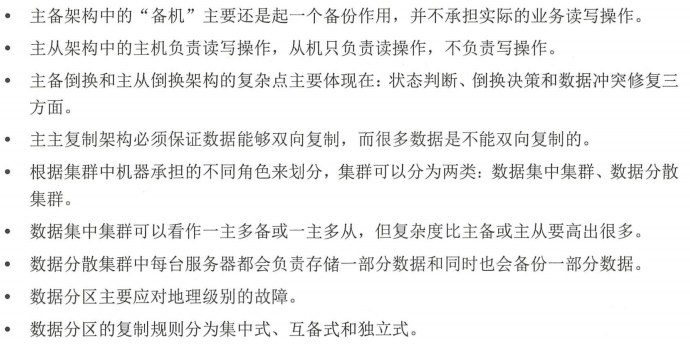
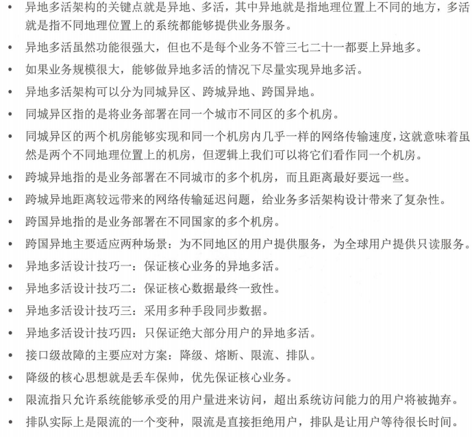
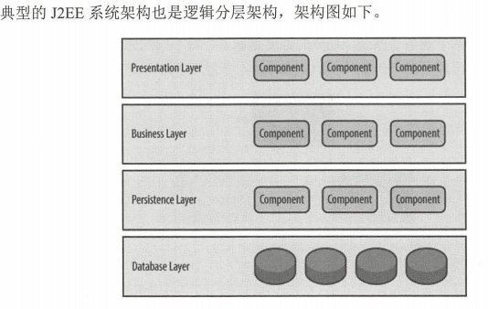
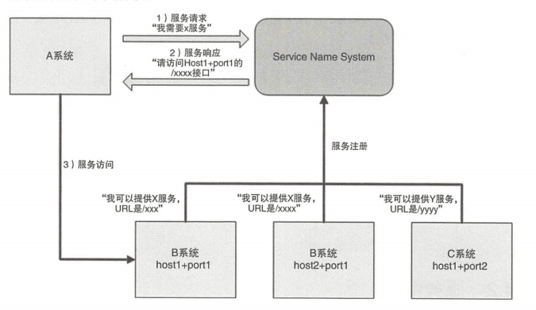

# 从零开始学架构:照着做，你也能成为架构师

- [ ] 书籍作者: 李运华
- [ ] 笔记时间: 2021.03.01

## 第1部分 概念和基础

### 第1章 架构基础

#### 1.1 "架构"到底指什么

##### 1.1.1 系统与子系统

- 系统: 泛指由一群高**关联**的个体组成,根据某种**规则**运作,能完成个别元件不能单独完成的**工作**的群体。意思是“总体”“整体”或“联盟”。
- 只能是关联的个体构成系统
- 个体按照指定规则运作,不是各自为政
- 能力不等于个体能力之和

##### 1.1.2 模块与组件

- 模块: 从逻辑角度划分,目的职责分离(module)
- 组建: 从物理角度划分,目的单元复用(component)

##### 1.1.3 框架与架构

- 框架: 通常指实现业界标准或完成特定基本任务的软件组件规范,也指为了实现某个软件组件规范时, 提供规范所要求之基础功能的软件产品
  - 框架是规范.比如MVC,MVVM,J2EE
  - 框架提供产品.SpringMVC等
- 架构: 指软件系统的“基础结构”,创造这些基础结构的准则,以及对这些结构的描述。

##### 1.1.4 重新定义架构

架构: 软件系统的顶层结构(需要注意 系统 规则 基础结构)

#### 1.2 架构设计的目的

##### 1.2.1 架构设计的误区

- 架构很重要 , 所以要做架构设计 -- 正确的废话
  - 没有架构直接编码?可以,甚至效果还不错.
  - 架构提升开发效率?不一定,有时候简单的设计开发效率反而高
  - 良好设计的架构能促进业务发展吗? 有一定道理.只能说不能照搬架构.合适的最好.
- 每个系统都要做架构设计吗?
  - 反正大家都做,应该是的吧
- 公司流程要求系统开发过程中必须有架构设计
  - 同上
- 为了高性能、高可用、可扩展 , 所以要做架构设计
  - 不是所有部分都能满足,只能部分满足

##### 1.2.2 以史为鉴

- 机器语言( 1940 年之前) -- 难写 难读 难改

- 汇编语言( 20 世纪 40 年代) -- 符号助记,可移植性差

- 高级语言 ( 20 世纪 50 年代)

  - 第一次软件危机与结构化程序设计( 20 世纪 60 年代~ 20 世纪 70 年代)

    > 软件规模和复杂度已经大大增加,经典例子 IBM的SYstem/360,书籍 <<人月神话>>
    >
    > 1968 NATO 软件工程 只能缓解危机
    >
    > 结构化程序设计 Edsger Dijkstra 于 1968 年发表了 著名的《 GOTO 有害论》论文,Pascal诞生(自顶向下、逐步细化、模块化),面向过程开设计思想

  - 第二次软件危机与面向对象( 20 世纪 80 年代)

    > 软件生产力远远跟不上硬件和业务的发展.
    >
    > 根源在于可扩展性,第一次是软件逻辑十分复杂.促进了面向对象发展,只能说也是一种缓解.

  - 软件架构

    > 早在 20 世纪 60 年代 Edsger Dijkstra 这位“上古 大神”就己经涉及软件架构这个概念.但是90 年代开始的流行的.背景不是为了解决新危机.
    >
    > 随着软件系统规模的增加,计算相关的算法和数据结构不再构成主要的设计问题;当系统由许多部分组成时, 整个系统的组织,也就是所说的“软件架构”,导致了一系列新的设计问题。
    >
    > 从模块到对象再到组件,可以看到划分粒度越来越大.

##### 1.2.3 架构设计的真正目的

架构设计的主要目的是为了解决复杂度带来的问题

#### 1.3 复杂度来源

技术发展带来了性能上的提升，不一定带来复杂度的提升。比如网速的变化.

只有那些并不是用来取代旧技术，而是开辟了一个全新领域的技术，才会给软件系统带来复杂度，因为软件系统在设计的时候就需要在这些技术之间进行判断选择或组合.比如汽车的发明,无法取代火车,出行时候需要判断.

##### 1.3.1 高性能

- 单机复杂度

  > 关键的地方就是操作系统.它会跟着硬件发展而发展.
  >
  > - 手工输入时期,性能很低效
  > - 批处理操作系统 -- 效率低
  > - 分时系统 -- 进程发明,并发 -- 多CPU,并行处理

- 集群的复杂度

  > - 任务分配 -- 如负载均衡
  > - 任务分解 -- 突破单台机器处理性能瓶颈.这里分解的粒度就是关键

##### 1.3.2 高可用

高可用指“系统无中断地执行其功能”的能力，代表系统的可用性程度，是进行系统设计时的准则之一。

本质上都是通过“冗余”来实现高可用

- 计算高可用

  > 业务的逻辑处理。 计算有 个特点就是无论在哪台机器上进行计算，同样的算法和输入数据，产出的结果都是一样的
  >
  > - 增加任务分配器
  > - 选择合适的连接方式
  > - 任务分配器增加分配算法.例如常见的双机算法有主备、主主 主备方案又可以细分为冷备、温备 热备。

- 存储高可用

  > 存储高可用的难点不在于如何备份数据，而在于如何减少或规避数据不一致对业务造成的影响.CAP定理用武之地.

- 高可用状态决策

  > 系统需要能够判断当前的状态是正常的还是出现了异常，如果出现了异常就要采取行动来保证高可用.但在具体实践的过程中，恰好存在 个本质的矛盾 通过冗余来实现的高可用系统，状态决策本质上就不可能做到完全正确 

  - 独裁式 -- 不会出现决策混乱的问题,一旦挂掉就完了

    

  - 协商式

    > 协商式决策指的是两个独立的个体通过交流信息，然后根据规则进行决策，最常用的协商式决策就是主备决策
    >
    > 基本规则就是启动时候都是备机,通过连接并交换信息决定主机
    >
    > 问题在于连接,在不适合的时候挂掉会导致各种问题

    

  - 民主式决策

    > 民主式决策指的是多个独立的个体通过投票的方式来进行状态决策。
    >
    > ZooKeeper 的选举协议 ZAB ，算法复杂,为了解决脑裂问题,系统一般都采用“投票节点数必须超过系统总节点数半”规则来处理。会降低性能.

##### 1.3.3 可扩展性

- 预测变化 -- "唯一不变的是变化"

  > - 不能每个设计点都考虑可扩展性
  >
  > - 不能完全不考虑可扩展性。
  >
  > - 所有的预测都存在出错的可能性

- 应对变化

  > 方案一 将变化部分封装在一个部分,变化层依赖稳定层
  >
  > 方案二 提炼出一个“抽象层”和一个 实现层”，抽象层是稳定的.常见的设计模式

  

##### 1.3.4 低成本

与高性能相矛盾,低成本给架构设计带来的主要复杂度体现在：往往只有“创新”才能达到低成本目标。

比如NoSQL,Hadoop,等的出现

##### 1.3.5 安全

- 功能安全

  > 常见的 xss 攻击、 cs盯攻击、 SQL 注入、 Windows 漏洞、密码破解等，本质上是因为系统实现有漏洞.主要在编码方面,架构关系不大.

- 架构安全

  > 传统的架构安全主要依靠防火墙，防火墙最基本的功能就是隔离网络，通过将网络划分成不同的区域，制定出不同区域之间的访问控制策略来控制不同信任程度区域间传送的数据流。
  >
  >  
  >
  > DDOS 攻击最大的影响是大 消耗机房的出口总带宽。不管防火墙处理能力有多强，当出口带宽被耗尽时，整个业务在用户看来就是不可用的
  >
  > 互联网系统的架构安全目前并没有太好的设计手段来实现，更多是依靠运营商或云服务商强大的带宽和流量清洗的能力，较少自己来设计和实现。

##### 1.3.6 规模

- 功能越来越多，导致系统复杂度指数级上升
- 数据越来越多，系统复杂度发生质变

#### 1.4 本章小结

### 第2章 架构设计原则

优秀程序员和架构师之间还有 个明显的鸿沟需要跨越，这个鸿沟就是“不确定性”

架构设计时遵循这几个原则，有助于我们做出最好的选择.

#### 2.1 合适原则

原则宣言：“合适优于业界领先”

1. 将军难打无兵之仗。-- 没那么多人，却想干那么多活，是失败的第一个主要原因
2. 罗马不是一天建成的。-- 没有那么多积累，却想一步登天，是失败的第二个主要原因
3. 冰 下面才是关键 -- 没有那么卓越的业务场景，却幻想灵光一闪成为天才，是失败的第三个主要原因

#### 2.2 简单原则

原则宣言 “简单优于复杂”

- 结构的复杂性
  - 组件越多，就越有可能其中某个组件出现故障，从而导致系统故障。
  - 某个组件改动，会影响关联的所有组件，这些被影响的组件同样会继续递归影响更多的组件。
  - 定位一个复杂系统中的问题总是比简单系统更加困难
- 逻辑复杂性
  - 高度耦合导致修改困难
  - 采用了复杂的算法,修改困难

#### 2.3 演化原则

宣言 “演化优于一步到位”。

对于建筑来说，永恒是主题；而对于软件来说，变化才是主题！

设计实现 - 迭代 - 重构 

#### 2.4 本章小结

### 第3章 架构设计流程

#### 3.1 有的放矢--识别复杂度

正确的做法是将主要的复杂度问题列出来，然后根据业务、技术、 团队等综合情况章架构设计流程进行排序，优先解决当前面临的最主要的复杂度问题

#### 3.2 按图索骥--设计备选方案

例如 可用的主备方案、集群方案，高性能的负载均衡、多路复用，可扩展的分层、插件化等技术

常见的错误:

- 设计最优秀的方案！
- 只做一个方案！ -- 3~5个 ,差异需要明显,不要局限熟悉的技术
- 备选方案过于详细 -- 备选阶段关注的是技术选型，而不是技术细节，技术选型的差异要比较明显。

#### 3.3 深思熟虑一一评估和选择备选万案

常见的方案质 属性点有：性能、可用性、硬件成本、项目投入、复杂度、安全性、可扩展性等。 在评估这些质 属性时，需要遵循架构设计原则 “合适原则”和原则 “简单原则”，避免贪大求全

具体实例来展示下方案“ 360 度环评”的具体做法

##### 3.3.1 业务背景

某个大约 20 个人规模的创业团队做了 个垂直电商的网站，其中开发人员大约是6个人创业初期为了能够快速上线，系统架构设计得很简 ，就是 个简单的 Web 网站

##### 3.3.2 备选方案设计

- 横向扩展

  

- 系统拆分

  

##### 3.3.3 备选方案 360 度环评

不可以根据优点数量进行加权评判,应该根据问题优先级进行选择

#### 3.4 精雕细琢一一详细污案设计

详细方案设计就是将方案涉及的关键技术细节给确定下来

- 架构师不但要进行备选方案设计和选型 ，还 需要对备选方案的关键细节有较深入的理解。
- 通过分步骤、分阶段、分系统等方式 尽量降低方案复杂度，方案本身的复杂度越高，某个细节推翻整个方案的可能性就越高，适当降低复杂性，可以减少这种风险。
- 如果方案本身就很复杂，那么就采取设计团队的方式来进行设计，博采众长，汇集大智慧 经验，防止 设计师时可能出现的思维盲点或经验盲区。

#### 3.5 本章小结

## 第2部分 高性能架构模式

### 第4章 存储高性能

#### 4.1 关系数据库

关系数据库由于其 ACID 的特性和功能强大的 SQL 查询，目前还是各种业务系统中关键和核心的存储系统，很多场景下高性能的设计最核心的部分就是关系数据库的设计。

##### 4.1.1 读写分离

实际应用过程中需要应对复制延迟带来的复杂性。MySQL的主从复制延迟可能达到1s,有以下常见解决方案:

1. 写操作后的读操作指定发给数据库主服务器。-- 对业务的侵入和影响较大,容易出问题
2. 读从机失败后再读一次主机。 -- 二次读取,主机压力很大,可能崩溃
3. 关键业务读写操作全部指 ，非关键 务采用读写分离。-- 可以接受

##### 4.1.2 分库分表

当数据量达到千万甚至上亿条 时候,单台数据库服务器的存储能力会成为系统 瓶颈

1. 数据量太大，读写的性能会下降，即使有索引也会变得很大，性能同样会下降

2. 数据文件会变得很大 ,数据库备份 恢复需要耗费很长时间

3. 数据文件越大 极端情况下丢失数据的风险越高（例如，机房火灾导致数据库主备机都发生故障〉。

- 业务分库 -- 按照业务模块将数据分散到不同的数据库服务器

  > 带来了一些新问题:
  >
  > 1. join操作 -- 不能使用,只能多次查询
  > 2. 事务 -- 分布式事务虽然有,但是性能低
  > 3. 成本 -- 倍增,显然只有业务达到一定规模才适合

  

- 分表

  > 垂直分表和水平分表,这里和HBase的存储原理就很相似了.还是带来新问题
  >
  > - 垂直分表
  >
  >   适合将表中某些不常用且占了大量空间的列拆分出去。引入的复杂性主要体现在表操作的数量要增加。
  >
  > - 水平分表
  >
  >   如果单表行数超过 5000 万就必须进行分表，(参考值)引入新的问题
  >
  >   1. 路由
  >      1. 范围路由 -- 例如根据id进行分段划分,大小需要具体取值,一般1000万~2000万,缺点可能分布不均匀
  >      2. Hash路由 -- 根据id取模,,分布均匀,难以扩充新的表
  >      3. 配置路由 -- 用独立的表记录路由.简单灵活,但是多一次查询,假如表太大,又是一个死循环.
  >   2. join操作 -- 需要在业务代码或数据库中间件中进行多次 in 查询，然后将结果合井。
  >   3. count()操作 
  >      1. count()相加,性能较低
  >      2. 记录数表.查询快,增加复杂度和写压力,可以定时同步减少压力
  >   4. order by操作 -- 只能由业务代码或数据库中间件分别查询每个子表中的数据，然后汇总进行排序。

  

##### 4.1.3 实现方法

读写分离需要将读／写操作区分开来，然后访问不同的数据库服务器 分库分表需要根据不同的数据访 不同的数据库服务器，两者本质上都是一种**分配机制**，即将不同的 SQL 语句发送到不同 数据库服务器。

常见的分配实现方式有两种：

- 程序代码封装 -- 代码中抽象一个数据访问层来实现读写分离、分库分表。

  >  比如淘宝的TDDL( Taobao Distributed Data Layer ,头都大了）,基本原理是一个基于集中式配置的 jdbc datas ource 实现，具有主备、读写分离、动态数据库配置等功能

  

  

- 中间件封装。 -- 独立一套系统出来，实现读写分离和分库分表操

  > 复杂度比代码封装高出一个数量级,大公司才适合.

  

#### 4.2 NoSQL 

SQL存在以下缺点:

1. 存储的是行记录，无法存储数据结构。
2. schema 扩展很不方便
3. 大数据场景下 I/O 较高
4. 全文搜索功能比较弱

##### 4.2.1 K-V 存储

全称是 Key-Value 存储,Redis是典型代表,常常被称为数据结构服务器

缺点主要体现在并不支持完整的 ACID 事务，只能保证隔离性和一致性

##### 4.2.2 文档数据库

最大的特点就是 no-schema ，可以存储和读取任意的数据 目前绝大部分文档数据库存储的数据格式是 JSON,优势在增加新字段简单,历史数据不会出错,容易存储复杂数据.特别适合电商和游戏这类的业务场景。

代价就是 不支持事务 和 无法实现关系数据库的 join 操作

##### 4.2.3 列式数据库

行式数据库优点: 读写多列效率高,但是在海量数据情境下不适合,因为常常只用一列.

除了节省 IO，列式存储还 更高的存储压缩比，

列式存储将不同列存储在磁盘上不连续的空间，导致更新多个列时磁盘是随机写操作，一般将列式存储应用在离线的大数据分析和统计场景中，因为这种场景主要是针对部分列进行操作，且数据写入后就无须再更新删除

##### 4.2.4 全文搜索引擎

- 数据库的缺陷

  > 1. 全文搜索条件可以任意排列组合,如果通过索引,索引数量非常多
  > 2. 模糊匹配只能是 like,但是全表扫描,效率低下

- 基本原理

  > “倒排索引” （ Inverted index ），也常被称为反向索引,是建立单词到文档的索引。“正排索寻 ”的基本原理是建立文档到单词的索引。

  

-  与数据库结合

  > 全文搜索 的索引对象是单词和文档,常用的转换方式是将关系型数据按照对象的形式转换为 JSON 文挡，然后将 JSON档输入全文搜索引擎进行索引。

#### 4.3 缓存

有些场景下提升存储系统的性能是不够的

1. 需要经过复杂运算后得出的数据，存储系统无能为力
2. 读多写少的数据，存储系统有心无力

虽然缓存可以减轻压力,但是引入了更多复杂度.

##### 4.3.1 缓存穿透

缓存中没有命中,需要查询数据库.

- 存储数据不存在 -- 设置一个默认值到缓存,第二次读取时获取默认值
- 缓存数据生成耗费大量时间或资源 -- 爬虫导致问题,访问大量不常用页面导致缓存大量无用页面,只能通过识别爬虫进行处理.

##### 4.3.2 缓存雪崩

缓存雪崩是指当缓存失效（过期）后引起系统性能急剧下降的情况.高并发情况下,多个请求未命中去请求数据,导致数据库压力大

- 更新锁

  > 对缓存更新操作进行加锁保护，保证只有1个线程能够进行缓存更新，未能获取更新锁的
  >
  > 线程要么等待锁释放后重新读取缓存，要么就返回空值或默认值。

- 后台更新

  > 由后台线程来更新缓存，而不是由业务线程来更新缓存，缓存本身的有效期设置为永久，后台线程定时更新缓存。
  >
  > 1. 定时读取。如果发现缓存被“踢了”就立刻更新缓存
  > 2. 消息队列通知。
  >
  > 后台更新既适应单机多线程的场景，也适合分布式集群的场景，相比更新锁机制要简单一些。后台更新机制还适合业务刚上线的时候进行缓存预热。

##### 4.3.3 缓存热点

缓存热点 的解决方案就是复 缓存， 将请求分散到 个缓存服务器上，减轻缓存热点导致的单台缓存服务器压力。

#### 4.4 本章小结

### 第5章 计算高性能

#### 5.1 单服务器高性能

单服务器高性能的关键之 就是服务器采取的网络编程模型,关键在于如何管理连接,如何处理请求.

都涉及到IO模型(阻塞 同步) 进程模型(单,多,多线程)

##### 5.1.1 PPC

PPC (Process per Connection ) ，其含义是指每次有新的连接就新建一个进程去专门处理这个连接的请求 ，这是传统的 UNIX 网络服务器所采用的模型

PPC实现简单,适合连接较少的情况,比如数据库服务器.

-  fork 代价高：即使用到写时复制技术,还是代价很大
-  父子进程通信复杂: 需要采用IPC之类的进程通信方案.
-  进程数量增大后对操作系统压力较大: 一般处理几百请求.

##### 5.1.2 prefork

prefork的关键是多个子进程都accept同一个socket,保证只有一个进程能最后accept成功.Linux可以解决"惊群"问题.

##### 5.1.3 TPC

Thread per Connection,差别不大.解决了代价高和通信复杂问题,但是带来了新问题.

1. 代价还是有,高并发还是有性能问题
2. 线程的互斥和共享问题,死锁
3. 多线程互相影响

##### 5.1.4 prethread

prethread 理论上可 以比 prefork 支持更多的并发连接，Apache 服务器的 MPM worker 模式本质上就是一种 pre thread 方案，但稍微做了改进.

##### 5.1.5 Reactor

使用进程池.

- 阻塞方案 : 进程可以采用“read －＞业务处理－＞ write ”的处理流程，如果当前连接没有数据可以读，则进程就阻塞在 read 操作上

- 非阻塞方案: 将 read 操作改为非阻塞，然后进程不断地轮询多个连接。效率低

- I/O多路复用

  > 计算机网络领域的 I/O 多路复用，其中的“多路”，就是指多条连接，“复用”指的是多条连接复用同 个阻塞对象，这个阻塞对象和具体的实现有关
  >
  > - 当 多条连接共用1个阻塞对象后，进程只需要在一个阻塞对象上等待 ，而无须再轮询所有连接。
  > - 当某条连接有新的数据可以处理时，操作系统会通知进程，进程从阻塞状态返回，开始进行业务处理。

I/O 多路复用结合线程池，解决了 PPC 和 TPC 模型的问题

Reactor 模式的核心组成部分包括 Reactor 和处理资源池 （进程池或线程池），其中 Reactor 责监听和分配事件，处理资源池负责处理事件 初看 Reactor 的实现是比较简单的，但实际上合不同的业务场景， Reactor 模式的具体实现方案灵活多变，主要体现在如下两点。

- Reactor 的数量可以变化 可以是 Reactor ，也可以是多个 Reactor
- 资源池的数量可以变化：以进程为例，可以是单个进程，也可以是多个进程（线程类似）。

1. 单Reactor单进程/线程

   简单,无法发挥多核处理,Handler是性能瓶颈.Redis典型应用.

   

2. 单 Reactor 多线程

   多核处理,多线程数据共享问题,一个Reactor压力过大.典型例子 Java NIO

   

3. 多Reactor 多进程／线程

   典型例子 Nginx 和 Netty

   

##### 5.1.6 Proactor

Reactor 是非阻塞同步网络模型 ，因为真正的 read 和 send 操作都需要用户进程同步操作。

Reactor 可以理解为“来了事件我通知你,你来处理”，而 Pro actor 可以理解为“来了事件我来处理，处理完了我通知你”。这里的“我”就是操作系统 内核，“ 事件”就是有新连接、有数据可读 有数据可写这些IO事件

##### 5.2 集群高性能

高性能集群的本质很简单，通过增加更多的服务器来提升系统整体的计算能力。计算本身存在一个特点：同样的输入数据和逻辑，无论在哪台服务器上执行，都应该得到相同的输出

复杂性主要体现在需要增加一个任务分配器，以及为任务选择一个合适的任务分配算法,也叫"负载均衡器”

##### 5.2.1 负载均衡分类

- DNS 负载均衡

  > 一般用来实现地理级别的均衡
  >
  > 优点: 简单、成本低,就近访问,提升访问速度
  >
  > 缺点: 更新不及时,扩展性差,分配策略 比较简单

- 硬件负载均衡

  > 硬件负载均衡是通过单独的硬件设备来实现负载均衡功能，这类设备和路由器交换机类似，
  >
  > 可以理解为一个用于负载均衡的基础网络设备。
  >
  > 优点: 功能强大 性能强大 稳定性好 支持安全防护
  >
  > 缺点: 扩展性差  贵

- 软件负载均衡

  > 软件负载均衡通过负载均衡软件来实现负载均衡功能 常见的有 Nginx LVS 其中 Nginx是软件的7层负载均衡， LV inu 内核的4层负载均衡。
  >
  > 硬件负载均衡性能远远高于软件负载均衡性能。
  >
  > 优点: 简单 便宜 灵活
  >
  > 缺点: 性能一般 没有安全防护

##### 5.2.2 负载均衡架

组合的基本原则为 DNS 负载均衡用于实现地理级别的负载均衡；硬件负载均衡用于实现 群级别的负载均衡；软件负载均衡用于实现机器级别的负载均衡

##### 5.2.3 负载均衡的算法

1. 任务平分类 负载均衡系统将收到的任务平均分配给服务器进行处理，
2. 负载均衡类 负载均衡系统根据服务器的负载来进行分配，
3. 性能 优类 负载均衡系统根据服务器的响应时间来进行任务分配
4. Hash 类：负载均衡系统根据任务中的某些关键信息进行 Hash 运算，将相同 Has的请求分配到同一台服务器上。

- 轮询

  > 最简单策略,无须关注服务器本身的状态。也就是说，只要服务器在运行，运行状态是不关注的

- 加权轮询

  > 负载均衡系统根据服务器权重进行任务分配，这里的权重一般是根据硬件配置进行静态配置的，采用动态的方式计算会更加契合业务，但复杂度也会更高。

-  负载最低优先

  > 负载均衡系统将任务分配给当前负载最低的服务器
  >
  > - LVS 这种4层网络负载均衡设备，可以以“连接数”来判断服务器的状态
  > - Ng nx 这种7层网络负载系统，可以以“HTTP 请求数”来判断服务器状态
  > - 如果我们自己开发负载均衡系统，可以根据业务特点来选择指标衡量系统压力
  >
  > 增加了很多复杂度
  >
  > - 最少连接数优先的算法要求负载均衡系统统计每个服务器当前建立的连接，其应用场景仅限于负载均衡接收的任何连接请求都会转发给服务器进行处理，否则如果负载均衡系统和服务器之间是固定的连接池方式，就不适合采取这种算法 例如， LVS 可以采取这种算法进行负载均衡，而 个通过连接池的方式连接 MySQ 群的负载均衡系统就不适合采取这种算法进行负载均衡。
  > - CPU 负载最低优先的算法要求负载均衡系统以某种方式收集每个服务器的 CPU 负载，而且要确定是以 分钟的负载为标准，还是以 15 分钟的负载为标准，不存在1分钟肯定比15分钟要好或差 。不 同业务最优的时间间隔是不一样的，时间间隔太短容易造成频繁波动，时间间隔太长又可能造成峰值来临时响应缓慢

- 性能最优类

  > 优先将任务分配给处理速度最快的服务器，

- Hash类

  > 负载均衡系统根据任务中的某些关键信息进行 Hash 运算，将相同 Hash 值的请求分配到同一台服务器上，这样做的目的主要是为了满足特定的业务需求。
  >
  > - 源地址 Hash : 将来源于同一个源 IP 地址的任务分配给同一个服务器进行处理，适合于存在事务、会话的业务。
  > - ID Hash : 将某个 ID 标识的业务分配到同 个服务器中进行处理，这 ID 一般是临时性数据的ID

#### 5.3 本章小结

## 第3部分 高可用架构模式

### 第6章 CAP

CAP 定理（ CAP theor ）又被称作布鲁尔定理（ Brewe theorem ）

#### 6.1 CAP 理论

对于一个分布式计算系统(指互相连接并共 数据的节点的集合)，不可能同时满足 致性（ Consistence ）、可用性(Availability ）、分区容错性（ Partition Tolerance ）三个设计约束

##### 6.1.1 一致性（ Consistency ) 

对某个指定的客户端来说，读操作保证能够返回最新的写操作结果

对于系统执行事务来说，在事务执行过程中，系统其实处于 个不一致的状态，不同的节点的数据并不完全一致.

##### 6.1.2 可用性(Availability)

非故障的节点在合理的时间内返回合理的响应

##### 6.1.3 分区容忍性（ Partition Tolerance )

当出现网络分区后，系统能够继 行职责”

发生了分区现象，不管是 么原因，可能是丢包，也可能是连接中断，还可能是拥塞 ，只要导致了网络分区，就通通算在里面

#### 6.2 CAP 应用

##### 6.2.1 CP--Consistency/Partition Tolerance

##### 6.2.2 AP一一－Availability/Partition Tolerance 

#### 6.3 CAP 细节

- CAP关注的粒度是数据 而不是整个系统

  > 在 CAP 理论落地实践时，我们需要将系统内的数据按照不同的应用场景和要求进行分类，每类数据选择不同的策略CCP 还是 AP ），而不是直接限定整个系统所有数据都是同一策略。

- CAP 忽略网络延迟的

  > 例如和金钱相关用户余额、和抢购相关的商品库存，技术上是无法做到分布式场 下完 的一致性的。而业务上必须要求一致性，因此单个用户的余额、单个商品的库存，理论上要求选择 CP 而实际上 CP都做不到，只能选择 CA

- 正常运行情况下 ，不存在 CP 和 AP 的选择 可以同时 CA

  > 如果系统没有发生分区现象，也就是说 不存在的时候（节点间的网络连接 切正常），没有必要放弃 ，应该 都可以保证

- 放弃并不等于什么都不做，需要为分区恢复后做准备。

  > 在分区过程中我们无法保证 ，但并不意味 我们什么都不做 因为在系统整个运行周期中，大部分时间都是正常的，发生分区现象的时间并不长.可以在分区期间进行 些操作，从而让分区故障解决后，系统能够重新达到 CA 的状态
  >
  > 最典型的就是在分区期间记录 些日志，当分区故障解决后 系统根据日志进行数据恢使得重新达到 CA 状态

#### 6.4 ACID , BASE

##### 6.4.1 ACID 

##### 6.4.2 BASE 

BASE Basically Available （基本可用）、 Soft State （软状态）和 Ev ntua lly Consistency （最终一致性〉三个短语的缩写

- 基本可用（ Basically Available) 

  > 分布式系统在出现故障时，允许损失部分可用性，即保证核心可用

- 软状 Soft State) 

  > 允许系统存在中间状态，而该中间状态不会 响系统整体可用性 这里的中间状态就是 CAP理论中的数据不一致

- 最终一致性 Eventual Consistency) 

  > 系统中的所有数据副本经过 时间后，最终能够达到 致的状态。

ACID 是数据库事务完整性的理论， CAP 是分布式系统设计理论， BASE 时 CAP 理论中 AP 方案的延伸

#### 6.5 小结

### 第7章 FMEA

#### 7.1 FMEA 介绍

FMEA (Failure mode and effects analysis ，故障模式与影响分析）又称为失效模式与后果分
析.是一套分析和思考的方法.

#### 7.2 FMEA 万法

在架构设计领域， FMEA 的具体分析方法如下：

1. 给出初始的架构设计图
2. 假设架构中某个部件发生故障。
3. 分析此故障对系统功能造成的影响
4. 根据分析结果，判断架构是否需要进行优化

FMEA分析表包含如下部分:

1. 功能点 -- 从用户角度看,用例图的功能点.比如登陆,而不是Redis缓存
2. 故障模式 -- 什么样的故障,包括故障点和故障形式,描述尽量精确.比如延迟3s
3. 故障影响 -- 功能点受到什么影响.可用,不可用等
4. 严重程度 -- 通常分为“致命／高／中/ 低／无”五个档次,严重程度 = 功能点重要程度×故障影响范围×功能点受损程度。
5. 故障原因 -- 故障模式说明故障现象.
6. 故障概率 -- 高中低三档
7. 风险程度 -- 等于 严重程度 x 故障概率
8. 已有措施 -- 检测警告,容错,自恢复,
9. 规避措施 -- 为了降低故障发生概率而做的一些事情，可以是技术手段，也可以是管理手段
10. 解决措施 -- 为了能够解决问题而做的 些事情， 一般都是技术手段.
11. 后续规划 -- 

#### 7.3 FMEA 实战

#### 7.4 本章小结

### 第8章 存储高可用

主要思考 数据如何复制 节点职责 复制延迟 复制中断

#### 8.1 主备复制

主备复制是最常见也是最简单的一种存储高可用方案，几乎所有的存储系统都提供了主备复制的功能。例如， MySQL Redis 、 MongoDB

##### 8.1.1 基本实现

##### 8.1.2 优缺点分析

优点 : 不需要感知备机  主备之间只需要数据复制,不用主备倒换

缺点 : 仅仅作为备份,故障需要人工干预

#### 8.2 主从复制

从机只负责读,主机负责读写

##### 8.2.1 基本实现

##### 8.2.2 优缺点分析

主从复制与主备复制相比，有以下不同的优缺点

- 主从复制在主机故障时，读操作相关的业务不受影响；
- 主从复制架构的从机提供读操作，发挥了硬件的性能；
- 主从复制要比主备复制复杂更多，主要体现在客户端需要感知主从关系，并将不同的操作发给不同的机器进行处理

故障需要人工干预,适合写少读多的情况,新闻,论坛等

#### 8.3 主备倒换与主从倒换

##### 8.3.1 设计关键

主从和主备缺点故障后无法写操作,甚至需要手工指定新主机.在原来基础上加上倒换,系统自动决定主机角色， 并完成角色切换可以解决问题.

##### 8.3.2 常见架构

- 互连式

  > 主备基础上增加状态传递,可以是网络/非网络,甚至可以和数据通道功用
  >
  > 客户端需要改变: 主备之间共享一个IP,客户端记录主备地址
  >
  > 缺点: 状态传递本身故障,可能出现两个主机

  

- 中介式

  > 1. 连接管理更简单 -- 主备机无须再建立和管理多种类型的状态传递连接通道，只要连接到中介即可
  > 2. 状态决策更简单 -- 只要断开连接就降级为备机.
  > 3. 代价是中介如何高可用,MongoDB就使用该架构.ZK通常可以胜任.

  

- 模拟式

  > 模拟式指主备机之间并不传递任何状态数据，而是备机模拟成一个客户端，向主机发起模
  > 拟的读写操作，根据读写操作的响应情况来判断主机的状态
  >
  > 实现简单,但是状态信息只有响应信息.

#### 8.4 主主复制

不用倒换,不用区分角色.

问题在于双向复制,有些数据是不能做到的:

- 注册生成的用户ID,如果按照数字增长,就会发生冲突
- 库存不能双向复制

所以只适合那些临时性、可丢失、可覆盖的数据场景

#### 8.5 数据集群

主备、主从 主主架 本质上都有一个隐含的假设：主机能够存储所有数据 ，但主机本身的存储和处理能力肯定是有极限的.使用多台服务器来存储数据,就是数据集群架构.

##### 8.5.1 数据集中集群

和主从架构很相似,由于服务器数量更多,导致复杂度更高,体现在以下几点:

- 主机如何将数据复制给备机

  > 存在多条复制通道,主机复制压力大,同时可能导致备机数据不一致

- 备机如何检测主机状态

- 主机故障后,如何决定新主机 -- zk默认使用ZAB协议,比较复杂

##### 8.5.2 数据分散集群

数据分散集群指多个服务器组成一个集群，每台服务器都会负责存储 部分数据：同时，为了提升硬件利用率，每台服务器又会备份 部分数据。典型例子:Hadoop

- 均衡性 -- 不要出现数据倾斜
- 容错性 -- 服务器故障能将数据转移
- 可伸缩性 -- 扩容时,自动均衡

##### 8.5.3 分布式事务算法

- 2PC(Two-phase commit protocol) -- 强一致算法,简单,同步阻塞,状态不一致,单点故障

  > 由两个阶段组成,基于以下假设:
  >
  > 1. 在分布式系统中，存在一个节点作为协调者（ Coordinator ），其他节点作为参与者(Cohorts ），且节点之间可 以进行网络通信
  > 2. 所有节点都采用预写式日志，旦日志被写入后即保持在可靠的存储设备上，即使节点
  >    损坏，也不会导致日志数据的消失
  > 3. 所有节点不会永久性损坏，即使损坏，仍然可以恢复

  - 第一阶段 -- 提交请求阶段

    > 1. 协调 向所有参与者发送 QUERY TO COMMIT 消息，询问是否可以执行提交事务，
    >    并开始等待各参与者的响应
    > 2. 参与者执行询问发起为止的所有事务操作，并将 Undo 信息和 Redo 信息写入日志，
    >    返回 Yes 消息给协调者；如果参与者执行失败，则返回 No 消息给协调者。

    

  - 第二阶段 -- 提交执行阶段

    > 成功: 所有参与者获得消息为YES,协调者向所有参与者发出"COMMIT"请求,参与者完成操作并释放资源,返回"ACK",协调者接收完成事务
    >
    > 失败: 超时或者有NO,协调者发出"ROLLBACK"请求,协调者利用Undo会滚,返回ACK,取消事务

    

- 3PC

  > 2PC插入一个准备阶段,参与者通过超时提交避免一直阻塞

  

##### 8.5.4 分布式一致性算法

分布式事务算法的主要目的是为了保证分散在多个节点上的数据统 提交或回滚，以满足ACID要求

分布式一致性算法的主要目 的是为了保证同一份数据在多个节点上的一致性，以满足 CAP 中的 CP 要求

复制状态机是实现分布式 致性的常用技术，其主要角色有三个:

1. 副本： 多个分布式服务器组成一个集群，每个服务器都 含完整状态机的 一个副本。
2. 状态机 :状态机接受输入，然后执行操作，将状态改变为下一个状态
3. 算法: 使用算法来协调各个副本的处理逻辑，使得副本的状态机保持一致。

- Paxos

  > 最有名的分布式一致性算法当属 Paxos Paxos 是被理论上证明为正确的算法.问题在于特别复杂难以理解,缺失很多细节,难以实现.
  >
  > 1. Paxos是多数一致性
  > 2. Client发起的请求可以是任何操作
  > 3. Paxos算法的角色是逻辑划分

- Raft

  > Raft 算法就是为了工程实践而设计的，“可理解性”成为 Raft 设计的首要目标。
  >
  > 从理论上来讲确实不是以个完备的分布式一致性算法.
  >
  > Raft 算法通过将分布式一致性问题拆分为三个子问题来简化算法 Leader 选举、日志复制、安全保证； Raft 强化了 Leader 的作用，通过 Leader 来保证分布式一致

- ZAB

  > ZooKeeper Atomic Broadcast Protocol ，和Raft相似,较大的差异是复制方式.

#### 8.6 数据分区

数据分区指将数据按照 定的规则进行分区，不同分区分布在不同的地理位置上，每个分区存储 部分数据，通过这种方式来规避地理级别的故障所造成的巨大影响

##### 8.6.1 数据量

数据量的大小直接决定了分区的规则复杂度。

##### 8.6.2 分区规则

包括洲际分区、国家分区、城市分区.

##### 8.6.3 复制规则

- 集中式 -- 一个总备份中心

  > 设计简单,容易扩展,成本较高

  

- 互备式 -- 每个分区各份另外一个分区的数据

  > 设计比较复杂,扩展麻烦,成本低

  

- 独立式 -- 每个分区自己有独立的备份中心

  > 设计简单,扩展容易,成本高

  

#### 8.7 本章小结

### 第9章 计算高可用

计算高可用的主要设计目标是当出现部分硬件损坏时，计算任务能够继续正常运行

复杂度体现在任务管理,如何重新分配任务

- 哪些服务器可以执行任务

  > 1. 所有节点都可以执行
  > 2. 部分主机执行任务

- 任务如何重新执行

  > 1. 对于已经分配的任务即使执行失败也不做任何处理，
  > 2. 设计一个任务管理器来管理需要执行的计算任务，

#### 9.1 主备

比存储高可用少了复制部分.

- 冷备 -- 备机上的程序包和配置文件都准备好，但备机上的业务系统没有启动

- 温备 -- 备机上的业务系统己经启动，只是不对外提供服务

- 优缺点

  > 简单,但是需要人工操作,容易出错,适合人数不多

#### 9.2 主从

优点: 主从架构的从机也执行任务，发挥了从机的硬件性能
缺点: 主从架构需要将任务分类，任务分配器会复杂一些。

#### 9.3 对称集群

前面都需要人工操作.负载均衡 群的设计关键点在于两点：任务分配器需要检测服务器状态(心跳机制)，任务分配器需要选取分配策略(轮询和随即基本就够)

#### 9.4 非对称集群

复杂度体现在两方面:

1. 任务分配策略更加复杂 需要将任务划分为不同类型并分配给不同角色的集群节点
2. 角色分配策略实现比较复杂

#### 9.5 本章小结

### 第10章 业务高可用

#### 10.1 异地多活

异地多活架构的关键点就是异地、多活，其中异地就是指地理位置上不同的地似于“不要把鸡蛋都放在同 篮子里” 多活就是指不同地理位置上的系统都能够提供业务服务，这里的“活”是活动、活跃的意思

- 正常情况下，用户无论访问哪一个地点的业务系统，都能够得到正确的业务服务。
- 某地系统异常情况下，用户访 问到 他地方正常的业务系统，也能够得到正确的业务服务。

代价很高,系统复杂度会发生质的变化.成本更高.

适合业务规模大,不能断的业务.比如支付宝,为新,共享单车等

##### 10.1.1 异地多活架构

- 同城异区

  > 同城异区指的是将业务部署在同 个城市不同区的多个机房 。
  >
  > 网络速度快,但是无法应对极端情况(虽然概率很小)

- 跨城异地

  > 跨城异地指的是业务部署在不同城市的多个 房，而且距离最好要远一些.
  >
  > 距离很远,不可控因素非常多(光纤被挖断),延迟很大
  >
  > 强一致性要求的数据无法做到(转账等).数据丢失也影响不大适合(新闻)

- 跨国异地

  > 跨国异地指的是业务部署在不同国家的多个机房。延迟可能有几秒.
  >
  > 主要为不同地区用户提供服务,只读业务多活

##### 10.1.2 异地多活设计技巧

- 保证核心业务的异地多活

  > 异地多活目的是为了保证业务的高可用,不是所有业务
  >
  > - 注册 -- 注册完成未同步,其他节点无法登陆
  > - 用户信息 -- 修改完成未同步,其他节点不显示
  > - 登陆 -- 核心业务,各节点都有帐号密码,皆可登录

  

  

- 核心数据最终一致性 -- 异地 论上就不可能很快，因为这是物理定律决定的

  > - 尽量减少异地多活机房的距离，搭建高速网络
  > - 尽量减少数据同步，只同步核心业务相关的数据
  > - 保证最终 致性，不保证实时一致性(BASE理论)

- 采用多种手段同步数据

  > 存储系统都会有同步功能.但是不能只用自带的同步功能.
  >
  > 比如 MySQL是单线程复制,延迟较长.
  >
  > - 消息队列
  > - 二次读取 -- 消息队列同步延迟
  > - 存储系统同步方式
  > - 回源读取方式
  > - 重新生成数据

  

- 只保证绝大部分用户的异地多活

  > 无法保证100%可用,物理规律决定(光速有限,硬盘读写等),只能容忍部分业务不可用的情况
  >
  > 比如某些实时强一致性业务,银行转账,从发起到完成可能要几个小时,甚至几天.通过转账申请进行实现异地多活.

##### 10.1.3 异地多活设计步骤

1. 业务分级

   > 按照一定标准分级,挑选核心业务(访问量,核心业务,产生大量收入等)

2. 数据分类

   > 需要对核心业务相关的数据进行进 步分析，目的在于识别所有的数据及数据特征，这些数据特征会影响后面的方案设计
   >
   > - 数据量 -- 包括总的数据两和增删改的量
   > - 唯一性 -- 指数据是否要求多个异地机房产生的同类数据必须保证唯一。
   > - 实时性 -- 同步要求.
   > - 可丢失性 -- 数据是否可以丢失.
   > - 可恢复性 -- 数据丢失后，是否可以通过某种手段进行恢复，如果数据可以恢复，至少说明对业务的影响不会那么大，这样可以相应地降低异地多活架构设计的复杂度

   

3. 数据同步

   > - 存储系统同步 -- 简单,自带,无法定制
   > - 消息队列同步 -- 适合无事务性或无时序性要求的数据。
   > - 重复生成 -- cookie session数据等

   

4. 异常处理 -- 避免业务不可用,恢复后数据修正,弥补用户损失

   > 1. 多通道同步 -- 比如消息队列加上mysql(成本更高,降低风险)
   > 2. 同步和访问结合 -- 访问指异地机房通过系统的接口来进行数据访问
   >    - 访问和同步通道不能采用相同的网络连接
   >    - 数据有路由规则，可以根据数据来推断应该访问哪个机房的接口来读取数据
   >    - 由于有同步通道，优先读取本地数据，本地数据无法读取到再通过接口去访问
   > 3. 日志记录 -- 用于故障恢复后对数据进行恢复，通过在每个关键操作前后都记录相关日志，然后将日志保存在 个独立的地方，当故障恢复后，拿出日志跟数据进行对比，对数据进行修复。
   >    - 服务器保存 -- 单台服务器宕机
   >    - 本地独立系统保存日志，这种方式可以应对某业务服务器和数据库同时看机的情况
   >    - 日志异地保存，这种方式可以应对机房者机的情况
   > 4. 用户补偿 -- 游戏里面自然就是各种礼包

   #### 10.2 接口级的故障应对方案

   异地多活应对系统级故障,概率较小.接口级则是系统没有宕机,但是服务不可用.这类问题的主要原因在于系统压力太大，负载太高，导致无法快速处理业务请求，由此引发更多的后续问题。

   - 内部原因 -- bug导致死循环,接口查询过慢等
   - 外部原因 -- 黑客攻击,节假日,第三方大量请求

   ##### 10.2.1 降级

   降级指系统将某些业务或接口的功能降低，可以是只提供部分功能，也可以是完全停掉所有功能.

   比如论坛可以降级为只能看帖不能发,核心思想保证核心业务可用.

   - 系统后门降级 -- 比如提供一个URL触发降级

   - 独立降级系统

     

##### 10.2.2 熔断

降级的目的是应对系统自身的故障，

熔断的目的是应对依赖的外部系统故障的情况

熔断机制实现的关键是需要有一个统一 API 调用层，由 API 调用层来进行采样或统计，如果接口调用散落在代码各处就没法进行统 处理了.

熔断机制实现的另外一个关键是阈值的设计

##### 10.2.3 限流

降级是从系统功能优先级的角度考虑如何应对故障，而限流则是从用户访问压力的角度来考虑如何应对故障 限流指只允许系统能够承受的访问 进来，超出系统访问能力的请求将被丢弃

- 基于请求限流

  > - 限制总量: 限制某 指标 累积上限，常见的是限制当前系统服务的 户总量
  > - 限制事件量: 限制一段时间内某个指标上限
  >
  > 问题就在于阈值的设定,可以通过性能测试和逐步优化进行调整.适合夫在均衡系统,网关系统等

- 基于资源限流

  > 基于请求限流是从系统外部考虑的， 基于资源限流是从系统内部考虑的， 即找到系统内部影响性能的关键资源，对其使用上限进行限制 常见的内部资源有连接数、文件句柄 线程数、请求队列等
  >
  > 如何确定关键资源和如何确定关键资源的阁值。通常情况下，这也是逐步调优的过程

##### 10.2.4 排队

限流的变种,由于排队需要 临时缓存大量的业务请求，单个系统内部无法缓存这么多数据，一般情况下，排队需要用独立的系统去实现,比如kafka等

#### 10.3 本章小结

## 第4部分 可扩展架构模式

### 第11章 可扩展模式

#### 11.1 可扩展概述

软件不同于硬件,它不会损坏,但是需要一直修改和扩展,如何用最小代价进行就是一门学问了.

#### 11.2 可扩展的基本思想

总结为"拆",将大一统系统拆分为多个规模小的部分.

- 面向流程拆分：将整个业务流程拆分为几个阶段，每个阶段作为 部分。(TCP/IP 分层模型)
- 面向服务拆分：将系统提供的服务拆分，每个服务作为一部分。(应用层的各种服务,HTTP服务等)
- 面向功能拆分：将系统提供的功能拆分，每个功能作为 部分(HTTP服务的GET功能,POST功能)

#### 11.3 可扩展方式

合理的拆分,能够强制保证即使程序员出错，出错的范围也不会太广，影响也不会太大

- 面向流程拆分 分层架构。
- 面向服务拆分： SOA 微服务。
- 面向功能拆分 微内核架构。

#### 11.4 本章小结

### 第12章 分层架构

#### 12.1 分层架构类型

- 2层: B/S , C/S -- 划分的对象是整个业务系统，划分的维度是用户交互，

  

- 3层: MVC,MVP -- 划分的对象是单个业务子系统，划分的维度是职责，

  

- 4层及以上: 通常是比较复杂的项目(比如操作系统内核),例子有TCP/IP的架构,OSI模型等

- 逻辑分层架构 -- 划分的对象可以是单个业务子系统，也可以是整个业务系统，划分的维度也是职责

  

#### 12.2 分层架构详解

分层架构设计最核心的一点就是需要保证各层之间的差异足够清晰，边界足够明显，让人看到架构图后就能看懂整个架构.

隔离关注点 separation of concerns), 即每个层中的组件只 处理本层的逻辑.具有层层传递的特点,不能跳跃传递.

分层架构的优势就体现在通过分层强制约束两两依赖， 一旦自由选择绕过分层，时间一长，架构就会变得混乱。缺点就是性能浪费(每次都要走所有流程),但是现在的硬件性能已经可以忽略了

#### 12.3 本章小结

### 第13章 SOA架构

#### 13.1 SOA 历史

SOA 的全称是 Service Oriented Architecture ，背景是企业内部的 IT 系统重复建设且效率低下

#### 13.2 SOA 详解

- 服务

  > 所有业务功能都是一向服务，服务就意味着要对外提供开放的能力，当其他系统需要使用这项功能时，无须定制化开发。

- ESB

  > Enterprise Service Bus,将企业中各个不同的服务连接在一起

- 松耦合

  > 松辑合的目的是减少各个服务间的依赖和互相影响 

  

ESB 要完成这么多协议和数据格式的互相转换，工作 和复杂度都很大，而且这种转换是需要耗费大 计算性能的，当 ESB 承载的消息太多时， ESB 本身会成为整个系统的性能瓶颈

#### 13.3 本章小结

### 第14章 微服务

#### 14.1 微服务历史

#### 14.2 微服务与 SOA 的关系

- 服务粒度 -- 微服务更细一些
- 服务通信 -- SOA使用ESB(负责服务定义、服务路由 、消息转换、消息传递),微服务使用HTTP
- 服务交付 -- SOA没有特殊要求,微服务要求快速交付(需要自动化测试,持续集成,自动化部署等,敏捷开发)
- 应用场景 -- SOA适合更加庞大复杂的企业系统,微服务适合快速变化轻量的web服务系统

两者是不同理念的架构模式

#### 14.3 微服务的陷阱

- 服务划分过细，服务间关系复杂

  

- 服务数量太多，团队效率急剧下降

- 调用链太长，性能下降,定位困难

- 没有自动化支撑，无法快速交付

- 没有服务治理，微服务数量多了后管理混乱

#### 14.4 微服务最佳实践

##### 14.4.1 服务粒度

一个微服务三个人负责开发

- 系统规模三人刚好
- 团队管理,具有一个备份
- 技术提升可以形成有效讨论

#### 14.4.2 拆分方法

1. 基于业务逻辑拆分。比如登录,注册等
2. 基于可扩展拆分。比如日志,升级等
3. 基于可靠性拆分。
4. 基于性能拆分.比如Web服务,数据库等

##### 14.4.3 基础设施

#### 14.5 本章小结

### 第15章 微内核架构

#### 15.1 基本概念

Microkemel Architecture ，中文翻译为微内核架构，也被称为插件化架构（ Plug-in Architecture ），是一种面向功能进行拆分的可扩展性架构，通常用于实现基于产品的应用.比如Eclipse,UNIX操作系统等

包含两类组件: 系统（ core system ）和插件模块（ plug-in modules)

#### 15.2 设计关键点

-  插件管理

   > 系统需要知道当前有哪些插件可用，如何加载这些插件，什么时候加载插件。
   >
   > 常见的实现方法是插件注册表机制系统提供插件注册表（可以是配置文件，也可以是代码，还可以是数据库）

-  插件连接

   > 插件连接指插件如何连接到核心系统。通常来说，核心系统必须制定插件和核 系统的连接规范，然后插件按照规范实现，核心系统按照规范加载即可
   > 常见的连接机制有 OSGi CEcli pse 使用）、消息模式、依赖注入（ Spring 使用），甚至使用分布式的协议都是可以的，比如 RPC HTTP Web 的方式

-  插件通信

   > 插件通信指插件间的通信 。由于插件之间没有直接联系，通信必须通过核心系统，因此核心系统需要提供插件通信机制。

#### 15.3 OSGi 架构简析

 Open Services Gateway initiative ，本身其实是指 OSGi Alliance 。

OSGi 具备动态化、热插拔、高可复用性、高效性、扩展方便 优点

1. 模块层

   > 完成插件管理功能 OSGi 中，插件被称为 Bundle ，每个 Bundle 是一个 Java JAR文件，每个 Bundle 里面都包含 元数据文 MANIFEST.MF ，这个 件包含了 Bundle 文本信息。例如，Bundle 的名称、描述、开发商、 classpath ，以及需要导入的包和输出的包，等等。 OSGi 系统会将这些信息加载到系统 用于后续使用。

2. 生命周期层

   > 生命周期层完成插件连接功能，提供了执行时模块管理、模块对底层 OSG 框架的访问生命周期层精确地定义了 bundle 生命周期的操作（安装、更新、启动、停止、卸载〕， Bundle必须按照规范 现各个操作

3. 服务层

   > 服务层完成插件通信的功能。 OSGi 提供了一个服务注册的功能，用于各个插件将自己能提供的服务注册到 OSGi 核心的服务注册中心，

#### 15.4 规则引擎架构简析

规则引擎从结构上来看也属于微内核架构的 种具体实现，其中执行引擎可以看作微内核，执行引擎解析配置好的业务流，执行其中的条件和规则，通过这种方式来支持业务的灵活多变
规则引擎在计费、保险、促销等业务领域应用较多。

​	

#### 15.5 本章小结

## 第5部分 架构实战

### 第16章 消息队列实战

#### 16.1 需求

- 前浪微博,目前都是系统间通过接口调用的 每通知一个新系统，微博子系统,就要设计接口 进行测试，效率很低，
- 用户等级达到 VIP 后，等级子系统要通知福利子系统进行奖品发放，要通知客服子系统安排专属服务人员 要通知商品子系统进行商品打折处理
- 中间件团队规模不大，大约6人左右
- 开发平台是 Linux ，数据库是 MySQL
- 目前整个 务系统是单机房部署，没有双机房。
- 中间件团队熟悉 Java 语言，但有一个新同事 C/C＋＋很牛：

#### 16.2 设计流程

##### 16.2.1 识别复杂度

- 这个消息队列是否需要高性能

  > 假定用户每天发送1000万条,那么消息读取约1亿条,TPS是115条,读取是1150条.
  >
  > 峰值取三倍,显然并不用高性能(Kafka是万级)
  >
  > 最终取四倍(考虑未来增长),TPS=1380,QPS=13800

- 这个消息队列是否需要高可用性

  > 需要,如果消息丢失没有审核可能会触犯法律;如果等级达到没有奖品,用户会不满意

- 这个消息队列是否需要高可扩展性

  > 消息队列的功能很明确，基本无须扩展，因此可扩展性不是这个消息队列的复杂度关键

- 有些项目还要考虑安全性,成本等更多方面

##### 16.2.2 设计备选方案

1. 采用开源 Kafka -- 成熟,性能高,强大

2. 集群＋ MySQL 存储 

   > 高性能消息读取属于“计算高性能”的范畴,基于 Ne即开发消息队列系统。
   >
   > 由于QPS=13800,所以采用集群分担压力.写入也是采用集群方式,利用 MySQL 主备复制功能来达到“高可用存储”的目的，通过服务器的主备方案来达到“高可用读取”的目的

   

3. 集群＋自研存储方案

   > MySQL关系型数据库不是很契合消息队列的特点,可以用自研方案代替.

##### 16.2.3 评估和选择备选方案

选择方案2:

- 方案1是可运维性,如果无法及时解决问题,无法保证高性能和可靠传输
- 方案3是复杂度太大,无法保证团队技术能胜任.
- 方案2复杂度不高,可靠性有保障;缺点也有
  - 性能,业务目前性能要求时可以满足的,加入还需扩展,可以通过平行扩展支撑
  - 成本.一个分组就需要四台,可以通过把其他系统和备机部署在同一台机器
  - 技术合适最好,而不是优越性.

##### 16.2.4 细化方案

#### 16.3 本章小结

### 第17章 互联网架构演进

#### 17.1 技术演进

##### 17.1.1 技术演进的动力

开源和分享的推动下,技术演变很快.

- Docker虚拟化很流行,引入后可以节省许多硬件成本.
- 阿里的云计算技术,业务增长了好几倍
- ....

1. 潮流派 -- 紧跟技术,容易出bug,成本较大
2. 保守派 -- 稳定优先,不能享受新技术带来的优势
3. 跟风派 -- 竞争对手用就跟着用,无风可跟?

影响企业的发展主要有3个因素 市场、技术、管理

- 产品类: 技术创新推动业务发展！比如苹果手机
- 服务类: 业务发展推动技术的发展！比如淘宝,微信

##### 17.1.2 淘宝

1. 个人网站

   > 买!因为当时只有一个月左右时间,需要快速,轻量,买的是"方案"

   

2. Oracle／支付宝 / 旺旺

   > MySQL支撑不住业务,开始优化架构.
   >
   > 替换Oracle,性能高稳定安全等.还购买了NAS作为数据库存储设备.这时候还是用买解决问题.
   >
   > - 此时上线不到半年,业务飞快,买的是"性能"

   

3. Java 时代 1.0一一脱胎换骨

   > 切换到Java时由于PHP开源连接池经常发生死锁.更多的是为后续发展铺路

   

4. J ava 时代 2.0一一坚若磐石

   > 数据分库 放弃 EJB 引入 Spring 、加入缓存、加入 CDN 、采用开源的 JBoss看起来没有章法可循 真实都是围绕着提高容量、 提高性能、节约成本来做的。
   >
   > 此时,量变带来质变

   

5. Java 时代 3.0 和分布式时代

   > 简单来说就是淘宝技术从商用转为 “自研”，典型的就是去 IOE 化

##### 17.1.3 手机 QQ

1. 十万级一IM2.X

   

2. 百万级一一IM2.X

   > 第一代问题:
   >
   > 1. 接入服务器内存为例,2GB内存只能支撑一百万在线用户
   > 2. CPU/网卡包量和流量/交换机流量等瓶颈
   > 3. 单台服务器支撑不下所有在线用户/注册用户

   

3. 干万级一－IM3.X

   > 第二代问题:
   >
   > 1. 同步流量太大,状态同步服务器遇到单机瓶颈
   > 2. 所有在线用户状态信息太大,单台服务及撑不住
   > 3. 单台状态同步服务器支撑不下所有在线用户。
   > 4. 单台接入服务器支撑不下所有在线用户的在线状态信息

   

4. 亿级一一IM4.X

   > 1. 灵活性很差:昵称长度增加一半需要两个月
   > 2. 无法支撑关键功能: 上万好友,隐私权限控制等
   > 3. 原来都是逐步升级,现在无法再支撑,重新设计实现.

   

   

##### 17.1.4 微信

1. 微信客户端 1.x

   > 标准Android应用设计

   

2. 微信客户端 2.x

   > 功能爆炸增长,导致各种问题: 机型兼容,内存占用过大,安装包膨胀等
   >
   > 设计思想: 轻重进程分离,Network进程独立到一个单独进程

   

3. 微信客户端 3.x

   > 原来进程每次都要重新加载,架构也有问题.

   

#### 17.2 技术演进的模式

复杂性要么来源于功能不断 加，要么来源于规模扩大，从而对性能和可用性有了更高的要求

那么架构师具体应该按照什么标准来判断呢？答案就是基于业务发展阶段进行判断，这也是为什么架构师必须具备业务理解能力的原因。

以前面淘宝发展为例:

- 最早的复杂度是快速开发,满足需求
- 保证系统性能
- 保证系统性能和稳定性
- 性能优化,分库分表,读写分离,缓存等
- 松散耦合等

#### 17.3 亘联网业务发展

互联网业务发展 般分为几个时期 初创期、快速发展期、竞争期、成熟期
不同时期的差别主要体现在两个方面 复杂性 用户规模

##### 17.3.1 业务复杂性

1. 初创期

   > 创新才能吸引用户,唯一要求快,能买就买,有开源就开源

2. 发展期

   > 业务就进入了 一个快速发展的时期 业务快速发 时期的主要目 的是将原来不完善的业务渐完善，因此会有越来越多的新功能不断地加入系统中 
   >
   > 对于绝大部分技术团队来说，这个阶段技术 是快速 实现各种需求 只有这样才能满足业务发展的需要。
   >
   > 一般会遇到 堆功能 和 优化期.
   >
   > - 优化派 -- 现有系统优化(重构,分层,优化语句,硬件层升级),简单快速.但是撑不住
   > - 架构派 -- 系统拆分,动作大,时间长,影响大.通常都会选择前者

3. 架构期

   > 无论如何优化也支撑不住,只能重新架构.什么地方都可以"拆"

4. 竞争期

   > 新业务的创新给技术带来的典型压力就是新的系统会更多，同时，原有的系统也会拆得越来越多。会出现 重复造轮子,系统交互一团乱麻
   >
   > - 平台化 -- 解决重复造轮子问题
   > - 服务化 -- 解决系统交互问题,通常使用消息队列

5. 成熟期

   > 业务上的逐步优化,比如响应时间等

##### 17.3.2 用户规模

用户量增大对技术的影响主要体现在两个方面：性能要求越来越高、可用性要求越来越高。

- 性能

  > MySQL从集中式变成分布式,读写分离,同步等很多问题

- 可用性

17.3.3 量变到质变

#### 17.4 本章小结

### 第18章 互联网架构模板

#### 18.1 总体结构

#### 18.2 存储层技术

##### 18.2.1 SQL

一般都需要使用集群加上分布式,引出问题就是如何拆分组合.

大公司会将这部分功能独立成中间件,中小公司可以使用开源方案,但是使用率不高.

大公司会在SQL集群之上构建SQL存储平台,以对业务透明的形式提供资源分配、数据备份、迁移、容灾、读写分离、分库分表等 系列服务

##### 18.2.2 NoSQL

NoSQL 发展到 定规模后，通常都会在 NoSQL 集群的基础之上再实现统一存储平台 存储平台主要实现如下几个功能。

- 资源动态按需分配
- 资源自动管理
- 故障自动处理

##### 18.2.3 小文件存储

特点: 数据小,数量大,访问量巨大.比如 微博内容

##### 18.2.4 大文件存储

Hadoop平台,以及在此之上的大数据平台

#### 18.3 开发层技术

##### 18.3.1 开发框架

##### 18.3.2 Web 服务器

拿来主义,Nginx ,Apache,Tomcat,JBoss等

##### 18.3.3 容器

#### 18.4 服务层技术

目的为了降低系统间耦合度

##### 18.4.1 配置中心

配置中 就是集中管理各个系统的配置。当服务很多时候,单独配置校验十分复杂,采用统一管理,可以提高效率,降低错误,自动检查

##### 18.4.2 服务中心

当系统数量不多的时候，系统间的调用 般都是直接通过配置文件记录在各系统内部的，但当系统数量多了以后，这种方式就存在问题了。

- 服务名字系统（ Service Name System)

  

- 服务总线系统（ Service Bus System)

  

##### 18.4.3 消息队列

为了快,异步是理想选择.

#### 18.5 网络层技术

##### 18.5.1 负载均衡

- DNS -- 地理界别,缓存时间长,不灵活
- Nginx & LVS & F5 -- 硬件性能远高于软件

#### 18.5.2 CDN

##### 18.5.3 多机房

前面有

#### 18.6 用户层技术

##### 18.6.1 用户管理

用户管理的第一个目标 sso ，单点登录，又叫统一登录。单点登录的技术实现手段较多，例如 cookie token 等，最有名的开源方案当属 CAS

用户管理的第二个目标：授权登录。现在最流行的授权登录就是 OAuth2.0 协议，基本上己经成为事实上的标准，如果要做开放平台，则最好用这个协议，私有协议漏洞多，第三方接入麻烦

##### 18.6.2 消息推送

消息推送根据不同的途径，分为短信、邮件、站内信、 App 推送。除了 App ，不同的途径
基本上调用不同的 API 即可完成，技术上没有什么难度。

如果设计敏感数据,就要自己实现消息推送:

- 海量设备和用户管理
- 连接保活
- 消息管理

##### 18.6.3 存储云与图片云

简单来说，存储云和图片云通常的实现都是“ CDN ＋小文件存储”，现在有了“云”之后，除非 BAT 级别，一般不建议自己再重复造轮子了，直接买云服务可能是最快也是最经济的方式

#### 18.7 业务层技术

业务层面对的主要技术挑战是“复杂性” -- 合久必分,分久必合

#### 18.8 平台技术

##### 18.8.1 运维平台

##### 18.8.2 测试平台

测试平台核心的职责当然就是测试了，包括单元测试、集成测试、接口测试、性能测试等，都可以在测试平台来完成。
测试平台的核心目的是提升测试效率，从而提升产品质量，其设计关键就是自动化

##### 18.8.3 数据平台

##### 18.8.4 管理平台

核心职责就是权限管理,

- 身份认证 -- 防止非法人员进入
- 权限控制 -- 防止未经授权的人员进行操作

#### 18.9 本章小结

### 第19章 架构重构

- 业务己经上线，不能停下来
- 关联方众多， 牵一发动全身
- 旧架构的约束

#### 19.1 有的放矢

首要任务是从一大堆纷繁复杂的问题中识别出真正要通过架构重构来解决的问题，集中力量快速解决

- 后台系统重构一一解决不合理的耦合

  > 系统是一个后台管理系统，负责管理所有游戏相关的数据 重构的主要原因是因为系统牺合了 务独有的数据和所有业务公用的数据，导致可扩展性比较差
  >
  > 重构目标就是将游戏数据和业务数据拆分

  

  

- 游戏接入系统重构一一解决全局单点的可用性问题

  

- X系统一 解决大系统带来的开发效率问题

  > 为将业务相关的所有功能都放在同 个系统中，导致系统可扩展性不足；同时，所有功能都在 个系统中，也可能导致 个功能出问题，整站不可用

  

  

#### 19.2 合纵连横

##### 19.2.1 合纵

要想真正推动一个架构重构项目启动 ，需要花费大量的精力进行游说和沟通。注意这里不是指要谈办公室政治，而是指要和利益相关方沟通好，让大家对于重构能够达成一致共识，避免重构过程中不必要的反复和争执。

所以在沟通协调时，将技术语言转换为通俗语言，以事实说话，以数据说话，是沟通的关键.

##### 19.2.2 连横

有效的策略是“换位思考、合作双赢、关注长期飞简单来说就是站在对方的角度思考，重构对他有什么好处，能够帮他解决什么问题，带来什么收益。

#### 19.3 运筹幢幢

#### 19.4 文武双全一一顶目管理＋技术能力

真正的架构师，当然必须具备一定的项目经理技能，但更重要的还是技术能力

#### 19.5 本章小结

### 第20章 开源系统

不要重复发明轮子，但要找到合适的轮子

#### 20.1 选：如何选择一个开源顶目

##### 20.1.1 聚焦是否满足业务

如果你的业务要求 lOOOTPS ，那么一个 20000 TPS 和 50000 TPS 的方案是没有区别的

##### 20.1.2 聚焦是否成熟

所以在选择开源项目时，尽 选择成熟的开源项目，降低风险

- 版本号,通常越高越好
- 使用的公司数量：一般开源项目都会把采用了自己项目的公司列在主页上
- 社区活跃 ：看 社区是否活跃，发帖数、回复数、问题处理速度等

##### 20.1.3 聚焦运维能力

- 开源方案日志是否齐全
- 开源方案是否有命令行、 管理控制台等维护工具，能够看到系统运行时的情况
- 开源方案是否有故障检测和恢复的能力 例如告 、倒换等

#### 20.2 用：如何使用开源万案

##### 20.2.1 深入研究，仔细测试

(1 ）通读开源项目的设计文档或白皮书，了解其设计原理。

(2 ）核对每个配置项的作用和影响，识别出关键配置项。

(3 ）进行多种场景的性能测试。

(4 ）进行压力测试，连续跑几天，观察 CPU 、内存、磁盘 1/0 等指标波动。

(5 ）进行故障测试： kill ，断电、拔网线、重启 100 次以上、倒换等。

##### 20.2.2 小心应用，灰度发布

##### 20.2.3 做好应急，以防万一

对于重要的业务或数据，使用开源项目时，最好有另外一个比较成熟的方案做备份，尤其是数据存储

#### 20.3 改：如何基于开源顶自做二次开发

##### 20.3.1 保持纯洁，加以包装

建议是不要改动原系统，而是要开发辅助系统：监控、报警、负载均衡、管理等。

如果实在太急那就只能自己改了，如果不是太急， 建议做好备份或应急手段

##### 20.3.2 发明你要的轮子

如果你有钱有人有时间，投入人力去重复发明完美符合自己业务特点的轮子也是很好的选择！毕竟，很多财大气粗的公司（ BAT 等）都是这样做的，否则我们也就没有那么多好用的开源项目了。

#### 20.4 本章小结

