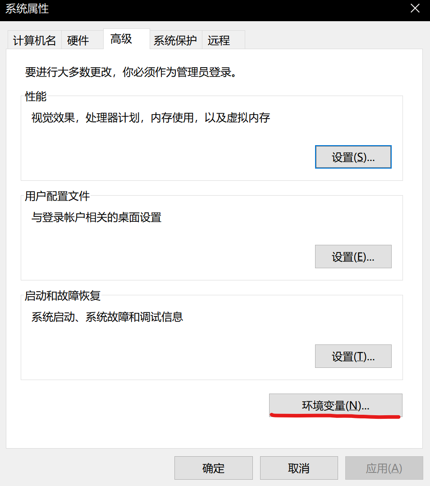
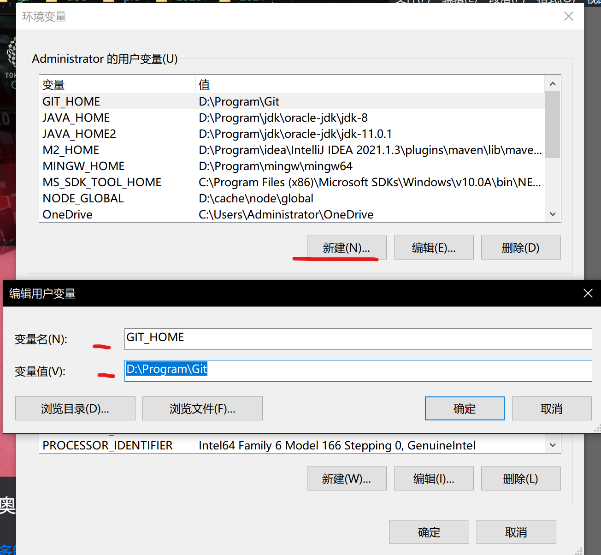
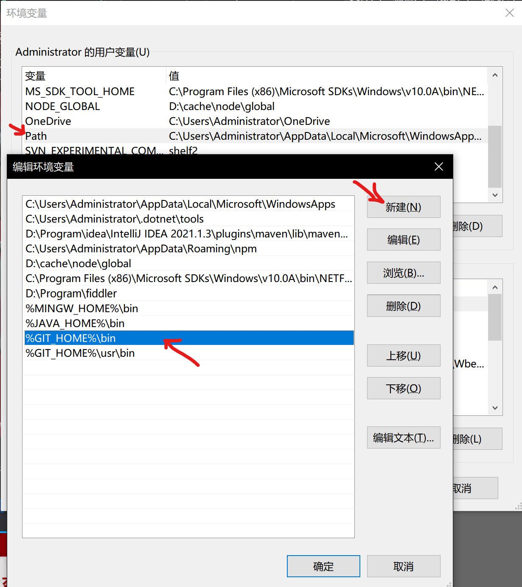
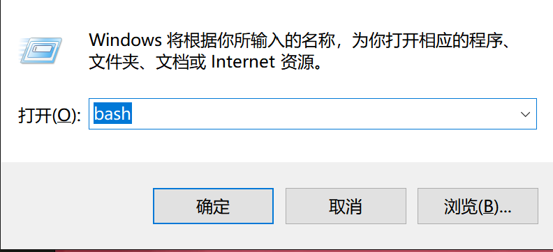
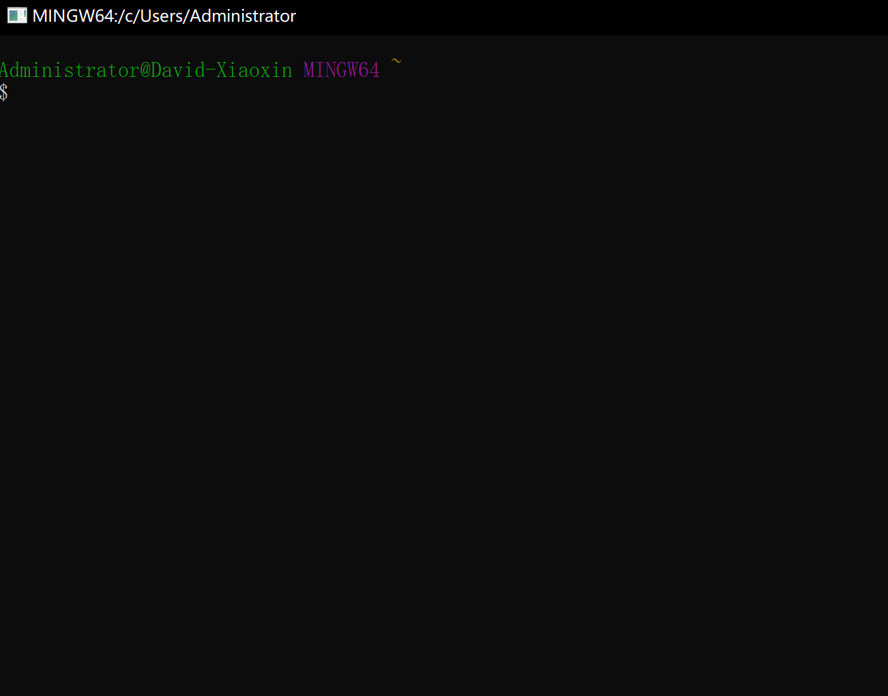
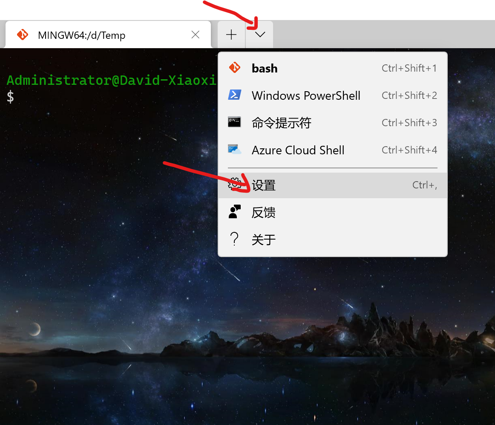
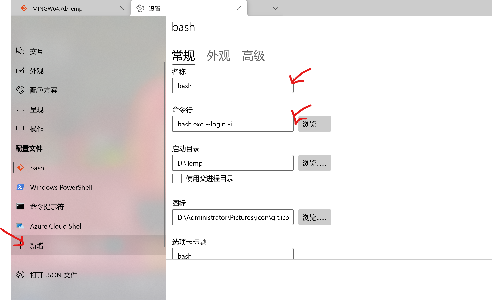
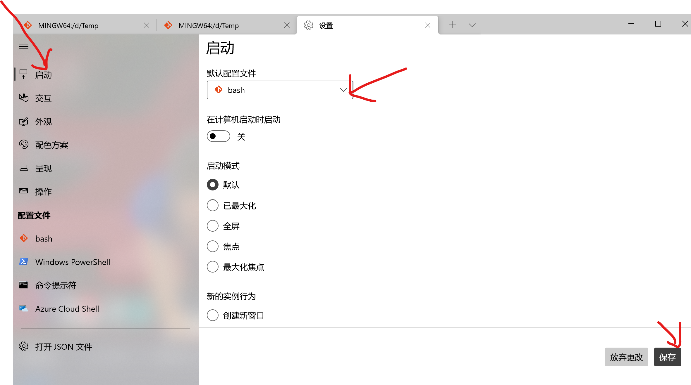

# Win10打造Shell环境

- 时间：2021.8.4

## 1.软件准备

- [Git-for-windows](https://git-scm.com/download/win)
- Windows Terminal （Microsoft Store可下载）

## 2.环境配置

- 将Git的家目录下的bin加入环境变量，步骤如下：
  1. 搜索环境变量
  2. 添加`GIT_HOME`环境变量，值为安装目录
  3. 新建环境变量
  4. 修改Path，增加bin和usr/bin，两行
  5. 此时，通过 Win+R，输入bash，可以打开git的bash界面

- 配置Windows Terminal
  - 添加启动命令
  - 顺便设置启动命令
  - 到这里已经可以使用shell的命令了

## 3.细节优化

- 更改背景，在 Windows Terminal》配置文件》bash》高级可以设置
- 添加快捷键，在 Windows Terminal 的快捷方式右键，添加快捷键。直接将图标拖动到桌面就可以创建快捷方式。
- 打造Vim，在 GIT_HOME/dev/vimrc 可以进行配置，等价于 linux 里面的 .vimrc
  - 用到了[plug.vim](https://github.com/junegunn/vim-plug)，可以直接搜索github查看教程。
- 远程登陆Linux
  - [使用ssh连接](https://gitee.com/help/articles/4181#article-header0)
  - 连接github和Linux原理一致，自行查找资料即可

