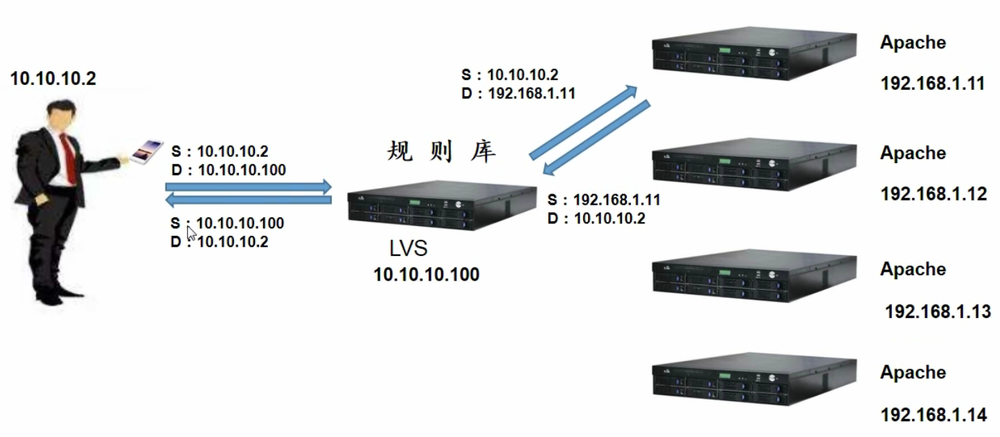
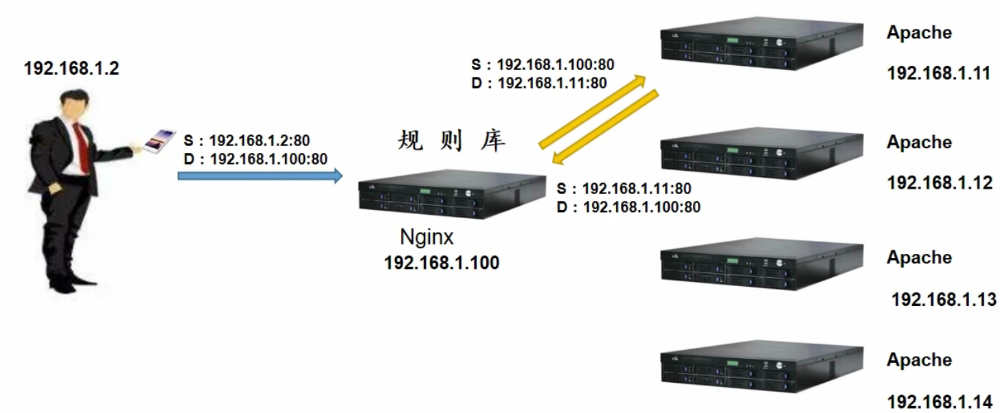

# 1.系统管理

## 1.1 基础知识

- [netcraft](https://searchdns.netcraft.com/)可以查询网站的一些信息，如操作系统，网站名称等

- MBR分区支持2.1TB，只能够有4个主分区， 可以把一个主分区分为多个逻辑分区。

  GPT是未来趋势。

- 格式化是为了选定文件系统，如EXT4、NTFS等 。默认Block大小4KB，每个INode大小128B。

- 将设备映射为文件，/dev/hda IDE硬盘接口， /dev/sda SATA接口。

  使用已经存在的空目录作为挂载点，可以对比windows的盘符。

  - 必须分区： 根分区、SWAP分区（可以对比虚拟内存，内核专用）
  - 推荐分区：/boot 1GB 
  - 常用分区：/home 、/www

- 修改IP配置，Redhat系列有 setup 命令可以辅助执行，一般通过vim修改配置文件也可以，记得打开onboot。

  - install.log 安装的软件包  
  - install.log.syslog 安装的操作记录
  - anaconda-ks.cfg  系统的信息

  > ├── bin -> usr/bin 已经合并了，普通用户的常用命令
  > ├── boot  启动的文件
  > ├── dev  设备映射文件
  > ├── etc  系统默认安装配置
  > ├── home  用户的家目录
  > ├── lib -> usr/lib 常用系统函数库
  > ├── lib64 -> usr/lib64
  > ├── media  挂载目录，比如光盘等
  > ├── mnt  挂载目录，U盘等
  > ├── opt  第三方软件安装位置，一般不用
  > ├── proc  内存数据
  > ├── root
  > ├── run
  > ├── sbin -> usr/sbin
  > ├── srv  服务数据
  > ├── sys  内存数据
  > ├── tmp  临时数据
  > ├── usr  重要系统资源
  > 		├──── local 建议源码安装包位置
  > 		├──── share 文档
  > 		├──── src 源码位置
  > 		├──── kernels 内核源码位置
  > └── var  临时文件
  > 		├──── lib 程序运行中数据保存位置
  > 		├──── log 日志
  > 		├──── spool 队列数据，如邮件，定时任务
  > 		├──── 服务运行后PID保存位置

## 1.2 常规操作

- 重启之前终止正在执行的服务，最好使用 sync 刷写数据后再重启，shutdown -r now

- 防火墙基本功能是数据包过滤，可以通过 IP、MAC、端口、协议类型、数据包数据进行过滤
  - 可以使用定时任务清除防火墙

- VirtualBox通过设置可以挂载 CD、U盘等，在centos里面可以通过挂载进行操作。

  - cd centos默认支持
  - VirtualBox默认支持USB1.0，2.0以上需要自己安装VirtualBox的扩展包
  - U盘 CentOS默认不认识exfat/NTFS等格式，需要自己安装相应依赖包
  - 可以开启自动挂载，但是容易出现问题。/etc/fstab 写错系统可能启动不了

- Linux驱动

  - 默认放在内核里面，数量少，速度快
  - 模块化，放在硬盘里，/lib/modules/3.10.0-1127.el7.x86_64/kernel

- 包管理 

  - RedHat系列采用RPM管理 ，Debian系列采用DPKG管理，rpm包依赖不能自动引入

    可以通过一个[数据库](www.rpmfind.net)查询某个函数依赖包

    所以在卸载的时候会安全一些，查询是基于本地的

  - 包命名规则 软件包名-版本-发布次数-平台.操作系统.硬件平台.后缀名，默认放在 /var/lib/rpm

- 手动编译安装

  - .configure 用于检测配置环境，自定义功能选项，生成Makefile
  - make编译，安装
  - 打补丁，diff
  - 脚本安装，

- 用户管理

  - 删除需要删除 用户|密码|组|组密码|家目录|邮箱
  -  /etc/default/useradd 放的是用户添加模板
  - --stdin 可以用于批量添加时候模拟shell输入

- 权限管理 
  - ACL：用于解决文件对于用户权限管理，使用命令 getfacl 和 setfacl，还是有风险的

  - sudo授权：命令  visudo

  - 特殊权限（危险）：

    SetUID （针对文件，执行过程中用户身份会变为程序所者的用户身份。）

    SetGID  （针对目录和文件）

    StickyBIT（针对目录，只能删除自己的文件）

  - chattr 限制root，配合lsattr

- 文件系统管理

  - 磁盘的基本结构（磁道，柱头，柱面，扇区等），固态

  - 硬盘常见接口 IDE接口（光驱使用）、SATA接口、SCSI接口、PCI-E、m2，内存条DDR3/4（后面的参数2400MB等）

  - 文件系统特性

    - 超级块，记录当前文件系统基本信息，dump2fs 可以查看，分区里面分为块组，

      块组里面有inode和数据

  - ll不会统计目录实际大小，使用 df 或者 du 进行查看

  - Buffer缓冲（加速写入），Cache缓存（加速读取），free命令可以查看，mkswap格式化

  - 可以对用户进行配额限制，针对普通用户在分区上的容量使用，可以限制文件个数等。

  - LVM可以动态调整空间大小

    - PV 物理卷：真正物理硬盘分区
    - VG 卷组：多个PV组成，可以来自不同硬盘的不同区
    - LV 逻辑卷：卷组是一个逻辑硬盘，必须分区后才能使用，该分区即逻辑卷
    - PE 物理扩展，保存数据基本单位，默认4MB，跨分区

- 引导与修复

  - 运行级别 0关机，1单用户，2不完整模式，3命令行，5图形 ，6重启。runlevel查看

  - /etc/rc.d/rc.local 开机执行，脚本可以放在rc.d里面

  - 引导程序在/boot/grub，开机启动后进入grub可以用e进入编辑模式

    单用户模式可以用于修改密码，启动时候进入单用户即可

- 服务管理

  - 基于RPM的管理有独立服务和xinetd（基本不用）
  - chkconfig 可以查看服务，ccentos7已经使用systemctl了
  - 可以使用连接放到/etc/init.d/下面，就可以被 systemctl 管理

- 系统管理

  - 进程管理 | 工作管理 | 定时任务 | 日志管理 | 

  

  

  

  

  

  

  

  

  

  

  

  

  

  

  

# 2 CentOS7 常用命令

- 出现wi-fi无法连接，提示Make sure you have a Wi-Fi adapter plugged and turned on
  - 执行ifconfig，只有virbr0；
  - 执行`dhclient -v`，可以看到一直使用 ens33
  - 关闭防火墙，使用xshell可以连接，上网

- 启动脚本
  - 将脚本存放的绝对路径+脚本全名追加到 /etc/rc.d/rc.local 文件最后。执行 `chmod +x /etc/rc.d/rc.local`
  - 将脚本移动到 /etc/rc.d/init.d 目录下，增加可执行权限

- 关闭防火墙
  - `systemctl stop firewalld.service  `，使用 `systemctl status firewalld.service  `查看关闭情况
  - `systemctl disable firewalld.service` 禁用防火墙

- 修改yum源

  - ```shell
     # backup
     mv /etc/yum.repos.d/CentOS-Base.repo /etc/yum.repos.d/CentOS-Base.repo.backup
     # update yum repo
     cd /etc/yum.repos.d/
     # wget http://mirrors.163.com/.help/CentOS7-Base-163.repo
     wget -O /etc/yum.repos.d/CentOS-Base.repo http://mirrors.aliyun.com/repo/Centos-7.repo
    # update cache
    yum makecache
    yum -y update
    ```

- 安装exfat

  ```shell
  yum install -y http://li.nux.ro/download/nux/dextop/el7/x86_64/nux-dextop-release-0-5.el7.nux.noarch.rpm
  
  yum install -y exfat-utils fuse-exfat
  ```

- centos中文识别

  ```
  LANG=zh_CN.UTF-8			# 修改全局变量LANG
  /etc/locale.conf			# 修改文件
  mount -t exfat -o iocharset=urf8 /dev/sdb1 /mnt/usb # 挂载U盘时候添加参数
  ```
  
- rpm命令

  ```shell
  #服务器最好安装证书，保证rpm包的安全性
  rpm -ivh  	#安装  
  rpm -Uvh	#升级
  rpm -e		#卸载
  rpm -qa		#是否安装
  rpm -qi		#包信息
  rpm -ql		#包命
  rpm -qR		#依赖性
  rpm2cpio #可以从RPM包提取文件
  yum			#rpm的在线安装
  ```

- 文件系统命令

  ```shell
  df -h 					#查看剩余空间情况
  du -Th 					#查看文件大小
  xfs_growfs /dev/sda1 	# xfs文件系统
  dumpe2fs /dev/sda1 		# ext2/3/4
  fsck -y /dev/sda1		# 开机自动执行
  stat					# 文件信息
  
  #########添加磁盘#########
  fdisk  -l  				#查看硬盘信息 n新建，p查看，
  mkfs -t ext4 /dev/sdb1 	#不能调整块大小，使用mke2fs可以设置
  /etc/fstab				#自动挂载，改错可能导致开不了机，问题在于需要拿到物理机，手动更改
  ### GPT分区 
  parted /dev/sdb			#分区表
  >	mklabel gpt				#GPT
  >	mkpart					#创建分区
  >	resize					#可以扩容
  mkfs					#创建文件系统
  
  dd 						#复制磁盘文件
  ### LVM
  pvcreate | pvscan | pvdisplay 				#PV的操作，物理卷
  vgcreate | vgscan | vgdisplay | vgextend 	#卷组的操作
  lvcreate | lvdisplay | lvresize			 	#逻辑卷的操作
  resize2fs									#让df刷新
  
  ```

- shell操作

  ```shell
  history 			#历史调用
  !n 					#重复执行第n条
  !!					#上一条	
  !$ 					#上一条的参数
  cmd >> file 2>&1	#记录错误日志
  cat << EOF			#输入重定向
  ()					#子shell执行 
  {}					#当前shell执行
   watch -d -n 1 cmd	#实时监控命令输出
  ```
  
- awk | sed | 

  ```shell
  awk 'BEGIN{} condition{action}' $(cmd) 
  		#  $0整行 $n某一列 NF列数 NR行号 FS分隔符
  
  sed option 'action' file 
  		#d删除，p打印，a追加，c行替换，s字符串替换
  		#-i修改，-n只显示修改行，-e执行多个命令
  
  test 	#-d目录 -e存在 -f普通文件 -L链接文件 -rwxugk权限 
  		#-n字符串不空 -z字符空 ==内容相等
  		#-a -o  -not  -eq -lt 等逻辑运算
  		
  		
  sort 	#-n数字排序，-k 3,3第三列排序，
  		#-t分隔符，-r反序，-u去重，-f忽略大小写，-b忽略空白
  ```

- 进程

  ```shell
  ps aux | el	#全部进程，静态
  top			#实时查看 -p进程id，-b -n 1重定向到文件， 
  pstree		#-p
  kill | killall | pkill -9 -t	#杀死进程|踢掉用户
  
  cmd & | ctrl-z					#放入后台
  fg | bg	| jobs | nohub &		#查看前|后台
  
  vmstat 1 3						#系统资源查看
  dmesg							#开机内核检测
  free |  lsb_release -a			#内存信息
  /proc/	| uname | uptime		#有各种设备信息，CPU，内存等
  ```

- 定时任务

  ```sh
  at | atq | atrm	#一次执行，-c查询任务 ，/etc/at。allow  用户白名单|查询
  cron			#crontab -e执行任务
  anacron			#开机后执行关机期间的定时任务
  
  /var/log		#目录下日志文件，很多都是二进制文件
  rsyslogd		#配置日志等级，输出目录
  /etc/logrotate.conf			#日志轮替
  ```

  

# 3. 集群管理

## 3.1 基本概念

- 一组协同工作的服务器，各有分工表现为一个整体。应用有高可用集群（HAC）、负载均衡集群（LBC）、高性能运算集群（HPC）

### 3.1.1 LBC

- 通过反向代理负载均衡到各个服务器，反向代理有  Niginx、HAPROXY、LVS、硬件设备等

- 四层工作逻辑，集群数量过多瓶颈会在LVS，此处的LVS是在公网，服务器在私网。一次TCP，LVS只是修改一下IP地址而已

  

- 七层工作逻辑，两次TCP

  

### 3.1.2 LVS工作层级

- NAT模式：LVS充当网关连接公网和私网 ，服务器在私网，地址转换两次；

  TUN模式：连接的都是公网，封装了两层；

  DR模式：处于同一个局域网，LVM负责转发并将数据包添加DMAC，转发给目标服务器，目标服务器响应指向真实网关

### 3.1.3 LVS DR构建

- DR需要两块网卡，需要修改ARP响应级别

## 3.2  调度算法

### 3.2.1 通用算法

- RR轮询；WRR加权轮询 

- SH源地址散列：IP相同发送给同一个服务器；

  DH目标地址散列：将同一个目标地址的用户请求发送给同一个服务器

- 动态算法 

  - LC最少链接：将新的丽娜姐请求分配个连接数最少的服务器
  - WLC加权最少链接：（活动链接*256+非活动链接）/权重 
  - SED最短期望延迟 ：（活动链接+1）*256/权重 
  - NQ永不排队 ：特殊的SED算法，无需等待
  - LBLC特殊的DH算法：考虑缓存命中率又考虑性能
  - LBLCR LBLC+缓存：尽可能提高负载均衡和命中缓存的折中方案

### 3.2.2 LVS持久化连接

- 类似 SH 算法，优先于通用算法。具有时间限制。

- PCC持久客户端连接：IP相同，分配的服务器相同

  PPC持久端口连接：同一个服务定位到同一个服务器

  PFMC持久防火墙标记连接：对于同意客户端对指定端口，始终定向到同一RS

## 3.3 高可用集群

### 3.3.1 Keepalive原理

- 支持LVS，使用VRRP虚拟路由冗余协议，一主多备，共用一个IP地址
- 


