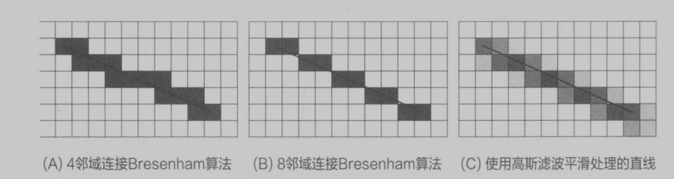

# 学习OpenCV3 笔记

- 笔记时间：2022.1.11
- 书籍作者：Adrian Kaehler 、Gary Bradski

## 第1章 概述

- 开源的计算机视觉库

- 计算机视觉：将图像/视频转换为一种决策或新的表示。
- 图像对于计算机来说就是一堆栅格化的数据，如何处理数据是一个问题
  - 额外场景信息可以进行建模，也会带来噪声
  - 噪声可以采用统计的方法处理，边缘检测会更加简单
- 

## 第2章 OpenCV初探

-  opencv.hpp 包含所有头文件

- 显示图片：img 类型是 cv::Mat，通用的图像数据结构。Mat资源会自动释放，窗口需要手动关闭，避免内存泄漏。

  ```python
  # 展示一幅灰度图片，按键则结束程序
  def showImage():
      img = cv.imread("./img/1.jpeg", cv.IMREAD_GRAYSCALE);
      cv.imshow('image',img)
      cv.waitKey(0)
      cv.destroyAllWindows()
  ```

- 视频播放则需要一帧一帧显示

  ```python
  # 需要注意的是，这里的帧颜色是BGR不是RGB，转换的时候一定要注意颜色问题
  # 延迟使用33ms是为了能匹配正常播放速度（30FPS）
  def showVideo():
      cap = cv.VideoCapture("./video/test.mp4")
      while cap.isOpened():
          ret, frame = cap.read()
          # 正确读取帧，ret为True
          if not ret:
              print("Cannot receive frame exit")
              exit()
          gray = cv.cvtColor(frame, cv.COLOR_BGR2GRAY)
          cv.imshow("frame", gray)
          if cv.waitKey(1) == ord('q'):
              break
      cap.release()
      cv.destroyAllWindows()
  ```

- 简单变换

  - 平滑处理：高斯模糊，降采样

    ```python
     # 高斯模糊，第二个参数是高斯核的宽高，第三个参数是坐标轴的标准差
     cv.imshow('blur', cv.GaussianBlur(img, (5, 5), 15))
    ```


## 第3章 了解OpenCV的数据类型

- 主要有三种类型，，，大型对象（Mat、SparseMat）
- 基础类型，C++原本的基本类型
  - cv::Vec\<\> 固定向量类，维度不可以超过9，用于特定大小向量加速处理（如颜色，坐标等）
  -  cv::Point 通过成员访问，通过后缀可以知道数据类型，成员个数（2D、3D）
    - Rect、Scaler、RotatedRect等都用到该类
  - cv::Matx 固定大小矩阵，

- 辅助对象（如垃圾收集指针等）
  - cv::TermCriteria 终止条件、cv::Range 连续整数序列
  - cv::Ptr 智能指针，引用计数算法，线程安全
  - cv::DataType 传递特定数据类型
  - 还有一些数学辅助计算、异常、内存分配、线程数
  - 很多都是基于模板的实现，感兴趣可以了解STL

## 第4章 图像和大型数组类型

- 动态可变存储：Mat是稠密数组，内含一个N维数，和内存区域，通过公式定位元素 
- 求逆具有三种接口（LU分解、Cholesky分解、SVD）
- 稀疏矩阵（直方图等）：内部是哈希表

## 第5章 矩阵操作

- 用到很多线性代数的操作，需要学习相关知识再看API，比如求逆、马氏距离、行列式的值等

## 第6章 绘图和注释

- 注意，OpenCV的颜色是BGR

- 线条和填充多边形，支持亚像素对齐，使用的是位移操作。至于其他图形绘制，查看API使用即可。

  

## 第7章 OpenCV中的函数子

- 


## 附录

- [高斯模糊原理](https://www.ruanyifeng.com/blog/2012/11/gaussian_blur.html)：数据平滑处理
  - 模糊可以理解成每一个像素都取周边像素的平均值。模糊半径越大，数值越平滑
  - 简单取平均值不合理，使用正态分布取权重。需要使用二维的正态分布函数，
  - 掩膜（Mask）：掩膜就是两幅图像之间进行的各种位运算操作，高斯掩膜就是将对应坐标的概率值填入的二维表，需要均一化

- [图像滤波](https://www.ruanyifeng.com/blog/2017/12/image-and-wave-filters.html)：目的去除噪音，识别图像特征，不能损坏图像轮廓和边缘
  - 假如把RGB三种颜色单独抽出来，每一行画图，会发现是一条曲线。**图像本质上就是各种色彩波的叠加。**
  - 单位时间内波动的次数称为频率，色彩变化剧烈的地方波动大。
  - lowpass效果是模糊，highpass效果是提取边缘

- 图像金字塔：分辨率不同的同一张图，用于放大和缩小
  - 高斯金字塔：降采样，删除偶数行和偶数列，大小变为原图的1/4
  - 拉普拉斯金字塔：根据高斯金字塔上采样

