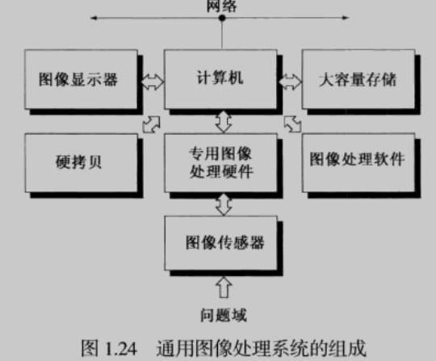
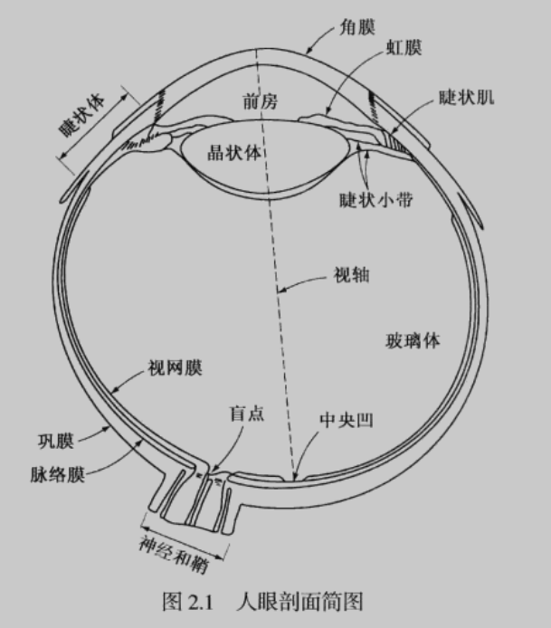
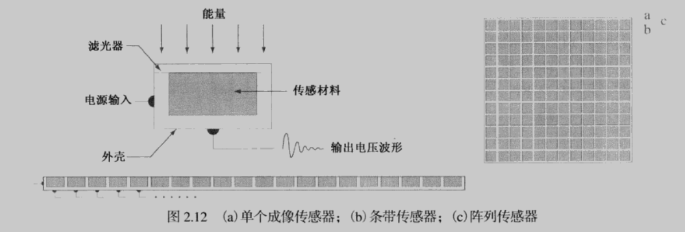
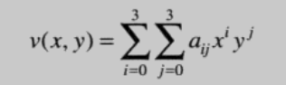

# 数字图像处理

- 书籍作者：Rafael C.Gonzalez
- 笔记时间：2022.1.27

## 第1章 绪论

### 1.1 什么是数字图像

- 一副图像可以定位为一个二位函数f(x,y)，值称为图像在该点的强度或灰度。

  当定义域和值域是有限的离散数值时，称为数字图像。

  数字图像的基本组成单位是像素。

- 图像处理和计算机视觉没有明确界限，使用低级、中级、高级操作进行区分计算处理
  - 低级处理：降噪、锐化、对比加强等，输入和输出都是图像
  - 中级处理：图像分割、特征提取等
  - 高级处理：视觉相关的认知，物体识别等

### 1.2 数字图像处理的起源

- 报纸通过海底电缆进行图片传输，需要将图片进行编解码

### 1.3 使用数字图像处理领域的实例

- 医学（CT、X光等等）、天文观测、紫外波段成像（荧光成像）、红外波段成像（遥感、显微镜等）、可见光（自动视觉检测）
- 微波波段成像（雷达）、无线电波波段成像（医学天文学）
- 还有  声波成像（海底地图绘制、产品质量检测、B超）、投射式电子显微镜（TEM）

### 1.4 数字图像处理的基本步骤

- 图像获取，包含一些预处理，比如缩放
- 图像增强，对图像进行某种操作，使其结果在**特定**应用中比原始图像更适合处理。
  - 图像复原倾向于概率模型为基础
  - 彩色图像处理
  - 小波是以不同分辨率描述图像的基本概念
  - 形态学处理涉及提取特征分量
  - 图像分割、识别

### 1.5 图像处理系统组成

- 

## 第2章 数字图像基础

### 2.1 视觉感知要素

- 数字图像处理建立在数学和概率公式表示的基础上，但人的直觉和分析会在技术选择起关键作用

- 视锥细胞对颜色高度敏感，分布在中央凹；视杆细胞对亮度敏感，中央凹两侧对称分布

  低照明水平主要杆状体处理，高照明水平主要有锥状体处理，大脑会对图像进行”脑补"，从而产生错觉（自动增加对比度，自动连接图形）

  

- 没有颜色的光称为单色光/无色光，唯一属性是强度

  彩色光具有：发光强度、光通量和亮度。

### 2.3 图像感知和获取

- 

- f(x,y) = i(x,y) r(x,y)，i表示入射到场景的光源总量，r表示物体反射因子。一般要求f值为正，特殊情况下可以用负数表示反方向（雷达）

### 2.4 图像取样和量化

- 模拟信号→数字信号，对**坐标**进行数字化称为**取样**，对**幅值**进行数字化称为**量化**，量化精度强烈依赖于取样信号的噪声

- 数字图像坐标原点位于左上角，向下为x轴，向右为y轴。灰度级数一般取2^k^，称为k比特图像
- 图像内插是基本的图像重取样方法。
  - 最近邻内插法：在放大后的网格里填充原图中最接近的像素，会产生边缘失真
  - 双线性内插：用四个最近邻去估计该位置的灰度 v(x,y) = ax+by+cxy+d
  - 双三次内插：

### 2.5 像素间的一些基本关系

- 相邻像素：上下左右，称为 p的四邻域，N~4~(p)

  ​					四个对角相邻元素，N~D~(p)

  ​					两者合起来称为8邻域，N~8~(p)

-  邻接性，V定义邻接性的灰度值几何
  - 在二值图像中，具有1值的像素归于邻接像素
  - 灰度图中V包含更多元素
  - 4邻接：q在N~4~(p)中，则具有V中数值的pq是4邻接。8邻接同理
  - m邻接：q在N~4~(p)  或者    q在N~D~(p)并且N~4~(p)和N~4~(q)交集为空
  - 通路：从一个像素p经过相邻像素到q的点的序列，根据邻域类型称为 k通路（k=4，8，m）
  - 连通：在像素子集S中，任意元素存在一个通路，则称为p，q在S中是连通的
  - 连通分量：S中连通到该像素的像素集，如果S仅有一个连通分量，则称S为连通集
  - 区域：如果R是连通集，如果两个区域联合形成一个连通集，称为相邻区域
  - 前景：图像中包含的不连通区域的并集，前景的补集称为背景
  - 边界：是点的集合，这些点与R的补集中的点相邻，需要指定连通类型，有时称为内边界
- 距离度量
  - 欧氏距离    ((x-i)^2^ + (y-i)^2^ )^1/2^,半径为i的圆
  - 城市街区距离 D~4~    |x-i|+|y-i|，半径为2的菱形
  - 棋盘距离D~8~    max(|x-i|,|y-i|)，半径为2的正方形

### 2.6 数字图像处理所用数学工具介绍

- 矩阵的加法和乘法

- 线性操作：H[f(x,y)] = g(x,y),f和g都是图像

  - 算子H如果满足线性操作（加法和数乘）则称为线性算子

    H(af+bf) = aH(f)+bH(f) = ag+bg，比如求和算子是，求最大值算子则不是

- 算术操作：

  - 

## 附录

### 概念定义

- 主观亮度：进入人眼的光强的对数函数
- 亮度适应：视觉系统不能同时在一个范围内工作，通过改变整个灵敏度进行适应
- 同时对比：感知区域的亮度跟区域周围背景相关
- 灰度级：从黑到白的单色光的度量值范围，单色图像称为灰度图
- 发光强度：光源流出能量的总和，单位W
- 光通量：观察者感受到的能量，单位流明（lm）
- 亮度：光感知的主观描绘子，不能度量，体现强度的无色概念，描述色彩感觉的参数之一
- 取样：模数转换过程中，对坐标进行数字化
- 量化：对幅值进行数字化
- 动态范围：灰度跨越的值域，系统最大可度量灰度与最小可检测灰度之比
- 对比度：图像中最高和最低灰度级的灰度差
- 饱和度：超过该值的灰度级将被剪切掉的最高值
- 分辨率：空间分辨率是图像中可辩别最小细节的度量，用每单位距离线对数或者每单位距离像素数描述（DPI）

### 参考

image process online （demo.ipol.im)