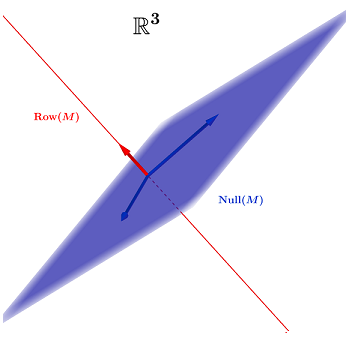

# 线性代数 - 理解

- 笔记时间:2022.03.29

## 1 矩阵乘法

### 列空间

- 这个跟MIT的线性代数一致,记为 C(A)

  **Ax=b**,假如b在A的线性空间里,那么一定存在x使其有解

  假如b在C(A)之外,那么寻找**Ax'**使其尽可能靠近b,显然b在列空间的投影**b'**是最接近的点

### 行空间

- 将列空间转置 (Ax)^T^,记为C(A^T^)
- 应用即为高斯消元法,不会改变行空间,空间内的线性组合还是在空间内

### 零空间

- 也称为映射的核,关注的是 Ax=0 的解形成的空间,记为N(A)

- 因为 Ax = 0 ,那么意味着 A 中的每一行 A~i~ 与  x 的点乘结果都为零,

  说明由A形成任意行向量与x的乘积为0

  所以行空间与零空间垂直 C(A^T^) ⊥ N(A)

  

  

### 左零空间 

- x^T^A = 0 ==> A^T^y = 0

- 行空间与零空间正交;列空间与左零空间正交;

- | 关注点 | Ax (m维空间)   | x'A / A'y (n维空间) |
  | ------ | -------------- | ------------------- |
  | b      | 列空间 C(A)    | 行空间 C(A')        |
  | x      | 左零空间 N(A') | 零空间 N(A)         |

- 

### 内积与外积

- 内积/点积: 行乘列

- 外积:矩阵可以拆分为多个外积之和

  

- 矩阵可以分解为若干个秩一矩阵之和

  

### 矩阵乘法

- **矩阵乘法**的作用是线性变换,将一个向量变换为另一个向量，效果与函数相同 

  以二维坐标为例,相当于旋转+缩放

  - 当取变换为 [[1,1],[0,1]] ,产生了缩放 

    

  - 当变换为[[1,1],[-0.2,1]],发生了缩放和旋转

    

- 在某些线性变换中,有某些向量只发生缩放而没有发生旋转,这些向量称为**特征向量,**缩放因子称为**特征值**
  - 在前面图里,可以发现第一幅图验证x方向的边并没有发生旋转,那么这个方向的向量就是特征向量
  - 假如矩阵作用只发生旋转,那么特征值为复数

## 2 傅里叶级数

### 傅里叶变换

- **傅立叶变换**提供了一种新的宇宙观——从**时域**到**频域**的**映射**，在这两个不同的时空中，波具有同样精确的刻画程度，因为频域按照频谱进行了拆解，往往比我们熟悉的时域更直觉更本质。
- 

- 托勒密的轮子 -- 使用多个圆尝试拟合曲线

- 傅里叶 -- 任何函数，不论连续与否，均可被展开为一系列Sine函数之和

  数学中，**泰勒级数**将任何函数表示为无限的单项之和；**傅里叶级数**可将任何周期函数表示为正弦 / 余弦函数之和

  

- 

  - 不同周期的cos/sin正交
  - 使用函数内积的概念扩展至连续函数
  - **傅立叶系数的本质是函数在正交基上的投影**

### 推导

#### 求解 a~k~ 和 b~k~

#### 系数分解

- 

#### 证明不同周期的正余弦正交 

### 复数形式

- 欧拉公式
- 

- 

## 3 希尔伯特空间

### 1 内积与内积空间

- 
  - 如果内积值为0,那么两个相控正交.

- 内积空间是具有内积运算的线性空间,内积空间具有以下属性
  - 第一参数线性: <x+y,z> = <x,z> + <y,z>,还有数乘
  - 共轭对称 
  - 正定 <x,x> ≥ 0

### 2 希尔伯特空间

- 函数内积替代向量内积 

  

## 4 正交

### 正交向量

- 检验其内积是否为0
- 

- 毕达哥拉斯定理: 假如x⊥y,那么 ||x-y||^2^ =  ||x||^2^ +  ||y||^2^
- 余弦定理: 用到了[数量积公式](https://baike.baidu.com/item/%E5%B9%B3%E9%9D%A2%E5%90%91%E9%87%8F%E6%95%B0%E9%87%8F%E7%A7%AF/22173525?fr=aladdin)

### 正交基

- 长度为1,两两垂直的积

- Gram-Schmidt正交化

  

### 正交子空间

- 由前面矩阵乘法部分可知,行空间和零空间相互垂直

- 

- 线性代数基本定理第一部分是矩阵四个基本空间的维度关系；

  线性代数基本定理第二部分是矩阵四个基本空间的正交关系；

  线性代数基本定理第三部分是矩阵四个基本空间基的关系

### 正交矩阵

- 正交矩阵Q的列是R^n^的标准正交基
- Q^T^Q = I  ,QQ^T^ =I ==> Q^T^ = Q^-1^
- P^2^ = Q^T^Q Q^T^Q  = Q^T^Q  = P

### 正交函数 

- **每个单位内的变化都一致。**由此，正交性的物理意义也显而易见：**每个单位内的变化的之和为0。**
- 

## 5 特征值 奇异值

### 对角化

- 

#### 证明

- 

#### 对角化条件

- 
- 

### 矩阵指数

- 

- 

### 复数矩阵

#### 复数性质

- 

- 

#### Hermitian矩阵 

- 

#### 酉矩阵

### 特征值与特征向量的几何意义

#### 斐波那契数列

- 特征值表示矩阵的缩放比
- 
- 

- 

------

#### 微分方程 

- 特征向量和特征值在**微分方程**中的应用。
- **特征向量**作为**分界线**将平面分为不同区域，初始条件位于不同区域决定了不同发展轨迹。
- 

------

#### 马尔可夫矩阵

- 例：一个城市的人口在城区和郊区之间迁移，每年城区的20%人口会转到郊区，郊区10%的人口转到城区
- 

- 

------

#### 图论中二部图判断

- 图论中的**二部图**(Bipartite Graph)在机器学习中经常会用到，它是指一个图的节点可以被分成2个相互独立没有交集的部分(U,V)，图中的每条边(Edge)所连接的节点都分别属于这两个不同的部分，同一部分的任何节点间不存在边。

- 1980年代，Hinton等人就提出了[玻尔兹曼机](https://zhuanlan.zhihu.com/p/277374208)，因为在连接上没有限制，加上那时候的算力有限，导致玻尔兹曼机很难被广泛应用，后来，推出的**受限的玻尔兹曼机**(Restricted Boltzmann Machine， RBM)就是做了类似于上面社交网络的限制，可用性大幅度上升，今天火红的神经网络深度学习的鼻祖源于2006年老爷子的三篇文章，RBM就位列其中

- 利用特征值快速确定是否为二部图
- 

- 

------

### 特征值的物理意义

#### 弹簧

- 

- 当不考虑阻尼,设k=m=1,可以看到图上方是一个圆,此时特征值为虚数,表示旋转

- 当增大k,加速度会变大,此时变成椭圆,依旧是旋转

- 当考虑阻尼,此时变成螺旋状

  

#### 电路

- 

- 

- 

### 奇异值与特征值

- **奇异值**与**特征值**都被用于描述矩阵作用于某些向量的标量，都是描述向量模长变化幅度的数值
  - **特征向量**描述的是矩阵的方向**不变作用**(**invariant** action)的向量；
  - **奇异向量**描述的是矩阵**最大作用**(**maximum** action)的方向向量
  - 

- 

## 6  投影 逆

### 投影

- A^T^A 是对称矩阵,可逆矩阵(假如A可逆)
- P = A(A^T^A)^-1^A^T^ ,P^T^ = P

- 

- 

------

### 逆矩阵

-  假如A存在左逆和右逆,那么它们相等且唯一
  - 证明 BA = I,AC = I ===> BA=AC ==> BAC = ACC ==> A=C
  - AB = I, AC = I ===> AB-AC = 0 ==> A(B-C) = 0 ==> B=C
- Ax = 0 有非零解,A不可逆 
  - 证明:  假设Ax=0存在非零解,并且A可逆, 那么A^-1^Ax =0,当x取非零解,A^-1^A = 0,矛盾
  - |A| = 0,A不可逆
  - A线性相关,A不可逆
- (A^-1^)^T^  = (A^T^)^-1^

### 正交矩阵

- 

- 旋转矩阵

- 置换矩阵
- 反射矩阵

### 正交化

- 由前面投影可知 e ⊥ p,也就是 (b-p)⊥ p,那么只要取得e就是跟p正交得向量
- Gram-Schmidt:
  - A = a,第一个矢量方向不变
  - B = b - b^T^A/(A^T^A) A
  - C = c - c^T^A/(A^T^A)  A - b^T^B/(B^T^B)  B
  - 最后归一化: a = A/||A||

### 正定矩阵

- **有一部分很特别的对称矩阵，它们的特征值都大于0，我们叫它们正定矩阵**
- **正定矩阵的子矩阵行列式大于 0** 。因为这些子矩阵都位于原矩阵的西北角，所以它们又叫做“NW minors”,NW代表   North West
- 

- 

### 相似矩阵

- 

## 7 矩阵分解

### 1 LU分解

- 高斯消元法改变了矩阵的列,但是不影响组合方式

- 通过一系列的初等矩阵可以把系数矩阵A变成三角矩阵U 

  ===> EA = U,E表示一系列的初等变换(行的线性组合)

  ===> E^-1^EA = E^-1^U ,即是LU分解,L是下三角矩阵,U是上三角矩阵

- 因为L是由初等矩阵(下三角矩阵)乘法得到,所以其对角线必定为1
- LU的U还可以分解为 U = DU,D表示对角阵, A = LDU,U是初等列变换
- 当A是对称矩阵时候,L和U互为转置,S = LDL^T^

### 2 QR分解

- 在6中可以知道投影矩阵 P = A(A^T^A)^-1^A^T^,假如A是正交矩阵的话,那么P=AA^T^,将这种类型的A记为Q

- 

- 等效于Gram-Schmidt分解

  

### 3 对角化

特征值章杰

### 4 正交对角化

复数矩阵

### 5 奇异值分解

- A  = UΣU^T^ (正交 对角  正交)
- 

## 8 行列式

### 性质 - 定义

- 克莱姆求解Ax=b就是利用构造特殊矩阵和行列式

  

- 面积符合行列式的3个性质,体积也是

## 笔记来源参考

- [特征向量与特征值的几何意义](https://zhuanlan.zhihu.com/p/353774689?ivk_sa=1024320u)
- [发现矩阵内禀性质](https://zhuanlan.zhihu.com/p/354102331)
- [解奇异值以及与特征值的区别](https://blog.csdn.net/qq_32742009/article/details/82286434)
- [傅立叶系列](https://zhuanlan.zhihu.com/p/350616936)

- [MIT 18.06](https://zhuanlan.zhihu.com/p/355019543)