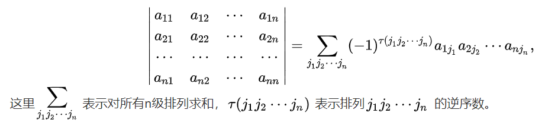

# 线性代数 学习笔记

- 笔记时间：2021.12.06
- 参考[网址](https://open.163.com/newview/movie/free?pid=DEV13EVV9&mid=KEV13EVVQ)

## 1 方程组的讲解

- $$
  X
  \left[
  \begin{matrix}
  2 \\
  -1
  \end{matrix} 
  \right]
  +
  Y
  \left[
  \begin{matrix}
  2 \\
  -1
  \end{matrix} 
  \right]
  =
  \left[
  \begin{matrix}
  0 \\
  3
  \end{matrix} 
  \right]
  $$

  Linear Combinatiion of Columns(Vector)

  - 从行视图看可以认为是两条线的交点
  - 从列视图看可以认为是两个向量的加法

- 提出问题，对于AX=b（A是3x3矩阵，X是3维向量）是否对任意b都有解？换句话说，对于三个向量的线性组合能够充满整个三维空间？

  - 比如三个向量处于同一个平面就不能
  
- 使用向量的方式来理解矩阵点乘

## 2  矩阵消元

- 
  $$
  \left[
  \begin{matrix}
   1 &2 &1 \\
   3 &8 &1 \\
   0 &4 &1
  \end{matrix}
  \right]
  X=
  \left[
  \begin{matrix}
   2  \\
   12 \\
   2 
  \end{matrix}
  \right]
  $$
  
- 消元法目的是将系数矩阵变成上矩阵（沿着对角线看成主元，逐个消除，主元不能为0）

  - 第一行 【1 2 1】，主元为第一个1的位置，不为零
  - 第二行 【3 8 1 】，主元为8的位置，但是第一个分量不为零，所以需要将其变为零，减去3倍的第一行，获得第二个主元为2
  - 第三行  【 0 4 1】，主元为1 的位置，第二个分量不为零，跟第二行做运算，可以将第一，第二分量消0，得到第三个主元为5
  - 使用增广矩阵进行上述的运算（也就是把目标列合并到系数矩阵里面），从后往前回代求出解
  - 注意
    - 这个过程规模每次都变小一次，过程重复，非常适合递归
    - 当主元为零的时候，使用行交换进行处理，假如无论如何交换还是无法满足主元不为零，那么消元法就会失效

- 消元矩阵

  - 记录变换操作的矩阵，比如某一行乘2。假定上面计算表达式2中X是列向量【1，2，3】，那么我们可以看成 列向量的线性组合（右乘，左乘则是行向量的线性组合）

  - $$
    \left[
    \begin{matrix}
     1 &2 &1 \\
     3 &8 &1 \\
     0 &4 &1
    \end{matrix}
    \right]
    \left[
    \begin{matrix}
    1\\
    2\\
    3
    \end{matrix}
    \right]
    =
    1
    \left[
    \begin{matrix}
    1\\
    3\\
    0
    \end{matrix}
    \right]
    +2
    \left[
    \begin{matrix}
    2\\
    8\\
    4
    \end{matrix}
    \right]
    +3
    \left[
    \begin{matrix}
    1\\
    1\\
    1
    \end{matrix}
    \right]
    $$

    

  -  所以关于矩阵的行变换就是左乘消元矩阵，消元矩阵基于单位矩阵进行变换（简写E，称为初等矩阵），每一步消元都会产生一个初等矩阵，由于矩阵乘法满足结合律，所以可以将多个初等矩阵合并为一个

  - 交换两行的初等矩阵称为置换矩阵（简写P） 

  - 提出 如何处理消元矩阵才能得到单位阵？引出逆矩阵定义。  

## 3 矩阵乘法和逆

- 矩阵乘法 AB=C，其中A为mxp矩阵，B为pxn矩阵
  $$
  C{_i}{_j} = \sum_{k=1}^{p} A{_i}{_k}B{_k}{_j}
  $$
  
- 矩阵的分块乘法，[证明](https://zhuanlan.zhihu.com/p/133330692)就是上面定义的分段加法

- 由矩阵的分块乘法可以证明 AB=C，C是ΣA~rowi~ B~coli~

- 由分块乘法可以证明 Gauss-Jordan 消元法来获得逆元，证明 E[A , I] = [I ,A^-1^]，因为EA=I，那么E=A^-1^。

## 4 矩阵的LU分解

- AB B^-1^A^-1^ = I ，C=AB，C^T^=B^T^A^T^，AA^-1^=I=(A^-1^)^T^(A)^T^

- 由高斯消元法可以得到 EA=U，再由可逆矩阵，可以获得 A=LU=LDU，那么L是E的逆。

  如果不存在行交换，消元乘数可以直接写进L，EA=U消元复杂度是O(n^3^)

## 5 转置、置换、向量空间

- 置换矩阵用于行交换，假如允许行交换的话，对于可逆矩阵A，PA=LU

- P都是可逆的，经过一定步骤可以还原为单位矩阵；

  置换矩阵组成群，运算结果都在置换矩阵里，P^-1^=P^T^，n阶方针具有 n! 个置换矩阵

- 转置矩阵，对称矩阵中转置矩阵等于自身，A^T^=A，A^T^A总是对称矩阵

- 向量空间，对于向量的线形组合（加法和数乘）封闭的所有向量组成的集合。

  子空间，比如 线 是 平面的一个子空间；

- 矩阵的列向量的线性组合构成一个向量空间，称为 C(A)，列空间

## 6 列空间、零空间

- 子空间的交集也是子空间
- 列空间 和 Ax=b 有解联系。当b属于列空间向量时，Ax=b有解。
- Ax=0，x的解向量是否构成一个子空间？YES，
  - 假定x和y分别为非零解，那么Ax+Ay=A(x+y)=0，满足 加法封闭
  - A(cx) = cAx = 0，c为非零常数，满足 数乘封闭
- 子空间必须经过原点，

## 7 主变量、特解

- 秩就是矩阵主元个数，AX=0，利用消元法，确定关键列和自由列，获取特解。
- 简化阶梯矩阵，使主元为1，所在列向量只有主元分量。
- R=[I,F]，Rx=0时，x可以取值列向量[-F,I]，这里的X称为零空间矩阵

## 8 Ax=b的可解性、解的结构

- 使用增广矩阵，因为b的行操作必须和系数矩阵保持一致。

- 可解性：Ax=b有解时，b必须满足的条件。

  - 当b属于A的列空间时

- 解步骤

  - 找到特解，将自由变量设为0，解出主变量
  - 添加上零空间矩阵

- Ax=b解结构：特解与零空间解的线形组合。图像理解，Ax=0相当于平面或者直线，通过b点。

  子空间需要经过原点，解空间则不一定。

- 列满秩：没有自由变量，零空间N(A)只有一个零向量，那么只有一个Ax=b特解
- 行满秩：对任意b有解，解结构是特解和零空间矩阵线性组合
- 总结： r=m=n，有且只有一个解；r=n<m，0或者1个解；r=m<n，无穷；r<n , r<m，0或者无穷

## 9 线性相关、基、维数

- Ax=0，A为mxn矩阵，m<n，总是有解，因为存在自由列。
- 线性无关：一组向量的线性组合不为0向量，系数不为0。
- 基：一组向量能够生成子空间并且线性无关。
- 维数：该子空间基的个数，等于秩

## 10 四个基本子空间

- 列空间C(A)、行空间C(A^T^)、零空间N(A)、N(A^T^)
  - 秩分别为 r 、r、m-r、n-r
- 行变换会导致列空间发生变化，行空间不变。求左零空间的基需要获取消元矩阵，然后获取消元矩阵中自由变量对应的行。
- 所有3x3矩阵组成一个向量空间，所有上三角矩阵组成一个子空间

### 11 矩阵空间、秩1矩阵、小世界图

- 3x3 矩阵空间A的维数是 9，对称矩阵子空间S维数是6，上三角矩阵子空间U维数是6，S+U可以构成矩阵空间。
  - dim(S)+dim(U) = dim(S ∩ U)+dim(S ∪ U)
- 秩1矩阵可以写成两个一维矩阵的乘法

- 图：节点和边的集合，六度分离猜想

## 12 图和网络

- 用矩阵表示图时候，行相关表示回路。

## 14 正交向量、子空间

- 正交向量：两个向量点乘结果为0，或者说夹角为90°。x^T^y=0。
  - 毕达哥拉斯：||x||^2^+||y||^2^=||x+y||^2^
  - 向量长度 x^T^x
- 空间正交：S、T为两个子空间，意味着S的每个向量和T的每个向量都正交
  - 行空间正交于零空间，因为Ax=0。它们是正交补，并集是完整空间。

- Ax=b，当无解时候，如何寻求最优解。关键 A^T^A
  - A^T^A的秩和 A的秩相等，零空间也相等，当A列向量线性无关时，A^T^A可逆

## 15 子空间投影

- 以平面为例，向量 b 在 向量 a上的投影，垂点为p，bp向量为(b-p)，那么 a于bp向量垂直可以得到

  a^T^(b-p) = a^T^(b-xa)=0，通过移项可以得到 xa^T^a=a^T^b

  可以获得 系数x=a^T^b/a^T^a，向量p=xa=(a^T^b/a^T^a)a=(aa^T^/a^T^a)b=Pb，

  这里的P称为投影矩阵，秩为1，经过a，对称，P^2^=P，P^T^=P

- 投影作用：上一讲的寻求最优解，就是寻找最接近b的Ax=p，让p尽可能接近b。

  - 多维空间里，投影矩阵 P=A(A^T^A)^-1^A^T^
  - 应用 最小二乘法拟合直线

## 16 投影矩阵、最小二乘法

- 列空间正交于N(A^T^) 、 行空间正交于 N(A)
  - 向量 b 在列空间的投影 p=Pb，在N(A^T^)投影为 e=(I-P)b
- 最小二乘法
  - 定义误差：令e=Ax-b，使e最小
- A^T^A当A线性独立时可逆
  - A^T^Ax=0只有0向量解，即证明x^T^A^T^Ax=0 只有0向量解。

## 17 正交矩阵、Gram-Schmidt

- 方阵向量组里两两正交，正交矩阵；标准正交基，向量长度为1。
- Q^T^Q=I  ，Q^T^=Q^-1^，对于投影矩阵十分重要。
- 正交化
  - q~i~ = A~i~/|| A~i~||，schmidt
  - B = b-(A^T^b)/(A^T^A) A
  - A=QR，R是个上三角矩形

## 18 矩阵行列式

- 行列式：del A 或者 |A|

  1. del I = 1
  2. 行交换会改变正负性 
  3. 行列每一行是一个线性函数，数乘等于对某一行进行乘法，某一行加上某个向量等于行列式加法

  - 如果两行相等，那么  del A等于零。用2可以推出。
  - 消元法不会改变行列式的值。3可以推出。
  - 有一行为0的话，del A为0
  - 三角矩阵的行列式为对角线乘积（加入使用消元法可能需要交换符号），由1、3可以推出。
  - det A = 0 当 A是非奇异矩阵，可逆
  - del AB = (del A)( del B) 
  - del A^T^ = del A

## 19 行列式公式、辅助因子

- 利用 18 的1 2 3可以推导出行列式公式
  - 假设是3x3矩阵，利用三可以拆成6个方阵的加法，每个方阵只有三个数不为零，利用二可以确定正负号。
  - 很像八皇后问题
  - 

- 代数余子式：行列式的合并同类项，比如将 a~1~~1~提取出来获得  a~1~~1~ （代数余子式），代数余子式具有正负号，同时本身的值等于去掉 a~1~~1~所在行列的矩阵的行列式值。
  - 可以同时花去k行和k列
  - 符号为(-1)^i+j+k+l...^ ，去掉符号称为余子式
- 三对角线行列式具有周期性 

## 20 克拉默法则、逆矩阵、体积

- 逆矩阵公式：A^-1^ = C^T^/|A|，C称为伴随矩阵，C^T^由伴随余子式构成。
  - 证明过程需要注意当 代数余子式错位的时候可以看成矩阵具有两行相同，所以对应行列式值为0
- Ax = b  得出 x = C^T^ b/|A| ，C^T^ b展开用到了克拉默法则，b~j~ = |B~j~|/|A| ，这里的Bj 是 矩阵A的第j列用b来替代。
- 行列式的值等于长方体的体积

## 21 特征值、特征向量

- 特征向量： Ax 平行于 x，即 Ax=λx，λ称为特征值，x称为特征向量
- 特征方程 （A-λI）x = 0
- 特征值之和等于矩阵对角线之和，特征值之积等于det A
- 特征向量相互垂直，可能出现复数特征值
- 对矩阵A加上单位阵，特征向量不变，特征值加一
- 三角矩阵特征值就是对角线的值

## 22 对角化 、A的幂

- S^-1^AS = Λ，S是特征向量组成的矩阵 
- A^2^x=λ^2^x，案例：斐波那契数列的构造 u~k+1~ = A u~k~，构造 u~k~ = c~1~λ~1~x~1~+...+c~n~λ~n~x~n~，得到 u~k~ =c1Ax~1~+...，这里x1表示 特征向量

## 23 微分方程

- λ实部小于零，u(t)趋于稳定；当λ=0，其余特征值<0，趋于稳态

## 24 马尔可夫矩阵、傅里叶级数

- e^At^ 可以使用泰勒展开公式
- 马尔可夫矩阵
  - 每个分量小于1
  - 每列加起来为1
- 傅里叶级数
  - f(x) = a~1~sinx+a~2~con2x+a~3~sin3x+....
  - 正交： ∫~0~^2Π^ f(x)g(x)=0

## 25 对称矩阵正定性

- 实对称矩阵的特征值是实数，特征向量相互垂直 ；那么 A=Q Λ Q^T^，谱定理

- 对称矩阵主元的符号与特征值符号一致
- 主元乘积等于行列式的值
- 正定矩阵：所有特征值为正，主元为正，子行列式为正

## 26 复数矩阵、快速傅里叶变换

- 复数向量长度 使用 Z^H^，H表示转置和共轭，酉矩阵复数形式的方阵，列向量正交

- 特殊标准正交矩阵

## 27 正定矩阵、最小值

- x^T^Ax > 0进行判定，假定是二阶矩阵 ax^2^+2bxy+cy^2^ = z，半正定矩阵图像为鞍形
- 特征值为零，称为半正定矩阵
- 主轴定理

## 28 相似矩阵、Jordan Form

- A=M^-1^BM，具有相同特征值，特征向量不同。
- 如果特征值相等，无法对角线化（单位矩阵为一类，其他为一类），其中最接近对角线形的称为Jordan Form（若尔当型）

## 29 奇异值分解

- 将行空间的标准正交基转为列空间的标准正交基。AV=UΣ，得到 A^T^A=VΣ^2^V^T^

## 30 线性变换

- T(v+w)=T(v)+T(w)    T(cv)=cT(v)，例子 旋转  投影

## 31 基的变换、压缩

- 傅里叶基、小波基

## 32 左右逆、伪逆

- 左逆--列满秩，A^-1^ = (A^T^A)^-1^A^T^

## 单词表

- Matrix 矩阵
- Linear Algebra 线形代数
- Pivot 主元 
- Elementary Matrix 初等矩阵 
- Elimination Matrix 消元矩阵，简写 E
- The Associative Law 结合律
- Permutation Matrix 置换矩阵，简写P
- Inverse Matirx 逆矩阵
- Identity Matrix 单位矩阵，简写 I
- Transpose Matrix 转置矩阵
- U表示Upper Triangular
- L表示Low Triangular
- D表示Diaonal 
- Semantic Matrix 对称矩阵
- Independence 线性无关
- Echelon 阶梯状
- Rank 秩，Full Rank 满秩，
- Reduce Row Echelon Form 简化行阶梯式形式，简写R
- Free Column 自由列，简写F
- Pivot Column 主列
- Argumented Matirx 增广矩阵
- Solvability 可解性
- Basis 基
- Graph 图
- Incidence Matrix 关联矩阵
- Kirchoff‘s Current Law ，KCL，基尔霍夫电流定律
- orthogonal 正交
- Orthogonal Complement 正交补
- Orthonormal 标准正交
- Determinant 行列式
- Eigenvalue 特征值
- Singular  奇异矩阵
- Cofactor 代数余子式
- Cramer 克拉默法则
- Algebraic Multiplicity 代数重度
- Spectrum 谱定理
- Positive Definite Matrix 正定矩阵
- Fast Fourier Transform 快速傅里叶变换
- conjugate 共轭
- Hermitian 
- Unitary 酉
- Singular Value Decomposition 奇异值分解

