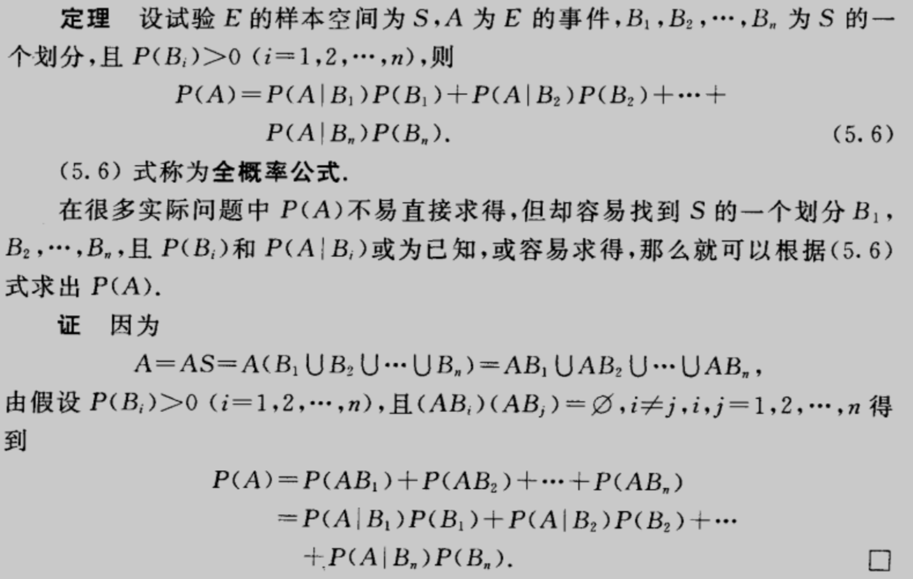
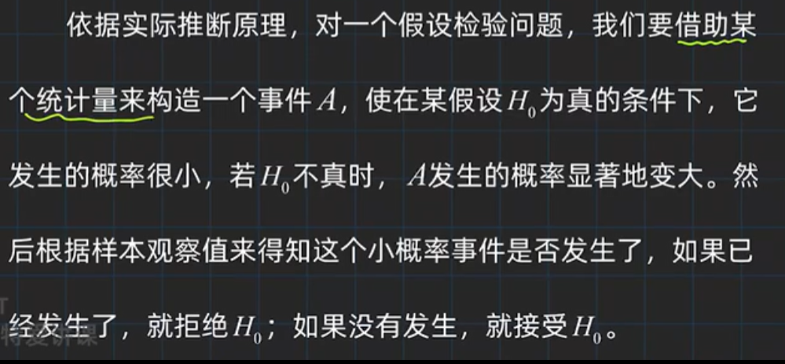
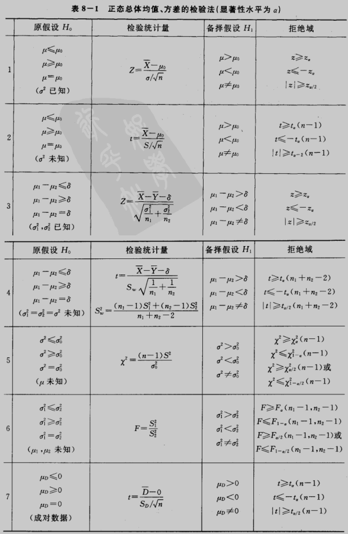

# 概率论与数理统计

- 书籍作者:盛骤 谢式千 潘承毅
- 笔记时间:2022.9.19

## 第一章 概率论的基本概念

### 1 随机试验

- 确定性现象:在某些条件下一定会发生的现象,比如石头往上扔必定会下落
- 随机现象: 个别实验结果具有不确定性,大量重复实验具有统计规律性的现象,比如抛硬币
- 统计规律性: 大量重复实验呈现的固有规律性,比如抛硬币,炮弹着点

- **随机试验**,用来观察随机现象的方式
  - 可以在相同条件下重复执行
  - 每次试验结果不止一个,可以事先明确所有可能结果(**样本空间**)
  - 每次试验之前不能确定试验结果

### 2 样本空间 随机事件

- **样本空间**
  - 随机试验的所有可能结果的**集合**,每个结果(集合里的元素)称为 **样本点**
  - 列举法 {H,T}
  - 描述法 {t | t＞0}
- **随机事件**
  - 满足某些条件的样本点组成的集合,也可以描述为 样本空间S的**子集**称为**E**的随机事件
  - **事件发生**,每次试验,当且仅当随机事件中的一个样本点出现
  - **基本事件**,由一个样本点组成的集合
  - **必然事件**,样本空间包含所有样本点,称为必然事件,**S**
  - **不可能事件**,不包含任何样本点的集合,**Ø**

- **事件运算法则**
  - 
  - 在一次随机试验中,基本事件是两两互不相容(不相容指的是互斥关系,上图第三条,交集为空)
  - 可列个事件的和与积
    - 
  - 
  - 

### 3 概率和频率

- 概率的定义

  - **描述性定义**,称随机事件A发生的可能性大小的度量(非负值)为事件A发生的概率

  - **频率**,相同条件下,进行n次试验,发生的事件A次数为a,那么称a为事件A发生的**频数**, a/n 这个比值称为事件发生的 **频率**,f~n~(A)来表示

  - 频率的基本性质

    - 当n趋于无穷大时,频率会趋于一个常数,这种频率稳定性就是随机试验的统计规律性

    

- 公理化定义(满足的性质,不需要证明)
  - 可以对比频率的性质,可列集合(按照一定顺序一一列举),概率是一个函数
  - 

### 4 古典概型(等可能概型)

- 古典概型具有以下特点:
  - 样本空间包含有限个元素
  - 每个基本事件发生概率相等
- 超几何分布
  - 

- 抽签原理
  - 

- 几何概型

### 5 条件概率

- 

- 乘法公式

  

- 划分

  

- 全概率(把A看成结果,B看成原因,由因及果)

  

- 贝叶斯公式(把A看成结果,B看成原因,由果及因)

  - 先验概率,由以往数据分析得到的概率(全概率)
  - 后验概率,在得到信息之后重新加以修正的概率(贝叶斯)

  

  

### 6 独立性

- 

- A B C 相互独立 ==> ABC两两独立

  

## 第二章 随机变量及其分布

### 1 随机变量

- 当样本空间里的样本点不是一个数的时候,如何将随机试验的每一个结果将实数对应起来.

- 

- 三次掷硬币出现Head的次数

  

### 2 离散型随机变量及其分布律

- 可能取到的值是有限个或者可列无限个的随机变量,称为离散型随机变量
- 通过每个可能值的概率来了解该变量,概率1以一定的规律分布在各个可能值上,故称为分布律
- 

#### 0-1 分布

- 

#### 伯努利分布/二项分布

- 称随机变量X服从参数为n,p的伯努利分布  X~b(n,p)
- 

#### 泊松分布

- 

- 

#### 几何分布/超几何分布

- 等比数列
- 

- 超几何分布

  

### 3 随机变量的分布函数

分布函数的基本性质

### 4 连续型随机变量及其概率密度

#### 均匀分布

- 

#### 正态分布

- X~N(0,1)表示 均值0,方差1,称为X服从标准正态分布
- 

- 正态分布引理

  

#### 指数分布

- 

### 5 随机变量的函数的分布

- 需要注意前提条件,定义域内单调保证有逆函数
- 

## 第三章 多维随机变量及其分布

### 1 二维随机变量

- 重点 定义在同一个样本空间上
- 

- 

- 

### 2 边缘分布

- 

- 

### 3 条件分布

- 

- 

### 4 相互独立的随机变量

- 

- 

### 5 两个随机变量的函数分布

- Z=X+Y

  

  

- Z=XY / Z=Y/X

- 

- Z=max{X,Y}

- 

## 第四章 随机变量的数字特征

随机变量的概率密度/分布函数描述完整随机变量,某些理论问题里只关心某一种特征的常数.

### 1 数学期望

- 

- 

- 函数的数学期望
- 

- 期望的性质
- 

### 2 方差

- 

- 标准化,期望=0,方差=1
- 

- 

- 方差性质及证明
- 

**重要不等式:切比雪夫不等式**

### 3 协方差及其相关系数

- 

### 4 矩 协方差矩阵

- 

## 第五章 大数定律及中心极限定理

### 1 大数定律

### 2 中心极限定理

- 

- 

- 

- 

## 第六章 样本及抽样分布

### 1 随机样本

- 基本概念
  - 总体:全部可能的观察值
  - 个体:每一个可能的观察值
  - 容量:总体中包含的个体个数
  - 有限总体:容量有限的总体
- 

### 2 直方图和箱线图

- 经过排序,划分为K个小区间,,计算落在区间的个体数量,除以总数得到区间频率.
  - 区间的长度称为组距
  - 区间的断电称为组限
  - y轴是 频率/组距 , 小矩形面积近似概率
  - 

- 箱线图
  - 样本分位数

    - 容量为n的样本观察值,样本p分位数(0<p<1),具有以下性质,至少有np个观察值小于等于Xp,至少有n(1-p)个观察值大于或等于Xp

    - Xp为经过排序后,第p个数 X1<X2<...<Xp<Xn

    - 0.25分位数称为第一四分位数,Q1;

      0.75分位数称为第三四分位数,Q3

    - IQR = Q3-Q1,若一个值小于 Q1-IQR 或者 大于 Q3+IQR ,可以认为是异常值

  - 案例
    - Min最小值,Max最大值,M是中位数,是数据集中心位置
    - 散布程度,四个区间各占四分之一则较为集中
    - 

### 3 抽样分布

- 常用统计量,样本均值,样本方差

- 

- 

- 

- 经验分布函数
- 

- 三大抽样分布(统计量的分布称为抽样分布)

- 卡方分布
- 

- 
- 

- t分布
- 
- 

- 

- 正态总体样本均值与样本方差的分布
- 

- 

- 

## 第七章 参数估计

### 1 点估计

- 设总体X的分布函数形式已知,但它的参数未知,借助于总体X的一个样本来估计总体未知参数的值的问题称为 **参数的点估计** 问题.
- 

- 矩估计
- 

- **最大似然估计法**
- 
- 

### 3 估计量评选标准

- 无偏性 
  - 
  - 
- 有效性
  - 
- 相合性
  - 

### 4 区间估计

- 
- 

- 
- 单个正态分布样本统计量
- 

### 5 正态总体均值和方差的区间估计

- 单个总体N(μ,σ^2^)的情况
  - 

- 方差的置信区间
- 

- 两个总体正态分布的均值和方差估计
  - 均值估计,μ1-μ2
  - 
  - 方差估计
  - 

### 6 0-1参数估计

- 

### 7 单侧置信区间

- 

## 第八章 假设检验

### 1 假设检验

- 基本原理:实际推断原理
  - 小概率事件在一次实验中几乎不可能发生
  - 

- 作出假设
  - 
  - 显著性检验
  - 
  - 假设检验分类
  - 

### 2 正态征提均值的假设检验

- 

- 两个正态总体均值差检验
- 

### 3 正态总体方差的假设检验

- 

### 4 置信区间与假设检验的关系

- 

## 附录

### 参考资料

1. [梨米特爱讲课](https://www.bilibili.com/video/BV1D741147G5/?spm_id_from=333.337.search-card.all.click&vd_source=75d343d583130dcc21675fbeadb22044)

2. [伽马函数](https://en.wikipedia.org/wiki/Gamma_function)

3. 参数估计表

   

### 词汇表

概率 Probability

随机试验  random experiment

频率 Frequency

古典概型 classical models of probability

独立性 Independent

条件概率 Conditional Probability

分布函数  Cumulative Distribution Function

概率密度  Probability Density

连续型随机变量 Continuous random variable

均匀分布 Uniform Distribution

二项式分布 Binomial Distribution

泊松分布 poisson distribution

正态分布/高斯分布 normal distribution

指数分布 Exponential Distribution

多维随机变量 multiple random variable

联合分布 Joint distribution

边缘分布 marginal distribution

数学期望 mathematic expectation

方差 variance/deviation Var

切比雪夫不等式 chebyshev's theorem

协方差 covariation

中心矩 central moment

直方图 Histogram

箱线图 boxplot

四分位数 quartile

中位数 median

点估计 point estimation

区间估计 Interval Estimation

枢轴量  Pivot

置信区间 Confidence intervals

置信水平 confidence coefficient

假设检验 hypothesis testing