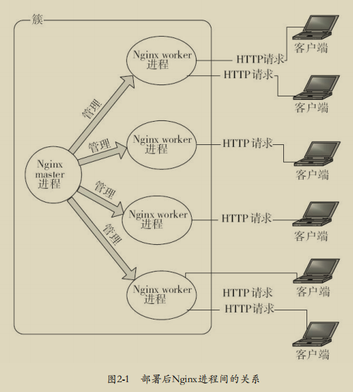
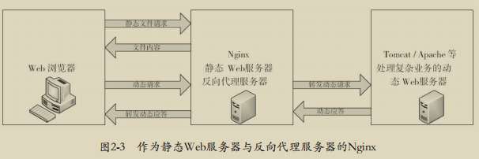
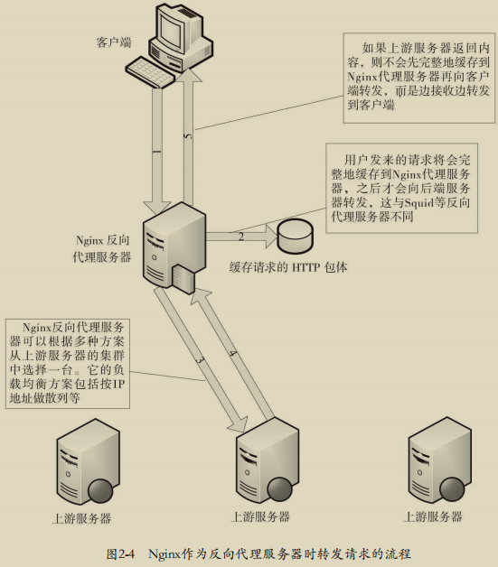
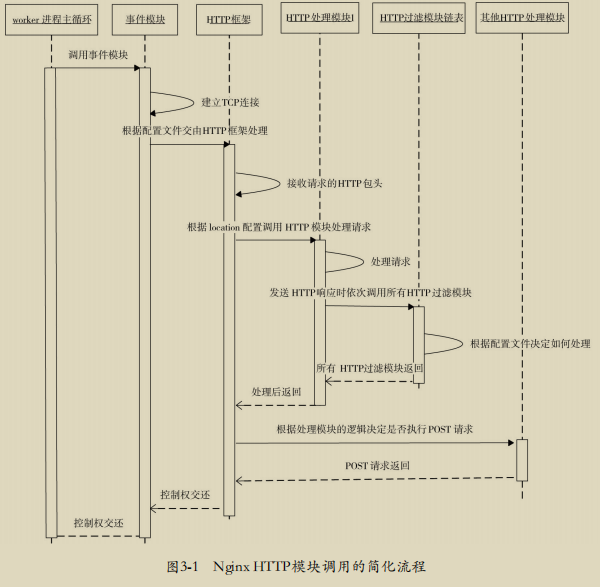
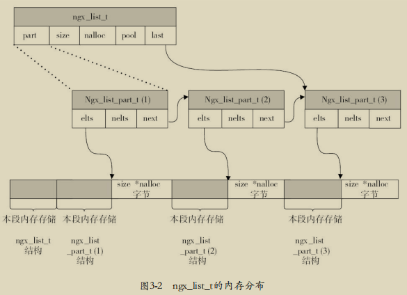

# 深入理解Nginx模块开发与架构解析 笔记

- [ ] 书籍作者: [陶辉](https://book.douban.com/search/陶辉)
- [ ] 笔记时间: 2020.12.31

## 第一部分 Nginx能帮我们做什么

### 第1章 研究Nginx前的准备工作

Nginx已经成为业界高性能Web服务器的代名词

#### 1.1 Nginx是什么

对手 Apache Tomcat Lighttpd Jetty 等也都是Web服务器

Lighttpd和Nginx一样，都是轻量级、高性能的Web服务器

Apache老牌占有率高,并发低

[Web Server市场占有率调查2020.04](https://news.netcraft.com/archives/2020/04/08/april-2020-web-server-survey.html)


#### 1.2 为什么选择Nginx

- 高性能--响应很快
- 模块化--设计极具扩展,第三方也有优秀性能
- 高可靠--基础功能必须可靠
- 低内存消耗--1 0000个非活跃HTTP Keep-Alive仅消耗2.5M内存
- 高并发--单机10万以上
- 开源--BSD协议,允许修改源码并发布
- 热部署--管理进程与工作进程分离设计

核心理由还是它能在支持**高并发**请求的同时保持**高效**的服务

> **背景介绍**: 中国人多导致高并发要求高 (双十一经典栗子)
>
> 低并发压力下，用户可以获得高速 体验，而在高并发压力下，更多的用户都能接入，可能访问速度会下降，但这只应受制于带 宽和处理器的速度，而不应该是服务器设计导致的软件瓶颈
>
> Nginx先天的事件驱动型设计、全异步的网络I/O处理机制、极少的进程间切换以及许多优化设计，都使得Nginx天生善于处理高并发压力下的互联网请求，同时Nginx降低了资源消耗，可以把服务器硬件资源“压榨”到极致

#### 1.3 准备工作

这里准备使用在线网站进行学习,假如必要的话再搭建本地虚拟机

##### 1.3.1 Linux操作系统

内核2.6以上的Linux,原因epoll解决多路复用

`uname -a` 查看内核

##### 1.3.2 使用Nginx的必备软件

###### 1. GCC编译器

GNU Compiler Collection 用来编译C语言.Ngixn不会直接提供二进制安装包

```shell
yum install -y gcc gcc-c++
```

###### 2. PCRE库

Perl Compatible Regular Expressions(Perl 兼容正则表达式),配置nginx.conf使用正则,编译Nginx时候必须把PCRE编译进Nginx

```shell
yum install -y pcre pcre-devel
```

##### 3. zlib库

用于对HTTP包内容做gzip格式压缩

```shell
yum install -y zlib zlib-devel
```

###### 4.OpenSSL开发库

如果服务想要再SSL上传输HTTP

```shell
yum install -y openssl openssl-devel
```

##### 1.3.3 磁盘目录

###### 1. Nginx源代码存放目录

###### 2.Nginx编译阶段产生的中间文件存放目录

该目录用于放置在configure命令执行后所生成的源文件及目录，以及make命令执行后生成的目标文件和最终连接成功的二进制文件。默认情况下，configure命令会将该目录命名为 objs，并放在Nginx源代码目录下。

###### 3. 部署目录 

该目录存放实际Nginx服务运行期间所需要的二进制文件、配置文件等。默认情况下， 该目录为/usr/local/nginx。 

###### 4. 日志文件存放目录 

日志文件通常会比较大

##### 1.3.4 Linux内核参数的优化

首先，需要修改 */etc/sysctl.conf* 来更改内核参数,然后执行`sysctl-p`使修改生效

```properties
# 标识一个进程可以打开的最大句柄数,限制到最大并发连接数
fs.file-max = 999999 
# 表示允许将TIME-WAIT状态的socket重新用于新的 TCP连接
net.ipv4.tcp_tw_reuse = 1 
# 表示当keepalive启用时，TCP发送keepalive消息的频度
net.ipv4.tcp_keepalive_time = 600
# 表示当服务器主动关闭连接时，socket保持在FIN-WAIT-2状态的最大时间。
net.ipv4.tcp_fin_timeout = 30 
#表示操作系统允许TIME_WAIT套接字数量的最大值， 如果超过这个数字，#TIME_WAIT套接字将立刻被清除并打印警告信息。
net.ipv4.tcp_max_tw_buckets = 5000 
net.ipv4.ip_local_port_range = 1024 61000 
# 定义了TCP接收缓存（用于TCP接收滑动窗口）的最小 值、默认值、最大值
net.ipv4.tcp_rmem = 4096 32768 262142 
net.ipv4.tcp_wmem = 4096 32768 262142 
# 当网卡接收数据包的速度大于内核处理的速度时，会有一个队列保存这些数据包
net.core.netdev_max_backlog = 8096 
net.core.rmem_default = 262144 
net.core.wmem_default = 262144 
net.core.rmem_max = 2097152 
net.core.wmem_max = 2097152 
# 该参数与性能无关，用于解决TCP的SYN攻击
net.ipv4.tcp_syncookies = 1 
net.ipv4.tcp_max_syn.backlog=1024
```

##### 1.3.5 获取Nginx源码 

官网下载并解压

```shell
tar -xvzf nginx-1.18.0.tar.gz
```

#### 1.4 编译安装Nginx

```shell
./configure # 检测操作系统内核和已经安装的软件 生成makefile文件等
make # 根据Makefile文件编译Nginx工程，并生成目标文件、最终 的二进制文件
maker install #根据configure执行时的参数将Nginx部署到指定的安装目录，包括相关目 录的建立和二进制文件、配置文件的复制
```

#### 1.5 configure详解 

##### 1.5.1 configure的命令参数

`./configure --help` 查看参数

[参数说明](http://nginx.org/en/docs/configure.html)

默认安装  */usr/local/nginx* 目录下

##### 1.5.2 configure执行流程

configure由Shell脚本编写，中间会调用*\<nginx-source\>/auto/*目录下的脚本。具体流程可以查看 源码

##### 1.5.3 configure生成的文件 

当 configure 执行成功时会生成 *objs* 目录

**ngx_modules.c** 是一个关键文件,用来定义ngx_modules数组的,它指明了每个模块在Nginx中的优先级

#### 1.6 Nginx的命令行控制

- 默认方式启动 

  ```shell
  /usr/local/nginx/sbin/nginx
  # 配置文件在 /usr/local/nginx/conf/nginx.conf
  ```

- -c 指定配置文件

- -p 指定Nginx的安装目录

- -g参数临时指定一些全局配置项

- 不启动Nginx的情况下，使用-t参数仅测试配置文件是否有错误

- 测试配置选项时，使用-q参数可以不把error级别以下的信息输出到屏幕

- -v/V 显示版本/配置信息

- -s stop 停止,Nginx通过ngixn.pid中得到master进程ID,发送TERM信号

- -s quit 优雅停止

- ......

### 第2章 Nginx的配置

[文档地址](http://nginx.org/en/docs/ngx_core_module.html)

#### 2.1 运行中的Nginx进程间的关系

一个master进程,多个worker进程(个数和CPU核心相等)

- master进程不会对用户请求提供服务，只用于管理真正提供服务的worker进程
- 多个worker进程处理互联网请求不但可以提高服务的健壮性,可以充分利用现在常见的SMP多核架构



#### 2.2 Nginx配置的通用语法

Nginx的配置文件其实是一个普通的文本文件

##### 2.2.1 块配置项

块配置项由一个块配置项名和一对大括号组成

##### 2.2.2 配置项的语法格式 

```conf
配置项名 配置项值1 配置项值2;
```

##### 2.2.3 配置项的注释

\# 进行注释

##### 2.2.4 配置项的单位

- k/m 字节单位
- ms(毫秒) w(周) M(月)

##### 2.2.5 在配置中使用变量 

有些允许使用变量 ${} 进行读取

#### 2.3 Nginx服务的基本配置

Nginx在运行时，至少必须加载几个核心模块和一个事件类模块

默认值设为第一个

##### 2.3.1 用于调试进程和定位问题的配置项 

`daemon on|off; ` 是否以守护进程方式运行Nginx

> 守护进程（daemon）是脱离终端并且在后台运行的进程。它脱离终端是为了避免进程执 行过程中的信息在任何终端上显示，这样一来，进程也不会被任何终端所产生的信息所打断。

`master_process on|off; `是否以master/worker方式工作

`error_log path/file level; `默认情况下是logs/error.log文件,也可以是/dev/null，这样就不会输出任何日志

`debug_connection[IP|CIDR]`仅对指定的客户端输出debug级别的日志

`worker_rlimit_core size;`限制coredump核心转储文件的大小

> 在Linux系统中，当进程发生错误或收到信号而终止时，系统会将进程执行时的内存内容（核心映像）写入一个文件（core文件），以作为调试之用，这就是所谓的核心转储（core dumps）

`working_directory path;` 指定coredump文件生成目录

##### 2.3.2 正常运行的配置项 

`env VAR|VAR=VALUE `定义/修改环境变量 

`include pathfile; ` 嵌入其他配置文件

`user username[groupname]; `Nginx worker进程运行的用户及用户组 

`worker_rlimit_nofile limit;`设置一个worker进程可以打开的最大文件句柄数

##### 2.3.3 优化性能的配置项

`worker_processes number; ` Nginx worker进程个数 

`worker_cpu_affinity cpumask[cpumask...]`绑定Nginx worker进程到指定的CPU内核 

##### 2.3.4 事件类配置项 

`accept_mutex[on|off] `是否打开accept锁 

> accept_mutex是Nginx的负载均衡锁,可以让多个worker进程轮流地、 序列化地与新的客户端建立TCP连接。

`lock_file path/file; `默认logs/nginx.lock,默认关闭,只有系统不支持原子锁才会用文件锁

#### 2.4 用HTTP核心模块配置一个静态Web服务器 

主要由ngx_http_core_module模块实现

[文档](http://nginx.org/en/docs/http/ngx_http_core_module.html)

##### 2.4.1 虚拟主机与请求的分发 

每个server块就是一个虚拟主机，它只处理与之相对应的主机域名请求。

`listen address:port` 监听端口,支持IPV6,还可以添加更多参数

> 在nginx.conf中找到的第一个server块作为默认server块。为什么需要默认虚拟主机呢？当一个请求无法匹配配置文件中的所有主机域名时，就会选用默认的虚拟主机

`server_name name[...]; `主机名称 ，Nginx会取出header头中的Host，与每个server中的server_name进行匹配(优先级: 完全匹配>\*name > name\*> 正则)

`server_names_hash_bucket_size size;`Nginx使用散列表来存储server name

`server_name_in_redirect on|off;` 重定向主机名称的处理

`location[=|~|~*|^~|@]/uri/{...} ` location会尝试根据用户请求中的URI来匹配上面的/uri表达式

##### 2.4.2 文件路径的定义

`root path; `定义资源文件相对于HTTP请求的根目录。默认html

首页 错误页面 重定向 等

##### 2.4.3 内存及磁盘资源的分配

是否存储http各个部分,以及设置各部分buffer大小

##### 2.4.4 网络连接的设置 

读取HTTP头/体时间 响应超时设置,连接保持,请求数设置

##### 2.4.5 MIME类型的设置

##### 2.4.6 对客户端请求的限制

限速 限制大小

##### 2.4.7 文件操作的优化 

aio 等优化

##### 2.4.8 对客户端请求的特殊处理 

对HTTP头进行过滤

##### 2.4.9 ngx_http_core_module模块提供的变量 

#### 2.5 用HTTP proxy module配置一个反向代理服务器

充当反向代理和静态Web服务器





##### 2.5.1 负载均衡的基本配置 

1. upstream块定义了一个上游服务器的集群，便于反向代理中的proxy_pass使用
2. server配置项指定了一台上游服务器的名字

3. ip_hash
4. 记录日志时支持的变量 

##### 2.5.2 反向代理的基本配置

默认情况下反向代理是不会转发请求中的Host头部的。如果需要转发，那么必须加上配置：`proxy_set_header Host $host; `

Nginx会将上游服务器的响应转发给客户端，但默认不会转发以下HTTP头部字段： Date、Server、X-Pad和X-Accel-*。

## 第二部分 如何编写HTTP模块

### 第3章 开发一个简单的HTTP模块

#### 3.1 如何调用HTTP模块



#### 3.2 准备工作

把第一个HTTP模块命名为ngx_http_mytest_module,就是一个c文件,还需要定义一个名称，以便在编译前的configure命令执行时显示是否执行成功

##### 3.2.1 整型的封装 

Nginx使用ngx_int_t封装有符号整型，使用ngx_uint_t封装无符号整型

##### 3.2.2 ngx_str_t数据结构 

ngx_str_t只有两个成员，其中data指针指向字符串起始地址，len表示字符串的有效长度

##### 3.2.3 ngx_list_t数据结构

ngx_list_t是Nginx封装的链表容器



Nginx提供的接口包括：ngx_list_create接口用于创建新的链表，ngx_list_init 接口用于初始化一个已有的链表，ngx_list_push接口用于添加新的元素

##### 3.2.4 ngx_table_elt_t数据结构

为HTTP头部“量身订制”的,就是键值对,带有hash

##### 3.2.5 ngx_buf_t数据结构

缓冲区ngx_buf_t是Nginx处理大数据的关键数据结构，它既应用于内存数据也应用于磁盘数据

本质上它提供的仅仅是一些指针成员和标志位

##### 3.2.6 ngx_chain_t数据结构 

ngx_chain_t是与ngx_buf_t配合使用的链表数据结构,如果是最后一个ngx_chain_t，那么必须将next置为NULL，否则永远不会发送成功，而且这个请求将一直不会结束

#### 3.3 如何将自己的HTTP模块编译进Nginx 

- 首先把源代码文件全部放到一个目录下，同时在该目录中编写一个文件用于通知Nginx如何编译本模块，这个文件名必须为config;在configure脚本执行时加入参数--add-module=PATH
- objs/Makefile和objs/ngx_modules.c文件，完全可以自己去修改这两个文件

##### 3.3.1 config文件的写法