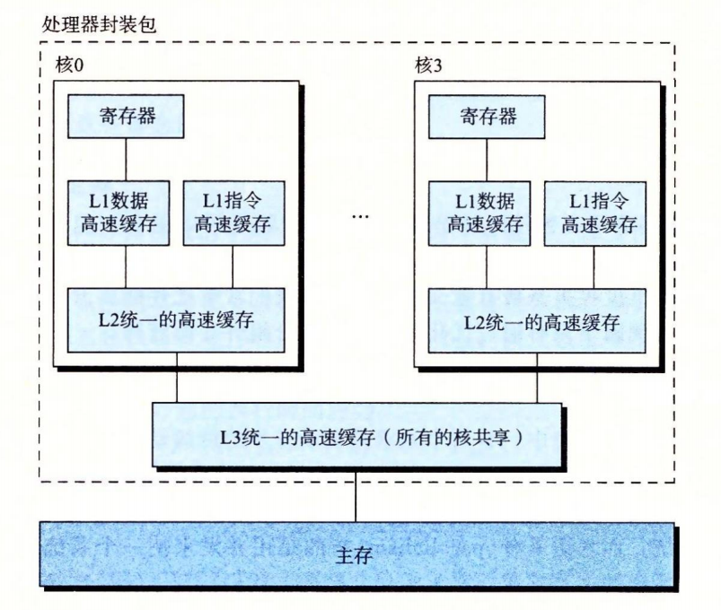

# 深入理解计算机系统

- 书籍作者:[Randal E.Bryant](https://book.douban.com/author/263391) / [David O'Hallaron](https://book.douban.com/search/David O'Hallaron)

- 笔记时间: 2022.05.03


### 第1章 计算机系统漫游

- 信息就是位+上下文,计算机程序是以字节序列存储在文件中,每个字节都对应一个整数值

  由ASCII字符构成的文件称为文本文件,其他文件称为二进制文件

  > 可以通过 od -Ax -tx1z file 查看文件的ASCII文本表示

- 系统中的所有信息都是一串比特表示(也就是0/1),区分对象需要通过上下文环境.

- 程序需要被编译器驱动程序编译为可执行文件才能执行

  - 编译器负责将源文件转为目标文件
  - 可执行文件包含低级机器指令,属于二进制文件

- C语言编译系统

  - 预处理器cpp,将#开头的命令执行,修改源文件,生成.i结尾的文件

  - 编译器ccl,将.i文件翻译为.s文件,包含一个汇编语言程序

  - 汇编器as,将.s文件翻译为机器指令,生成.o文件

  - 链接ld,负责将用到的库合并进来

    > 预处理：gcc -E hello.c -o hello.i
    >
    > 编 译： gcc -S hello.i -o hello.s
    >
    > 汇 编：gcc -c hello.s -o hello.o
    >
    > 链 接：gcc  hello.o -o hello_elf

- 硬件结构
  - 总线,携带信息字节并负责传输,总线宽度称为字
  - IO设备,负责与外界交互的通道(鼠标,键盘等),通过控制器/适配器与IO总线相连
  - 主存,临时存储设备,存放程序和数据,由DRAM(动态随机存取存储器)芯片组成
  - CPU(中央处理单元),核心是大小为一个字的寄存器,称为PC(程序计数器)
  - cache(高速缓存存储器),位于CPU和主存之间,使用SRAM(静态随机访问存储器)实现,使用L1,L2来标记第几层存储
  - 

- 操作系统
  - 封装硬件,提供统一接口
  
  - 进程,操作系统提供的假象,程序看上去独占CPU/内存/IO设备
  
    - 进程是操作系统对一个正在运行的程序的抽象,通过并发(交错执行不同进程指令)实现每个进程"独占"效果
  
    - 上下文切换,操作系统负责保存PC/寄存器等信息,加载新进程信息,传递控制权
  
      负责这部分工作的是操作系统内核,内核时操作系统常驻贮存的部分,提供的接口是系统调用,需要软硬件的配合
  
      

- 线程,相比进程更轻量,容易进行数据交换

- 虚拟内存,为进程提供独占主存的假象

  - > 64位机器只用到48位的虚拟内存,已经达到256TB,内核与普通进程各占一半
    >
    > 这里说的是内存,不是硬盘存储,即使实际只有4G/8G,也可以通过映射/置换算法

  - 每个进程看到的内存地址都是一致的,称为虚拟地址空间,

  - 代码和数据,代码从固定地址开始,紧接着是对应的数据

  - 堆,跟在代码和程序(大小已经确定)之后,大小不确定

  - 共享库,位于地址空间的中间位置,很复杂也很强大

  - 用户栈,编译器实现函数调用

  - 内核虚拟内存,只能由内核执行

  - 

- 文件,就是字节序列
  
  - 所有设备(键鼠,显示器,网络等等)都可以看成文件,输入/输出都是通过UnixI/O的系统调用读写文件完成
- amdahl定律(阿姆达尔定律)
  - T~new~ = (1-α)T~old~ + αT~old~/k ,T表示执行时间,α表示某部分比例,k表示性能提升比例
  - T~old~/T~new~ = 1/((1-a) + a / k) ,加速比,表示新系统相对于旧系统的性能比

- 并发和并行

  - 线程级并发

    - 传统并发是通过快速交替执行模拟出来,允许多用户同时与程序交互,称为单处理器系统

    - 单个操作系统控制多处理器,称为多处理器系统

      每个CPU称为核,超线程在硬件上含有多个备份(比如PC,寄存器等),可以在1个时钟周期内完成切换上下文,比如4核8线程可以实现8个线程并行

    - 

  - 指令级并行,流水线的指令执行,如果CPU可以达到一条指令少于一个周期,那么称为超标量,CPU抽象出指令集

  - 单指令多数据并行(SIMD),用于向量/图像等处理加速,操作系统抽象出虚拟机

## 第一部分 程序结构和执行

### 第2章 信息的表示和处理

#### 1 信息存储

- 内存的基本单位是字节,对于程序来说,内存就是一个巨大的字节数组,称为 虚拟内存

  每个基本单位都有唯一数字定位,称为 地址,所有地址称为 虚拟地址空间

  c语言的指针指向的都是某个存储块的第一个字节的虚拟地址

	> 进制转换,Linux shell 可以直接使用 printf "%x" 123 格式化输出,不支持2进制
	>
	> echo 'obase=16;ibase=2;1011'|bc ,需要先安装bc(可能自带)
	
- 字长制命指针数据的标称大小,虚拟地址以字编码,假设字长w,那么虚拟地址范围 0\~2^w^-1

  由于不同位数机器的基本类型长度有变,可以使用明确长度的类型 比如int32_t 

  > gcc -std=c11 指定c标准
  >
  > gcc -m32		指定编译位数(32/64位),影响基本类型长度
  >
  > man ascii  可以查看 ASCII表

- 当连续字节在内存中时,存储顺序需要注意,假设有连续四个字节数据 1 2 3 4

  在不同机器传输数据时候需要注意,编写汇编代码,还有使用强制类型转换和联合的时候(打印地址等)

  ASCII字符串没有大小端问题,结尾是 "\0"

  | 地址   | 0x101 | 0x102 | 0x103 | 0x104 |
  | ------ | ----- | ----- | ----- | ----- |
  | 大端法 | 1     | 2     | 3     | 4     |
  | 小端法 | 4     | 3     | 2     | 1     |

- 位向量是长度为w,由0/1组成的串.表示为[a^w-1^    , ... ,a^0^],逻辑右移用0填充,算数右移用最高有效位

#### 2 整数表示

- c/c++支持无符号数,没有明确整数范围(是否采用补码),需要通过类型明确

  Java只支持有符号数,明确类型大小(明确补码)

  原码,使用最高位表示符号,出现+/-0的情况,B2S = (-1)* x^w-1^ + Σ x^i^2^i^

  反码,最高位权重跟补码不一致, B2O = -(2^w-1^-1)x^w-1^ + Σ x^i^2^i^

  补码,B2T = -(2^w-1^)x^w-1^ + Σ x^i^2^i^,采用的是符号扩展

- 无符号数和二进制序列之间是双射,补码和对应整数也是双射

- 一般来说,少用无符号数,除非想要把字当成位的集合等特殊情况

#### 3 整数运算

- 无符号加法发生溢出会进行截断,去掉最高位,相当于减去 2^w^

  所以判断无符号加法溢出  s = x + y - 2^w^  ,因为 x,y都小于2^w^,所以s必定小于x/y

- 补码溢出分正负,正溢出和无符号一样,负溢出需要加上2^w^

  补码的非 = ~x+1

- 一般来说乘法/除法需要的时钟周期较多,会使用移位代替

  除法对于补码来说是算术右移,无符号数是逻辑右移

#### 4 浮点数

- xxx.yyy在2进制情况下可以看成 xxxyyy/2^3^,也就是除以2的幂次方,这种方法不可以表示很大的数

- IEEE浮点表示 V = (-1)^s^ * M * 2^E^,

  s是符号位,占1位

  M是二进制小数(1开头),表示为frac,称为尾数,

  2^E^称为阶码,表示为 exp,单精度8位,双精度11位

- |          | exp        | frac |                                                              |
  | -------- | ---------- | ---- | ------------------------------------------------------------ |
  | 规格化   | ≠0 && ≠255 | f    | 普遍情况,阶码 E = e - Bias,e是无符号数exp,Bias是 2^k^ -1,M = 1 + f |
  | 非规格化 | 0          | f    | 阶码 E = 1 - Bias,Bias是 2^k^ -1,M = f                       |
  | 无穷大   | 255        | 0    |                                                              |
  | NaN      | 255        | ≠0   |                                                              |

- 由于浮点数的构造会导致舍入问题,所以一般使用向最近舍入,也就是大于0四舍五入,小于零相反,这么做是为了减少统计偏差

- 浮点数乘法不具备分配性(会溢出)和可结合性

### 第3章 程序的机器级表示

#### 1 历史观点

- Intel 处理器系列俗称x86,第一代芯片是16位微处理器

  - 8086(1978,29K晶体管),16位芯片.是当初IBM的PC心脏,IBM和微软合作使用了MS-DOS操作系统

  - 80286(1982,134K晶体管),更多寻址模式,MS Windows最初的使用平台

  - i386(1985,275K晶体管),32位芯片,增加平坦寻址模式,支持Unix

  - Pentium(1993,3.1M) ....

  - 后续基本遵循摩尔定律,增加了SSE(处理整数/浮点向量指令),超线程,64位支持等

    > 最初8086的内存模型和80286的扩展到 i386就已经过时
    >
    > 原来的x87浮点指令在SSE2也过时了
    >
    > 在x86-64程序中可以看到历史发展的痕迹,但是很多特性已经不会出现

#### 2 程序编码

- ```shell
  gcc -Og -o p p1.c p2.c
  # -Og 告诉编译器使用会生成符合原始C代码征提结构的机器代码的优化等级
  # C预处理器扩展源码,#include 等插入,宏处理
  # 编译器产生汇编代码,p1.s p2.s
  # 编译器生成目标代码 p1.o p2.o,还没有填入全局值的地址
  # 链接器将目标代码与库代码合并,并产生最终可执行文件
  ```

- 机器级代码

  - 机器级编程有两种抽象十分重要

    - 指令集架构(Instruction Set Architecture),处理器支持并发执行
    - 虚拟内存

  - 通过汇编代码可以看到PC,整数寄存器文件,条件寄存器,向量寄存器等

    程序内存包括 程序机器码 操作系统信息 运行时栈 堆

    因为使用虚拟内存,在x86-64中虚拟地址高16位置零,所以地址范围实际为256TB,

    操作系统负责把虚拟地址翻译为物理地址

- 代码示例

  - ```c++
    long mult2(long,long);
    
    void multstore(long x,long y,long* dest){
            long t = mult2(x,y);
            *dest = t;
    }
    ```

  - ```shell
    g++ -Og -S mult.cpp	#生成汇编代码
    #在汇编代码里面可以看到(以下是部分汇编)
     pushq   %rbx		#表示压栈
     movq    %r8, %rbx
     call    _Z5mult2ll
     movl    %eax, (%rbx)
     addq    $32, %rsp
     popq    %rbx
     ret
     
    g++ -Og -c mult.cpp	 #生成.o文件
    #在二进制文件里面可以看到
    53 48 83 ec 20 4c 89 c3	#对应上面的第一条汇编代码
    ```

  - ```shell
    #gdb 可以调试.o文件
    objdump -d a.o #表示查看反汇编
    # x86指令是变长指令(1~5字节),反汇编不需要源码或汇编代码
    # 此处的地址是 0,
    0000000000000000 <multstore>:
       0:   53                      push   %rbx
       1:   48 83 ec 20             sub    $0x20,%rsp
       5:   4c 89 c3                mov    %r8,%rbx
       8:   e8 00 00 00 00          callq  d <multstore+0xd>
       d:   89 03                   mov    %eax,(%rbx)
       f:   48 83 c4 20             add    $0x20,%rsp
      13:   5b                      pop    %rbx
    # 给案例源码增加main方法并生成可执行文件反编译后,地址已经变化
    0000000000401590 <multstore>:                        
        401590:|53                   |push   %rbx          
        401591:|48 83 ec 20          |sub    $0x20,%rsp    
        401595:|4c 89 c3             |mov    %r8,%rbx      
        401598:|e8 ea ff ff ff       |callq  401587 <mult2>
        40159d:|89 03                |mov    %eax,(%rbx)   
        40159f:|48 83 c4 20          |add    $0x20,%rsp    
        4015a3:|5b                   |pop    %rbx          
      
    ```

- 格式解读

  - ```shell
    #汇编代码
            .file   "mstore.c"	#.开头的指令是伪代码,指导编译器/链接器
            .text
            .globl  multstore
            .def    multstore;      .scl    2;      .type   32;     .endef
            .seh_proc       multstore
    # void multstore(long x,long y,long* dest)
    # x in %rdi,y in %rsi, dest in %rdx
    multstore:
            pushq   %rbx
            .seh_pushreg    %rbx
            subq    $32, %rsp
            .seh_stackalloc 32
            .seh_endprologue
            movq    %r8, %rbx		# copy dest to %rbx
            call    mult2
            movl    %eax, (%rbx)	# store result at *dest
            addq    $32, %rsp
            popq    %rbx
            ret
            .seh_endproc
            .ident  "GCC: (x86_64-posix-seh-rev0, Built by MinGW-W64 project) 8.1.0"
            .def    mult2;  .scl    2;      .type   32;     .endef
    ```

  - 上面的汇编代码是ATT格式,在 `gcc -masm=intel `可以产生intel格式的汇编代码

#### 3 数据格式

- | C声明      | Intel数据类型 | 汇编代码后缀 | 大小(字节) |
  | ---------- | ------------- | ------------ | ---------- |
  | char       | 字节          | b            | 1          |
  | short      | 字            | w            | 2          |
  | int/float  | 双字/单精度   | l/s          | 4          |
  | long/char* | 四字          | q            | 8          |
  | double     | 双精度        | l            | 8          |

  

#### 4 访问信息

- x86-64的CPU具有一组16个64位寄存器(通用目的寄存器),

  复制和生成1/2字节会保持其他字节不变,4字节会把高位置零

  

- 操作数格式
  - 立即数,使用 $整数 表示
  - 寄存器,使用它r~a~表示,a代表1/2/4/8字节
  - 内存引用,直接写地址
  - 支持多种寻址模式,立即数寻址/寄存器寻址/绝对寻址/间接寻址/变址寻址等
  - 

- 数据传送

  - MOV S D指令,S→D,具有1/2/4/8字节版本,S和D不可以同时是内存位置

    移动内存数据到内存指定位置需要借助寄存器

    需要注意的是 movl (移动两字,4字节) 会把高位置零

    MOVZ 填充0 ,MOVS填充高位符号

  - 需要注意的是C指针就是地址,间接引用指针就是把指针放到寄存器

    通常局部变量放在寄存器里

- 压栈/弹栈,pushq/popq 放到 %rsp

#### 5 算数操作

- 
  - 加载有效地址(load effective address),从内存读取数据到寄存器,

    没有引用内存而是直接写入地址到寄存器

    > leaq 7(%rdx,%rdx,4) ,%rax 可以表示位5x+7 利用地址来计算算术操作

  - 大部分操作支持补码和无符号运算,只有右移需要区分

  - 特殊算数操作,intel把16字节数称为8字,支持产生两个64位乘除法,

#### 6 控制

- CPU维护一组单个条件码寄存器,leaq不改变状态寄存器

  - TEST (and运算)/ CMP (sub运算) 不产生结果,只会修改状态寄存器

  | CF   | 进位,检查无符号溢出 |
  | ---- | ------------------- |
  | ZF   | 零标志,检查结果为零 |
  | SF   | 符号标指            |
  | OF   | 溢出标志,有符号溢出 |

- 访问条件码

  - 设置条件码,SET指令

    

  - 跳转指令,跳转目的使用标号(label)指明.

    一般使用PC相对寻址,

    

  - if控制流会编译生成各自代码块,插入条件和无条件分支

- 条件传送指令

  - 使用数据的条件转移,计算一个条件的两个结果,根据是否满足选择其中一个

    因为现代处理器采用分支预测+流水线,预测错误代价很大,浪费15~30个周期

  - 条件十分受限,但比较常见

- 循环,都可以采用简单策略翻译,

- switch,使用了跳转表进行高效执行

#### 7 过程

- 过程具有多种形式函数/方法/子例程等等,包括以下机制:

  - 传递控制,假设P调用Q需要把PC设置为Q的起始地址,返回时复原
  - 传递数据,P向Q提供参数,Q向P提供返回数值
  - 分配和释放内存,局部变量分配空间

- 运行时栈

  - 过程的调用和返回符合栈的特点,后进先出.

    x86-64栈往低地址方向增长,P调用Q会把返回地址压栈,认为是P的一部分,

    将过程参数压栈(多数过程栈帧是定长的),参数不大于6个可以用寄存器传递

    

- 转移控制,只需要 简单的设置PC为目标代码起始位置,call 指令会自动压栈, ret自动弹栈

- 数据传送

  - 可以使用固定的寄存器传递参数 (rdi,rsi,rdx,rcx,r8,r9)

  - 超过6个则直接压栈,超过部分压栈,大小8的倍数对齐

  - 根据惯例,%rbx/%rbp和%r12~%r15被划分为被调用者保存寄存器,P调用Q时候P必须保存,

    返回时候复原,所有其他寄存器(除了栈指针%rsp)都分为调用者保存寄存器

#### 8 数组分配和访问

- 数组名就是指针,指向第一个元素的内存地址,指针的运算和地址运算一样
- 嵌套数组,地址计算 `D[i][j] =x+L(Ci+j)` 

- 定长数组/变长数组(c99)


#### 9 异质的数据结构

- 类似数组,编译器维护每个结构信息,只是每个字段的字节偏移