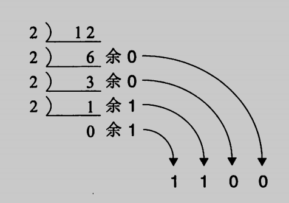
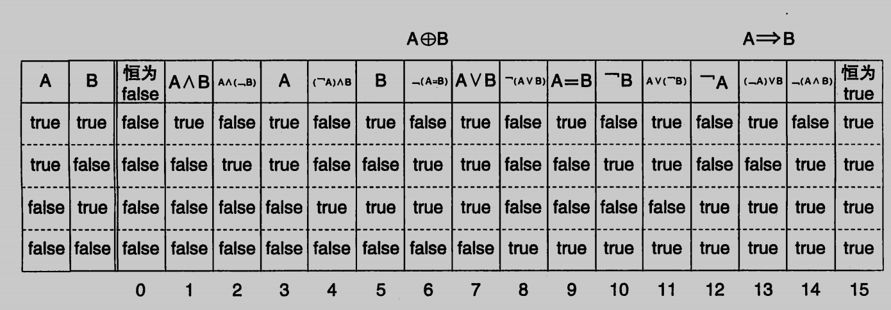
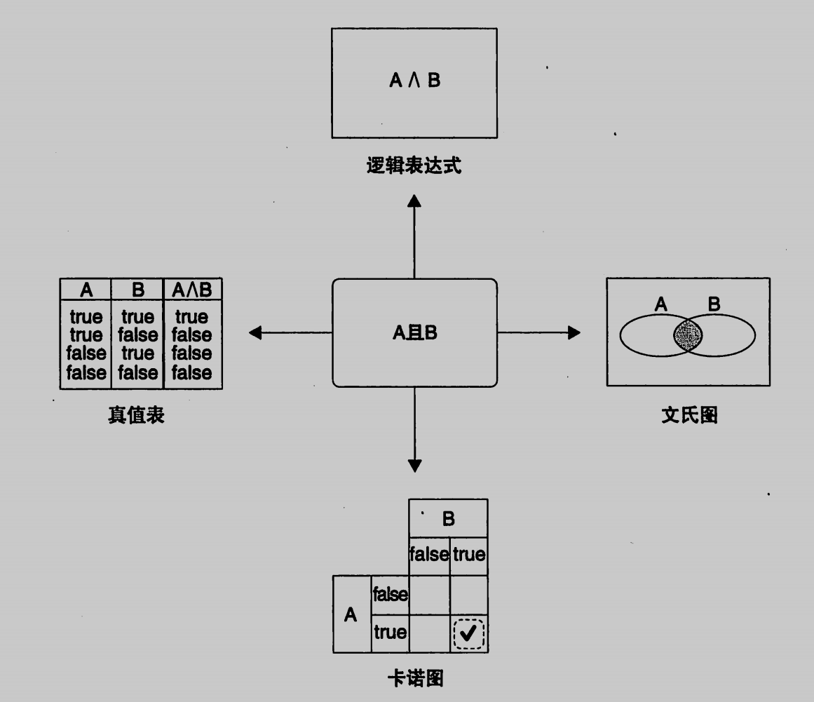

# 程序员的数学

- [ ] 书籍作者：结城浩
- [ ] 笔记时间：2021.9.14

## 第1章 0的故事——无即是有

- 进制的表示 
  $$
  a_3a_2a_1a_0=a_3*N^3+a_2*N^2+a_1*N^1+a_0*N^0
  $$
  
- 进制转换

  

- 按位计数法 （比如10进制、2进制的计数方法），不按位计数的有罗马数字
- 定义 10^0^ ，指数每减一都是原来的十分之一，那么就会无限逼近0（指数函数）→ **以简化规则为目标去定义值**
- 0的作用
  - 占位，保证其他位置的数不会乱
  - 统一标准，简化规则
  - 生活中比如吃药吃3天停1天，可以使用安慰剂放在停的哪天，那么只需要每天吃药 

- 将大问题分解为小单元

## 第2章 逻辑——真与假的世界

- 逻辑是消除歧义的工具
- 命题：能够判断对错的陈述句。可能存在缺漏（完整性）、重复（排他性）的情况，可以使用数轴辅助，边界必须很清晰。

- 逻辑运算辅助工具
  - 真值表：将所有情况罗列出来，方便，不直观
  - 文氏图 ：直观
  - 卡诺图：用于简化逻辑表达式
- 摩根定律
- 蕴含 ，若 A 则 B，是一种运算（跟与或非一样），规定A真B假时候A→B为假。
- 三值逻辑，增加了undefined ，表示不进行任何处理
- 

- 

## 第 3 章  余数——周期性和分组

- 戈尼斯堡七桥问题，通过度的奇偶
- 铺设草席问题，通过分为奇偶块
- 奇偶校验

## 第 4 章 数学归纳法——如何征服无穷数列

- 高斯求和

- $$
  1+3+...+(2k-1)=k^2
  $$

## 第 5 章 排列组合——解决计数问题的方法

- 容斥原理
  $$
  |A \cup B| = |A| + |B| - |A \cap B|
  $$

- 排列 → 满二叉树 ，组合 → 剪枝

  

## 第 6 章 递归——自己定义自己

- 汉诺塔问题

## 第 7  章  指数爆炸——如何解决复杂问题

- 对半查找
- 处理方式 —— 极力求解、变相求解、近似求解、概率求解

## 第 8 章 不可解问题——不可解的数、无法编写的程序

- 反证法
- 可数表示可以计数，元素有限或者与正整数一一对应。
- 不可数集合——不能通过编号穷尽集合元素，对角论证法
- 停机问题

## 第 9 章 什么是程序员的数学——总结篇

- 一般不需要深奥的数学知识，认清并简化结构，总结具有一致性规则就可以了

