# 精通C#

- [ ] 书籍作者: [美\] Andrew Troelsen
- [ ] 笔记时间: 2021.05.15

## 第一部分　c#与.net平台

### 第1章　.net之道

CIL ( Common Intermediate Language，公共中间语言）

JIT ( just-in-time，即时)编译

#### 1.1 初识.net平台

COM( Component Objcct Model，组件对象模型)允许不同语言构建共享代码库--复杂的基础结构,平台耦合

.NET支持多种语言,共享运行时,全面的基础类库

#### 1.2 .net平台构造块(clr、cts和cls)简介

- CLR（Common Language Runtime 公共语言运行库),运行时管理,定位加载管理.NET类型,同时负责底层工作,比如线程,内存等

- CTS（Common Type System,公共类型系统）规范描述.NET支持的所有数据格式

- CLS（Common Language Specification,公共语言规范）CLR和CTS实现的一个子集

##### 1.2.1 基础类库的作用

基础类库(BCL,Base Class Library)

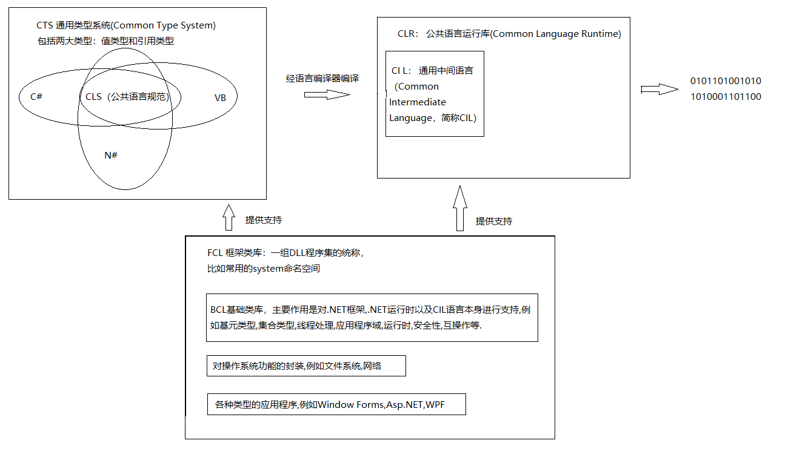

##### 1.2.2 c#的优点

跟Java很相似,支持更多

##### 1.2.3 托管代码与非托管代码

必须在.NET运行库下执行的代码称为托管代码managed code).这些包含托管代码的二进制单元称为程序集( assembly ),

#### 1.3 其他支持.net的编程语言

C#,F#,JS,VB,C++ .....

#### 1.4 .net程序集概览

.NET二进制文件不包含特定于平台的指令，它包含的是平台无关的IL ( Intermediate Language，中间语言）和类型元数据。清单用于描述程序集的元数据.

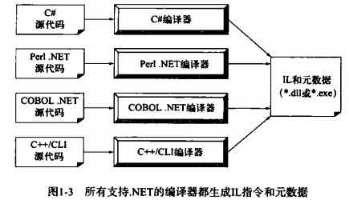

##### 1.4.1 cil的作用

对应于Java字节码,使用之前必须即时编译.

##### 1.4.2 .net类型元数据的作用

对应于Java的Class对象,可以用于反射,序列化等

##### 1.4.3 程序集清单的作用

描述程序集正常工作的外部程序集,版本号,版权等信息.

#### 1.5 CTS

- 类类型 每一种支持.NET的语言至少要支持类类型( class type）的概念，这是OOP的基础。
- 接口类型
- 结构类型
- 枚举类型
- 委托类型 类型安全的C风格指针
- 类型成员 构造函数 方法 属性 索引器 常量 等等
- 内置数据类型 Int short等等

#### 1.6 CLS

CTS的一个子集,编译器遵循以下规则

- CLS规则仅适用于类型中向定义它的程序集以外公开的部分。

#### 1.7 CLR

CLR中最重要的部分是由名为mscoree.dll的库（又称公共对象运行库执行引擎）物理表示的。

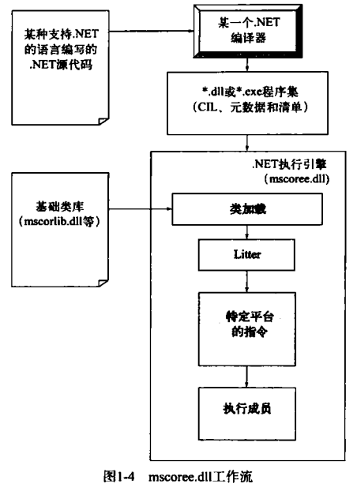

#### 1.8 程序集/命名空间/类型的区别

命名空间 -- 包

##### 1.8.1 microsoft根命名空间的作用

与windows操作系统交互使用

##### 1.8.2 以编程方式访问命名空间

##### 1.8.3 引用外部程序集

除了命名空间还要告诉编译器实际CIL定义的程序集名字,大多数程序集位于 全局程序集缓存( Global Assembly Cache，GAC）的特定目录下

#### 1.9 使用ildasm.exe探索程序集

#### 1.10 .net的平台无关性

当微软发布C#语言和.NET平台时，也发布了一整套正式的文档来说明C#和CIL语言的语法及语义、.NET程序集格式、核心.NET命名空间以及假定的.NET运行时引擎的结构（叫做虚拟执行系统，即VES ).

.NET领域中的另外一个缩写词CLI ( CommonLanguage Infrastrcture，公共语言基础设施)

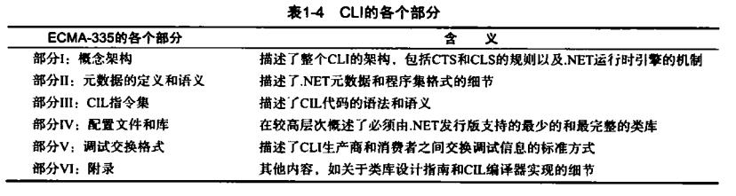

### 第2章　构建c#应用程序

#### 2.1 .net framework 4.5 sdk的作用

安装.NET的SDK以后会有各种工具,具体位置版本不同

> C:\Windows\Microsoft.NET\Framework64\v4.0.30319

#### 2.2 用csc.exe构建c#应用程序

##### 2.2.1 指定输入输出目标

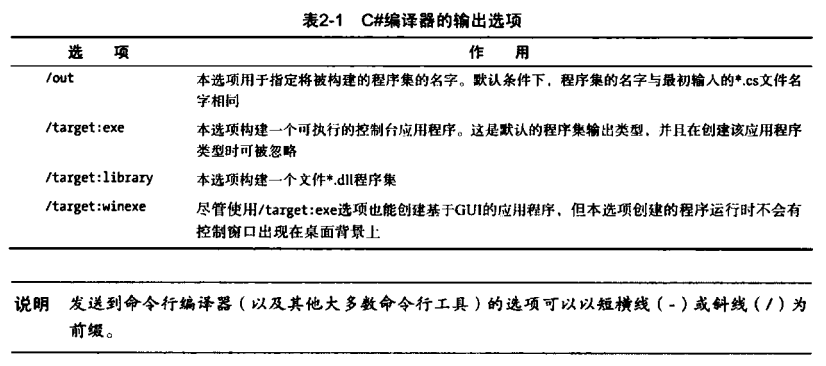

##### 2.2.2 引用外部程序集

命令行使用 /resource:名称空间

##### 2.2.3 引用多个外部程序集

使用分号分隔多个引用

##### 2.2.4 编译多个源文件

支持通配符

##### 2.2.5 使用c#响应文件

都使用命令会导致命令过长,可以使用response file进行配置.

文件后缀名是rsp,使用的时候用 csc @文件名

系统默认是自带一个rsp文件的,如果希望取消 /noconfig

#### 2.3 使用notepad++构建.net应用程序

ctrl+space 可以提示

#### 2.4 使用sharpdevelop构建.net应用程序

免费

#### 2.5 使用visual c# express构建.net应用程序

#### 2.6 使用visual studio构建.net应用程序

可视化,代码阅读等等,终归是工具,选择合适自己的即可.

## 第二部分　c#核心编程结构

### 第3章　c#核心编程结构ⅰ

#### 3.1 一个简单的c#程序

##### 3.1.1 main()方法的其他形式

返回值可以是void , int ; 默认访问修饰符是私有

##### 3.1.2 指定应用程序错误代码

Windows操作系统默认返回值保存在 **%ERRORLEVEL%** 的环境变量里面

##### 3.1.3 处理命令行参数

exe 后面添加即可

##### 3.1.4 使用visual studio指定命令行参数

#### 3.2 有趣的题外话：system.environment类的其他成员

可以获取系统的各种参数

#### 3.3 system.console类

可以设置控制台的各种属性,包括背景色,声音,大小等

##### 3.3.1 使用console类进行基本的输入和输出

##### 3.3.2 格式化控制台输出

占位符 {数字}

##### 3.3.3 格式化数值数据

{数字:格式 位数}  比如,{0:n2}表示用第一个数字填充,基本数字两位小数

##### 3.3.4 在控制台应用程序外格式化数值数据

string.Format() 参数里面也是可以使用的

#### 3.4 系统数据类型和相应的c#关键字

C#的数据类型关键字是System命名空间的简化

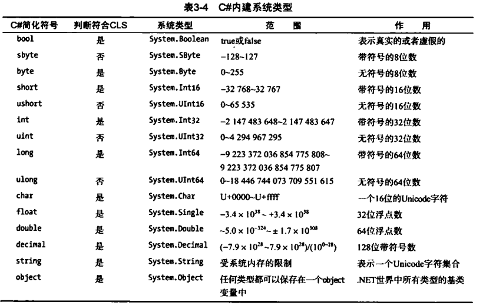

##### 3.4.1 变量声明和初始化

基本类型使用没什么差别

##### 3.4.2 内建数据类型与new操作符

所有类型都支持new关键字

##### 3.4.3 数据类型类的层次结构

所有类型都派生自System.Object,许多数值类型派生自System.ValueType,在栈上分配;其他的在堆上分配

##### 3.4.4 数值数据类型的成员

具有最大值,最小值等属性,等同于Java的包装类

##### 3.4.8 system.datetime和system.timespan

##### 3.4.9 system.numerics.dll程序集

BigInteger 和 Complex,使用的时候需要添加引用

#### 3.5 使用字符串数据

##### 3.5.4 定义逐字字符串

@字符串 ,这里的字符串就不会被解析了

字符串也是不可变,可变就用StringBuilder

#### 3.6 窄化和宽化数据类型转换

类型提升和转换

##### 3.6.1 checked关键字

可以检测强制类型转换的溢出情况,若溢出则抛异常

##### 3.6.2 设定项目级别的溢出检测

编译器支持 /checked标志位 

##### 3.6.3 unchecked关键字

#### 3.7 隐式类型本地变量

var

##### 3.7.1 隐式类型变量的限制

不能充当参数 返回值 自定义类型字段

##### 3.7.2 隐式类型数据是强类型数据

它只是编译器类型推断,不是动态类型

##### 3.7.3 隐式类型本地变量的用途

LINQ

#### 3.8 c#迭代结构

#### 3.9 条件结构

### 第4章　c#核心编程结构ⅱ

#### 4.1 方法和参数修饰符

- 默认 -- 值传递
- out -- 引用,需要函数赋值,可以不用初始化
- ref --  引用,需要初始化
- params -- 可变数组
- 可选参数 -- 使用等号,必须放在最后,支持命名参数,使用冒号

#### 4.2 c#数组

System.Array 工具类

#### 4.3 枚举类型

- 可以控制底层存储类型  enum Type : byte{}

#### 4.4 结构类型

关键字struct,轻量的class

#### 4.5 值类型和引用类型

派生自System.ValueType,默认浅复制

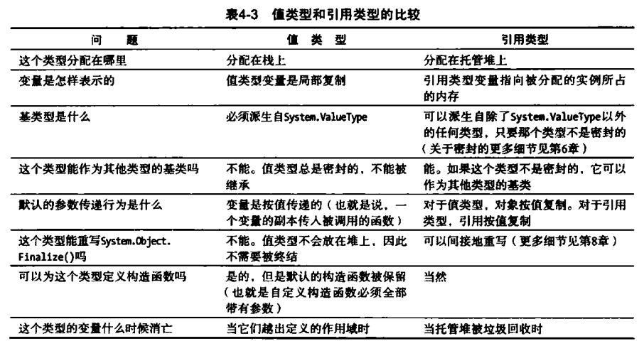

#### 4.6 c#可空类型

值类型(局部可空) -- 后缀?

Nullable<基本类型>

?? value 表示 假如为空则返回value

## 第三部分　c#面向对象编程

### 第5章　封装

成员 构造函数 this static(支持静态构造函数)

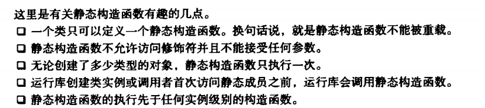

#### 5.6 c#访问修饰符


#### 5.7 第一个支柱：c#的封装服务

具有属性语法,使用的时候直接对属性设置(底层会调用get/set处理)

```C#
class Test{
    public int v{
        get{}
        set{}
    }
}
```

#### 5.8 自动属性

- 必须拥有读写
- 使用构造器初始化属性,属性具有默认值

```c#
class Test{
    public int v{get;set;}
}
```

#### 5.9 对象初始化语法

```c#
new Point(RED){X=1,Y=2};
```

#### 5.10 常量数据

const,一定要初始化,不可以在构造器修改

readonly可以在构造器修改

#### 5.11 分部类型

partial class Test{}

### 第6章　继承和多态

#### 6.1 继承的基本机制

- 冒号 类名,不支持多继承
- sealed 表示不可继承
- base 表示父类构造器

#### 6.5 oop的第三个支柱：c#的多态支持

- virtual 子类可以覆盖,子类必须使用 override 
- sealed 可以禁止某个方法被子类覆盖
- abstract 子类必须实现,virtual 子类可以覆盖
- 投影 子类通过new关键字覆盖掉父类投影

#### 6.6 基类/派生类的转换规则

- as 运行时转换,失败返回null
- is 判断类型

### 第7章　结构化异常处理

#### 7.1 错误、bug与异常

所有异常基类 System.Exception

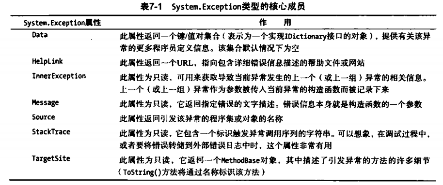

#### 7.4 配置异常的状态

- TargetSite 可以了解返回值类型,名称,引发异常的参数等信息
- StackTrace 可以了解错误源
- HelpLink URL/Windows Help
- Data 填充自定义数据

#### 7.5 系统级异常

System.SystemException ,自定义异常应该继承 System.ApplicationException,为了简单直接继承Exception

### 第8章　接口

#### 8.1 接口类型

- 接口命名以 "I" 开头
- 利用 yield 构建迭代器

## 第四部分　高级c#编程结构

### 第9章　集合与泛型

#### 9.1 集合类的动机

- System.Collections 集合类,常见的容器
- System.Collections.Specialized 包含非泛型集合类----非泛型需要转换类型,性能较低(装箱 值类型->引用类型,内存从栈复制到堆)
- System.Collections.Generic 泛型可以在栈上分配,更安全
- System.Collections.ObjectModel 用于观察者模式,使用和List\<T\>相同
- default(T) 可以设置泛型默认值

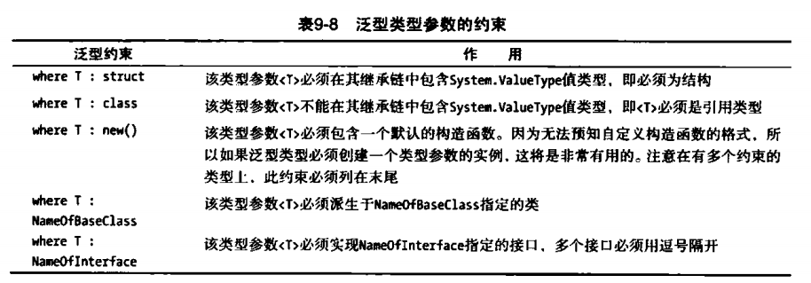

### 第10章　委托、事件和lambda表达式

- 委托就是回调函数,delegate 是关键字,自动派生自System.MulticastDelegate类.更像是动态代理模式. 

  使用方式跟Java的函数式接口很像

- 委托支持多路广播,重载操作符 += 可以方便添加,底层转化为Delegate.Combine()的调用,充当观察者模式的观察者列表

- Action 和 Func 是预定义委托,相当于 Java 的Supplier接口

#### 10.5 c#事件

- event 关键字,自动提供注册 注销 等操作,语法糖.底层会扩展两个隐藏的公共方法,add_ 和 remove_ 前缀
- 底层委托的参数 第一个System.Object 第二个是 System.EventArgs子类

#### 10.6 c#匿名方法

```c#
c.Handlers += delegate(){}
// lambda 表达式和Java的使用一样,只是使用 =>
```


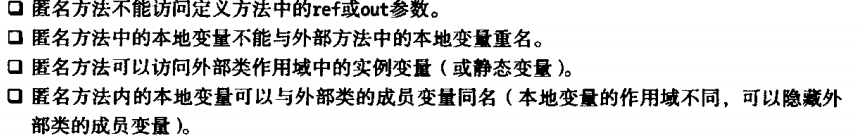

### 第11章　高级c#语言特性

- 索引器 使得List也可以支持中括号,甚至可以支持多维索引器

  ```c#
  T this[int row,int col]{get... set .....}
  ```

- 操作符重载 关键字 operator,必须使用static. 与之相关的复合操作会自动完成,比如 +=  , -= 等

- 自定义强制转换 使用explicit 和 implicit,方法名就是返回类型

- 扩展方法 第一个参数类型添加了 this

- 匿名类型 new {K=v},继承Object,覆盖Equals方法,但是没有覆盖 ==

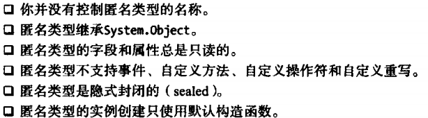

- 指针类型 需要使用unsafe代码块才能操作

  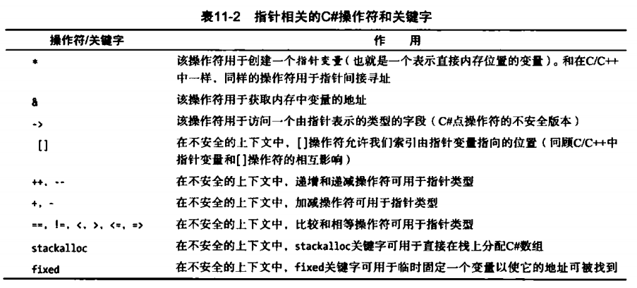

### 第12章　linq to object

- 延迟执行,整体括号起来调用ToArray可以立即执行
- ofType\<T\>() 可以过滤出T类型的数据
- 底层是 System.Enumerable的方法,扩展方法和泛型委托

### 第13章　对象的生命周期

- 可达性算法
- 标记-清除
- 分代回收
  - 0代 : 从没有标记为回收的新分配对象
  - 1代 : 上次标记过没被回收
  - 2代 : 一次以上垃圾回收仍没有被回收的对象
- System.GC 类,GC.Collect()可以强制回收垃圾
- System.Object.Finalize() 在极个别情况下,用到非托管资源的类
- 实现 IDisposable 接口,尽快处理资源释放
- using语法自动关闭资源
- Lazy\<\> 用于延迟数据的创建.

## 第五部分　用.net程序集编程

### 第14章　.net程序集入门

- 将多个类分散在同一个命名空间,using可以用于取别名
- 程序集格式
  - Windows文件首部,告诉OS如何处理
  - CLR文件首部,标记元数据和资源位置等
  - CIL代码 类型 清单
  - 可选程序集资源
- 私有 / 共有程序集 (私有需要n份副本) 
  - App.config 可以辅助管理程序集引用,相当于maven的POM文件
  - 共享库在 `C:\Windows\Microsoft.NET\assembly\GAC_MSIL`中
  - 生成名称会用到非对称加密,之后将dll安装到.NET的GAC里面
  - 跟 Java 的 Maven 相比确实麻烦

### 第15章　类型反射、晚期绑定和基于特性的编程

- Type.GetType() 反射用
- 动态加载dll, System.Reflection.Assembly类实现
- 晚期绑定 System.Activator类,默认加载 bing\Debug文件夹里的

### 第16章　动态类型和动态语言运行时

- dynamic 修饰,不是强类型,可以调用任意方法
- 可以作为成员,不可以使用Lambda表达式和C#匿名方法
- 动态类型简化延迟调用

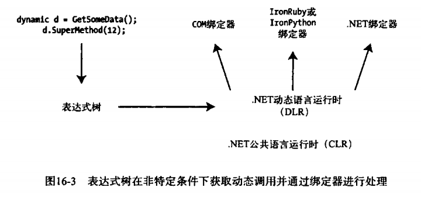

### 第17章　进程、应用程序域和对象上下文

- System.Diagnostics.Process 
- .NET可执行程序承载在进程的一个逻辑分区里,称为程序域
  - 包含多个程序域,也就是exe 或者 dll
  - 一个程序集可以被不同程序域调用
- System.AppDomain类允许创建程序域,动态加载任务.不可以单独卸载程序集,但是可以卸载程序域

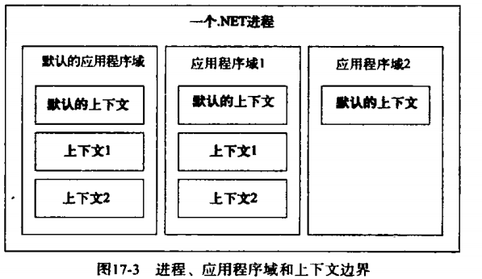

### 第18章　cil和动态程序集的作用

- CIL指令 以点开头的指令 ,作用 描述程序集结构
- CIL特性 用于限定CIL指令
- CIL操作码 实际逻辑实现,操作码是二进制数据,看到的是助记符
- IL_XXXX 称为代码标签,用于分支跳转
- 可以根据CIL语法格式编写程序,应用场景动态生成程序集 System.Reflection.Emit

## 第六部分　.net基础类库

### 第19章　多线程、并行和异步编程

- 任意时间点,一个线程只能运行在一个应用程序域中
- 委托会实现MulticastDelegate类,其中的Invoke方法是同步的.
  - 异步的实现 BeginInvoke 和 EndInvoke,参数用到了IAsyncResult接口类型
  - .Net Core不支持委托隐式异步调用

- System.Threading 命名空间
- System.Threading.Time 可以用于定时任务
- TPL(Task Parallel Library),位于System.Threading.Tasks,类似Java的 fork-join
- LINQ 类似Java的stream,并行版本也是
- async 和 await ,异步/阻塞处理

### 第20章　文件输入输出和对象序列化

- 分为 File 和 Directory,和对应的Info类,也是分为字节/字符流
- 序列化为类添加特性

### 第21章　ado.net之一：连接层

数据库交互 => JDBC

- 

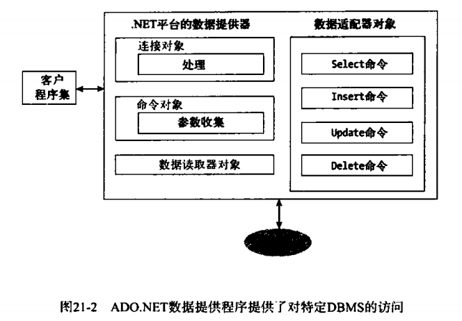

### 第22章　ado.net之二：断开连接层

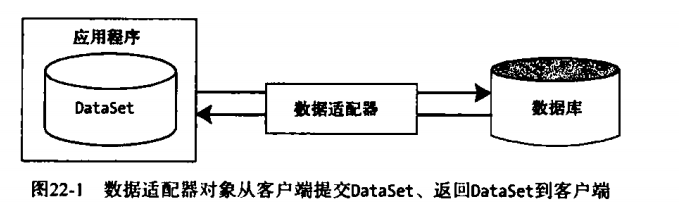

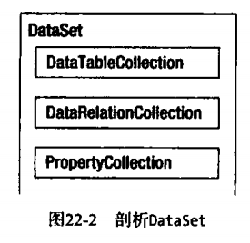

### 第23章　ado.net之三：entity framework

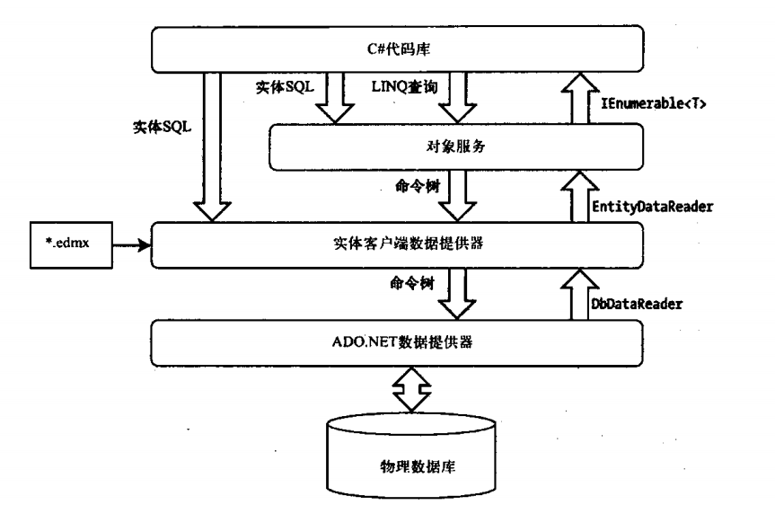

### 第24章　linq to xml简介

- System.Xml.Linq

### 第25章　wcf

分布式计算.

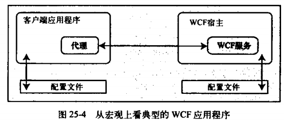

### 第26章　windows workflow foundation简介

声明式业务流程建模

## 第七部分　wpf

- 统一桌面API
- System.Windows.Application 运行中WPF实例
- System.Windows.Window 窗口,同级下还有很多功能
- 四个引用
  - PresentationCore.dll
  - PresentationFramework.dll
  - System.Xaml.dll
  - WindowsBase.dll
- MSBuild.exe 可以把XAML标记转为C#代码,推荐 Kaxaml 学习语法

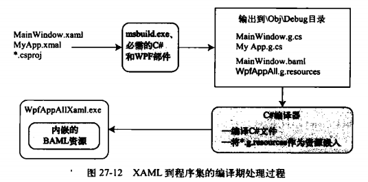

---

- xaml 文件的两个名称空间映射.NET命名空间 和 关键字
- WPF 使用图形保留模式,Shapes适合交互,Drawing适合复杂,Visual适合大量图形
- 对象资源是xaml的二进制对象

---

- 依赖属性 : 可以通过C#或者XAML进行设置,继承链要有DependencyObject,类中表示为一个公共静态只读属性

- 路由事件 : 
  - 冒泡事件 : 由内往外传递事件,可以在参数 e 的Handled属性设置为true停止
  - 隧道事件
  - 直接事件
- 逻辑树 : 类似DOM树,这里是XAML的逻辑结构
- 可视树 : 每个逻辑树对应一颗可视树

## 第八部分　asp.net web form

### 第32章 asp.net web form

了解一下,用到再回头看