# 计算机网络:自顶向下方法

- 书籍作者:詹姆斯·F.库罗斯  基思·W.罗斯
- 笔记时间:2022.4..26

## 第1章 计算机网络和因特网

### 1 因特网	

- 软硬件角度

  - 像手机 PC 智能联网设备等称为**主机**或者**端系统**

    端系统通过 **通信链路** **分组交换机** 连接在一起

    链路的 **传输速度** 用 bit/s 度量,数据会分段发送,称为 **分组**(packet)

  - 端系统通过 **因特网服务提供商**(ISP) 接入因特网

    因特网标准由 **因特网工程任务组(**IETF) 制定,标准文档称为 **请求评论**(RFC)

- 应用程序角度

  - 涉及多个相互交换数据的端系统的程序称为 **分布式程序**
  - 数据通过 **套接字接口**(socket interface) 进行交换

- 协议

  - 双方约定好的规则,比如上课举手代表疑问,这是课堂的协议
  - 网络协议:定义了多个通信实体之间交换的报文格式和顺序,以及报文收发后的动作

### 2 网络边缘

- 通常把因特网相连的计算机和其他设备称为端系统或者主机

  主机可分为 客户端 和 服务器,如今大部分服务器属于 大型数据中心

  物联网(Internet of Things,IoT)

- 接入网

  - 指将  端系统 连接到 边缘路由器的网络

  - 宽带接入方式分为 数字用户线(digital subscriber line,DSL) 和 电缆

    DSL是电话线,电话公司一般也是ISP

    电缆因特网接入则是有线电视线接入,因为有光纤参与,也成为 混合光纤同轴系统(Hybrid Fiber Coax,HFC),重要特征可以共享广播媒体

  - 单根电话线可以通过频分复用,同时进行网络和电话通信

    接入因特网需要调制调解器比如DSL调制调解器,电缆调制调解器(cable modem)

  - 光纤到户(Fiber To The Home,FTTH),分为有源(active)和无源(passive)光纤网络(Optical Network),AON本质是交换以太网

  - 家庭接入使用  以太网和WiFi ,广域无线接入 3G和LTE

- 物理媒体

  - 分为导引行型媒体和非导引行型媒体(unguided  media),区别在于是否沿着媒体前进,比如光纤和无线传播的区别

  - 双绞铜线,一直用于电话网,绞合为了减少相互电气干扰,一对电线构成一个通信链路.传输速度受距离影响交大

    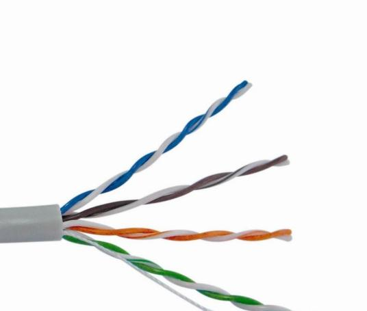

  - 同轴电缆,由两个同心的铜导体组成,之间隔着绝缘体/铝箔等保护层

    

  - 光纤,使用光脉冲替代电信号

    

  - 无线电信号,分为陆地和卫星

### 3 网络核心

- 分组交换

  - 端系统彼此交换**报文**(message),报文可以被分为多个小数据块,称为**分组**(packet),分组通过分组交换机进行传输

  - **存储转发**(store-and-forward transmission),发送之前必须收到完整packet,

    - 假设链路传输速率R,packet的大小L,那么发送时间达到 L/R,不考虑传输时间的话,N段链路时延达到  NL/R

  - 排队时延和分组丢失,每台分组交换机都有多条链路,每条链路对应一个输出缓存

    - 如果队列不为空,那么分组就需要队列里面等待,这段时间称为 **排队时延**

    - 如果队列已经满了,那么新到达的分组会被丢弃,称为 **分组丢失**

  - 转发表和路由选择协议

    - 每台路由器都保存一张转发表,记录分组的目的地址和输出链路的映射
    - 路由选择协议可以自动设置转发表
    - 利用 traceroute 可以查看packet经过哪些路由器

- 电路交换

  - 传统的电话网络就是电路交换,预留了端系统间沿路径跟通信需要的资源,

    连接路径是固定的,称为一条**电路**(circuit)

    然而分组交换则不是,甚至可能丢包

  - 电路通过频分复用(Frequency-Division Multiplexing)或者时分复用(Time-Division Multiplexing)

    - FDM是连接期间链路位每条链接专用一个频段,电话网络里这恶频段宽度4kHZ,比如电台使用88MHz~108MHz

    - TDM是时间划分为固定的帧,帧里面划分时隙,时隙被链路指定

      假设具有24时隙,比特速率1.536Mbps的链路,需要 0.5s 建立链路,

      那么传输一个640kb文件需要 0.5 + 640/(1.536*1000/24) = 10.5s

    - 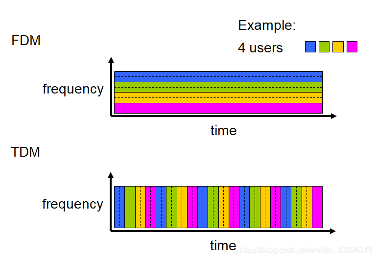

- 对比

  - 分组交换时延不确定,可以提供更大带宽,并且更简单
  - 案例1:假设多个用户共享1Mbps链路,用户活跃周期变化,活跃时候100bps数据传输,10%的概率活跃
    - 链路交换支持10个用户
    - 分组交换支持约30个用户,当35个用户有11个同时活跃时的概率约0.0004
  - 案例2:假设10个用户,某个用户突然数据传输激增,产生1000个1000比特分组,其余用户静默,
    - 链路交换只能使用其中一个时隙,需要10s时间传输
    - 分组交换可以使用1Mbps的速率传输,只需要1s

- ISP互联

  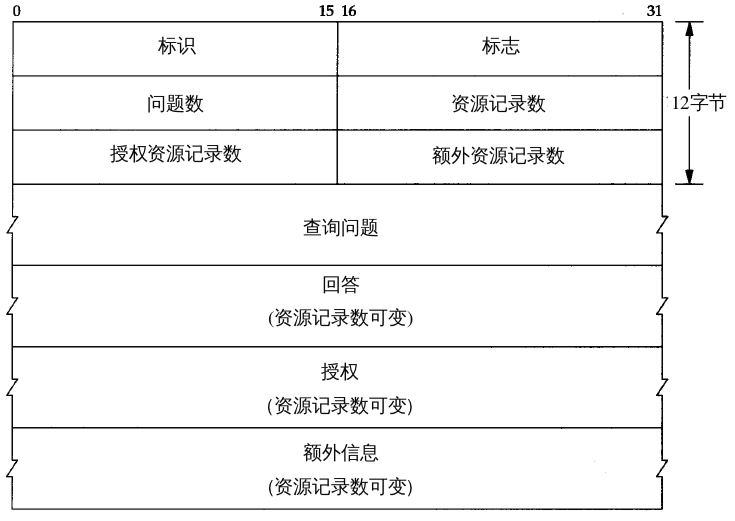

### 4 时延 丢包 吞吐量

- 时延(delay)

  - 处理时延:检查分组头部和决定该分组去往何处,一般是微秒级别

  - 排队时延:分组在链路上等待传输时间,取决于队列长度.一般微秒到毫秒级别

  - 传输时延:分组长度/传输速率,一般微秒到毫秒级别

  - 传播时延:距离/传播速度,广域网是毫秒级别

    

  - 排队时延一般使用平均值,方差和超过某些特征值的概率表示

    假设R是传输速率(队列往外),a是分组到达队列的平均速率,L是分组长度,那么队列的输入速率是 aL ,把  输入/输出 的比率称为 **流量强度**, aL/R

    显然,当aL/R > 1,队列就会开始积攒分组

  - 如果分组周期性到达,不会有排队时间

    如果分组激增,可能会有很高平均排队时延,第一个没有,第二个等待1,第n个等待n-1发送时间

    正常情况下,分组到达情况是随机的,

    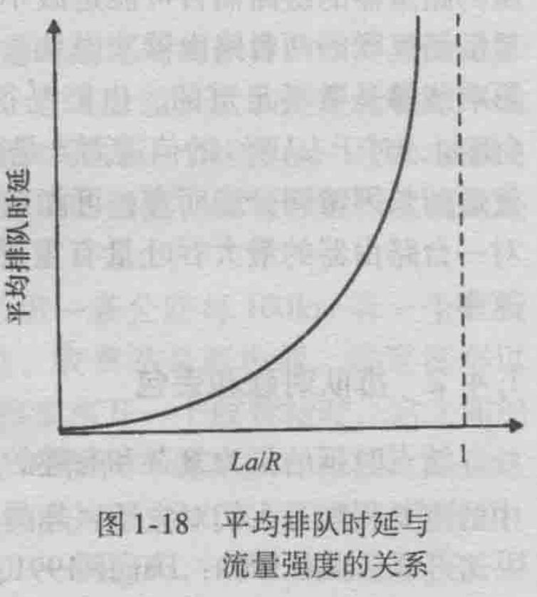

- 丢包
  
  - 分组丢失的比例随着流量强度增加而增加,可以使用重发机制保证到达
- 端到端时延
  - 假设链路没有发生拥塞,不考虑排队.那么时延 = N(d~proc~ + d~trans~ +d~prop~)
  - traceroute 可以了解路径上的实验情况
- 吞吐量
  - 平均吞吐量 单位时间内接收到比特数
  - 链路的吞吐量取决于瓶颈链路,假如多个用户共享一条链路就会均分链路吞吐量

### 5 协议层次

- 协议分层

  - **协议栈**,各层所有的协议,TCP的五层结构,OSI的7层结构

    - 应用层的信息分组称为 message,

      传输层的信息分组称为 segment

      网络层 datagram,

      链路层 frame,

  - 每一层,一个分组具有两个部分,首部和有效载荷(payload)

### 6 面对攻击的网络

- 攻击分类

  - 植入有害程序,将宿主机加入僵尸网络等

    病毒:需要某种形式交互的恶意软件,比如电子邮件病毒

    蠕虫:不需要明显用户交互,比如某个程序本身有漏洞,蠕虫攻击该漏洞

  - 拒绝服务攻击(Denial-of-Service DoS),让服务器等瘫痪

    - 弱点攻击
    - 带宽泛洪,让目标接入链路拥塞
    - 连接泛洪,大量TCP半开/全开连接

  - 嗅探分组(packet sniffer)

  - IP欺骗(spoofing)

## 第2章 应用层

### 1 应用层协议原理

- 有CS体系结构,著名应用 FTP / Web  /Telnet  / Email 等,随着服务器规模的扩大会形成数据中心等配备大量主机的结构

  P2P体系结构,著名应用 文件共享,对等放协助下载加速器(迅雷),视频会议

- 进程通信
  
  - 跨越端系统的通信通过报文交换进行,通过 套接字 的软件接口和其他进程进行报文的交换
  
    也被称为 应用程序和网络之间的API,
  
  - 程序只能在应用层设置相应的套接字控制信息,比如 协议类型,协议的部分参数( 最大缓存 之类)
  
    几乎不可以控制传输层
  
  - 进程寻址, 目标主机的地址(IP),目标进程的唯一标识符(端口)

- 传输层可以提供的服务要求

  - 可靠的数据传输,通过某些手段保证数据正确/完整的传输到目的地

  - 吞吐量,发送端往接收端交付比特的速率,具有吞吐量要求的应用成为 带宽敏感的应用,吞吐量越大越好, 尽最大努力满足

  - 定时,延迟保证 , 尽最大努力满足

  - 安全性, 常见的传输层协议(TCP/UDP)默认是没有提供安全保证的, 

    后来开发出 安全套接字层(Secure Socket Layer)对其进行加强

    SSL不是新协议,而是对TCP的一种加强,是在应用层实现的,所以是先加密明文,再发给TCP

- 应用层协议
  -  交换报文类型(请求/响应)  
  -   类型语法(字段及描述) 
  -  字段的语义  
  -  如何/何时发送报文

### 2 Web 和 HTTP

- HTTP(HyperText Transport Protocol),由两个程序实现(客户端/服务端),

  - Web页面本身由对象组成,对象就是一个文件(html,jpeg,png等),可以通过URL寻址

    Web服务器实现了HTTP的服务端,存储Web对象

  - HTTP服务端以 TCP 为支撑,根据请求报文响应对应的数据,本身不会存储这次连接的相关信息

    所以称为 无状态协议

  - HTTP默认使用持续链接(持久连接,persistent connection),在传输复杂页面时候可以避免多次握手

- HTTP请求报文格式

  ```shell
  # 每个请求报文使用ASCII编写,每一行结尾都是 cr lf(回车 换行)
  GET / HTTP/1.1							# 请求行,可以看到请求方法 请求路径 协议版本
  Accept-Encoding: gzip, deflate, br		#其他称为 首部行
  Accept-Language: zh,zh-CN;q=0.9,en;q=0.8
  Connection: keep-alive					#使用长连接,短链接是 close
  Host: www.baidu.com						#请求的目的主机,web代理高速缓存要求
  User-Agent: Mozilla/5.0 (Windows NT 10.0; Win64; x64) AppleWebKit/537.36 (KHTML, like Gecko) Chrome/101.0.4951.54 Safari/537.36
  										# 指明代理(浏览器类型等)
  										# 请求体在POST时候可以放置 表单 的数据
  ```

  

- HTTP响应报文格式

  ```shell
  HTTP/1.1 200 OK								# 状态行,指明 协议类型 状态码 状态信息
  Access-Control-Allow-Credentials: true
  Access-Control-Allow-Origin: https://image.baidu.com
  Bdqid: 64c44a1230633102
  Connection: keep-alive						# 保持长连接
  Content-Encoding: gzip
  Content-Type: text/html; charset=UTF-8
  Date: Tue, 10 May 2022 03:33:42 GMT			#检索发送该文件的服务器时间,
  											#假如有修改时间,那么是 Last-Modified
  Search_result: OK
  Server: Apache
  Vary: Accept-Encoding
  Transfer-Encoding: chunked
  ```

- 使用cookie来跟踪用户信息,请求和响应报文都含有cookies字段,同时cookie作为文件保存在浏览器和服务器数据库

- Web缓存,也称为代理服务器,作用如同电脑的多级缓存,加速请求获取

  通过内容分发网络(Content Distribution Network)Web缓存器与来越重要

  - 条件GET,GET请求并且包含 If-modified-since,值是Last-modified,

    假如初始服务器返回对应内容则缓存服务器会更新

### 3 电子邮件

- 

- SMTP(Simple Mail Transfer Protocol),历史悠久,是Email的核心,用于服务器之间的通信控制
  - 由于历史问题,限制报文的体部分只能使用ASCII表示
  - 依赖于TCP协议,不会经过中间服务器

- |      | HTTP                    | SMTP                       |
  | ---- | ----------------------- | -------------------------- |
  | 类型 | 拉协议(pull),下载到本地 | 推协议(push),发送到远程    |
  | 限制 |                         | 体只能用ASCII,其他需要转码 |
  | 封装 | 放到各自的HTTP响应报文  | 所有保温对象放到一个报文里 |

- 因为SMTP主要是负责推送,所以需要其他协议来获取邮件

  - 第三版邮局协议(Post Office Protocol-Version 3)
    - 授权认证,用户名和密码
    - 事务处理,获取报文
    - 结束会话
  - 因特网邮件访问协议(Internet Mail Access Protocol)
  - HTTP

### 4 DNS

- Domain Name System,域名系统,是一个分布式数据库,

  DNS服务器通常是运行在BIND(Berkeley Internet Name Domain)的Unix机器

  DNS基于UDP协议,使用53号端口

- DNS提供的服务

  - 主机别名,一个IP可以同时对应多个域名
  - 邮件服务器别名,允许和Web服务器使用相同的主机名
  - 负载均衡,

- 架构

  - 分布式层次数据库

    - 根DNS服务器,由13个不同的组织管理,提供顶层域服务器的IP
    - 顶级域服务器(Top-Level Domain),维护顶级域(com,cn,fr,org等)
    - 权威DNS服务器,公共可访问
    - 本地DNS服务器,具有递归和迭代查询的特点,扮演DNS缓存

    

- DNS服务器存储了资源记录(Resource Record),提供主机名与IP地址的映射

  | Name         | Value | Type                     | TTL  |
  | ------------ | ----- | ------------------------ | ---- |
  | bar.foo.com  | IP    | A(主机名)                |      |
  | foo.com      | IP    | NS(域)                   |      |
  | bar.foo.com  | IP    | CNAME(规范主机名)        |      |
  | mail.foo.com | IP    | MX(邮件服务器规范主机名) |      |

- DNS报文

  - 前12个字节表示首部区域
  
    - 标识(2字节),标记此次查询,查询和响应是一样的
    - 标志表明查询类型,授权,截断,递归查询等
    - 问题数,通常为1
    - 回答资源数,记录数通常为0
    
  - 问题区域
  
    - Name 查询名称,不定长度,是主机名称
    - Type查询的类型,比如A 是 IPv4地址,NS 名字服务器等
    - Class ,IN标识Internet数据,通常为1
  
  - 回答区域
  
    - 之前的标志每个都有定义,回答RR数代表有几条解析结果
    - 每个资源记录(RR)除了Name,Type,Class,还有TTL(Time to Live),DataLength(地址长度几字节),Addr
  
  - > 可以使用nslookup 来进行DNS测试
  
    - 

- 注册域名
  
  - 注册登记机构(registrar)是一个商业实体,验证域名并加入DNS数据库

### 5 P2P文件分发

- P2P自扩展性

  - 分发时间是所有N个对等放得到文件所需时间,假设N个客户端,文件大小F比特,服务器上传速率u,下载速率d,

    那么最小分发时间 D~cs~ ≥ max{NF/u,F/d},时间随着客户端增加而增加

  - P2P中因为每个对等方既是服务器又是客户端,所以系统总上传带宽是全体总和,D~p2p~ = max{F/u,F/d,NF/Σu}

- BitTorrent

  - 参与一个特定文件分发的所有对等方集合成为一个洪流(torrent),对等方彼此下载等长文件块(chunk),大小256K,

    当一个对等方下载时也会上传文件块

  - 每个洪流具有一个基础设施节点,称为追踪器(tracker),对等方加入洪流时会向追踪器注册并周期性通知追踪器

  - 例子:

    - 当Alice加入网络时会从追踪器获取对等方列表,并试图与列表成员建立TCP连接,成功建立连接的称为临近对等方
    - Alice周期性询问临近对等方的块列表,请求块时候会向邻居询问并优先请求稀缺快(稀缺块是指副本最少的块)
    - Alice获取的时候会以当前最高速率上载的邻居排序,取最高4个为集合,这些对等方称为疏通,每个30s Alice 也要向一个邻居发送一个数据块

### 6 视频流和内容分发网络

- 因特网视频

  - 随着图像质量的提升,因为视频帧率固定(24/30),那么每秒钟要发送的比特数也会提升,

    低质量视频 100kbps,高分辨率电影 3Mbps,4K流 10Mbps,

    单一2Mbps视频在67分钟内会消耗1GB流量

  - 一般准备不同比特率的版本(300kbps 1Mbps 3Mbps等,对应标清,高清,超清)

- HTTP流和DASH

  - HTTP流中,视频只是服务器的一个普通文件,用户观看视频时从缓存直接获取帧并解压缩展示

  - 对相同编码的视频,也会受限于用户带宽,就是卡顿

  - 出现了 经HTTP的动态适应性流 (Dynamic Adaptive Streaming over HTTP),

    视频编码为几个不同比特率的版本,客户端动态请求不同版本的视频数据块

- 内容分发网络

  - 单数据中心缺点: 

    - 假如距离过长,时延过长
    - 重复发送相同数据
    - 没有容灾备份

  - CDN就是服务器副本,向周边客户端提供服务

    - 服务器两种安置原则, 

      深入,通过和ISP中部署服务器集群深入到ISP的接入网

      邀请做客,通过在关键位置建造大肌群邀请ISP做客,放在因特网交换点(IXP)

  - CDN操作

    - 当发起DNS请求的时候,DNS权威服务器返回的是CDN的主机名,经过解析后,最后返回CDN的IP

    - 集群选择策略,

      地理位置最近(geographically closet),基于当前流量条件

  - 案例

    - Netflix,Web网络放在亚马逊云上,内容分发之前上传到云上,云主机生成不同格式,比特率版本的视频,向CDN发送副本

      CDN中一般保存当前最热视频,使用推告诉缓存,因为仅仅分发视频,所以不需要DNS重定向

    - Youtube,使用 拉高速缓存 和 DNS 重定向,没有使用DASH,应用的是HTTP流,使用HTTP字节范围请求来限制传输的数据流

    - 迅雷看看,使用P2P视频交付

### 7 套接字编程

- 网络应用程序

  - 有标准协议(如 RFC或其他文档)中定义的操作实现,称为是开放的.比如谷歌浏览器于Apache服务器通信
  - 客户端/服务器使用的应用协议是么有公开的

- UDP套接字编程

  - 需要在分组指定目标的IP地址和端口号,至于本机地址和端口操作系统会自动填充

- TCP套接字编程

  - 服务器端程序具有两个套接字,

    一个用于三次握手的欢迎套接字,发生在传输层,对程序透明

    一个用于数据传输的连接套接字

## 第3章 传输层

### 1 传输层服务

- 传输层为不同主机的应用程序提供了逻辑通信,传输层协议在端系统中实现,把应用层报文转为传输层报文段(segment),并添加传输层首部.

  网络路由器仅仅到网络层,根据IP尽心数据分发,不会检查传输层

  网络层为不同主机提供逻辑通信

- IP 的服务模型是尽力而为交付服务(best-effort delivery service),本身是不可靠服务(unreliable service),

  本身是主机间的通信服务,传输层负责转为进程间的通信服务,称为传输层的多路复用(transport-layer multiplexing)与多路分解(demultiplexing)

  - TCP/UDP可以在报文段首部添加一些差错校验字段提供完整性检查,进程到进程的数据交付,

    这两种服务是UDP所能提供的.

  - TCP还提供了拥塞控制(congestion control),流量控制,序号,确认,定时器

### 2 多路复用与多路分解

- 假定计算机正在下载Web页面,同时运行一个FTP会话和两个Telnet会话,那么网络层的数据到达后需要知道该把数据给哪个进程
  - 进程通过套接字(一个/多个)接收/发送数据,每个套接字都有唯一标识符,
  - 在接收端,运输层检查报文字段(端口等信息),标识套接字并将报文段定向到套接字,称为 多路分解
  - 在发送端,从不同套接字收集数据块,并未数据块添加首部信息从而生成报文段,然后传递给网络层,称为 多路复用
  - 唯一标识套接字的就是端口号(分为 目的 和 源 端口)
  - 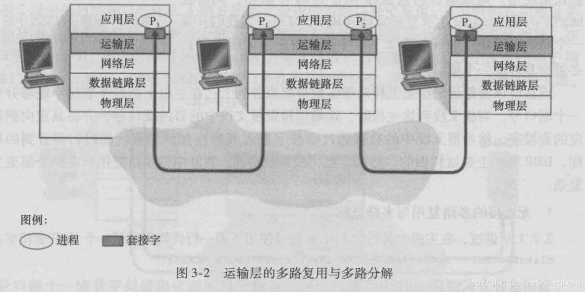

- 有无连接的复用与分解
  - UDP的套接字标识是一个二元组,包含目的IP和目的端口
  - TCP的套接字标识是一个四元组,(源IP,源端口,目的IP,目的端口),当源IP/端口不同时,会创建不同的套接字,除非携带了初始创建链接的请求
  - 一个进程可以拥有多个连接套接字,通过多线程处理不同套接字是Web服务器常用手段

### 3 无连接运输:UDP

- 一个最简化的模型,单纯传输数据,几乎不提供额外服务(校验/纠错等),只需要多路复用分解

  也就是添加源/目的端口号,以及一些校验字段就可以传给网络层

- 使用UDP的原因

  - 需要低延迟,比如直播/语音通话等
  - 无需连接,比如chrome浏览器的QUDP协议
  - 无连接状态,分组首部开销小

  - 案例有 DNS / SNMP / 实时的流等

- UDP报文结构

  - 首部只有8字节,

  - UDP校验和计算: 

    - 生成,对校验值设置为0,对所有16比特字求和, 遇到溢出就回卷(加到结果上),对和取反码(0变1)

    - 校验,对所有16比特字求和,结果需要是每个位都是1

    - > 假设 sum = a + b + c + d + 0,sum代表最终加法和,字母表示16比特字,0代表初始校验值,那么 校验值等于 sum取反,记为 !sum, 并且 sum + !sum = 11111111111
      >
      > 校验时候 result =a + b + c + d  + !sum = sum + !sum = 11111111,假如出现一个0,说明错误

  - 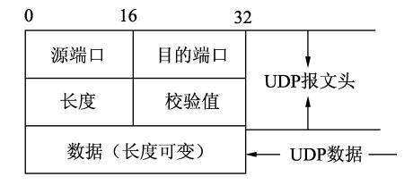

### 4 可靠数据传输原理 

- 可靠数据传输协议位上层实体提供的服务抽象是数据通过可靠信道传输,数据比特不会发生损坏或者丢失

- 构造可靠传输协议

  - rdt1.0,假设底层信道完全可靠

    - 因为不必担心数据错误问题,直接发送和接收

  - rdt2.0,假设底层是不可靠信道,但是顺序接收

    - 对比打电话,假如听到模糊语音可以让对方重复一遍,

      接收到顺坏数据,让对方重新发送的机制称为 自动重传请求协议(Automatic Repeat reQuest)

    - 需要另外三种协议功能来处理存在比特差错的情况:

      - 差错检测,需要一种机制检测合适出现了比特错误.
      - 接收方反馈,肯定确认和否定确认
      - 重传

    - 发送方完成发送后进入等待确认状态,不可以传送更多数据,这种协议称为 停等协议(stop-and-wait)

      - 看起来已经可用且见到那,但是对于ACK/NAK丢失未作处理
      - 通过重传冗余分组让接收端返回ACK/NAK,通过在首部添加序号让接收端可以区分数据分组
      - 对于停等协议只需要一个比特位,可以去掉NAK

  - rdt3.0

    - 需要解决 如何检测丢包 以及 丢包后如何处理
    - 可以通过等待一定时间,假如没有接收到确认,则认定丢包
      - 等待时长至少大于数据包在两者之间传递一个来回的时间,但是无法区分是丢失还是时延过长
      - 基于计时的重传机制需要一个倒计时器(countdown timer)
    - 到这里,实现了一个可靠的数据传输,用到了 校验和,序号,定时器,确认分组技术
  
- 流水线可靠数据传输协议

  - rdt3.0是一个正确的协议,但是性能不行,问题是它是停等协议

    > 假设有两台主机,往返传播时延(RTT)是30ms,通过发送速率R=1Gpsd相连,
    >
    > 发送长度 L = 1000字节的数据需要 t = L/R = 8 μs
    >
    > 接收到ACK的时刻 t = RTT/2+L/R = 30.008 ms
    >
    > 信道的利用率, 发送方发送比特进入信道时间与发送时间之比 U~sender~ = L/R  / (L/R + RTT/2) = 0.00027

  - 流水线方式发送,允许等待确认之前发送多个报文

    - 影响,需要增加序号范围,需要增加缓冲,差错恢复使用回退N步和选择重传

    - 回退N步协议(Go-Back-N),流水线允许的最大未确认数N.

      - N也成为窗口长度,GBN也称为滑动窗口协议(sliding-window protocol)
      - 为什么不采用无限制长度? 流量控制是原因之一.
      - 首部字段中会有k位表示序号,N的长度为 2^k^
      - 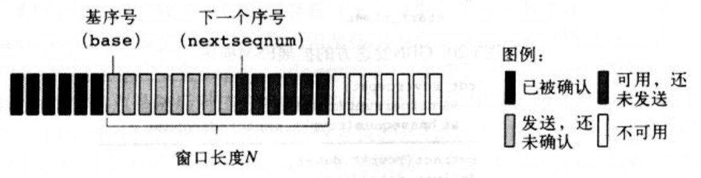

      - 发送方必须响应三种类型的事件
        - 上层的调用,检查发送窗口是否已满,假如已满可以返回/加入缓存等操作
        - 接收ACK,对序号为n的分组采取累计确认(cumulative acknowledge),表示接收方以正确接收到包括n之前的所有分组
        - 超时事件,发送方超时后重传所有已发送但未确认分组
      - 接收方
        - 如果分组n正确接收,返回n;
        - 其他情况丢弃
      - 这种协议对接收方来说简单

  - 选择重传

    - 在GBN中发生差错会重传大量分组,选择重传(Seletctive Repeat)只重发认为丢失的分组
    - 接收方会缓存失序分组,知道所有丢失分组接收完整才会交付给上层
    - 发送/接收方不同步会带来严重问题,当窗口长度大于序号长度
      - ACK丢失,发送方的重发分组被当成新分组
      - 分组丢失,无法区分新分组还是重发
      - 窗口长度必须小于等于序号空间的一半
    - 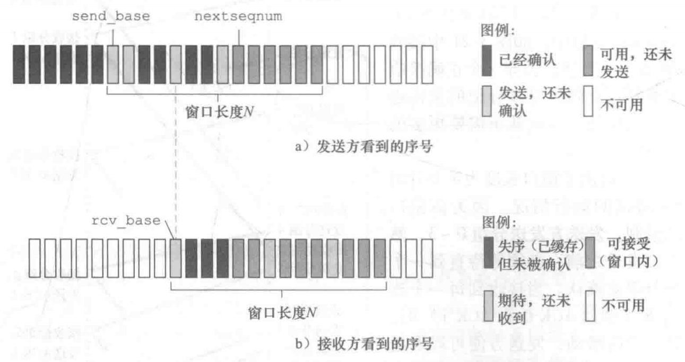

  - 当信道是网络时,分组重排序是不可避免的,可以吧信道看成在缓存分组,并在将来任意时刻发送分组,

    由于序号可以被重新使用,对于冗余分组必须十分小心

    必须确保一个序号不被重新使用,直到发送方确信任何先前发送的序号不再存在.通过设置最大存活时间,一般假设大约3min

### 5  面向连接的传输:TCP

- TCP连接

  - 面向连接(connection-oriented)是因为发送数据之前双方必须先握手,即通过相互发送某些信息建立确保数据传输的参数

  - 事实上TCP连接只是逻辑连接,只存在于端系统,路由器看到的是数据报而不是连接

  - TCP连接是全双工服务(full-duplex service),也就是数据可以双向流动

    同时也是点对点(point-to-point),不存在多播(一对多)

- 连接过程

  - 三次握手,由客户端主动发起一个TCP特殊报文,服务器接收并响应,不带有负载

    客户端接收再响应特殊报文,这次可以承载有效载荷

  - 建立TCP连接后,客户端通过套接字把发送数据引导到 发送缓存 (在三次握手时设置的缓存之一)

    - TCP可以缓存中获取一定量数据并放入报文段,数量受限于 最大报文段长度(Maximum Segment  Size),指的是纯数据,不包含TCP首部

    - MSS通常根据本地主机的最大链路层帧长度(Maximum Transmission Unit,最大传输单元)来设置,以太网和PPP协议的MTU都是 1500 字节

      MSS典型值 1460,TCP/IP首部 40字节,

- TCP报文段结构

  - 两个16位端口号,用于多路复用/分解

    32位序号和确认号,用于可靠数据传输服务

    4位首部长度(数据偏移),表明首部长度.TCP首部长度可变(20-60),以四字节为单位

    选项字段用于协商MSS,还定义了时间戳选项

  - 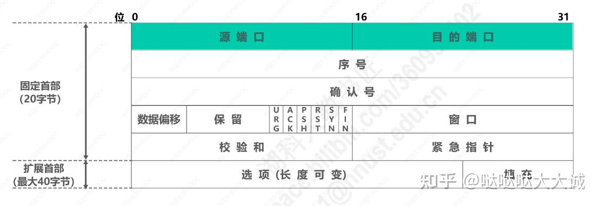

  - 序号(Sequential number for a segment)和确认号

    - TCP把数据看成无结构,有序的字节流,确认号是代表当前主机期望收到的报文序号,
    - TCP只确认流中至第一个丢失位置的字节,也成为累计确认
      - 对于失序报文可以采用丢弃(回退N),也可以缓冲(选择确认)

- 往返时间估计

  - 报文段的样本RTT是从某段报文被发出到对该报文段确认被收到之间的时间量

    大多数TCP实现仅采用某个时刻做一次SampleRTT测量,不会为义重传的报文计算SampleRTT

  - 采样使用指数加权移动平均(Exponential Weighted Moving Average),

    EstRTT = α SampleRTT + (1-α)EstRTT  ,α 取 1/8,表示预估值

    DevRTT = (1-β)DevRTT + β|SampleRTT - EstRTT|,β取0.25,表示差值

    TimeoutInterval = EstRTT + 4 DevRTT,重传间隔

- 可靠数据传输

  - 定时器的管理需要相当大开销,推荐定时器管理过程仅使用单一的重传定时器,即使有多个未确认报文段

  - 定时器超时重传具有最小序号但仍未应答报文段,启动定时器

  - 接收来自确认报文的ACK(确认序号),假如确认序号y>当前发送且未确认序号,则更新未确认序号(因为采用累确认,所以y代表y之前已接受到),

    假如当前还有未确认报文,还需要启动定时器

  - ```c++
    /* 假设发送方不受 TCP 流量和拥塞控制的限制，来自上层数据的长度小于 MSS，且数据传送只在一个方向进行。 */
    
    NextSeqNum = InitialSeqNumber
    SendBase = InitialSeqNumber
    
    loop (永远) {
    	switch (事件)
    		事件: 从上面应用程序接收到数据 e
    			生成具有序号 NextSeqNum 的 TCP 报文段
    			if (定时器当前没有运行)
    				启动定时器
    			向 IP 传递报文段
    			NextSeqNum = NextSeqNum + length(data)
    			break;
    		事件: 定时器超时
    			重传具有最小序号但仍未应答的报文段
    			启动定时器
    			break;
    		事件: 收到 ACK，具有 ACK 字段值 y
    			if (y > SendBase) {
    				SendBase = y;
    				if (当前有未被确认的报文段)
    					启动定时器
    			}
    			break;
    } /* 结束永远循环 */
    
    ```

- 超时情况分析

  - 确认丢失而导致重传,只需要直接丢弃
  - 发生超时重传,只要发送端接收到确认号就会停止对应部分的重传
  - 累计确认会取消之前的超时重传
  - 可以看到确认跨越一个超时周期就会重传
  - 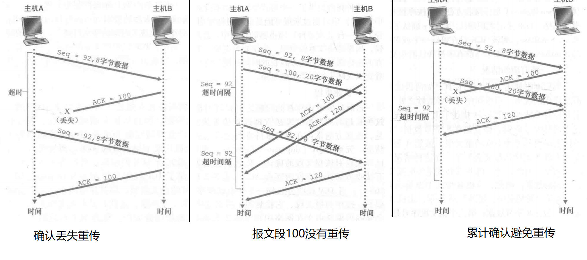

- 超时间隔加倍

  - 大多数TCP实现中定时器过期后超时周期是之前的两倍

    TimeoutInterval = 2 * TimeoutInterval,而不是之前的EstRTT和DevRTT加权平均

    这个是定时器过期才是两倍,收到上层请求/ACK更新定时还是之前的公式

  - 这是一种形式受限的拥塞控制,定时器过期很可能是网络拥塞引起的,如果持续重传分组很可能加重拥塞

- 快速重传

  - 超时触发重传的问题之一是超时周期可能相对较长,当一个报文丢失这种长超时周期迫使发送方延迟重传丢失的分组,增加了端到端的时延

    冗余ACK(duplicate ACK)就是再次确认某个报文段的ACK

    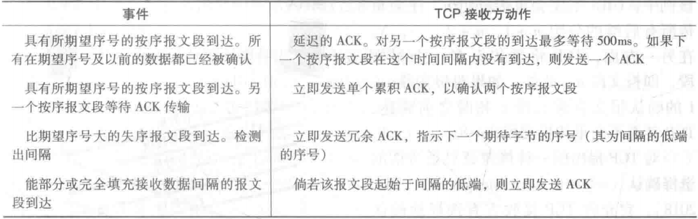

  - 当发送方连续收到3个冗余ACK立即执行快速重传(fast retransmit),即在该报文段的定时器之前重传丢失的报文段

  >  TCP确认是累计式,正确接收但失序是不会被确认的,看起来更像GBN方式
  >
  > 对TCP提出的一种修改意见是选择确认,允许接收方有选择确认失序报文段,看起来更像SR协议
  >
  > TCP的差错恢复机制可以说是GBN协议与SR协议的混合体

- 流量控制

  - TCP接收正确,按序的字节后将数据放入缓存,但不一定立即被消费,当发送方发的太多太快就会发生溢出,

    TCP提供了流量控制服务(flow-control service),作用是速度匹配,让发送和接收速率相匹配,TCP发送方可能因为网络拥塞而被抑制,称为拥塞控制,两者采取动作相似,但是原因完全不同

  - TCP通过发送方维护一个接收窗口(receive window)提供流量控制,给发送方指示当前接收方还有多少缓存空间

    - LastByteRead表示进程读取最后一个字节编号

    - LastByteResv表示加入缓存的最后一个字节编号

    - LastByteResv - LastByteRead ≤ ResvBuffer ,ResvBuffer表示缓冲区大小

    - 接收窗口 rwnd = Resv - (LastByteResv - LastByteRead)

    - 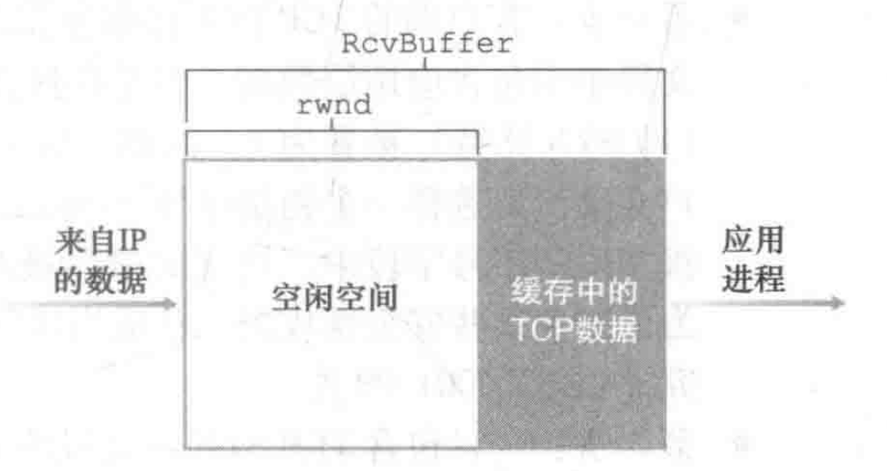

    - 发送方需要保证未确认报文数小于接收窗口大小,TCP仅当有数据发送/确认时才会发送报文段,假如此时窗口为0,那么发送方是不知道的

      所以TCP在rwnd=0时,主机A继续发送只有一个字节数据的报文段,这些报文段最终会被确认,缓存清空时,确认报文就会含有非0的rwnd

- TCP 连接管理

  - TCP 连接的建立会显著增加时延
  - 三次握手连接过程
    - 客户端发送特殊报文段,不包含数据,首部的 SYN 标志位置 1,称为 SYN 报文段, 
      会随机选择一个初始序号(client_isn),为了避免某些攻击,有些会适当随机取
    - 服务器接受到 SYN 报文段,分配 TCP 缓存和变量,并发送允许连接的报文段,不包含数据 
      SYN 置 1,确认号=client_isn+1,最后选择服务器的初始序号(server_isn) 
      称为 SYNACK 报文段
    - 客户端收到 SYNACK 报文段,分配缓存和变量,发送最后一个报文进行确认. 
      SYN 置 0,序号=client_isn+1,确认号=server_isn+1,该报文可以携带数据
    - 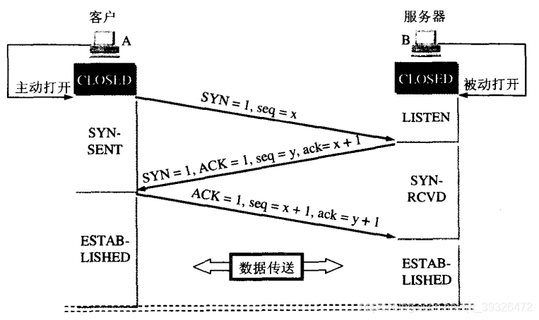
  - 四次挥手
    - 客户端发送特殊报文,FIN 置 1
    - 服务器发送 ACK 报文
    - 服务器发送 FIN 报文
    - 客户端发送 ACK 报文
    - 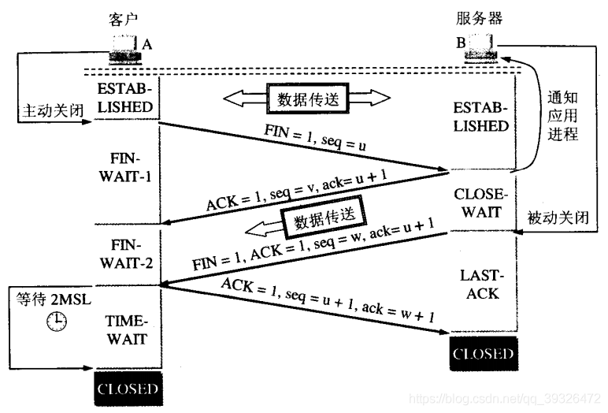
    - 

- SYN洪泛攻击(SYN flood attack),大量SYN连接请求生成半连接,使用SYN cookie进行防御

  - 服务器生成一个初始TCP序列号而不是半连接,序列号是根据四元组和散列函数生成的,称为cookie
  - 如果客户端返回ACK,那么才会生成套接字

- nmap端口扫描工具

  - 当一台主机端口不接受连接,收到TCP的SYN报文段时会将RST标志位置1,表示拒绝

    收到UDP分组时则是返回特殊的ICMP数据报

  - 所以nmap扫描一个端口时

    - 收到TCP SYNACK,说明TCP端口接收连接
    - 收到TCP RST,说明拒绝连接,没有防火墙
    - 什么也没有,防火墙阻隔

### 6 拥塞控制  

- 拥塞原因和代价

  - 两个发送方和无限缓存的路由器,发送速率λ字节/秒,链路容量R,

    当λ < R/2,每连接吞吐量等于λ,当超过R/2,只能达到R/2

    然而此时分组会开始排队,时延指数级增长

    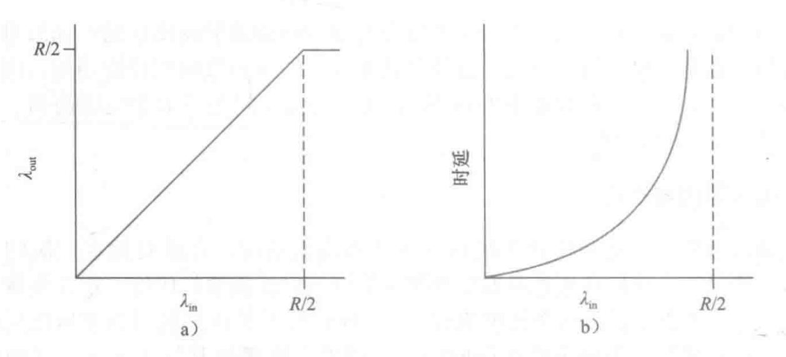

  - 两个发送方和缓存有限路由器

    考虑到TCP重传,假设发送速率没有重传是λ~in~,重传是λ^'^ ~in~ ,

    当网络拥塞时重发分组占比越来越大

    当路由器转发两次,其吞吐量变为R/4

    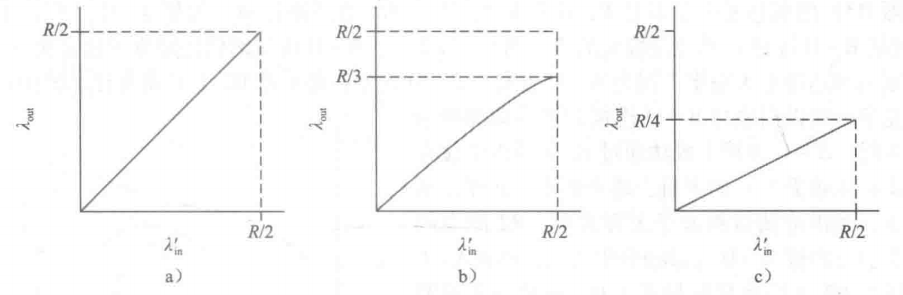

  - 四个发送方和多台缓存有限路由器

    以R2来考虑,需要承担A-C和B-D的流量,当R1以速率R发送就会把R2占满,那么主机B就会丢包,

    假如主机B把R2占满,那么R1就会丢包,代价是之前在R1的传输全浪费了

    - 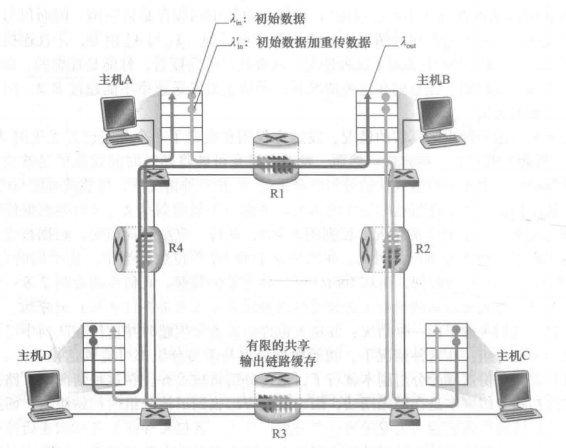

- 拥塞控制方法
  - 可以根据网络层是否为传输层拥塞控制提供显示帮助来区分拥塞控制方法
    - 端到端拥塞控制,网络层不提供显示帮助.通过报文丢失(超时/3次冗余确认)认为拥塞,减少发送窗口长度
    - 网络辅助的拥塞控制,路由器提供某些显示信息,默认是端到端

### 7 TCP拥塞控制

- TCP采用端到端拥塞控制,通过感知网络拥塞程度调整发送速率

  - 如何感知? 如何限制?

  - 控制发送速率,TCP连接每一端都维护发送缓存,接收缓存,变量,除此之外,发送方额外维护一个拥塞窗口(congestion window),表示为cwnd.

    发送方未被确认分组数不会超过 cwnd与rwnd的最小值(rwnd是接收窗口大小)

    LastByteSent - LastByteAcked ≤ min{cwnd,rwnd}

  - TCP的丢包事件定义为 超时或者出现3次冗余ACK.TCP通过感知丢包事件推测拥塞

    - TCP使用确认来触发调节拥塞窗口长度,也称为自计时的
    - 使用一些原则来限制发送速率:
      - 丢失的报文意味着拥塞,应当降低发送速率
      - 一个确认报问可以认为是网络通畅,可以增加发送速率

- TCP拥塞控制算法(TCP congestion control algorithm)

  - 慢启动 

    - TCP连接开始时,cwnd的值通常初始为一个MSS的较小值,这样发送速率大约为 MSS/RTT
    - 接收到确认报文后 cwnd 将增加一个MSS大小,并发送两个最大长度报文段 
    - 每接收一个ACK,都会有上面操作,cwnd指数增长
    - 当发生丢包,就把cwnd置1,重新开始慢启动,更新ssthresh(慢启动阈值)为原来的一般,检测到冗余ACK还会执行快速重传

  - 拥塞避免

    - 进入拥塞避免状态,cwnd 约为 遇到拥塞值得一半.此时每个RTT只增加一个MSS.(比如cwnd时14600字节,MSS时1460字节,那么在一个RTT内发送10个报文段,每个ACK增加1/10MSS)
    - 出现丢包,cwnd设置为原来的一半,ssthresh为cwnd的一半

  - 快速恢复

    - 对于每个冗余ACK,cwnd增加一个MSS.
    - 丢包时,cwnd设置为1个MSS,ssthresh为cwnd的一半
    - 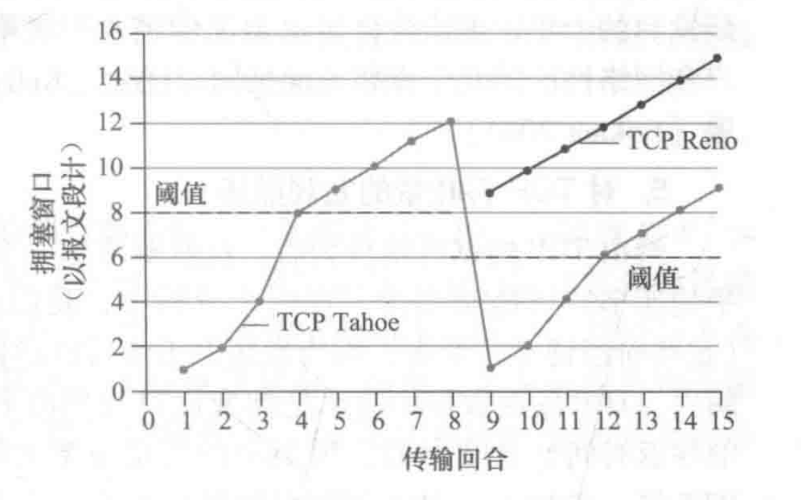

  - 从上面三个过程来看,拥塞控制是一个动态的过程,常被称为加性增,乘性减(additive-increase , multiplicative-decrease,AIMD)

    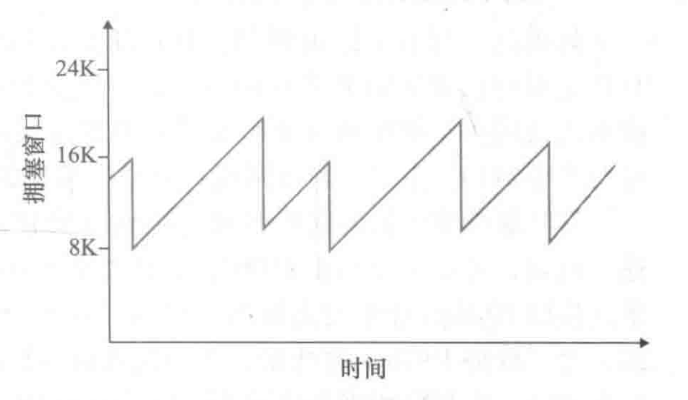

- 公平性

  - TCP的AIMD算法公平吗?TCP趋于在竞争的多条TCP连接平等分享带宽

  - 假设两个连接经过同一个路由,刚开始吞吐量处于A点,连接1和2都会增加cwnd,

    所以来到了B点(x,y都增加相同的值),此时超过带宽R,连接1和2开始拥塞控制,cwnd变一半

    来到了C点,重复A~B过程

  - 以上时理想情况,实际上具有较小RTT能更快抢到带宽

    

  - 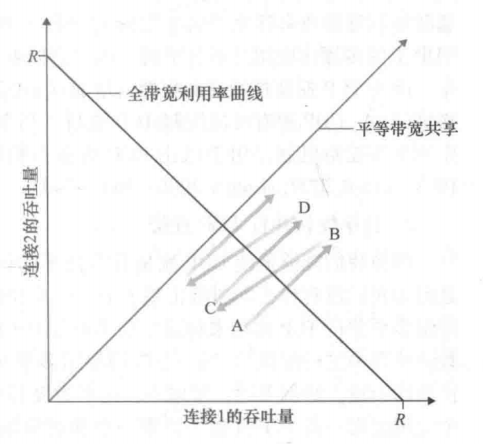

  - 遇到UDP时候时不公平的,因为UDP没有拥塞控制,TCP可能会直接被压制

  - 一般现在浏览器使用多个TCP连接,对于并行的TCP连接也是不公平的

- 明确拥塞通告

  - 网络层IP数据包的首部使用两个比特指示用于ECN(Explicit Congestion Notification,明确拥塞通告 )
  - 路由器设置,会发送给目的主机,目的主机在ACK报文段折纸ECE(明确拥塞通告回显)

- 小结

  - 数据报拥塞控制协议(Datagram congestion control protocol)提供了 一种低开小,面向报文,类似UDP的不可靠服务,

    应用程序可选的控制形式,和TCP兼容,应用于诸如流媒体程序

  - 在谷歌浏览器中实现了QUIC(Quick UDP internet Connection)协议,通过重传差错检测,快速连接和基于速率的拥塞控制提供可靠性,建立在UDP之上

  - DCTCP(Data Center TCP)是一种专门为数据中心定制的TCP,使用ECN可以更好控制短流和长流

  - 流控制传输协议(stream control transmission protocol),可靠面向保温的协议,允许几个不同层次的流应用到SCTP

  - TCP友好速率控制协议是一种拥塞控制协议而不是功能齐全的运输层协议,目标是让锯齿状的发送速率更平滑

## 第4章 网络层:数据平面

### 1 网络层概述

- 路由器具有截断的协议栈(只有物理层,链路层,网络层),

  路由器的数据平面功能负责从输入链路转发数据报到输出链路

  路由器的控制平面功能 主要协调本地的路由器转发动作

- 转发和路由选择:数据平面和控制平面

  - 转发(forwarding),当一个分组到达路由器的输入链路,路由器必须将其移动到适当的输出链路

    是指分组从输入转移到输出链路的路由器动作,时间很短(通常几纳秒),使用硬件实现

  - 路由选择,分组转发时的路由选择算法(routing algorithm),决定了输出链路

    是指确定分组从源到目的地所采取的端到端路径的网络范围处理过程,通常要几秒,软件实现

  - 每台路由器网络都有转发表(forwarding table),路由器根据首部搜索转发索引

  - 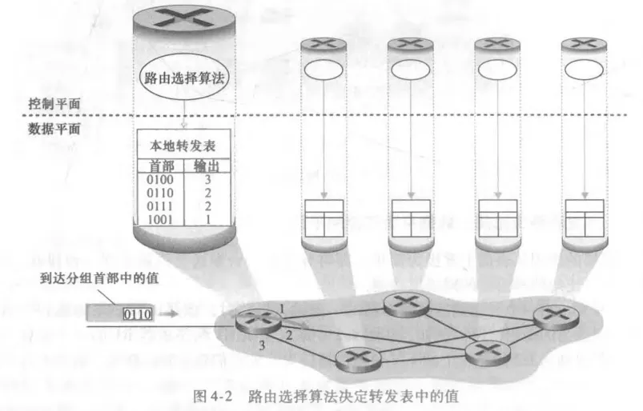

  - 控制平面:传统方法

    - 路由器通过与邻居路由器交换信息决定转发表的值
    - 人工配置可以不需要任何路由协议,但是容易出错,响应慢

  - 控制平面:SDN方法

    - SDN(Software Defined Networking),软件定义网络,通过将控制平面功能作为一个单独服务,与数据平面分离

    - 对于人类可以手动配置路由表启发,远程控制器负责计算和分发转发表供路由器使用,路由设备只负责转发

      远程控制器可能是现在具有高可靠性和荣誉的远程数据中心,由ISP或第三方管理

      路由器和远程控制器通过交换包含转发表和其他路优选择信息的报文进行通信

      SDN的计算转发表和远程控制器都是软件实现的,所以网络是软件定义的

    - 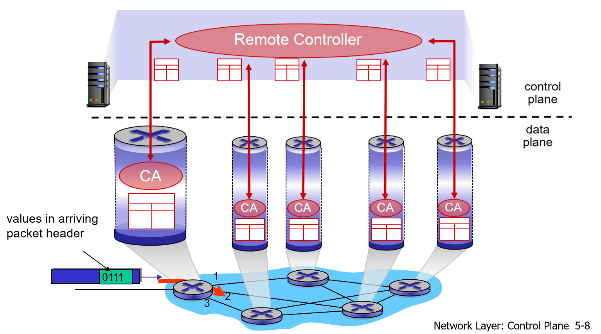

- 网络服务模型(network service model)
  - 定义网络层能够提供的端到端的运输特性,可能包含以下服务:
  - 确保交付,该服务确保分组最终到达目的地
  - 具有时延上届的确保交付
  - 有序分组交付
  - 确保最小带宽
  - 安全性,加密
  
- 因特网提供了单一服务,尽力而为服务(best-effort service),上述的服务都没有覆盖

  - ATM网络体系提供了按序时延/有序时延/最小带宽服务
  - 尽力而为和适当带宽供给已经"足够好"

### 2 路由器工作原理

- 转发功能

  - 输入端口,从左往右是 物理层,链路层,网络层, 在网络层通过查询转发表决定路由输出端口

  - 输出端口,顺序从左往右是 网络层,链路层,物理层, 一般和该链路的输出端口出现在同一线路卡

  - 交换结构,连接输入输出,包含在路由器结构

  - 路由选择处理器,负责控制平面.传统路由器中,执行路由选择邪恶一,维护路由选择表与关联链路信息

    在SDN路由器中,路由选择处理器负责与远程控制器通信,接收来自控制器的转发表并安装这些表项,此外它还执行网络管理功能

  - 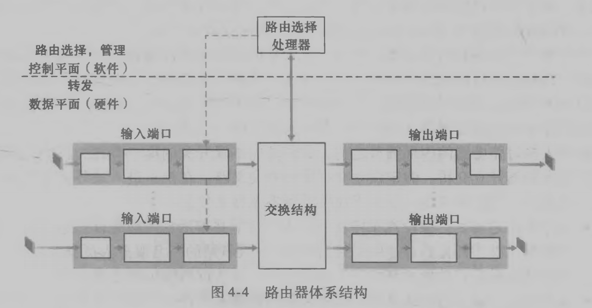 

  - 假设一条10Gbps的链路接收64字节的IP数据包,那么在另一个数据报到达之前只有51.2ns处理,如果N个端口绑定在一块线路卡,那么数据包处理流水线必须以N被速率运行,所以数据平面几乎是使用硬件实现的

  - 路由器的控制平面一般使用软件实现,以毫秒甚至秒运行,包括执行路由协议,上下线处理,远程通信和网络管理

- 输入端口处理和基于目的地转发

  - 路由器转发表从路由选择处理器经过独立总线(比如PCI总线)复制到线路卡,每个输入端口都有转发表副本,避免了集中式处理的瓶颈

  - 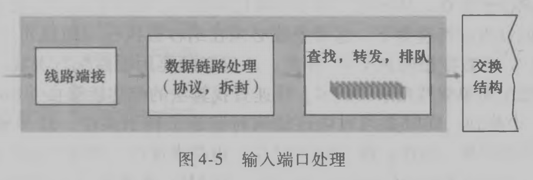

  - 考虑最简单的情况,在32位情况下,假如每个IP地址都对应一个表项,那么会超过40亿个地址

    考虑使用不同的端口匹配不同的前缀,出现多个匹配时使用最长前缀匹配规则(longest prefix matching rule),这是跟IP的编址特点对应的

    | 前缀匹配      | 链路接口 |
    | ------------- | -------- |
    | 101.101.*     | 0        |
    | 101.102.*     | 1        |
    | 101.102.101.* | 2        |

  - 在Gbps,查找表项必须使用超出简单搜索的技术,同时对内存访问事件特别关注,所以嵌入式片上用DRAM和SRAM,也经常用三态内容可寻址存储器(Tenary Content Address Memory),使用TCAM可以在常数时间内返回一个IP地址对应的表项

  - 除了查找,还需要处理物理层和链路层,检查分组版本号,校验和,TTL,还要更新网络管理计数器,

    总结起来就是"匹配+动作",无论时网络层还是链路层,还是软件设计,都是一种很常见的抽象

    > 比如 awk 工具就是匹配加操作

- 交换

  - 交换结构位于路由器核心,可以有多种完成方式

    - 经过内存交换,最早最简单的路由器就是传统计算机,跟传统IO设备一样,当输入端口发出中断,CPU复制到内存,根据首部发往目的端口缓存,

      如果内存每秒读写分组数称为带宽B,那么总吞吐量只有B/2

      现代路由器通过内存交换,差别是目的地址的查找和复制进内存由线路卡完成

    - 经总线交换,输入端口通过共享总线直接传输到输出端口,不需要处理器干预.

      输入端口为分组预先计划一个内部标签,指示输出端口,所有输出端口都可以接收到分组,只有标签对应的输出端口才能保存

      每个分组必须跨越总线,每次都有其他接口等待,交换带宽受限于总线速率

    - 经互联网络交换,克服单一共享式总线的方法就是使用更复杂的互联网络,

      图中使用2N条总线,交叉点可以通过结构控制器开闭,属于非阻塞的

  - 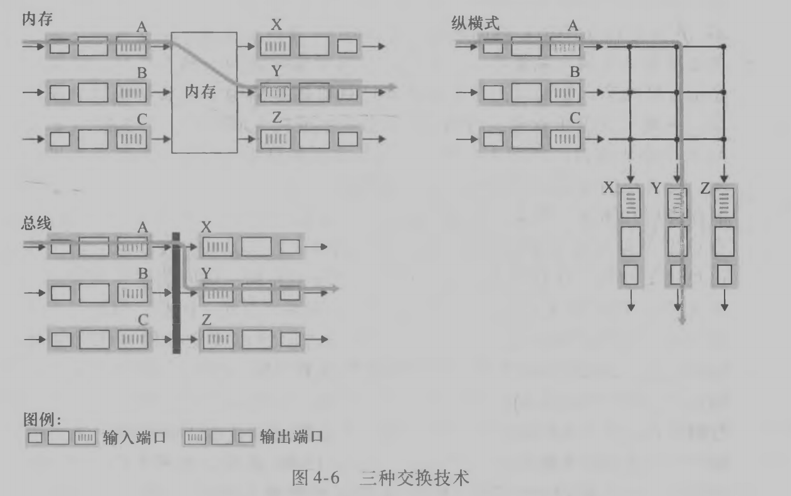

- 输出端口处理

  - 当输出端口的缓存不够时就会发生丢包

  - 当交换结构的处理速率比输入端口的速率快N倍,处理N个输入端口只会发生轻微排队

    - 当交换结构速度不够快,输入端口会发生排队,当不同输入端口发往同一个输出端口时,就会发生排队,称为线路前部阻塞(head-of-the-line,HOL)

  - 当交换结构够快,假如都发往同一个输出端口,就会发生输出端口缓存耗尽

    - 要么丢弃新来分组(drop-tail,弃尾),要么删除缓存里的.某些情况下,缓存还没填满就会丢弃一个分组,发送阻塞信号,这种行为称为主动队列管理(Active Queue Management)

      随即早期检测(Random Early Detection)就是一个AQM

  - 当输出缓存有多个分组时,就要使用分组调度算法决定输出顺序

  - 缓存大小一般采用 平均往返时延*链路容量C, 

  - 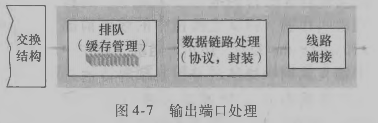

- 分组调度(调度算法)

  - FIFO,先进先出,丢弃策略要么拒绝新的,要么删除旧的

  - 优先权排队(priority queuing),不同队列有不同的优先级,队列里面采用FIFO

    - 比如IP实时通话可以优先级高一些,网络管理信息优先级高

  - 循环排队规则(round robin queuing discipline),多个队列逐个轮询

  - 加权公平排队(weighted fair queuing),跟上面的区别在于每个队列分配一个权重w~i~,

    在队列i有数据要发送的时间间隔中,队列i保证 接收到的服务部部分等于 w~i~

    /Σw~i~,简而言之就是根据队列权重分配带宽

### 3 网际协议

- IPv4数据包格式

  - 版本号,4比特,路由器根据它确定如何解析数据报

  - 首部长度 4比特,以4字节为单位,IPv4的首部长度是可变的,包含一些可选项目,一般是20字节

  - 服务类型(TOS),用于区分不同类型数据报,比如优先级高低,吞吐量大小,时延大小等

  - 数据报长度,16比特,是IP数据报总长度(首部+数据),最大为65535,但是很少超过1500,因为以太网帧长度限制

  - 标识/标志/片偏移,与IP分片处理相关,IPv6不允许路由器分片

  - TTL(Time to Live)确保数据不会在网络中循环,当TTL=0时,直接丢弃

  - 上层协议,指明数据里面是TCP/UDP还是别的协议

  - 首部校验和,首部(不包括数据)每两个字节当成一个数,进行求和后取反码放到该字段

    每个路由器必须重新校验,因为TTL是会变化的,跟TCP差别在于只需要计算首部

  - 选项,扩展IP首部,很少使用,IPv6已经去除

  - 数据,承载TCP/UDP/ICMP等报文

  - IP+TCP 首部长度达到了 40 字节

  - 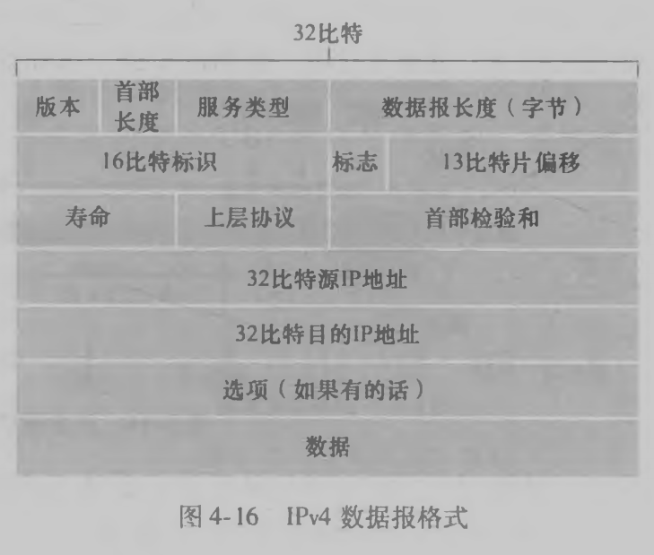

- 链路层帧能够承载的最大数据量称为 最大传输单元(maximum transmission unit),比如 以太网不能超过1500字节,限制着IP报文大小

  - 当路由器连接着不同的链路,MTU很可能是不同的,就会发生分片现象,把大的IP数据报拆为若干个小的,这些小的数据包称为片(fragment)

  - 分片的合并工作放在端系统里,为了保持网络内核的简单

    合并工作用到标识 标志 和 片偏移 这三个IPv4协议字段

    - 标识,16比特,标识数据报唯一ID,不同分片用一样ID,每发送一个数据报就加一
    - 标志,3比特,bit0保留,bit1表示是否分片(0表示分片),bit2表示是否还有后续分片(0表示最后分片)
    - 片偏移,13比特,表示该分片在整个数据报的位置,单位8字节,

- IPv4编址
  - 主机与网络连接
    - 主机与物理链路的边界称为 接口,链路与路由器的边界也称为接口,路由器因此拥有多个接口,
    - IP要求每台主机和路由器接口拥有自己的IP地址,从技术上来说,IP是与接口关联的,而不是路由器/主机
  - IP长度32比特,大约有40亿个可能IP地址,采用点分十进制表示(dotted-decimal notation),
    - 不包含路由器的网络通常用一朵云表示,很可能是在一个以太网LAN互联
    - 云朵可以表示为一个子网,比如 223.1.1.xxx/24 ,这个 24 表示该网络中前24相同,处于同一个网段,称为 子网掩码
    - 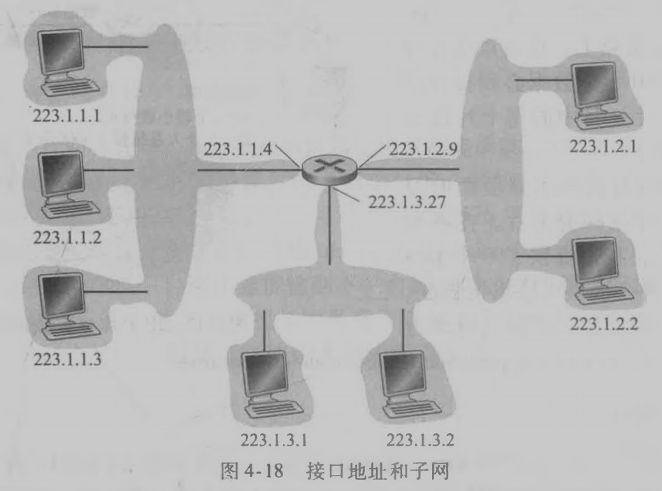
  - 因特网编址
    - 因特网地址分配策略称为无类别域间路由选择(Classess Interdomain Routing,CIDR)
    - IP地址具有以下形式 a.b.c.d/x, 地址的前x位表示IP地址的网络部分,称为地址前缀,这也是路由表使用前缀匹配目的地址的原因
    - 使用前缀通告多个网络的能力称为地址聚合/路由聚合/路由摘要
    - 地址可以匹配多个,采用最长前缀匹配
  - 分类编址(classful addressing)
    - IP地址使用网络部分被限制为 8/16/24 比特,分别称为 A/B/C网
  - IP获取流程
    - 获取一块地址
      - 向ISP获取一块地址,IP地址由因特网名字和编号分配机构(Internet Corporation forAssigned Names and Numbers,ICANN)管理
      - 它们不仅仅管理IP地址,还管理DNS根服务器
    - 获取主机地址
      - 可以通过手工配置路由器的IP地址,也可以使用动态主机配置协议(Dynamic Host Configuration Protocol,DHCP)
      - DHCP允许主机自动获取一个IP地址,管理员只需要配置DHCP
      - DHCP获取IP过程
        - DHCP服务器发现,主机通过DHCP发现报文(DHCP discover message)完成,使用UDP分组向端口67发送,通过广播地址255.255.255.255进行发送,本机地址0.0.0.0
        - DHCP服务器提供,服务器响应DHCP提供该报文(DHCP offer message),也是向全网广播,因为DHCP服务器可能含有冗余,响应带有IP地址/租期等信息
        - DHCP请求,客户端选择一个DHCP报文,并向该服务器发送DHCP请求报文,回显配置参数
        - DHCP ACK,服务器进行响应,确认请求报文参数
      - 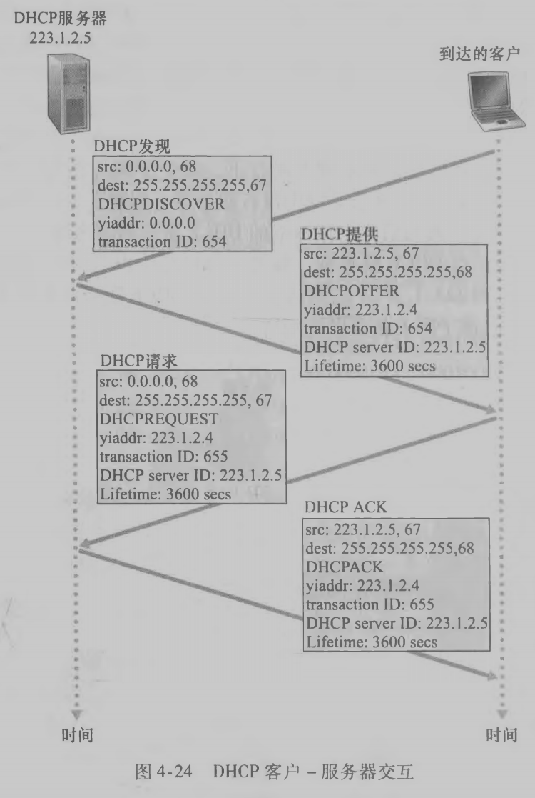

- NAT(Network Address Translation)

  - Nat路由器通过NAT 转换表来决定分组应该发给哪台主机,除了IP地址还包含了端口

    利用端口映射不同主机的不同端口

  - 端口使用16比特,意味着NAT协议可支持60 000个并行路由器广域网一侧单个IP地址选择

  - 反对声音,

    - NAT在局域网当服务器会引起问题,解决方案包括NAT穿越工具(NAT traversal)和通用即插即用(Universal Plug and Play)
    - 路由器是基于网络层,而NAT用到了端口

    - NAT违反了主机彼此对话

  - 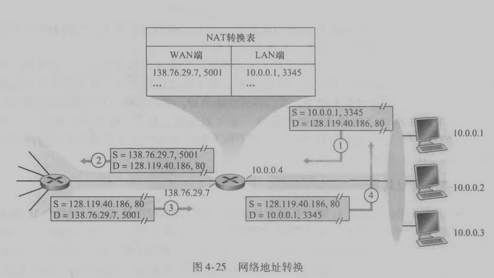

- IPv6

  - 首部 40 字节
  - 地址容量 128 比特,引入任播地址(anycast-address),将数据交付给一组主机的任意一个
  - 流量类型,跟TOS字段含义相似
  - 流标签,给特殊流的分组加上标签,比如视频/音频等传输可以被当做一个流
  - 下一首部,表示数据的协议类型(TCP/UDP/...)
  - 跳限制,IPv4的TTL
  - 取消以下字段
    - 分片/重组,IPv6不允许中间路由器分片重组,假如路由器不能发送大分组,只需要返回一个ICMP差错报文,发送方就可以使用较小长度数据报重发数据
    - 校验和,IPv4的TTL导致每个路由器都要重新计算,耗时较大
    - 选项,出现在下一首部指示的位置,下一首部就不一定是TCP/UDP了
  - 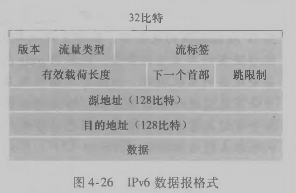

  

  - 迁移
    - 建隧道(tunneling),两端采用IPv6,中间路由使用IPv4
    - 改变网络层协议是十分困难的,如同替换一栋房子的地基,1992年IETF开始研究,2003年出现IPv6测试网络,至今尚未普及开来
    - 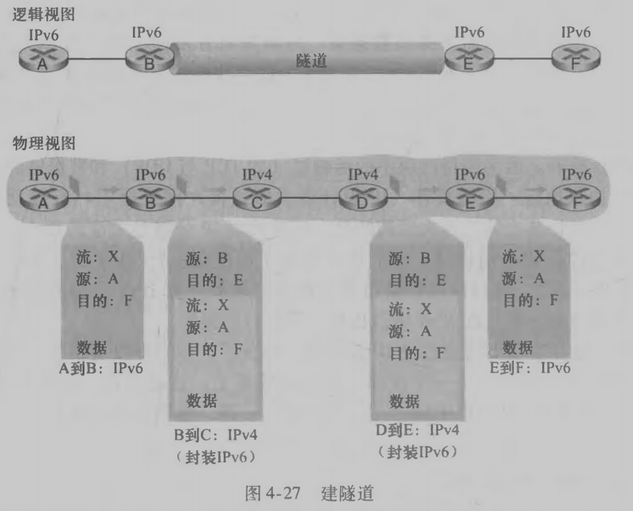

### 4 通用转发 和 SDN

- 匹配+动作

  - 许多网络层中间盒有了大量发展,比如NAT重写IP地址和端口,防火墙基于首部字段拦截,均衡负载将web请求转发到 指定服务器

  - 基于SDN总结为匹配+动作,匹配包括对多个协议首部进行匹配,动作包括广播/拦截/负载均衡/重写首部等

  - 所以将之前的路由器称为分组交换机,只负责将分组进行交换,而没有其他动作处理

    路由器使用匹配加动作表,由远程控制器计算/分发/更新

  - OpenFlow是已经得到认可的标准,匹配动作表称为流表,表项包括

    - 首部字段值集合,基于硬件匹配,可能由多张流表组成
    - 计数器集合,包括已经匹配的分组数量,更新时间等
    - 动作 集合,转发/复制/重写/丢弃等

  - 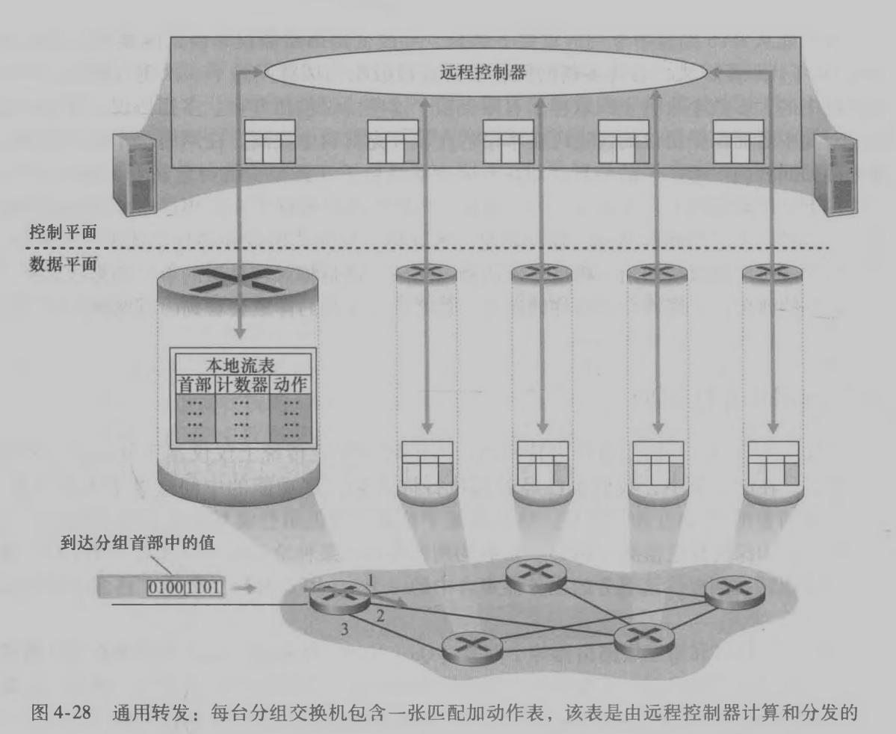

- 匹配
  - 可以一次匹配三个层次的协议首部(违反了分层原则)
  - 入端口是指交换机的输入端口(识别IP首部字段)
  - OpenFlow不匹配TTL/数据报长度/校验和等,
  - 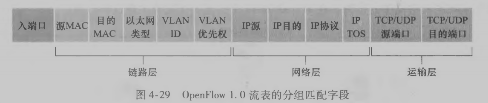

- 动作
  - 转发,跟之前一样,输入端口复制到输出端口,支持多播
  - 丢弃,没有动作的流表项就会被丢弃
  - 修改字段,,分组首部的10个匹配字段可以重写