# 计算机网络:自顶向下方法

- 书籍作者:詹姆斯·F.库罗斯  基思·W.罗斯
- 笔记时间:2022.4..26

## 第1章 计算机网络和因特网

### 1 因特网	

- 软硬件角度

  - 像手机 PC 智能联网设备等称为**主机**或者**端系统**

    端系统通过 **通信链路** **分组交换机** 连接在一起

    链路的 **传输速度** 用 bit/s 度量,数据会分段发送,称为 **分组**(packet)

  - 端系统通过 **因特网服务提供商**(ISP) 接入因特网

    因特网标准由 **因特网工程任务组(**IETF) 制定,标准文档称为 **请求评论**(RFC)

- 应用程序角度

  - 涉及多个相互交换数据的端系统的程序称为 **分布式程序**
  - 数据通过 **套接字接口**(socket interface) 进行交换

- 协议

  - 双方约定好的规则,比如上课举手代表疑问,这是课堂的协议
  - 网络协议:定义了多个通信实体之间交换的报文格式和顺序,以及报文收发后的动作

### 2 网络边缘

- 通常把因特网相连的计算机和其他设备称为端系统或者主机

  主机可分为 客户端 和 服务器,如今大部分服务器属于 大型数据中心

  物联网(Internet of Things,IoT)

- 接入网

  - 指将  端系统 连接到 边缘路由器的网络

  - 宽带接入方式分为 数字用户线(digital subscriber line,DSL) 和 电缆

    DSL是电话线,电话公司一般也是ISP

    电缆因特网接入则是有线电视线接入,因为有光纤参与,也成为 混合光纤同轴系统(Hybrid Fiber Coax,HFC),重要特征可以共享广播媒体

  - 单根电话线可以通过频分复用,同时进行网络和电话通信

    接入因特网需要调制调解器比如DSL调制调解器,电缆调制调解器(cable modem)

  - 光纤到户(Fiber To The Home,FTTH),分为有源(active)和无源(passive)光纤网络(Optical Network),AON本质是交换以太网

  - 家庭接入使用  以太网和WiFi ,广域无线接入 3G和LTE

- 物理媒体

  - 分为导引行型媒体和非导引行型媒体(unguided  media),区别在于是否沿着媒体前进,比如光纤和无线传播的区别

  - 双绞铜线,一直用于电话网,绞合为了减少相互电气干扰,一对电线构成一个通信链路.传输速度受距离影响交大

    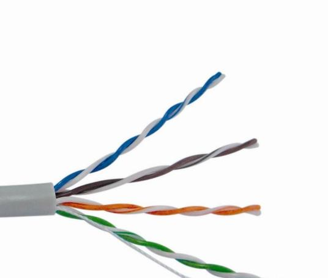

  - 同轴电缆,由两个同心的铜导体组成,之间隔着绝缘体/铝箔等保护层

    

  - 光纤,使用光脉冲替代电信号

    

  - 无线电信号,分为陆地和卫星

### 3 网络核心

- 分组交换

  - 端系统彼此交换**报文**(message),报文可以被分为多个小数据块,称为**分组**(packet),分组通过分组交换机进行传输

  - **存储转发**(store-and-forward transmission),发送之前必须收到完整packet,
- 假设链路传输速率R,packet的大小L,那么发送时间达到 L/R,不考虑传输时间的话,N段链路时延达到  NL/R
  
- 排队时延和分组丢失,每台分组交换机都有多条链路,每条链路对应一个输出缓存
  
  - 如果队列不为空,那么分组就需要队列里面等待,这段时间称为 **排队时延**
  
  - 如果队列已经满了,那么新到达的分组会被丢弃,称为 **分组丢失**
  
- 转发表和路由选择协议
  
  - 每台路由器都保存一张转发表,记录分组的目的地址和输出链路的映射
    - 路由选择协议可以自动设置转发表
    - 利用 traceroute 可以查看packet经过哪些路由器
  
- 电路交换

  - 传统的电话网络就是电路交换,预留了端系统间沿路径跟通信需要的资源,

    连接路径是固定的,称为一条**电路**(circuit)

    然而分组交换则不是,甚至可能丢包

  - 电路通过频分复用(Frequency-Division Multiplexing)或者时分复用(Time-Division Multiplexing)

    - FDM是连接期间链路位每条链接专用一个频段,电话网络里这恶频段宽度4kHZ,比如电台使用88MHz~108MHz

    - TDM是时间划分为固定的帧,帧里面划分时隙,时隙被链路指定

      假设具有24时隙,比特速率1.536Mbps的链路,需要 0.5s 建立链路,

      那么传输一个640kb文件需要 0.5 + 640/(1.536*1000/24) = 10.5s

    - 

- 对比

  - 分组交换时延不确定,可以提供更大带宽,并且更简单
  - 案例1:假设多个用户共享1Mbps链路,用户活跃周期变化,活跃时候100bps数据传输,10%的概率活跃
    - 链路交换支持10个用户
    - 分组交换支持约30个用户,当35个用户有11个同时活跃时的概率约0.0004
  - 案例2:假设10个用户,某个用户突然数据传输激增,产生1000个1000比特分组,其余用户静默,
    - 链路交换只能使用其中一个时隙,需要10s时间传输
    - 分组交换可以使用1Mbps的速率传输,只需要1s

- ISP互联

  

### 4 时延 丢包 吞吐量

- 时延(delay)

  - 处理时延:检查分组头部和决定该分组去往何处,一般是微秒级别

  - 排队时延:分组在链路上等待传输时间,取决于队列长度.一般微秒到毫秒级别

  - 传输时延:分组长度/传输速率,一般微秒到毫秒级别

  - 传播时延:距离/传播速度,广域网是毫秒级别

    

  - 排队时延一般使用平均值,方差和超过某些特征值的概率表示

    假设R是传输速率(队列往外),a是分组到达队列的平均速率,L是分组长度,那么队列的输入速率是 aL ,把  输入/输出 的比率称为 **流量强度**, aL/R

    显然,当aL/R > 1,队列就会开始积攒分组

  - 如果分组周期性到达,不会有排队时间

    如果分组激增,可能会有很高平均排队时延,第一个没有,第二个等待1,第n个等待n-1发送时间

    正常情况下,分组到达情况是随机的,

    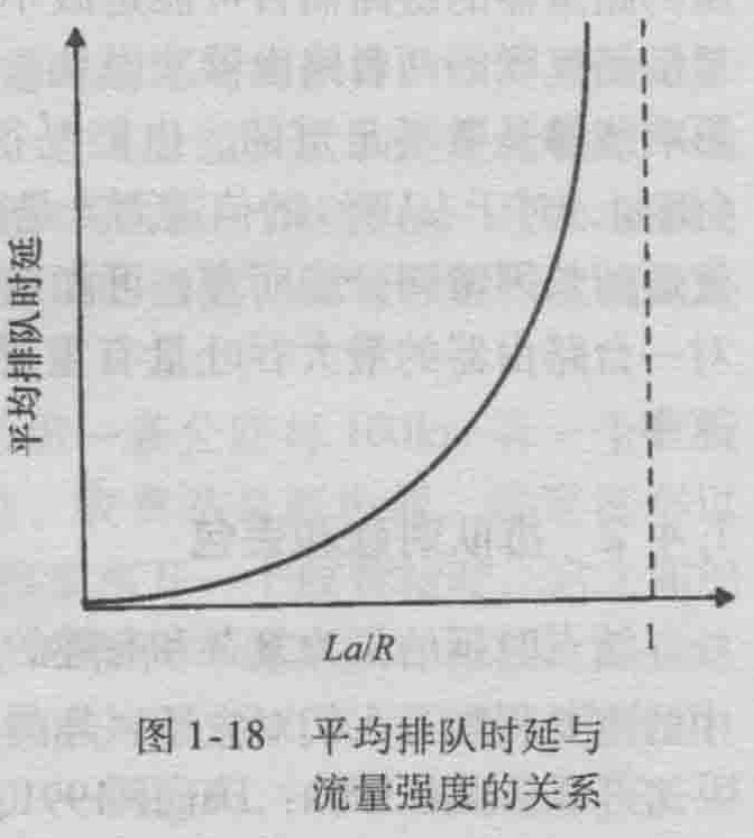

- 丢包
  
  - 分组丢失的比例随着流量强度增加而增加,可以使用重发机制保证到达
- 端到端时延
  - 假设链路没有发生拥塞,不考虑排队.那么时延 = N(d~proc~ + d~trans~ +d~prop~)
  - traceroute 可以了解路径上的实验情况
- 吞吐量
  - 平均吞吐量 单位时间内接收到比特数
  - 链路的吞吐量取决于瓶颈链路,假如多个用户共享一条链路就会均分链路吞吐量

### 5 协议层次

- 协议分层

  - **协议栈**,各层所有的协议,TCP的五层结构,OSI的7层结构

    - 应用层的信息分组称为 message,

      传输层的信息分组称为 segment

      网络层 datagram,

      链路层 frame,

  - 每一层,一个分组具有两个部分,首部和有效载荷(payload)

### 6 面对攻击的网络

- 攻击分类

  - 植入有害程序,将宿主机加入僵尸网络等

    病毒:需要某种形式交互的恶意软件,比如电子邮件病毒

    蠕虫:不需要明显用户交互,比如某个程序本身有漏洞,蠕虫攻击该漏洞

  - 拒绝服务攻击(Denial-of-Service DoS),让服务器等瘫痪

    - 弱点攻击
    - 带宽泛洪,让目标接入链路拥塞
    - 连接泛洪,大量TCP半开/全开连接

  - 嗅探分组(packet sniffer)

  - IP欺骗(spoofing)

## 第2章 应用层

### 1 应用层协议原理

- 有CS体系结构,著名应用 FTP / Web  /Telnet  / Email 等,随着服务器规模的扩大会形成数据中心等配备大量主机的结构

  P2P体系结构,著名应用 文件共享,对等放协助下载加速器(迅雷),视频会议

- 进程通信
  
  - 跨越端系统的通信通过报文交换进行,通过 套接字 的软件接口和其他进程进行报文的交换
  
    也被称为 应用程序和网络之间的API,
  
  - 程序只能在应用层设置相应的套接字控制信息,比如 协议类型,协议的部分参数( 最大缓存 之类)
  
    几乎不可以控制传输层
  
  - 进程寻址, 目标主机的地址(IP),目标进程的唯一标识符(端口)

- 传输层可以提供的服务要求

  - 可靠的数据传输,通过某些手段保证数据正确/完整的传输到目的地

  - 吞吐量,发送端往接收端交付比特的速率,具有吞吐量要求的应用成为 带宽敏感的应用,吞吐量越大越好, 尽最大努力满足

  - 定时,延迟保证 , 尽最大努力满足

  - 安全性, 常见的传输层协议(TCP/UDP)默认是没有提供安全保证的, 

    后来开发出 安全套接字层(Secure Socket Layer)对其进行加强

    SSL不是新协议,而是对TCP的一种加强,是在应用层实现的,所以是先加密明文,再发给TCP

- 应用层协议
  -  交换报文类型(请求/响应)  
  -   类型语法(字段及描述) 
  -  字段的语义  
  -  如何/何时发送报文

### 2 Web 和 HTTP

- HTTP(HyperText Transport Protocol),由两个程序实现(客户端/服务端),

  - Web页面本身由对象组成,对象就是一个文件(html,jpeg,png等),可以通过URL寻址

    Web服务器实现了HTTP的服务端,存储Web对象

  - HTTP服务端以 TCP 为支撑,根据请求报文响应对应的数据,本身不会存储这次连接的相关信息

    所以称为 无状态协议

  - HTTP默认使用持续链接(持久连接,persistent connection),在传输复杂页面时候可以避免多次握手

- HTTP请求报文格式

  ```shell
  # 每个请求报文使用ASCII编写,每一行结尾都是 cr lf(回车 换行)
  GET / HTTP/1.1							# 请求行,可以看到请求方法 请求路径 协议版本
  Accept-Encoding: gzip, deflate, br		#其他称为 首部行
  Accept-Language: zh,zh-CN;q=0.9,en;q=0.8
  Connection: keep-alive					#使用长连接,短链接是 close
  Host: www.baidu.com						#请求的目的主机,web代理高速缓存要求
  User-Agent: Mozilla/5.0 (Windows NT 10.0; Win64; x64) AppleWebKit/537.36 (KHTML, like Gecko) Chrome/101.0.4951.54 Safari/537.36
  										# 指明代理(浏览器类型等)
  										# 请求体在POST时候可以放置 表单 的数据
  ```

  

- HTTP响应报文格式

  ```shell
  HTTP/1.1 200 OK								# 状态行,指明 协议类型 状态码 状态信息
  Access-Control-Allow-Credentials: true
  Access-Control-Allow-Origin: https://image.baidu.com
  Bdqid: 64c44a1230633102
  Connection: keep-alive						# 保持长连接
  Content-Encoding: gzip
  Content-Type: text/html; charset=UTF-8
  Date: Tue, 10 May 2022 03:33:42 GMT			#检索发送该文件的服务器时间,
  											#假如有修改时间,那么是 Last-Modified
  Search_result: OK
  Server: Apache
  Vary: Accept-Encoding
  Transfer-Encoding: chunked
  ```

- 使用cookie来跟踪用户信息,请求和响应报文都含有cookies字段,同时cookie作为文件保存在浏览器和服务器数据库

- Web缓存,也称为代理服务器,作用如同电脑的多级缓存,加速请求获取

  通过内容分发网络(Content Distribution Network)Web缓存器与来越重要

  - 条件GET,GET请求并且包含 If-modified-since,值是Last-modified,

    假如初始服务器返回对应内容则缓存服务器会更新

### 3 电子邮件

- 

- SMTP(Simple Mail Transfer Protocol),历史悠久,是Email的核心,用于服务器之间的通信控制
  - 由于历史问题,限制报文的体部分只能使用ASCII表示
  - 依赖于TCP协议,不会经过中间服务器

- |      | HTTP                    | SMTP                       |
  | ---- | ----------------------- | -------------------------- |
  | 类型 | 拉协议(pull),下载到本地 | 推协议(push),发送到远程    |
  | 限制 |                         | 体只能用ASCII,其他需要转码 |
  | 封装 | 放到各自的HTTP响应报文  | 所有保温对象放到一个报文里 |

- 因为SMTP主要是负责推送,所以需要其他协议来获取邮件

  - 第三版邮局协议(Post Office Protocol-Version 3)
    - 授权认证,用户名和密码
    - 事务处理,获取报文
    - 结束会话
  - 因特网邮件访问协议(Internet Mail Access Protocol)
  - HTTP

### 4 DNS

- Domain Name System,域名系统,是一个分布式数据库,

  DNS服务器通常是运行在BIND(Berkeley Internet Name Domain)的Unix机器

  DNS基于UDP协议,使用53号端口

- DNS提供的服务

  - 主机别名,一个IP可以同时对应多个域名
  - 邮件服务器别名,允许和Web服务器使用相同的主机名
  - 负载均衡,

- 架构

  - 分布式层次数据库

    - 根DNS服务器,由13个不同的组织管理,提供顶层域服务器的IP
    - 顶级域服务器(Top-Level Domain),维护顶级域(com,cn,fr,org等)
    - 权威DNS服务器,公共可访问
    - 本地DNS服务器,具有递归和迭代查询的特点,扮演DNS缓存

    

- DNS服务器存储了资源记录(Resource Record),提供主机名与IP地址的映射

  | Name         | Value | Type                     | TTL  |
  | ------------ | ----- | ------------------------ | ---- |
  | bar.foo.com  | IP    | A(主机名)                |      |
  | foo.com      | IP    | NS(域)                   |      |
  | bar.foo.com  | IP    | CNAME(规范主机名)        |      |
  | mail.foo.com | IP    | MX(邮件服务器规范主机名) |      |

- DNS报文

  - 前12个字节表示首部区域
  
    - 标识(2字节),标记此次查询,查询和响应是一样的
    - 标志表明查询类型,授权,截断,递归查询等
    - 问题数,通常为1
    - 回答资源数,记录数通常为0
    
  - 问题区域
  
    - Name 查询名称,不定长度,是主机名称
    - Type查询的类型,比如A 是 IPv4地址,NS 名字服务器等
    - Class ,IN标识Internet数据,通常为1
  
  - 回答区域
  
    - 之前的标志每个都有定义,回答RR数代表有几条解析结果
    - 每个资源记录(RR)除了Name,Type,Class,还有TTL(Time to Live),DataLength(地址长度几字节),Addr
  
  - > 可以使用nslookup 来进行DNS测试
  
    - 

- 注册域名
  
  - 注册登记机构(registrar)是一个商业实体,验证域名并加入DNS数据库

### 5 P2P文件分发

- P2P自扩展性

  - 分发时间是所有N个对等放得到文件所需时间,假设N个客户端,文件大小F比特,服务器上传速率u,下载速率d,

    那么最小分发时间 D~cs~ ≥ max{NF/u,F/d},时间随着客户端增加而增加

  - P2P中因为每个对等方既是服务器又是客户端,所以系统总上传带宽是全体总和,D~p2p~ = max{F/u,F/d,NF/Σu}

- BitTorrent

  - 参与一个特定文件分发的所有对等方集合成为一个洪流(torrent),对等方彼此下载等长文件块(chunk),大小256K,

    当一个对等方下载时也会上传文件块

  - 每个洪流具有一个基础设施节点,称为追踪器(tracker),对等方加入洪流时会向追踪器注册并周期性通知追踪器

  - 例子:

    - 当Alice加入网络时会从追踪器获取对等方列表,并试图与列表成员建立TCP连接,成功建立连接的称为临近对等方
    - Alice周期性询问临近对等方的块列表,请求块时候会向邻居询问并优先请求稀缺快(稀缺块是指副本最少的块)
    - Alice获取的时候会以当前最高速率上载的邻居排序,取最高4个为集合,这些对等方称为疏通,每个30s Alice 也要向一个邻居发送一个数据块

### 6 视频流和内容分发网络

- 因特网视频

  - 随着图像质量的提升,因为视频帧率固定(24/30),那么每秒钟要发送的比特数也会提升,

    低质量视频 100kbps,高分辨率电影 3Mbps,4K流 10Mbps,

    单一2Mbps视频在67分钟内会消耗1GB流量

  - 一般准备不同比特率的版本(300kbps 1Mbps 3Mbps等,对应标清,高清,超清)

- HTTP流和DASH

  - HTTP流中,视频只是服务器的一个普通文件,用户观看视频时从缓存直接获取帧并解压缩展示

  - 对相同编码的视频,也会受限于用户带宽,就是卡顿

  - 出现了 经HTTP的动态适应性流 (Dynamic Adaptive Streaming over HTTP),

    视频编码为几个不同比特率的版本,客户端动态请求不同版本的视频数据块

- 内容分发网络

  - 单数据中心缺点: 

    - 假如距离过长,时延过长
    - 重复发送相同数据
    - 没有容灾备份

  - CDN就是服务器副本,向周边客户端提供服务

    - 服务器两种安置原则, 

      深入,通过和ISP中部署服务器集群深入到ISP的接入网

      邀请做客,通过在关键位置建造大肌群邀请ISP做客,放在因特网交换点(IXP)

  - CDN操作

    - 当发起DNS请求的时候,DNS权威服务器返回的是CDN的主机名,经过解析后,最后返回CDN的IP

    - 集群选择策略,

      地理位置最近(geographically closet),基于当前流量条件

  - 案例

    - Netflix,Web网络放在亚马逊云上,内容分发之前上传到云上,云主机生成不同格式,比特率版本的视频,向CDN发送副本

      CDN中一般保存当前最热视频,使用推告诉缓存,因为仅仅分发视频,所以不需要DNS重定向

    - Youtube,使用 拉高速缓存 和 DNS 重定向,没有使用DASH,应用的是HTTP流,使用HTTP字节范围请求来限制传输的数据流

    - 迅雷看看,使用P2P视频交付

### 7 套接字编程

- 网络应用程序

  - 有标准协议(如 RFC或其他文档)中定义的操作实现,称为是开放的.比如谷歌浏览器于Apache服务器通信
  - 客户端/服务器使用的应用协议是么有公开的

- UDP套接字编程

  - 需要在分组指定目标的IP地址和端口号,至于本机地址和端口操作系统会自动填充

- TCP套接字编程

  - 服务器端程序具有两个套接字,

    一个用于三次握手的欢迎套接字,发生在传输层,对程序透明

    一个用于数据传输的连接套接字

## 第3章 传输层

### 1 传输层服务

- 传输层为不同主机的应用程序提供了逻辑通信,传输层协议在端系统中实现,把应用层报文转为传输层报文段(segment),并添加传输层首部.

  网络路由器仅仅到网络层,根据IP尽心数据分发,不会检查传输层

  网络层为不同主机提供逻辑通信

- IP 的服务模型是尽力而为交付服务(best-effort delivery service),本身是不可靠服务(unreliable service),

  本身是主机间的通信服务,传输层负责转为进程间的通信服务,称为传输层的多路复用(transport-layer multiplexing)与多路分解(demultiplexing)

  - TCP/UDP可以在报文段首部添加一些差错校验字段提供完整性检查,进程到进程的数据交付,

    这两种服务是UDP所能提供的.

  - TCP还提供了拥塞控制(congestion control),流量控制,序号,确认,定时器

### 2 多路复用与多路分解

- 假定计算机正在下载Web页面,同时运行一个FTP会话和两个Telnet会话,那么网络层的数据到达后需要知道该把数据给哪个进程
  - 进程通过套接字(一个/多个)接收/发送数据,每个套接字都有唯一标识符,
  - 在接收端,运输层检查报文字段(端口等信息),标识套接字并将报文段定向到套接字,称为 多路分解
  - 在发送端,从不同套接字收集数据块,并未数据块添加首部信息从而生成报文段,然后传递给网络层,称为 多路复用
  - 唯一标识套接字的就是端口号(分为 目的 和 源 端口)
  - 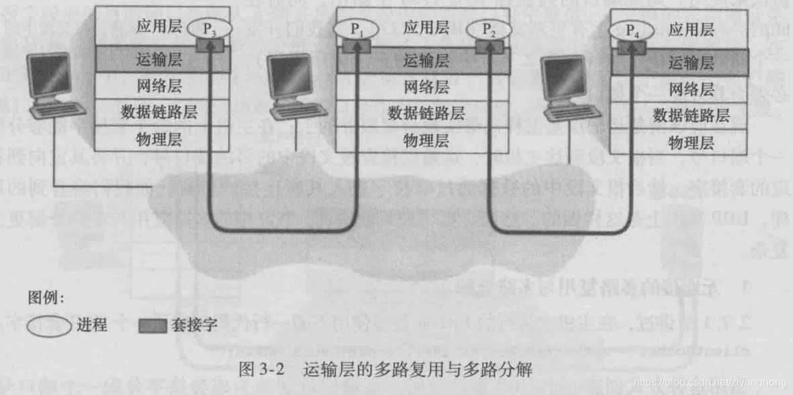

- 有无连接的复用与分解
  - UDP的套接字标识是一个二元组,包含目的IP和目的端口
  - TCP的套接字标识是一个四元组,(源IP,源端口,目的IP,目的端口),当源IP/端口不同时,会创建不同的套接字,除非携带了初始创建链接的请求
  - 一个进程可以拥有多个连接套接字,通过多线程处理不同套接字是Web服务器常用手段

### 3 无连接运输:UDP

- 一个最简化的模型,单纯传输数据,几乎不提供额外服务(校验/纠错等),只需要多路复用分解

  也就是添加源/目的端口号,以及一些校验字段就可以传给网络层

- 使用UDP的原因

  - 需要低延迟,比如直播/语音通话等
  - 无需连接,比如chrome浏览器的QUDP协议
  - 无连接状态,分组首部开销小

  - 案例有 DNS / SNMP / 实时的流等

- UDP报文结构

  - 首部只有8字节,

  - UDP校验和计算: 

    - 生成,对校验值设置为0,对所有16比特字求和, 遇到溢出就回卷(加到结果上),对和取反码(0变1)

    - 校验,对所有16比特字求和,结果需要是每个位都是1

    - > 假设 sum = a + b + c + d + 0,sum代表最终加法和,字母表示16比特字,0代表初始校验值,那么 校验值等于 sum取反,记为 !sum, 并且 sum + !sum = 11111111111
      >
      > 校验时候 result =a + b + c + d  + !sum = sum + !sum = 11111111,假如出现一个0,说明错误

  - 

### 4 可靠数据传输原理 

- 可靠数据传输协议位上层实体提供的服务抽象是数据通过可靠信道传输,数据比特不会发生损坏或者丢失

- 构造可靠传输协议

  - rdt1.0,假设底层信道完全可靠

    - 因为不必担心数据错误问题,直接发送和接收

  - rdt2.0,假设底层是不可靠信道,但是顺序接收

    - 对比打电话,假如听到模糊语音可以让对方重复一遍,

      接收到顺坏数据,让对方重新发送的机制称为 自动重传请求协议(Automatic Repeat reQuest)

    - 需要另外三种协议功能来处理存在比特差错的情况:

      - 差错检测,需要一种机制检测合适出现了比特错误.
      - 接收方反馈,肯定确认和否定确认
      - 重传

    - 发送方完成发送后进入等待确认状态,不可以传送更多数据,这种协议称为 停等协议(stop-and-wait)

      - 看起来已经可用且见到那,但是对于ACK/NAK丢失未作处理
      - 通过重传冗余分组让接收端返回ACK/NAK,通过在首部添加序号让接收端可以区分数据分组
      - 对于停等协议只需要一个比特位,可以去掉NAK

  - rdt3.0

    - 需要解决 如何检测丢包 以及 丢包后如何处理
    - 可以通过等待一定时间,假如没有接收到确认,则认定丢包
      - 等待时长至少大于数据包在两者之间传递一个来回的时间,但是无法区分是丢失还是时延过长
      - 基于计时的重传机制需要一个倒计时器(countdown timer)
    - 到这里,实现了一个可靠的数据传输,用到了 校验和,序号,定时器,确认分组技术
  
- 流水线可靠数据传输协议

  - rdt3.0是一个正确的协议,但是性能不行,问题是它是停等协议

    > 假设有两台主机,往返传播时延(RTT)是30ms,通过发送速率R=1Gpsd相连,
    >
    > 发送长度 L = 1000字节的数据需要 t = L/R = 8 μs
    >
    > 接收到ACK的时刻 t = RTT/2+L/R = 30.008 ms
    >
    > 信道的利用率, 发送方发送比特进入信道时间与发送时间之比 U~sender~ = L/R  / (L/R + RTT/2) = 0.00027

  - 流水线方式发送,允许等待确认之前发送多个报文

    - 影响,需要增加序号范围,需要增加缓冲,差错恢复使用回退N步和选择重传

    - 回退N步协议(Go-Back-N),流水线允许的最大未确认数N.

      - N也成为窗口长度,GBN也称为滑动窗口协议(sliding-window protocol)
      - 为什么不采用无限制长度? 流量控制是原因之一.
      - 首部字段中会有k位表示序号,N的长度为 2^k^
      - 

      - 发送方必须响应三种类型的事件
        - 上层的调用,检查发送窗口是否已满,假如已满可以返回/加入缓存等操作
        - 接收ACK,对序号为n的分组采取累计确认(cumulative acknowledge),表示接收方以正确接收到包括n之前的所有分组
        - 超时事件,发送方超时后重传所有已发送但未确认分组
      - 接收方
        - 如果分组n正确接收,返回n;
        - 其他情况丢弃
      - 这种协议对接收方来说简单

  - 选择重传

    - 在GBN中发生差错会重传大量分组,选择重传(Seletctive Repeat)只重发认为丢失的分组
    - 接收方会缓存失序分组,知道所有丢失分组接收完整才会交付给上层
    - 发送/接收方不同步会带来严重问题,当窗口长度大于序号长度
      - ACK丢失,发送方的重发分组被当成新分组
      - 分组丢失,无法区分新分组还是重发
      - 窗口长度必须小于等于序号空间的一半
    - 

  - 当信道是网络时,分组重排序是不可避免的,可以吧信道看成在缓存分组,并在将来任意时刻发送分组,

    由于序号可以被重新使用,对于冗余分组必须十分小心

    必须确保一个序号不被重新使用,直到发送方确信任何先前发送的序号不再存在.通过设置最大存活时间,一般假设大约3min

### 5  面向连接的传输:TCP

- TCP连接

  - 面向连接(connection-oriented)是因为发送数据之前双方必须先握手,即通过相互发送某些信息建立确保数据传输的参数

  - 事实上TCP连接只是逻辑连接,只存在于端系统,路由器看到的是数据报而不是连接

  - TCP连接是全双工服务(full-duplex service),也就是数据可以双向流动

    同时也是点对点(point-to-point),不存在多播(一对多)

- 连接过程

  - 三次握手,由客户端主动发起一个TCP特殊报文,服务器接收并响应,不带有负载

    客户端接收再响应特殊报文,这次可以承载有效载荷

  - 建立TCP连接后,客户端通过套接字把发送数据引导到 发送缓存 (在三次握手时设置的缓存之一)

    - TCP可以缓存中获取一定量数据并放入报文段,数量受限于 最大报文段长度(Maximum Segment  Size),指的是纯数据,不包含TCP首部

    - MSS通常根据本地主机的最大链路层帧长度(Maximum Transmission Unit,最大传输单元)来设置,以太网和PPP协议的MTU都是 1500 字节

      MSS典型值 1460,TCP/IP首部 40字节,

- TCP报文段结构

  - 两个16位端口号,用于多路复用/分解

    32位序号和确认号,用于可靠数据传输服务

    4位首部长度(数据偏移),表明首部长度.TCP首部长度可变(20-60),以四字节为单位

    选项字段用于协商MSS,还定义了时间戳选项

  - 

  - 序号(Sequential number for a segment)和确认号

    - TCP把数据看成无结构,有序的字节流,确认号是代表当前主机期望收到的报文序号,
    - TCP只确认流中至第一个丢失位置的字节,也成为累计确认
      - 对于失序报文可以采用丢弃(回退N),也可以缓冲(选择确认)

- 往返时间估计

  - 报文段的样本RTT是从某段报文被发出到对该报文段确认被收到之间的时间量

    大多数TCP实现仅采用某个时刻做一次SampleRTT测量,不会为义重传的报文计算SampleRTT

  - 采样使用指数加权移动平均(Exponential Weighted Moving Average),

    EstRTT = α SampleRTT + (1-α)EstRTT  ,α 取 1/8,表示预估值

    DevRTT = (1-β)DevRTT + β|SampleRTT - EstRTT|,β取0.25,表示差值

    TimeoutInterval = EstRTT + 4 DevRTT,重传间隔

- 可靠数据传输

  - 定时器的管理需要相当大开销,推荐定时器管理过程仅使用单一的重传定时器,即使有多个未确认报文段

  - 定时器超时重传具有最小序号但仍未应答报文段,启动定时器

  - 接收来自确认报文的ACK(确认序号),假如确认序号y>当前发送且未确认序号,则更新未确认序号(因为采用累确认,所以y代表y之前已接受到),

    假如当前还有未确认报文,还需要启动定时器

  - ```c++
    /* 假设发送方不受 TCP 流量和拥塞控制的限制，来自上层数据的长度小于 MSS，且数据传送只在一个方向进行。 */
    
    NextSeqNum = InitialSeqNumber
    SendBase = InitialSeqNumber
    
    loop (永远) {
    	switch (事件)
    		事件: 从上面应用程序接收到数据 e
    			生成具有序号 NextSeqNum 的 TCP 报文段
    			if (定时器当前没有运行)
    				启动定时器
    			向 IP 传递报文段
    			NextSeqNum = NextSeqNum + length(data)
    			break;
    		事件: 定时器超时
    			重传具有最小序号但仍未应答的报文段
    			启动定时器
    			break;
    		事件: 收到 ACK，具有 ACK 字段值 y
    			if (y > SendBase) {
    				SendBase = y;
    				if (当前有未被确认的报文段)
    					启动定时器
    			}
    			break;
    } /* 结束永远循环 */
    
    ```

- 超时情况分析

  - 确认丢失而导致重传,只需要直接丢弃
  - 发生超时重传,只要发送端接收到确认号就会停止对应部分的重传
  - 累计确认会取消之前的超时重传
  - 可以看到确认跨越一个超时周期就会重传
  - 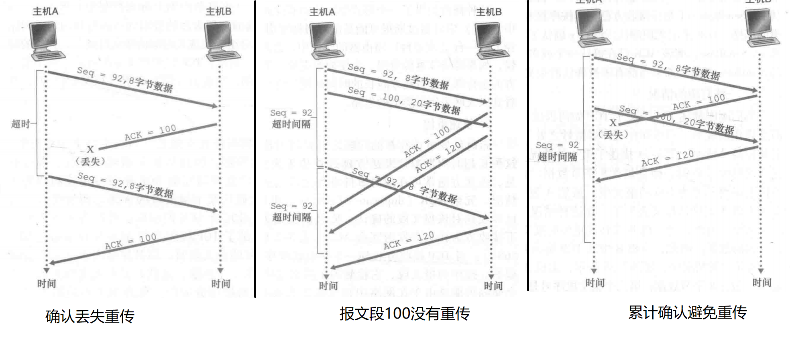

- 超时间隔加倍

  - 大多数TCP实现中定时器过期后超时周期是之前的两倍

    TimeoutInterval = 2 * TimeoutInterval,而不是之前的EstRTT和DevRTT加权平均

    这个是定时器过期才是两倍,收到上层请求/ACK更新定时还是之前的公式

  - 这是一种形式受限的拥塞控制,定时器过期很可能是网络拥塞引起的,如果持续重传分组很可能加重拥塞

- 快速重传

  - 超时触发重传的问题之一是超时周期可能相对较长,当一个报文丢失这种长超时周期迫使发送方延迟重传丢失的分组,增加了端到端的时延

    冗余ACK(duplicate ACK)就是再次确认某个报文段的ACK

    

  - 当发送方连续收到3个冗余ACK立即执行快速重传(fast retransmit),即在该报文段的定时器之前重传丢失的报文段

  >  TCP确认是累计式,正确接收但失序是不会被确认的,看起来更像GBN方式
  >
  > 对TCP提出的一种修改意见是选择确认,允许接收方有选择确认失序报文段,看起来更像SR协议
  >
  > TCP的差错恢复机制可以说是GBN协议与SR协议的混合体

- 流量控制

  - TCP接收正确,按序的字节后将数据放入缓存,但不一定立即被消费,当发送方发的太多太快就会发生溢出,

    TCP提供了流量控制服务(flow-control service),作用是速度匹配,让发送和接收速率相匹配,TCP发送方可能因为网络拥塞而被抑制,称为拥塞控制,两者采取动作相似,但是原因完全不同

  - TCP通过发送方维护一个接收窗口(receive window)提供流量控制,给发送方指示当前接收方还有多少缓存空间

    - LastByteRead表示进程读取最后一个字节编号

    - LastByteResv表示加入缓存的最后一个字节编号

    - LastByteResv - LastByteRead ≤ ResvBuffer ,ResvBuffer表示缓冲区大小

    - 接收窗口 rwnd = Resv - (LastByteResv - LastByteRead)

    - 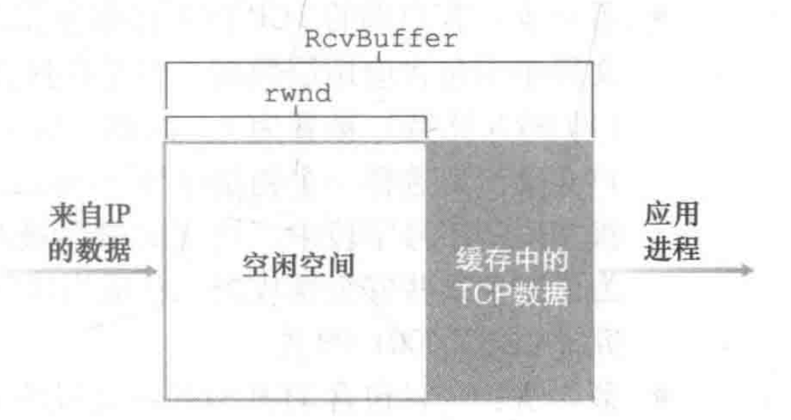

    - 发送方需要保证未确认报文数小于接收窗口大小,TCP仅当有数据发送/确认时才会发送报文段,假如此时窗口为0,那么发送方是不知道的

      所以TCP在rwnd=0时,主机A继续发送只有一个字节数据的报文段,这些报文段最终会被确认,缓存清空时,确认报文就会含有非0的rwnd

- TCP 连接管理

  - TCP 连接的建立会显著增加时延
  - 三次握手连接过程
    - 客户端发送特殊报文段,不包含数据,首部的 SYN 标志位置 1,称为 SYN 报文段, 
      会随机选择一个初始序号(client_isn),为了避免某些攻击,有些会适当随机取
    - 服务器接受到 SYN 报文段,分配 TCP 缓存和变量,并发送允许连接的报文段,不包含数据 
      SYN 置 1,确认号=client_isn+1,最后选择服务器的初始序号(server_isn) 
      称为 SYNACK 报文段
    - 客户端收到 SYNACK 报文段,分配缓存和变量,发送最后一个报文进行确认. 
      SYN 置 0,序号=client_isn+1,确认号=server_isn+1,该报文可以携带数据
    - 
  - 四次挥手
    - 客户端发送特殊报文,FIN 置 1
    - 服务器发送 ACK 报文
    - 服务器发送 FIN 报文
    - 客户端发送 ACK 报文
    - 
    - 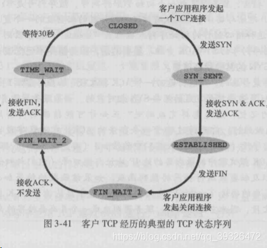

- SYN洪泛攻击(SYN flood attack),大量SYN连接请求生成半连接,使用SYN cookie进行防御

  - 服务器生成一个初始TCP序列号而不是半连接,序列号是根据四元组和散列函数生成的,称为cookie
  - 如果客户端返回ACK,那么才会生成套接字

- nmap端口扫描工具

  - 当一台主机端口不接受连接,收到TCP的SYN报文段时会将RST标志位置1,表示拒绝

    收到UDP分组时则是返回特殊的ICMP数据报

  - 所以nmap扫描一个端口时

    - 收到TCP SYNACK,说明TCP端口接收连接
    - 收到TCP RST,说明拒绝连接,没有防火墙
    - 什么也没有,防火墙阻隔

### 6 拥塞控制  

- 拥塞原因和代价

  - 两个发送方和无限缓存的路由器,发送速率λ字节/秒,链路容量R,

    当λ < R/2,每连接吞吐量等于λ,当超过R/2,只能达到R/2

    然而此时分组会开始排队,时延指数级增长

    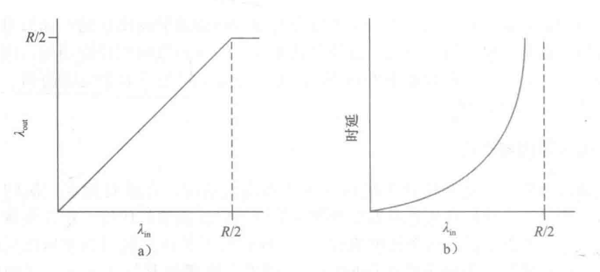

  - 两个发送方和缓存有限路由器

    考虑到TCP重传,假设发送速率没有重传是λ~in~,重传是λ^'^ ~in~ ,

    当网络拥塞时重发分组占比越来越大

    当路由器转发两次,其吞吐量变为R/4

    

  - 四个发送方和多台缓存有限路由器

    以R2来考虑,需要承担A-C和B-D的流量,当R1以速率R发送就会把R2占满,那么主机B就会丢包,

    假如主机B把R2占满,那么R1就会丢包,代价是之前在R1的传输全浪费了

    - 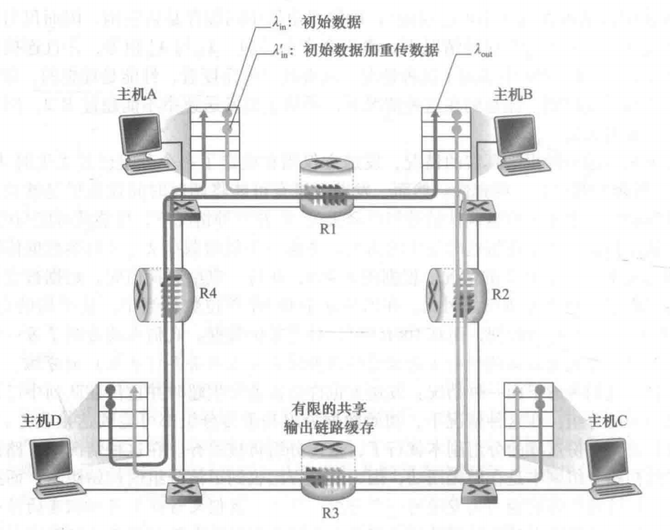

- 拥塞控制方法
  - 可以根据网络层是否为传输层拥塞控制提供显示帮助来区分拥塞控制方法
    - 端到端拥塞控制,网络层不提供显示帮助.通过报文丢失(超时/3次冗余确认)认为拥塞,减少发送窗口长度
    - 网络辅助的拥塞控制,路由器提供某些显示信息,默认是端到端

### 7 TCP拥塞控制

- TCP采用端到端拥塞控制,通过感知网络拥塞程度调整发送速率

  - 如何感知? 如何限制?

  - 控制发送速率,TCP连接每一端都维护发送缓存,接收缓存,变量,除此之外,发送方额外维护一个拥塞窗口(congestion window),表示为cwnd.

    发送方未被确认分组数不会超过 cwnd与rwnd的最小值(rwnd是接收窗口大小)

    LastByteSent - LastByteAcked ≤ min{cwnd,rwnd}

  - TCP的丢包事件定义为 超时或者出现3次冗余ACK.TCP通过感知丢包事件推测拥塞

    - TCP使用确认来触发调节拥塞窗口长度,也称为自计时的
    - 使用一些原则来限制发送速率:
      - 丢失的报文意味着拥塞,应当降低发送速率
      - 一个确认报问可以认为是网络通畅,可以增加发送速率

- TCP拥塞控制算法(TCP congestion control algorithm)

  - 慢启动 

    - TCP连接开始时,cwnd的值通常初始为一个MSS的较小值,这样发送速率大约为 MSS/RTT
    - 接收到确认报文后 cwnd 将增加一个MSS大小,并发送两个最大长度报文段 
    - 每接收一个ACK,都会有上面操作,cwnd指数增长
    - 当发生丢包,就把cwnd置1,重新开始慢启动,更新ssthresh(慢启动阈值)为原来的一般,检测到冗余ACK还会执行快速重传

  - 拥塞避免

    - 进入拥塞避免状态,cwnd 约为 遇到拥塞值得一半.此时每个RTT只增加一个MSS.(比如cwnd时14600字节,MSS时1460字节,那么在一个RTT内发送10个报文段,每个ACK增加1/10MSS)
    - 出现丢包,cwnd设置为原来的一半,ssthresh为cwnd的一半

  - 快速恢复

    - 对于每个冗余ACK,cwnd增加一个MSS.
    - 丢包时,cwnd设置为1个MSS,ssthresh为cwnd的一半
    - 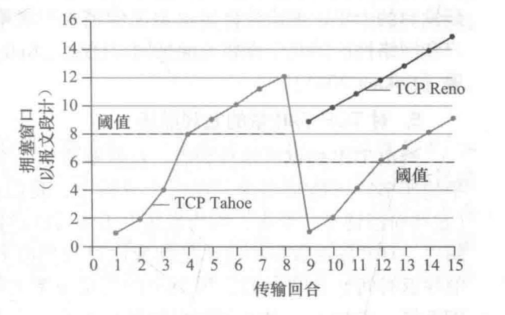

  - 从上面三个过程来看,拥塞控制是一个动态的过程,常被称为加性增,乘性减(additive-increase , multiplicative-decrease,AIMD)

    

- 公平性

  - TCP的AIMD算法公平吗?TCP趋于在竞争的多条TCP连接平等分享带宽

  - 假设两个连接经过同一个路由,刚开始吞吐量处于A点,连接1和2都会增加cwnd,

    所以来到了B点(x,y都增加相同的值),此时超过带宽R,连接1和2开始拥塞控制,cwnd变一半

    来到了C点,重复A~B过程

  - 以上时理想情况,实际上具有较小RTT能更快抢到带宽

    

  - 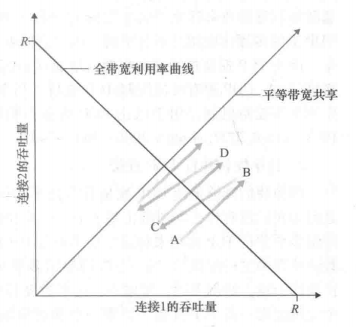

  - 遇到UDP时候时不公平的,因为UDP没有拥塞控制,TCP可能会直接被压制

  - 一般现在浏览器使用多个TCP连接,对于并行的TCP连接也是不公平的

- 明确拥塞通告

  - 网络层IP数据包的首部使用两个比特指示用于ECN(Explicit Congestion Notification,明确拥塞通告 )
  - 路由器设置,会发送给目的主机,目的主机在ACK报文段折纸ECE(明确拥塞通告回显)

- 小结

  - 数据报拥塞控制协议(Datagram congestion control protocol)提供了 一种低开小,面向报文,类似UDP的不可靠服务,

    应用程序可选的控制形式,和TCP兼容,应用于诸如流媒体程序

  - 在谷歌浏览器中实现了QUIC(Quick UDP internet Connection)协议,通过重传差错检测,快速连接和基于速率的拥塞控制提供可靠性,建立在UDP之上

  - DCTCP(Data Center TCP)是一种专门为数据中心定制的TCP,使用ECN可以更好控制短流和长流

  - 流控制传输协议(stream control transmission protocol),可靠面向保温的协议,允许几个不同层次的流应用到SCTP

  - TCP友好速率控制协议是一种拥塞控制协议而不是功能齐全的运输层协议,目标是让锯齿状的发送速率更平滑

## 第4章 网络层:数据平面

### 1 网络层概述

- 路由器具有截断的协议栈(只有物理层,链路层,网络层),

  路由器的数据平面功能负责从输入链路转发数据报到输出链路

  路由器的控制平面功能 主要协调本地的路由器转发动作

- 转发和路由选择:数据平面和控制平面

  - 转发(forwarding),当一个分组到达路由器的输入链路,路由器必须将其移动到适当的输出链路

    是指分组从输入转移到输出链路的路由器动作,时间很短(通常几纳秒),使用硬件实现

  - 路由选择,分组转发时的路由选择算法(routing algorithm),决定了输出链路

    是指确定分组从源到目的地所采取的端到端路径的网络范围处理过程,通常要几秒,软件实现

  - 每台路由器网络都有转发表(forwarding table),路由器根据首部搜索转发索引

  - 

  - 控制平面:传统方法

    - 路由器通过与邻居路由器交换信息决定转发表的值
    - 人工配置可以不需要任何路由协议,但是容易出错,响应慢

  - 控制平面:SDN方法

    - SDN(Software Defined Networking),软件定义网络,通过将控制平面功能作为一个单独服务,与数据平面分离

    - 对于人类可以手动配置路由表启发,远程控制器负责计算和分发转发表供路由器使用,路由设备只负责转发

      远程控制器可能是现在具有高可靠性和荣誉的远程数据中心,由ISP或第三方管理

      路由器和远程控制器通过交换包含转发表和其他路优选择信息的报文进行通信

      SDN的计算转发表和远程控制器都是软件实现的,所以网络是软件定义的

    - 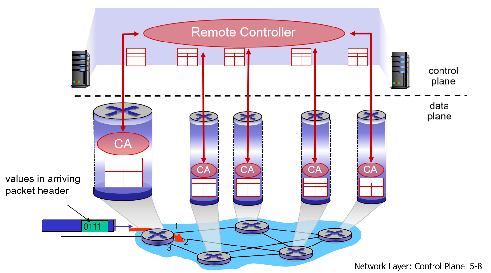

- 网络服务模型(network service model)
  - 定义网络层能够提供的端到端的运输特性,可能包含以下服务:
  - 确保交付,该服务确保分组最终到达目的地
  - 具有时延上届的确保交付
  - 有序分组交付
  - 确保最小带宽
  - 安全性,加密
  
- 因特网提供了单一服务,尽力而为服务(best-effort service),上述的服务都没有覆盖

  - ATM网络体系提供了按序时延/有序时延/最小带宽服务
  - 尽力而为和适当带宽供给已经"足够好"

### 2 路由器工作原理

- 转发功能

  - 输入端口,从左往右是 物理层,链路层,网络层, 在网络层通过查询转发表决定路由输出端口

  - 输出端口,顺序从左往右是 网络层,链路层,物理层, 一般和该链路的输出端口出现在同一线路卡

  - 交换结构,连接输入输出,包含在路由器结构

  - 路由选择处理器,负责控制平面.传统路由器中,执行路由选择邪恶一,维护路由选择表与关联链路信息

    在SDN路由器中,路由选择处理器负责与远程控制器通信,接收来自控制器的转发表并安装这些表项,此外它还执行网络管理功能

  -  

  - 假设一条10Gbps的链路接收64字节的IP数据包,那么在另一个数据报到达之前只有51.2ns处理,如果N个端口绑定在一块线路卡,那么数据包处理流水线必须以N被速率运行,所以数据平面几乎是使用硬件实现的

  - 路由器的控制平面一般使用软件实现,以毫秒甚至秒运行,包括执行路由协议,上下线处理,远程通信和网络管理

- 输入端口处理和基于目的地转发

  - 路由器转发表从路由选择处理器经过独立总线(比如PCI总线)复制到线路卡,每个输入端口都有转发表副本,避免了集中式处理的瓶颈

  - 

  - 考虑最简单的情况,在32位情况下,假如每个IP地址都对应一个表项,那么会超过40亿个地址

    考虑使用不同的端口匹配不同的前缀,出现多个匹配时使用最长前缀匹配规则(longest prefix matching rule),这是跟IP的编址特点对应的

    | 前缀匹配      | 链路接口 |
    | ------------- | -------- |
    | 101.101.*     | 0        |
    | 101.102.*     | 1        |
    | 101.102.101.* | 2        |

  - 在Gbps,查找表项必须使用超出简单搜索的技术,同时对内存访问事件特别关注,所以嵌入式片上用DRAM和SRAM,也经常用三态内容可寻址存储器(Tenary Content Address Memory),使用TCAM可以在常数时间内返回一个IP地址对应的表项

  - 除了查找,还需要处理物理层和链路层,检查分组版本号,校验和,TTL,还要更新网络管理计数器,

    总结起来就是"匹配+动作",无论时网络层还是链路层,还是软件设计,都是一种很常见的抽象

    > 比如 awk 工具就是匹配加操作

- 交换

  - 交换结构位于路由器核心,可以有多种完成方式

    - 经过内存交换,最早最简单的路由器就是传统计算机,跟传统IO设备一样,当输入端口发出中断,CPU复制到内存,根据首部发往目的端口缓存,

      如果内存每秒读写分组数称为带宽B,那么总吞吐量只有B/2

      现代路由器通过内存交换,差别是目的地址的查找和复制进内存由线路卡完成

    - 经总线交换,输入端口通过共享总线直接传输到输出端口,不需要处理器干预.

      输入端口为分组预先计划一个内部标签,指示输出端口,所有输出端口都可以接收到分组,只有标签对应的输出端口才能保存

      每个分组必须跨越总线,每次都有其他接口等待,交换带宽受限于总线速率

    - 经互联网络交换,克服单一共享式总线的方法就是使用更复杂的互联网络,

      图中使用2N条总线,交叉点可以通过结构控制器开闭,属于非阻塞的

  - 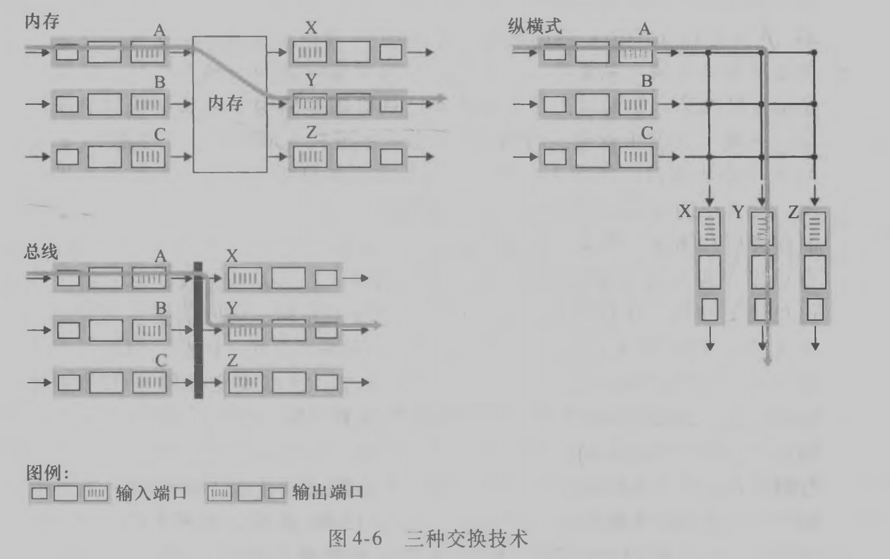

- 输出端口处理

  - 当输出端口的缓存不够时就会发生丢包

  - 当交换结构的处理速率比输入端口的速率快N倍,处理N个输入端口只会发生轻微排队

    - 当交换结构速度不够快,输入端口会发生排队,当不同输入端口发往同一个输出端口时,就会发生排队,称为线路前部阻塞(head-of-the-line,HOL)

  - 当交换结构够快,假如都发往同一个输出端口,就会发生输出端口缓存耗尽

    - 要么丢弃新来分组(drop-tail,弃尾),要么删除缓存里的.某些情况下,缓存还没填满就会丢弃一个分组,发送阻塞信号,这种行为称为主动队列管理(Active Queue Management)

      随即早期检测(Random Early Detection)就是一个AQM

  - 当输出缓存有多个分组时,就要使用分组调度算法决定输出顺序

  - 缓存大小一般采用 平均往返时延*链路容量C, 

  - 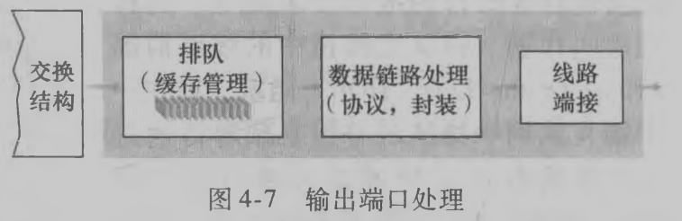

- 分组调度(调度算法)

  - FIFO,先进先出,丢弃策略要么拒绝新的,要么删除旧的

  - 优先权排队(priority queuing),不同队列有不同的优先级,队列里面采用FIFO

    - 比如IP实时通话可以优先级高一些,网络管理信息优先级高

  - 循环排队规则(round robin queuing discipline),多个队列逐个轮询

  - 加权公平排队(weighted fair queuing),跟上面的区别在于每个队列分配一个权重w~i~,

    在队列i有数据要发送的时间间隔中,队列i保证 接收到的服务部部分等于 w~i~

    /Σw~i~,简而言之就是根据队列权重分配带宽

### 3 网际协议

- IPv4数据包格式

  - 版本号,4比特,路由器根据它确定如何解析数据报

  - 首部长度 4比特,以4字节为单位,IPv4的首部长度是可变的,包含一些可选项目,一般是20字节

  - 服务类型(TOS),用于区分不同类型数据报,比如优先级高低,吞吐量大小,时延大小等

  - 数据报长度,16比特,是IP数据报总长度(首部+数据),最大为65535,但是很少超过1500,因为以太网帧长度限制

  - 标识/标志/片偏移,与IP分片处理相关,IPv6不允许路由器分片

  - TTL(Time to Live)确保数据不会在网络中循环,当TTL=0时,直接丢弃

  - 上层协议,指明数据里面是TCP/UDP还是别的协议

  - 首部校验和,首部(不包括数据)每两个字节当成一个数,进行求和后取反码放到该字段

    每个路由器必须重新校验,因为TTL是会变化的,跟TCP差别在于只需要计算首部

  - 选项,扩展IP首部,很少使用,IPv6已经去除

  - 数据,承载TCP/UDP/ICMP等报文

  - IP+TCP 首部长度达到了 40 字节

  - 

- 链路层帧能够承载的最大数据量称为 最大传输单元(maximum transmission unit),比如 以太网不能超过1500字节,限制着IP报文大小

  - 当路由器连接着不同的链路,MTU很可能是不同的,就会发生分片现象,把大的IP数据报拆为若干个小的,这些小的数据包称为片(fragment)

  - 分片的合并工作放在端系统里,为了保持网络内核的简单

    合并工作用到标识 标志 和 片偏移 这三个IPv4协议字段

    - 标识,16比特,标识数据报唯一ID,不同分片用一样ID,每发送一个数据报就加一
    - 标志,3比特,bit0保留,bit1表示是否分片(0表示分片),bit2表示是否还有后续分片(0表示最后分片)
    - 片偏移,13比特,表示该分片在整个数据报的位置,单位8字节,

- IPv4编址
  - 主机与网络连接
    - 主机与物理链路的边界称为 接口,链路与路由器的边界也称为接口,路由器因此拥有多个接口,
    - IP要求每台主机和路由器接口拥有自己的IP地址,从技术上来说,IP是与接口关联的,而不是路由器/主机
  - IP长度32比特,大约有40亿个可能IP地址,采用点分十进制表示(dotted-decimal notation),
    - 不包含路由器的网络通常用一朵云表示,很可能是在一个以太网LAN互联
    - 云朵可以表示为一个子网,比如 223.1.1.xxx/24 ,这个 24 表示该网络中前24相同,处于同一个网段,称为 子网掩码
    - 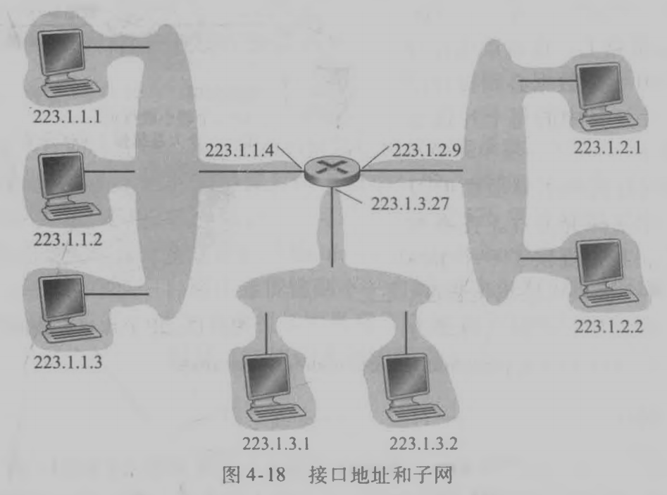
  - 因特网编址
    - 因特网地址分配策略称为无类别域间路由选择(Classess Interdomain Routing,CIDR)
    - IP地址具有以下形式 a.b.c.d/x, 地址的前x位表示IP地址的网络部分,称为地址前缀,这也是路由表使用前缀匹配目的地址的原因
    - 使用前缀通告多个网络的能力称为地址聚合/路由聚合/路由摘要
    - 地址可以匹配多个,采用最长前缀匹配
  - 分类编址(classful addressing)
    - IP地址使用网络部分被限制为 8/16/24 比特,分别称为 A/B/C网
  - IP获取流程
    - 获取一块地址
      - 向ISP获取一块地址,IP地址由因特网名字和编号分配机构(Internet Corporation forAssigned Names and Numbers,ICANN)管理
      - 它们不仅仅管理IP地址,还管理DNS根服务器
    - 获取主机地址
      - 可以通过手工配置路由器的IP地址,也可以使用动态主机配置协议(Dynamic Host Configuration Protocol,DHCP)
      - DHCP允许主机自动获取一个IP地址,管理员只需要配置DHCP
      - DHCP获取IP过程
        - DHCP服务器发现,主机通过DHCP发现报文(DHCP discover message)完成,使用UDP分组向端口67发送,通过广播地址255.255.255.255进行发送,本机地址0.0.0.0
        - DHCP服务器提供,服务器响应DHCP提供该报文(DHCP offer message),也是向全网广播,因为DHCP服务器可能含有冗余,响应带有IP地址/租期等信息
        - DHCP请求,客户端选择一个DHCP报文,并向该服务器发送DHCP请求报文,回显配置参数
        - DHCP ACK,服务器进行响应,确认请求报文参数
      - 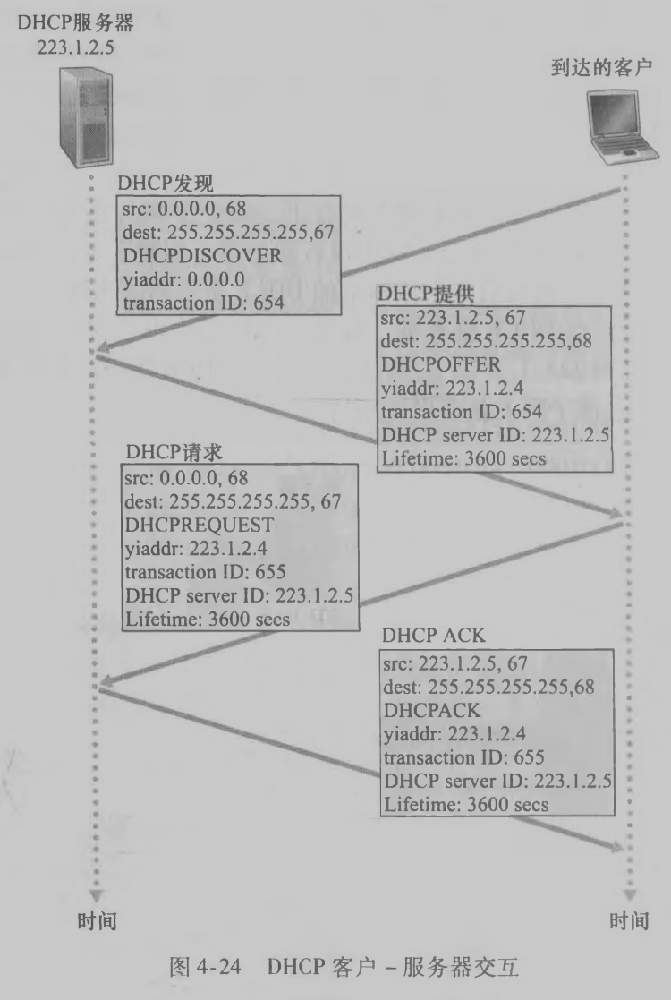

- NAT(Network Address Translation)

  - Nat路由器通过NAT 转换表来决定分组应该发给哪台主机,除了IP地址还包含了端口

    利用端口映射不同主机的不同端口

  - 端口使用16比特,意味着NAT协议可支持60 000个并行路由器广域网一侧单个IP地址选择

  - 反对声音,

    - NAT在局域网当服务器会引起问题,解决方案包括NAT穿越工具(NAT traversal)和通用即插即用(Universal Plug and Play)
    - 路由器是基于网络层,而NAT用到了端口

    - NAT违反了主机彼此对话

  - 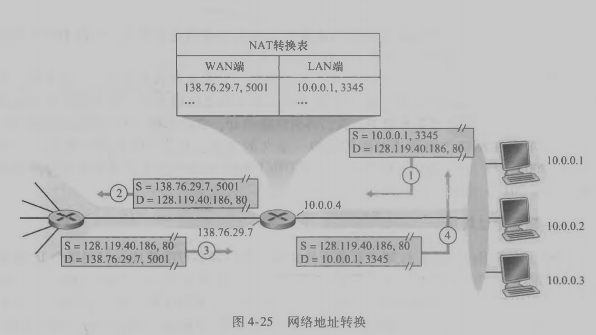

- IPv6

  - 首部 40 字节
  - 地址容量 128 比特,引入任播地址(anycast-address),将数据交付给一组主机的任意一个
  - 流量类型,跟TOS字段含义相似
  - 流标签,给特殊流的分组加上标签,比如视频/音频等传输可以被当做一个流
  - 下一首部,表示数据的协议类型(TCP/UDP/...)
  - 跳限制,IPv4的TTL
  - 取消以下字段
    - 分片/重组,IPv6不允许中间路由器分片重组,假如路由器不能发送大分组,只需要返回一个ICMP差错报文,发送方就可以使用较小长度数据报重发数据
    - 校验和,IPv4的TTL导致每个路由器都要重新计算,耗时较大
    - 选项,出现在下一首部指示的位置,下一首部就不一定是TCP/UDP了
  - 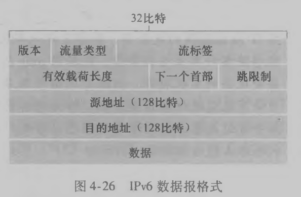

  

  - 迁移
    - 建隧道(tunneling),两端采用IPv6,中间路由使用IPv4
    - 改变网络层协议是十分困难的,如同替换一栋房子的地基,1992年IETF开始研究,2003年出现IPv6测试网络,至今尚未普及开来
    - 

### 4 通用转发 和 SDN

- 匹配+动作

  - 许多网络层中间盒有了大量发展,比如NAT重写IP地址和端口,防火墙基于首部字段拦截,均衡负载将web请求转发到 指定服务器

  - 基于SDN总结为匹配+动作,匹配包括对多个协议首部进行匹配,动作包括广播/拦截/负载均衡/重写首部等

  - 所以将之前的路由器称为分组交换机,只负责将分组进行交换,而没有其他动作处理

    路由器使用匹配加动作表,由远程控制器计算/分发/更新

  - OpenFlow是已经得到认可的标准,匹配动作表称为流表,表项包括

    - 首部字段值集合,基于硬件匹配,可能由多张流表组成
    - 计数器集合,包括已经匹配的分组数量,更新时间等
    - 动作 集合,转发/复制/重写/丢弃等

  - 

- 匹配
  - 可以一次匹配三个层次的协议首部(违反了分层原则)
  - 入端口是指交换机的输入端口(识别IP首部字段)
  - OpenFlow不匹配TTL/数据报长度/校验和等,
  - 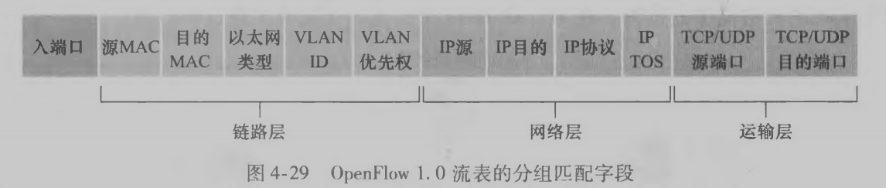

- 动作
  - 转发,跟之前一样,输入端口复制到输出端口,支持多播
  - 丢弃,没有动作的流表项就会被丢弃
  - 修改字段,,分组首部的10个匹配字段可以重写

## 第5章 控制平面

### 1 概述

- 转发表(基于目的转发)和流表(通用转发)
  - 计算安装维护
    - 每路由器控制,每台路由器运行一种路由选择算法,包含转发和路由选择哦那个能,通过路由选择组件与其他路由器通信.代表案例OSPF,BGP协议.
    - 逻辑集中式控制,提供更多功能,如转发/拦截/重写等,通过CA(Control Agent)管理流表,代表SDN.

### 2 路由选择算法

- 路由选择算法(routing algorithm)作用是从发送方到接收方之间确定一条好的路由路径(低开销)

  - 使用图来表示网络,节点表示路由器,边表示链路,边的值表示开销(比如时延/速度/金钱等)

  - 算法最终目的就是求出两点之间开销最小的路径,称为最低开销路径,

    这些路径可能有多条,边最少的那条称为最短路径

- 算法分类(根据集中式/分布式)

  - 集中式路由选择算法(centralized routing algorithm),用完整的,全局的网络知识计算出从源到目的地之间的最低开销路径

    这要求提前知道关于开销和连通性的全局信息,具有这种信息的全局算法称为链路状态算法(Link State)

  - 分散式路由选择算法(decentralized routing algorithm),路由器用迭代,分布式的方式计算最低开销路径.每个路由器包含自己和邻居路由器的信息.

    代表案例,距离向量(Distance Vector)算法

  - 根据算法是静态还是动态的划分

    - 静态路由算法是指路由随时间变化非常慢,一般人工调整
    - 动态路由算法随着网络流量负载变化/网络拓扑变化而改变路由路径

  - 根据对负载是否敏感划分

    - 负载敏感算法(load-sensitive)链路开销会动态变化以反映底层的拥塞水平(ARPAnet使用,所以遇到很多问题)
    - 负载迟钝算法(load-insensitive),链路开销不明确表示当前拥塞程度(现在网络采用)

- 链路状态路由选择算法

  - LS算法的输入网络拓扑和所有链路开销,实践中是让每个节点向网络广播链路状态分组完成的(使用OSPF协议)

  - 使用Dijsktra算法(使用了贪心算法的思想),算法复杂度O(n^2^),经过堆优化可以达到对数实践

    - 记号定义:

      - D(v)表示到算法的本次迭代,从源节点到目的节点v的最低开销路径的开销.Distance
      - p(v)表示从源到节点v最低开销路径的前一个节点.Previous
      - N' 节点子集,如果源到v的最低开销路径已知则v在N'中

    - ```c++
      // 算法伪代码实现
      Initialization: 	// 初始化
      N' = {u} 			// 假设源节点是u
      for all nodes v		// 对所有节点遍历,假如是u的邻居则更新距离,否则设置∞
      	if v is a neighbour of u
          	then D(v) = c(u,v)
          else D(v) = ∞
      
      Loop:				// 迭代,观察还未加入N'的节点,并且找到前一次迭代的
      					// 具有最小开销的节点,加入N'
      	find w not in N' such that D(w) is a minimun
      	add w to N'		// N'是已知有最小开销,所以更新不在N'的节点
      	update D(v) for each neighbour v of w and not in N':
      		D(v) = min(D(v),D(w)+c(w,v))	// 节点只加入w,比较旧的最小路径和新的最小路径开销
      until N'=N
          
      ```

    - 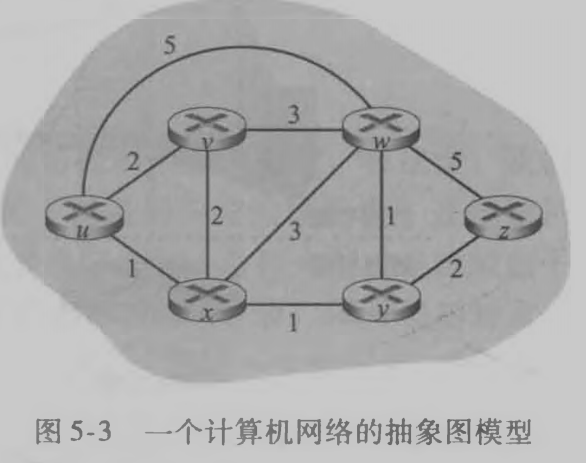

    - 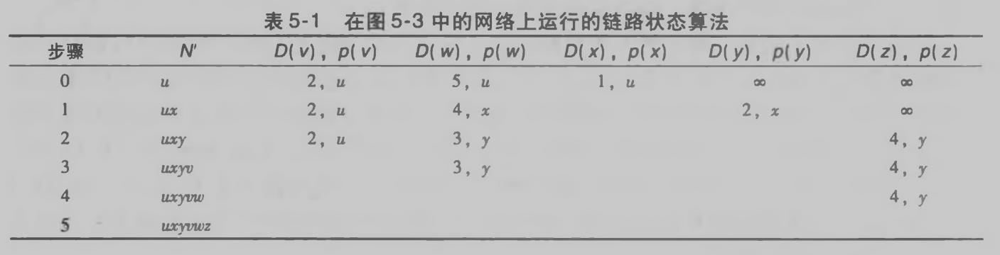

  - 在上面的算法中默认是两个节点之间的双向开销是一样的,实际中流量/负载双向可能不均衡,

    就会出现震荡的现象(顺时针更新完,逆时针更新,如此迭代)一种方案是让所有路由器不要同时运行LS算法

    可以让路由器发送链路通告的实践随机化

- 距离向量路由算法

  - 是一个异步/迭代/分布式的算法,每个节点都要从直连邻居接收某些信息,计算并向邻居分发结果

    此过程已知持续到邻居间无更多信息交换

  - Bellman-Ford方程,d~x~(y)=min~v~{c(x,v)+d~v~(y)},v是x的所有邻居

    - 因为是连通图,所以xy之间必定存在某条路径使其相连,那么x到达y必定需要通过x的邻居节点
    - 可以把Dij算法看成反向传播,Bellman-Ford就是正向传播

  - 算法过程

    - 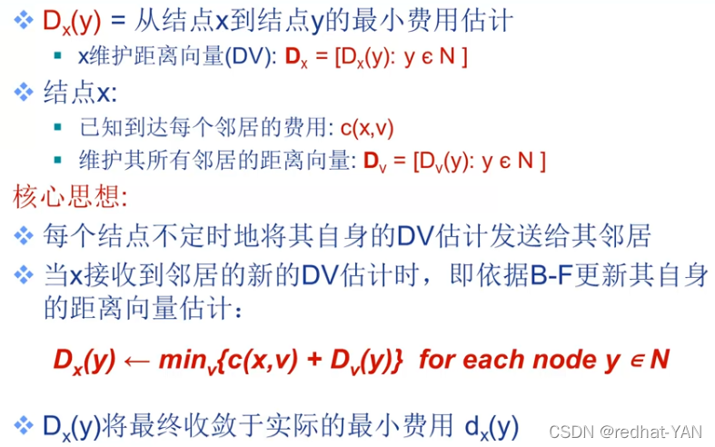
    - 

  - 应用有RIP/BGP/ISO IDRP等,算法一直更新直到不发生变化

    - 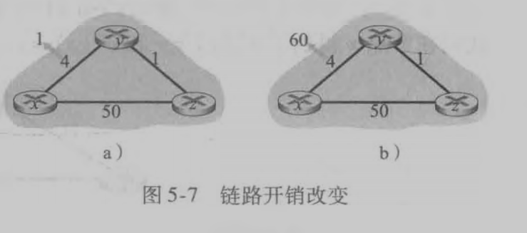

    - 链路开销变化/链路故障,当节点x检测到变化时会自动通知邻居

      - 假如链路开销变小,很快就能达到静态状态

      - 假如链路开销变大,会遇到路由选择环路(routing loop),y→z→y...,称为无穷计数问题,坏消息传播很慢

        (因为路由表的向量计算是根据本地计算,再通知邻居,就会导致邻居的数据是旧的)

    - 增加毒性逆转(poisoned reverse)

      - 如果z通过y达到目的地x,那么z通告y,Dz(x)=∞
      - 可以解决上面环路问题,但是对于多个节点的环路无法解决

    - LS和DV对比

      - | 项目                      | LS                       | DV                    |
        | ------------------------- | ------------------------ | --------------------- |
        | 报文复杂性(N路由器,E链路) | O(NE)个报文,任何链路改变 | 链路开销改变通知邻居  |
        | 收敛速度                  | O(N^2^)                  | 较慢,遇到无穷计数问题 |
        | 健壮性                    | 具有一定健壮性           | 会扩散到整个网络      |

### 3 OSPF

- 自治系统内部的路由选择

  - 随着路由规模数目变大,再路由器中使用DV无法收敛,使用LS数量巨大,

    ISP希望使用自己的路由算法

    以上问题可以通过自治系统(Autonomous System)解决,每个AS有一组相同管理的路由器组成

    自治系统运行的路由选择算法叫做 自治系统内部路由选择协议(intra-autonomous system routing protocol)

- OSPF(开放最短路优先)

  - 和关系密切的IS-IS协议都被广泛应用于AS内部路由选择
  - OSPF是链路状态协议,使用洪范链路状态信息和Dijkstra算法,一台路由器含有整个自治系统的完整拓扑,每台路由运行Dijkstra算法,确定到所有子网的最短开销路径
  - 广播路由信息时是向自治系统内所有路由广播,而不仅仅是邻居路由,通过周期性广播增加健壮性
  - 使用OSPF报文,直接由IP承载,上层协议89
  - 优点
    - 安全,能够鉴别路由器之间的交换,使用鉴别可以防止恶意注入路由,默认OSPF没有使用鉴别伪造
      - 简单鉴别,路由器配置相同口令,明文方式,不是很安全
      - MD5加密,路由器共享密钥
    - 多条相同开销路径,可以用于负载均衡
    - 单播/多播的支持
    - 支持再单个AS层次结构

### 4 ISP之间的路由

- 当AS之间的路由协议需要一个自治系统间路由选择协议(inter-autonomous system routing protocol),所有AS运行相同的路由选择协议称为 边界网关协议(Border Gateway Protocol)

- BGP作用,将分组路由到CIDR化的前缀(也就是网段),路由器转发表具有(x,I)表项,x是前缀,I是路由器接口号

  - BGP获得邻居AS的前缀可达性信息,BGP允许子网向网络其他部分通告存在,保证所有AS知道该子网
  - BGP确定该前缀最好的路由

- 通告BGP路由信息

  - BGP中每对路由器使用179端口的半永久TCP连接交换路由选择信息,每条直接连接以及通过该链接的BGP报文称为 BGP连接

  - 跨越两个AS的BGP称为 外部BGP,再相同AS的两个BGP则是 内部BGP

  - 比如 3a → 2c 发送前缀 x 的eBGP报文, 2c保存 'AS3 x',

    2c → 2a 发送iBGP报文 'AS3 x',2a保存,

    2a → 1c 发送eBGP报文 'AS2 AS3 x',.....

  - 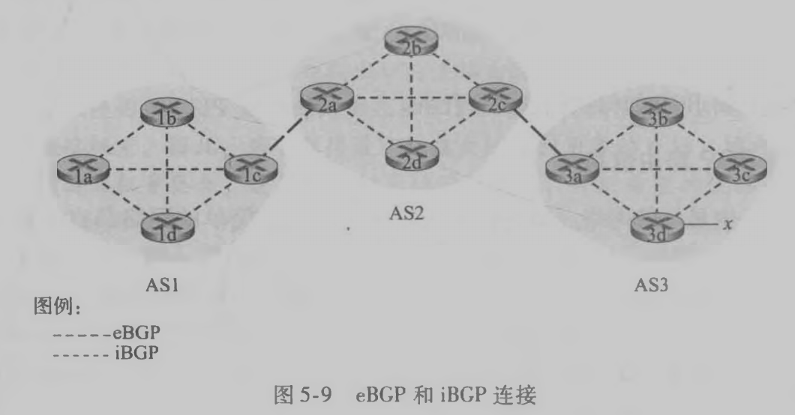

- 确定最好的路由

  - BGP连接通告前缀时,包含一些BGP属性

    - AS-PATH属性,当一个前缀通过AS,AS回把ASN加入AS-PATH列表,就是 'AS1 AS2'

      可以用于检测和防止回路

    - NEXT-HOP是AS-PATH起始的路由器接口的IP地址

    - BGP路由包含三个组件 NEXT-HOP;AS-PATH;目的前缀

  - 热土都路由选择(hot potato routing)

    - 计算AS内部到NEXT-HOP的最小开销路径,不管AS到目的地的开销,

      就像烫手山芋,尽快发到另一个AS,所以是自私的算法

  - 路由选择算法

    - 路由器具有某前缀的所有路由的集合,假如只有一条路由直接选择
    - 否则使用下列消除规则直至一条:
      - 路由被指派一个本地偏好,完全取决于网络管理员,具有最高本地偏好的直接选择
      - 余下选择最短AS-PATH,使用距离向量算法,算的是AS的跳数
      - 使用热土豆路由
      - 使用BGP标识选择

- IP任播

  - BGP用于实现IP任播服务,通常用于DNS中,任播的使用动机

    - 在分散的服务器替换相同的内容
    - 让每个用户访问最靠近的服务器(CDN)

  - CDN举例IP任播

    - CDN为多个服务器指定相同IP地址,当BGP选择路由时会自动选择最近(AS跳数最少)的服务器

    - 尽管CDN一般不采用IP任播,因为BGP路由选择的变化会导致相同的TCP分组到达不同的Web服务器实例.

      但是DNS服务器用到IP任播,DNS使用的是UDP

    - 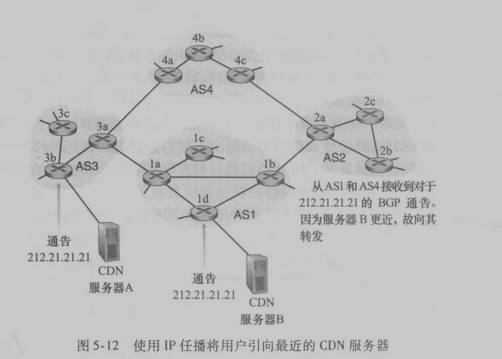


- 路由选择策略

  - X是一个多宿桩网络(multi-homed stub network),两个提供商 提供流量

    装网络通过BGP路由的通告,通告自身没有通向其他目的地的路径,只起到接入ISP的作用.

  - 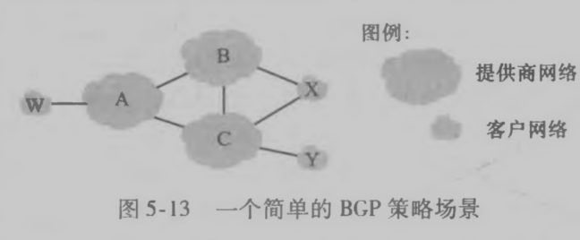

- AS间和内部协议

  - AS间路由策略起到主导作用,不希望穿过不需要的网络,会考虑扩展能力,性能是次要的

### 5 SDN控制平面

- 将网络的分组转发设备称为 分组交换机 ,因为是根据分组首部字段进行转发,没有进一步操作

  SDN体系结构具有4个关键特征:

  - 基于流的转发,能够基于运输层/网络层/链路层首部中任意数量的首部字段进行,传统方法仅根据IP地址
  - 数据平面和控制平面分离,数据平面由交换机组成,控制平面由服务器加软件组成
  - 网络控制功能,控制器维护准确网络信息(链路/交换机/主机状态等)
  - 可编程网络
  - 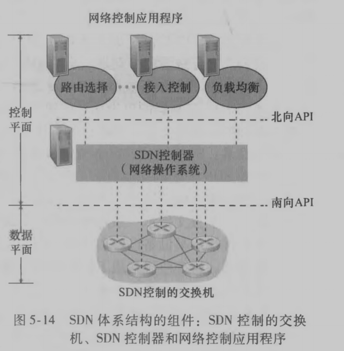

- SDN控制平面:控制器和程序

  - SDN控制器

    - 通信层,SDN控制器和受控网络设备的通信,称为南向接口
    - 网络范围状态管理层,由SDN控制平面的最终控制决定
    - 对网络控制应用程序的接口,称为北向接口
    - 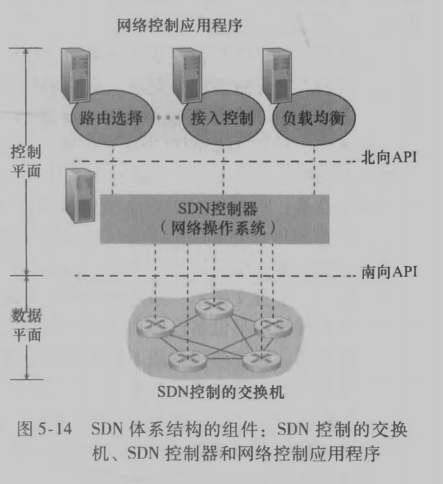

  - OpenFlow协议

    - 运行在SDN控制器和SDN控制的交换机,在TCP协议之上,使用6653端口

      对交换机配置/修改状态/发送分组

    - 案例:当S1和S2连接发生断开,交换机通过OpenFlow协议向控制器发送状态报文,控制器更新状态信息并告知应用程序,Dij算法更新最短路径并修改流表分发给交换机

    - 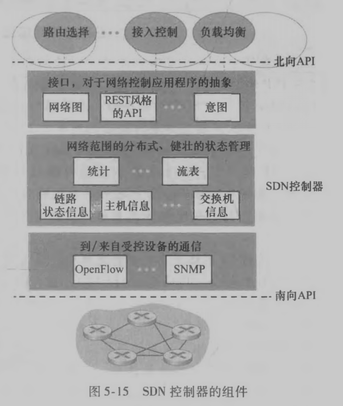

  - OpenDaylight Lithium SDN控制器平台简化视图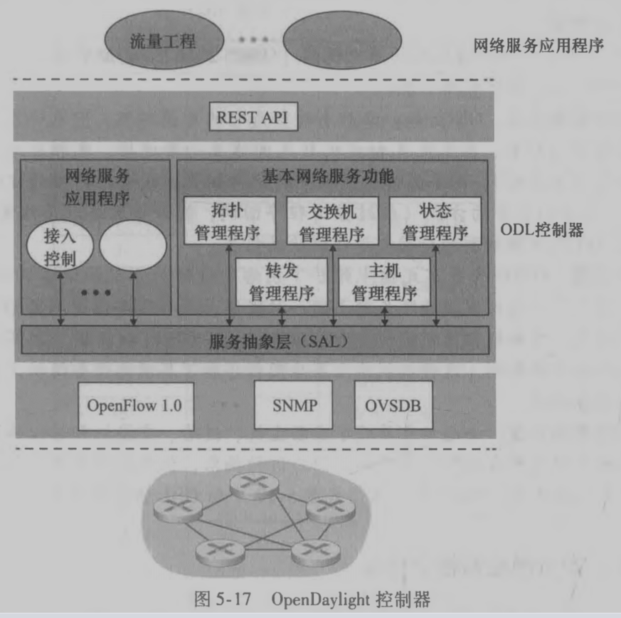


### 6 ICMP:因特网控制报文协议

- 用于主机和路由器共同网络层信息,主要作用是差错报告,比如HTTP会话的目的网络不可达

  路由器找不到路径就会返回ICMP报文

  - ICMP通常认为是IP的一部分,但体系结构上位于IP之上,由IP分组承载
  - ICMP具有源抑制报文,很少使用.TCP已经具有自己的拥塞控制
  - 具有差错/控制/查询三种报文

- 上层协议编码为1,首部8字节,比如 类型0,编码0,表示ping的回答

  - traceroute用ICMP报文实现,每个数据携带一个不可达的UDP端口,TTL从1~n,

    n取决于收到源主机收到一个ICMP报文(类型3,编码3,目的端口不可达)

    TTL过期(类型11,编码0)

  - 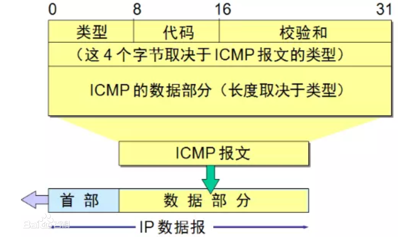

### 7 网络管理和SNMP

- 网络管理

  > 网络管理包括了硬件、软件和人类元素的设置、综合和协调，以监视、测 
  >
  > 试、轮询、配置、分析、评价和控制网络及网元资源，用合理的成本满足实时
  >
  > 性、运营性能和服务质量的要求


- 网络管理框架

  - 管理服务器(managing server)是一个应用程序,通常有人参与,运行在网络运营中心的集中式网络管理共工作站上

  - 被管设备(managed device)是网络装备的一部分,可以是主机/路由器/交换机...

  - 被管设备的信息收集在管理信息库(management information base),MIB对象可以是计数器/描述信息

    MIB对象由 SMI(Structure of Management information)定义结构

  - 网络管理代理(network management agent)是运行在被管设备的一个进程,与服务管理器通信,在管理服务器的命令和控制下在被管设备中采取本地动作。

  - 网络管理协议(network management protocol)运行在服务器和设备之间,代理通过协议向服务器通知异常事件

  - 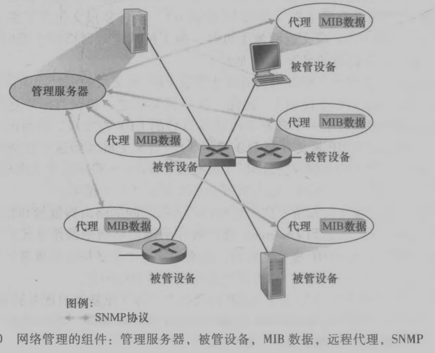

- SNMP
  - 简单网络管理协议(Simple Network Management Protocol)是应用层协议,用于管理服务器和代理之间传递管理控制和信息报文,使用请求/响应模式
  - 第二个常被使用的是代理向服务器发送非请求报文,称为陷阱报文(trap message),用于通知服务器异常情况
- 报文格式
  - SNMP PDU通常作为UDP载荷,代理会返回带有PDU请求ID的响应
  - 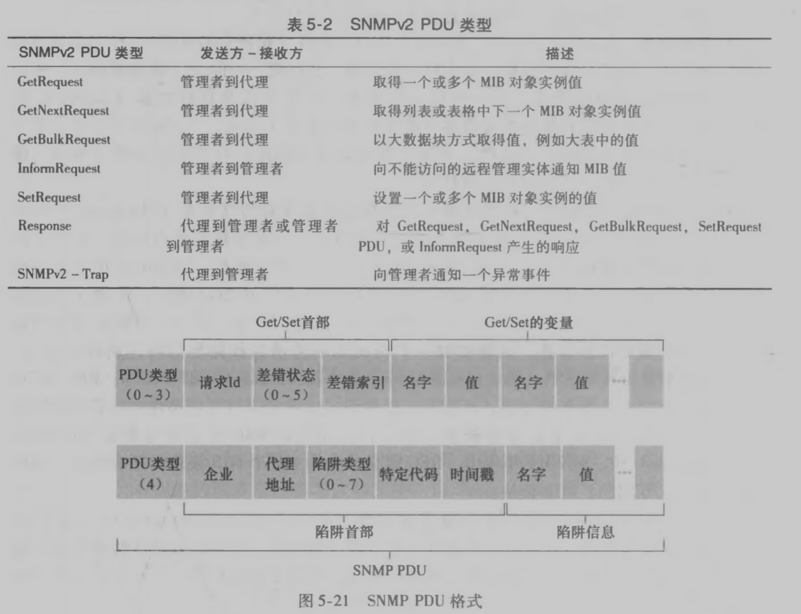


## 第6章 链路层和局域网

### 1 链路层概述

- 基本过程

  - 节点,运行链路层协议的任何设备
  - 链路,沿着通信路径链接相邻结点的通信信道

- 链路层可能提供的服务

  - 成帧(framing),每个网络层数据报经过链路层之前,需要用链路层帧封装起来

  - 链路接入,媒体访问控制(Medium Access Control,MAC)协议规定了帧在链路上传输的规则,

    用于协调多个节点帧传输

  - 可靠交付,保证无差错交付,TCP在传输层通过确认和重传完成.对于低比特错误链路可以认为是不必要的

  - 差错检测和纠正,许多链路层协议提供机制检测别特错误,网络层和传输层也提供了有限检测(校验和),不同在于链路层更复杂并且使用硬件实现

- 链路层在哪里实现

  - 链路层的主体部分是在网络适配器中实现的,网络适配器(network adapter)也叫做网路接口卡(network interface card,NIC)

    实现了许多链路层服务的专用芯片

  - 是软硬件结合体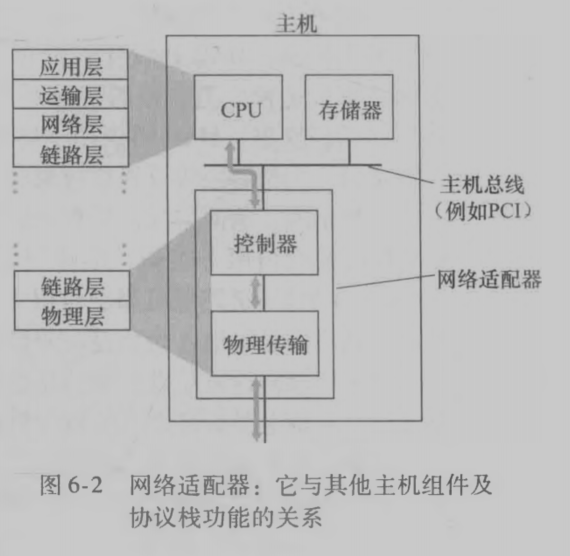


### 2 差错检测和纠正技术

- 比特级差错检测和纠正(bit-level error detection and correction),对链路层帧的比特损伤进行检测和纠正,一般是链路层提供的两种服务
- 差错检测和纠正比特(Error-Detection and Correction),EDC
- 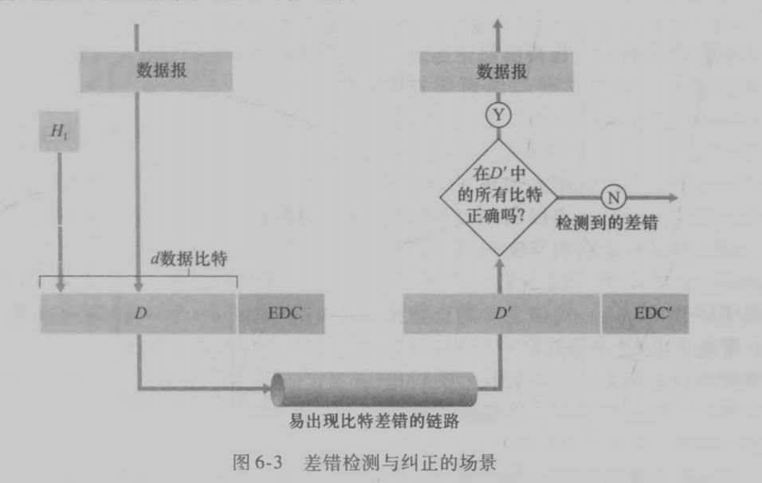


- 奇偶校验
  - 奇偶校验位 (parity bit),只需要在数据后加上校验位
    - 偶校验方案: 假设发送d个比特,发送方保证d+1个比特位之和是偶数
    - 只能检测奇数个比特错误
    - 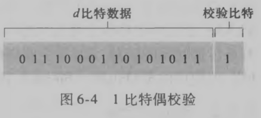
  - 二维奇偶校验(two-dimensional parity)
    - 接收方检测和纠正差错的能力称为前向纠错(forward error correction),通常用于音频/CD等存储回访设备
    - 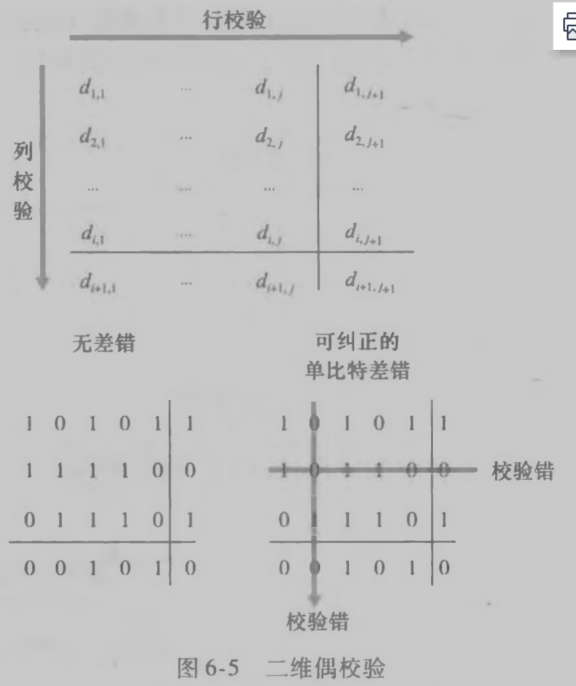

- 校验和方法

  - 因特网校验和(internet checksum )就是把16比特数据加起来,把反码放进校验字段

    接收方把数据全部求和取反码检测是否含0

  - TCP/UDP对所有字段计算检验和(首部和数据),IP只检测首部

  - 开销较小

- 循环冗余检测

  - Cyclic Redundancy Check ,循环冗余检测编码也成为 多项式编码,把0/1看作多项式系数

  - 发送/接收方需要协商一个r+1位比特模式,称为 生成多项式,表示为G,要求G的最高有效位为1

    用模2算术恰好能被 G 整除,模2表示加减不进位,可以用异或表示

  - 发送方计算R,令  D* 2^r^ XOR R = nG → R = remainder D2^r^/G

    - D2^r^ = nG XOR R (看成加法) ==> 换成十进制表示 x = 10y + r ,那么 r = x%y,

  - 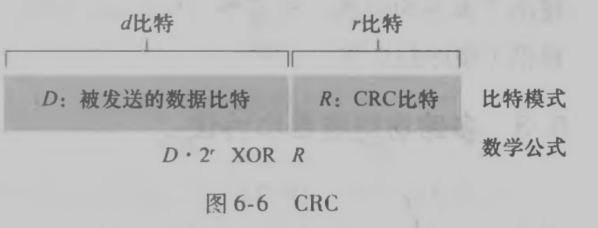

### 3 多路访问协议

- 链路网络

  - 点对点链路(point-to-point link)由链路连接单个发送方和接收方组成,有点对点协议(point-to-point protocol,PPP),高级数据链路控制(high-level data link control,HDLC)

  - 广播链路(broadcast link),让多个发送和接收节点连接到相同单一共享的广播信道

    协调发送和接收节点的访问称为 多路访问问题(multiple access problem)

    使用多路访问协议规范广播信道的传输行为

  - 节点同时接收到多个帧称为碰撞(collide),使用多路访问协议进行协调

  - 多路访问协议划分为三种形式

- 信道划分协议(channel partitioning protocol)

  - 时分多路复用(TDM)
    - 消除碰撞并且很公平,每个节点在每个帧时间得到专用速率R/N,R是节点吞吐量
    - 缺点,速率被固定为R/N,节点必须等待轮次
  - 频分多路复用(FDM)
    - 跟上面缺点一致
  - 码分多址(Code Division Multiple Access,CDMA),为每个节点分配唯一编码,发送节点使用唯一编码对数据进行编码(第七章学习)
    - 通过精心挑选的编码可以实现不同节点同时传输,目前已被广泛应用

- 随机接入协议(random access protocol)

  - 节点总是以信道的全部速率R发送,遇到碰撞后就等待一定时间并重发,直到无碰撞(类似拥塞控制)

  - 时隙ALOHA

    - 假设帧长度L,时隙L/R(传输一帧时间),节点同步(知道时隙何时开始),节点在时隙开始时传输,时隙发生碰撞所有节点在时隙结束前检测到该碰撞

    - 当网络中有大量节点同时发送时,会发生大量碰撞导致重发,效率会很低,

      大量节点仅有37%的工作效率

    - 纯ALOHA协议(节点不同步时隙)效率只有时隙ALOHA的一半

  - 载波侦听多路访问(CSMA)

    - ALOHA总是不管信道是否有其他节点在传输,一旦发生碰撞就重发,导致效率低下

      所以使用一些规则减少碰撞

      - 说话之前先听,如果有别人在说话,则等到他们说完.称为 载波监听(carrier sensing),发送数据之前监听信道是否空闲,检测到一小段时间空闲就发送
      - 如果与他人同时开始说话则停止说话,称为碰撞检测(collision detection),传输帧时发现有干扰帧则停止发送,继续监听直到信道空闲

    - CSMA(Carrier Sense Multiple Access),因为存在信道传播时延(channel propagation delay),也就是从一个节点到另一个节点的传播时间,导致发生碰撞

      距离越长发生碰撞概率越大

  - 具有碰撞检测的载波监听多路访问(CSMA/CD)

    - CSMA with Collision Detection,没有碰撞检测的情况节点都会发送完整的帧后再停止

    - 重新发送前等待时间希望碰撞点少就短一些,碰撞点多就长一些,两个碰撞节点时间不一致

      - 二进制指数后退(binary exponential backoff)算法可以解决该问题,

        经历连续n次碰撞后,节点随机从{0,1,....,2^n^-1}中随机挑选一个值K

        实际中以太网节点等待时间 512K 比特时间,也就是发送512比特的时间的K倍,n最大值在10以内

      - 假设节点第一次发生碰撞,以概率p=0.5进行等二次发生碰撞,那么就要从{0,1,2,3}随机获取一个K,以概率p=0.25立刻进行监听发送

      - 不同帧之间相互独立

      - 效率 =  1/ (1 + 5 d~prop~/d~trans~) ,

        d~prop~是信号在两个适配器之间传播时间,越小效率越高

        d~trans~是传输一个以太帧的时间,越大效率越高

    - 纵向表示时间,左右表示距离,也就是B在t0时刻开始传播,D在t1时刻传播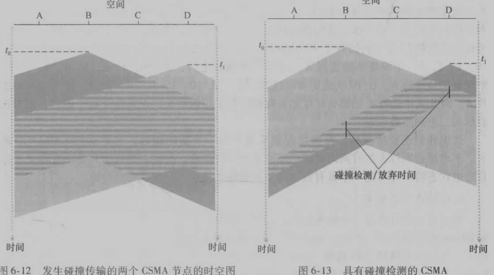

- 轮流协议(taking-turns protocol)
  - CSMA不具有多个节点时平分带宽(因为距离越近效率越高)
  - 轮询协议(polling protocol),每次轮流向节点通过可以传输的数据量,可以避免碰撞和空时隙
    - 引入了轮询时延,通知一个节点可以传输的时间
    - 如果主节点故障,信道不可用
  - 令牌传递协议(token-passing protocol),当一个节点持有令牌才可以发送,发送完把令牌发给下一个节点
    - 节点故障,忘记释放令牌等问题

- DOCSIS

  - CMTS(电缆调制解调器端接系统,Cable Modem Termination System)

    DOCSIS(数据经电缆服务接口,Data-Over-Cable Service Interface)

  - 用于电缆因特网接入的链路层协议,可以看到之前的三种多路访问协议

  - DOCSIS使用FDM将下行和上行划分多个频率信道,下行没有多路访问问题

    上行被划分为时间间隔(类似TDM),时间间隔含有时隙序列,CMTS通过MAP报文指定调制解调器使用哪个时隙

    调制解调器通过发送请求报文告知CMTS有数据发送,使用随机接入,发生碰撞则回退


### 4 交换局域网

- 链路层交换机,运行在链路层,交换链路层帧,不识别网络地址

  实际上,不是主机/路由器具有链路层地址,而是他们的适配器(网络接口)具有链路层地址

  链路层交换机并不具有与他们接口相关联的链路层地址

- 链路层寻址和ARP

  - 链路层地址/LAN地址/物理地址/MAC地址指的都是同一个东西,MAC地址六字节 ,使用16进制表示,理论上MAC是永久的,但现在使用软件改变也是可能的

    MAC地址前24位是每个公司分配的,后24位是公司为适配器分配唯一的组合

    MAC广播帧目的地址全是1

  - 地址解析协议(Address Resolution Protocol)

    - 作用 进行IP和MAC之间的转换
    - 假设交换机在局域网广播所有帧,那么就要求发送方知道目的MAC,这时候就需要ARP协议,并且ARP只工作在同一个子网
    - 每台主机包含一张ARP表,指明IP和MAC的映射关系
    - ARP请求报文是广播报文,但是响应式标准帧,并且使自动建立的

  - 发送到子网以外

    - 使用ARP请求报文知道网关的MAC地址(路由器接口地址),路由器根据IP转发到对应网段

      目的MAC自然是从路由器的ARP表查询或者ARP请求获取

- 以太网

  - 几乎占领了现有的有线局域网市场,可以说以太网之于有线局域网的,正如因特网之于全球联网
  - 使用总线拓扑的以太网是广播局域网,也就是所有节点都会收到帧,这时候CSMA/CD就用到了
  - 集线器是物理层设备,仅仅用于加钱信号,也是一个广播局域网
  - 交换机不仅是无碰撞的,也是名副其实的存储转发分组交换机
  - 是不可靠传输,类似UDP
  - 结构
    - 前同步码(8字节),前期个字节 10101010,最后一个 10101011,用于唤醒接受适配器,双方同步时钟(因为以太网有不同的速率传输帧)
    - 目的地址/源地址(6字节),MAC地址,只有收到自己的MAC的帧才会接收,其他都会丢弃
    - 类型(2字节),和上一层协议联系起来
    - 数据(46~1500字节),最少46不足则填充
    - CRC(4字节),提供错误检测
    - 

- 以太网技术

  - 种类繁多,比如 100BASE-T表示 100Mbps基于以太网的双绞铜线

  - 吉比特以太网标准成为 IEEE 802.3z

  - 基于以太网的总线拓扑和基于集线器的星型结构是广播链路,为了处理碰撞采用了CSMA/CD 

    但是基于存储转发的交换机方案是否需要MAC协议?答案是不需要的,交换机同一时刻不会向相同接口转发超过一个帧

- 链路层交换机

  - 任务是接收链路层帧并转发,自身对主机和路由器是透明的

  - 转发和过滤

    - 过滤决定一个帧是否应该丢弃,转发决定帧导向哪个接口,借助于交换机表

      表项含有MAC地址,接口,时间,听起来和数据转发一样,但是有重要差异

      - 接口x接收到帧查询,表中没有对应表项,广播该帧
      - 如果表项等于 x, 那么丢弃
      - 如果表项 不等于 x,转发对应接口

  - 自学习

    - 对于每个入帧,交换机存储 <源MAC,接口,时间>
    - 一段时间后(老化期,aging time)删除表项,属于即插即用设备

  - 性质

    - 消除碰撞,不会浪费带宽
    - 异质链路,交换机可以让不同链路以不同速率运行
    - 便于管理,可以收集比如带宽使用/流量/碰撞率等数据,便于排查

- 比较

  | 项目         | 交换机                              | 路由器                         | 集线器            |
  | ------------ | ----------------------------------- | ------------------------------ | ----------------- |
  | 区分不同数据 | MAC地址                             | IP地址                         | 无                |
  | 动作         | 存储转发                            | 匹配+动作,支持识别多个协议字段 | 无                |
  | 优点         | 即插即用,速率较高                   | 分层,结构丰富,防火墙           | 即插即用          |
  | 缺点         | 无法阻止广播风暴,可能维护很大ARP表, | 需要配置IP,处理时间较长        | 碰撞,没有优化路由 |
  |              | 防止循环,拓扑限制为生成树           |                                |                   |

  

- 虚拟局域网

  - 上面的局域网缺乏流量隔离,广播流量会跨越整个网络

    交换机无效使用,一台交换机不可以用于多个网络

    管理用户

  - 使用虚拟局域网(virtual local network),允许单一物理局域网具有多个虚拟局域网

    基于端口的VLAN可以把端口划分到一个组,不同组之间流量不共享

  - 隔离的VLAN需要通过网部路由器进行互相访问,(也就是可以跨网段)

    物理隔离的两台交换机可以通过 VLAN干线连接(VLAN trunking),以太网帧802.1Q定义了可以跨越trunking的帧,增加了VLAN标签协议标识符和控制信息

    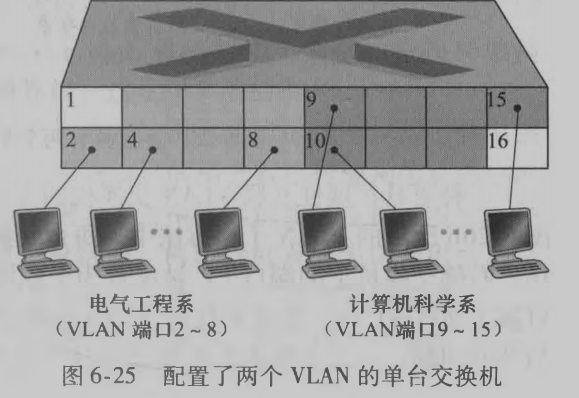

    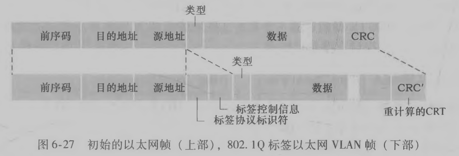


### 5 链路虚拟化

- 多协议标签交换

  - MPLS(Multiprotocol Lable Switch)采用虚电路网络的一个概念,固定长度标签,在保持IP数据转发的前提下,增强功能
  - MPLS格式
    - MPLS加强帧可以在MPLS路由器间发送,可以在不用IP地址的前提下转发MPLS帧
    - 镖旗;3比特保留;1比特S;TTL
    - 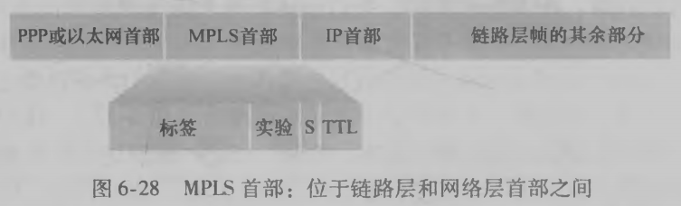

  - R1-R4是MPLS路由器,根据转发表可以不用提取IP转发

    MPLS提供了新的流量管理能力,可以迫使流量往某条路径从流动,被用于虚拟专用网络(Virtual Private Network)

    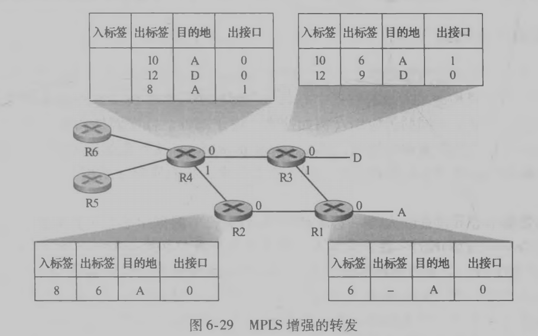

### 6 数据中心网络

- 数据中心
  - 主机称为 刀片(blade),一个机架一般有多态主机堆叠,顶部都有一台交换机称为 机架顶部交换机(Top Of Rack)
  - 与外网连接的路由称为边界路由器
  - 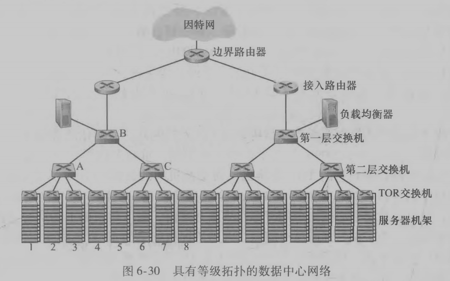

- 负载均衡 ,外部请求被定向到负载均衡器(load balancer),根据主机负载进行分发

  由于基于分组的目的端口和IP地址做决策,也称为 第四层交换机

  提供NAT功能(利用端口区分不同局域网主机IP)

- 等级体系结构,如上图所示

- 趋势,网络采用全连接拓扑,这样可以使用聚合容量

  基于船运集装箱的模块化数据中心(Modular Data Center)

### 7 回顾:Web页面请求历程

- 假设Bob启动他的PC,通过以太网连接到学校交换机,并开始访问一个页面

- 准备:DHCP/UDP/IP/以太网

  - 第一次接入网络,

    PC发送DHCP报文,由UDP负载(目的端口67,源端口68),

    封装到IP报文(广播地址255.255.255.255和源地址0.0.0.0),

    封装到以太网帧(目的MAC全是1)

  - 交换机收到以太网帧,此时没有转发表项,广播该帧;

  - 路由器接收该帧,逐层提取数据,获得DHCP请求报文

    分配IP地址并返回DHCP ACK报文,此时知道来源的 端口/IP/MAC

  - 交换机接收到DHCP ACK的以太网帧,此时已经有了对应表项,直接转发

  - Bob的PC接收到DHCP ACK,提取 IP/掩码/DNS/网关 ,向网关发送 DHCP确认报文

- 准备 DNS/ARP

  - Bob输入URL并回车,生成TCP套接字用于发送HTTP报文,此时没有URL对应的IP地址,获取网址的IP地址

    发送DNS报文封装到UDP(目的端口53),

    封装到IP报文(DNS已知),

    封装到以太网帧,此时目标MAC未知

  - 发送ARP查询报文,目标IP是DNS的IP,广播该报文

    DNS服务器接收到该报文,响应

  - Bob接收到ARP结果,提取MAC地址并填充到以太网帧,发送DNS请求的帧

- 准备 路由

  - 网关转发DNS帧,抽取IP数据报,根据BGP填写
  - 到达DNS服务器,找到地址并响应
  - Bob接收到DNS响应,提取IP(可能要经过多次询问)

- Web交互

  - Bob发起TCP的三次握手(SYN),完成后开始接收数据


## 第7章 无线网络和移动网络

### 1 概述

- 无线网络

  - 无线主机(wireless host),运行程序的端系统设备,可以是手机,笔记本电脑,桌面计算机等

  - 无线通信链路(wireless communication link),主机通过链路连接到基站或者另一个主机

  - 基站(base station)在有线网络中没有明确对应的设备,负责协调与之相关的多个无线设备传输

    - 当我们说无线主机与基站相关联时表示

      1. 主机位于基站覆盖范围
      2. 主机使用基站中继它和更大网络的通信

    - 蜂窝网络的蜂窝塔,802.11的无线LAN接入点都是基站例子

    - 与基站相关联的主机称为以基础设施模式(infrastructure mode)运行,所有传统网络向通过基站的主机提供

      在自组织网络中,无线主机没有这样的基础设置,必须自身完成

  - 网络基础设施

    - 单跳,基于基础设施,网络具有与比较大有线网络相连的基站.比如802.11,4G等
    - 单跳,无基础设施,不存在与无线网络相连的基站.蓝牙
    - 多跳,基于基础设施,某些无线网状网络
    - 多跳,无基础设施,移动自组织网络,如果是车载系统,则称为车载自组织网络

  - 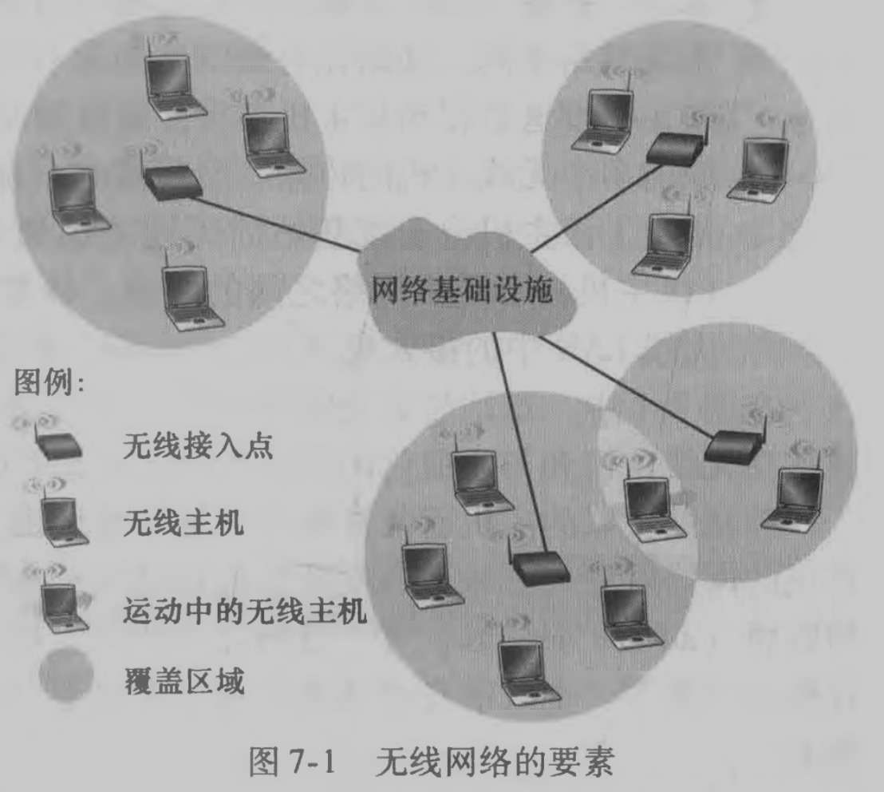

  - 部分无线网络标准特性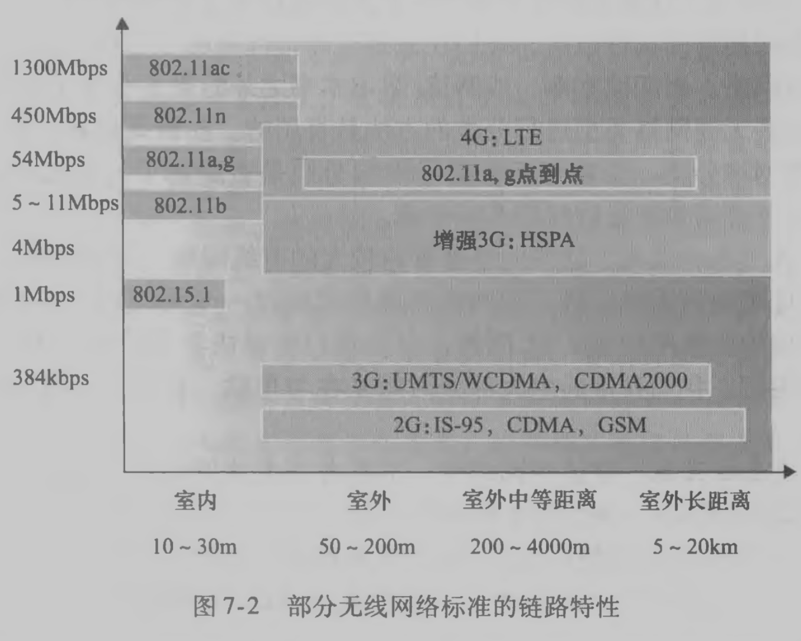


### 2 无线链路和网络特征

- 简单的网络

  - 使用802.11替代以太网,无线网络接口替代主机有线以太网接口,接入点代替以太网交换机,在网络层以上不需要变化
  - 需要注意的是
    - 信号衰减,电磁波穿过物体时减弱,随着距离增加信号强度减弱,称为路径损耗
    - 来自其他源干扰,假如干扰源位于同频段会干扰传输
    - 多径传播,电磁波受物体表面反射导致发送方和接收方走了不同长度,称为多径传播(multipath propagation)

  - 无线链路不仅采用更有效的CRC错误检测码,还采取了ARQ协议重传受损严重的帧
  - 信噪比(Signal to Noise Ratio)是  接收到信号强度/ 噪音强度,较大的信噪比更容易提取信号
  - BER(比特差错率)
    - 可以通过增加发送功率提高 SNR,降低BER.但是除了消耗更多能量还可能干扰另一方传输
    - 对于给定SNR具有较高比特传输速率具有较高BER
    - 物理层调制技术的动态选择可以用于适配对信道条件的调制技术
    - 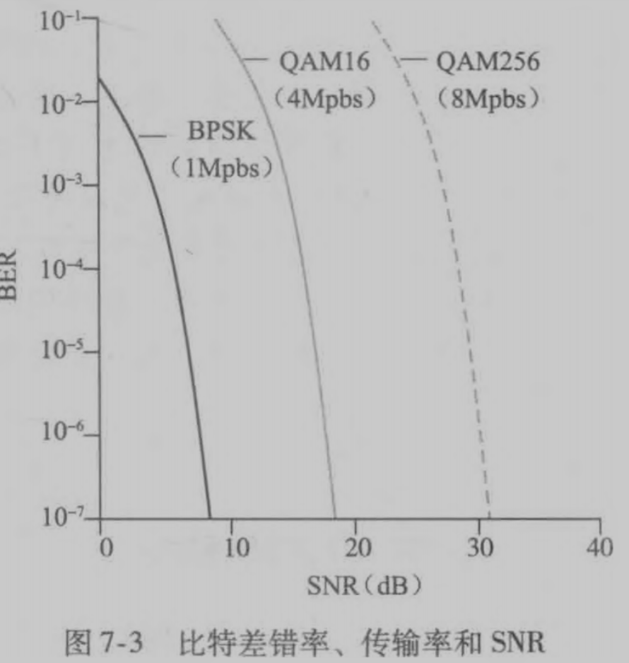

- 一些问题
  - 假设AC同时向B传输数据
  - 隐蔽终端问题(hidden terminal problem),由于阻挡导致AB之间无法相互沟通
  - 衰减,AC之间信号不足以直接相互检测,但是足以干扰B的接收
  - 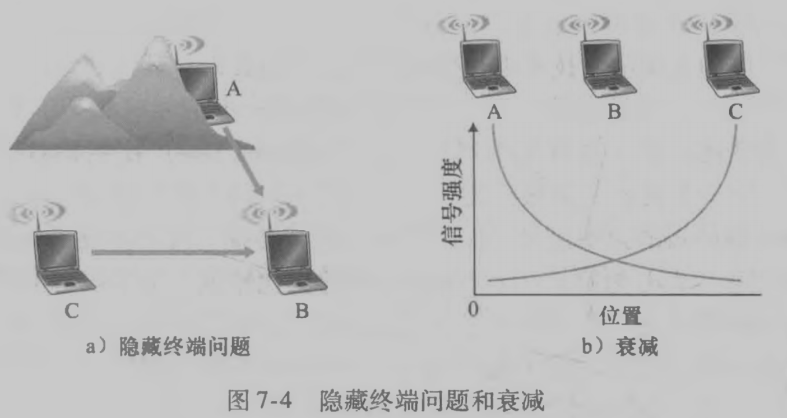

- CDMA(Code Division Multiple Address)
  - 码分多址属于信道划分,每个要发送的比特都需要乘以一个信号编码,这个信号编码变化速率(码片速率,chipping rate)比初始比特速率变化快得多,
  - 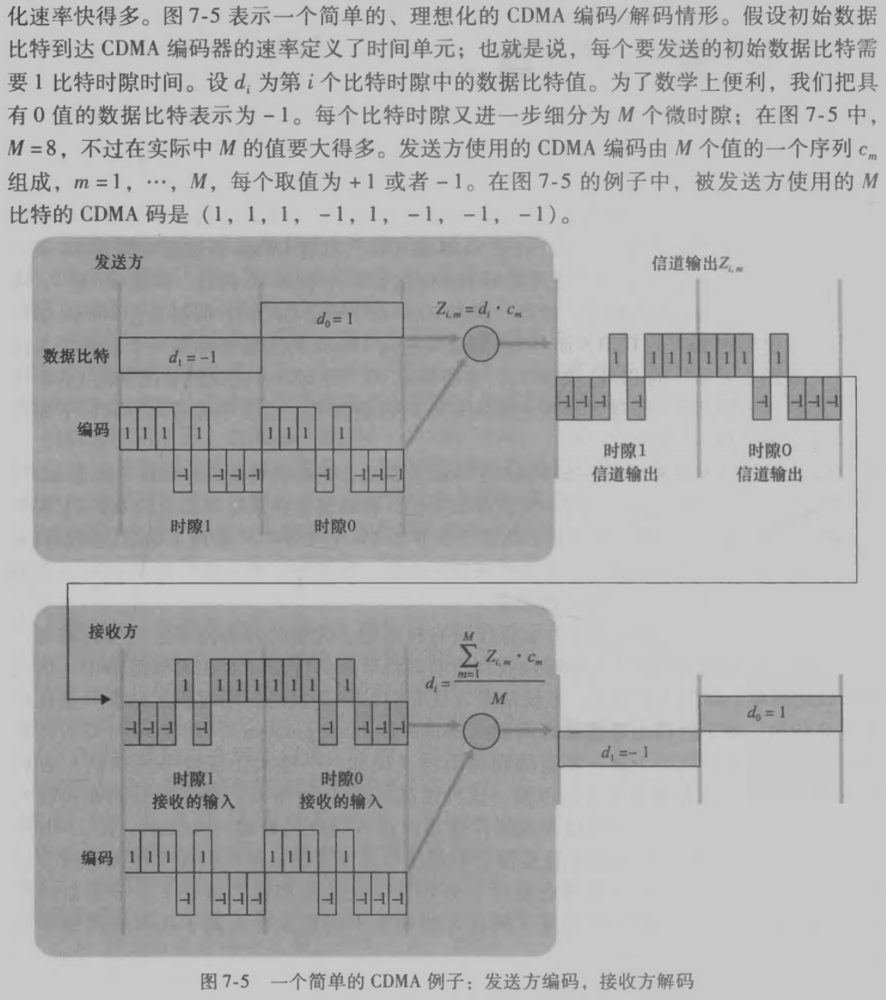

- > 个人理解:看成对数据的加密,每个主机都有自己的密钥,加密的动作就是把比特乘以编码
  >
  > 解密则利用同样的密钥进程乘法操作,结果只能是-1或者1,如果出现别的数据就说明解密错误,直接丢弃

- 编码需要经过精心设计,CDMA假设比特信号是叠加的,也就是多个1产生信号n,

  经过设计的编码可以只解出自己的目标值,一般是正交(向量点乘为0)

### 3 WiFi:802.11 无线 LAN

- 标准小结
  
- 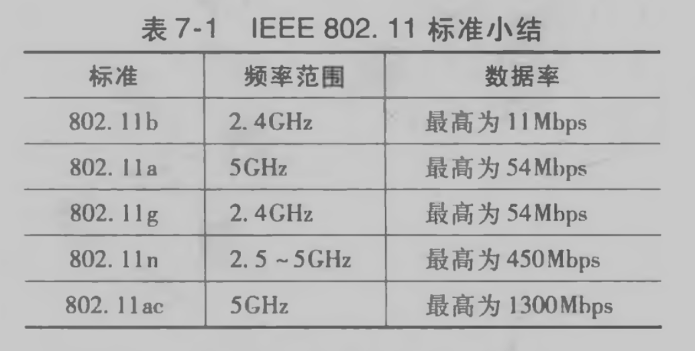
  
- 802.11 体系结构

  - 基本构件模块是 基本服务集(basic service set,BSS),包含多个无线站点和一个接入点(Access Point),每个无线站点也有MAC

  - 配置AP的无线LAN称为 基础设施无线LAN(infrastructure wireless LAN)

  - 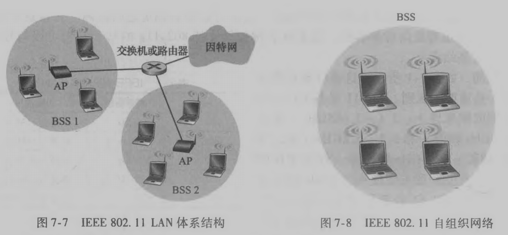

  - 信道与关联

    - 每个无线站点发送/接收数据之前必须和一个AP相关联,当管理员安装一个AP时,会分配一个服务集标识符(Service Set Identifier,SSID),同时还分配信道号

    - 802.11运行在 2.4~2.4835GHz频段,定义了11个部分重叠的信道,特别是信道 1,6,11的集合是唯一3个非重叠信道的集合,所以一个物理网络可以分配三个AP,每个AP连接一台交换机

    - WiFi丛林(WiFi jungle)是一个物理位置可以收到多个AP信号,802.11标准要求AP周期发送信标帧(beacon frame),包含 SSID 和 MAC,

      无线站点扫描11个信道,接收到信标帧后选择一个AP用于关联

      > 有点类似 DHCP

    - 扫描信道和监听信标帧的过程称为 被动扫描(passive scanning),无线主机也可以通过发送广播探测帧进行主动扫描

    - 关联过程中AP可以鉴权,可以基于MAC地址,也有用户密码方式

    - 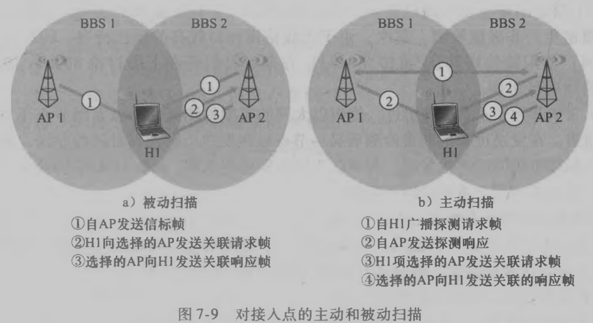


- 802.11 MAC协议

  - CSMA/CA(CSMA with collision avoidance),带避免碰撞的CSMA,

    - 以太网的碰撞检测是遇到碰撞就停止发送,可以边发送边监听

    - 802.11 没有使用检测是因为适配器的接收信号远小于发送信号,硬件代价大,

      同时会因为隐蔽终端和衰减问题而无法检测所有碰撞

    - 由于无线信道差错比特率更高,还会使用加强CRC和ARQ协议

  - 链路层确认(link layer acknowledgment)

    - 站点一旦发送数据就不会停止,接收方收到通过CRC校验的帧后,等待短帧间间隔(short inter frame spacing,SIFS)然后发送一个确认帧

    - 发送站点一定时间内没有收到确认帧就会重传,尝试几次还没收到就放弃

    - > 类似TCP的确认报文

  - CSMA/CA过程

    - 站点监听到信道空闲,在分布式帧间间隔(distracted inter-frame space,DIFS)的段时间段后发送该帧
      - 否则,选择一个随即回退(碰撞检测一样),侦听到信道忙时暂停计数
      - 当计数为0,发送数据帧
    - 接收到确认,发送下一帧,此时从第二步开始
    - 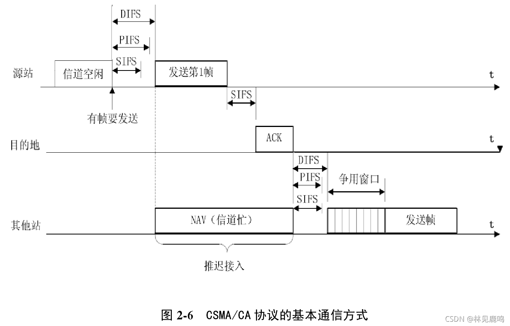

  - 隐藏终端处理:RTS和CTS

    - 允许站点使用一个段请求发送(request to send)控制帧和段允许发送(clear to send)控制帧进行预约
    - 增加了时延和消耗信道资源,因此RTS/CTS用于长数据帧预约信道
    - 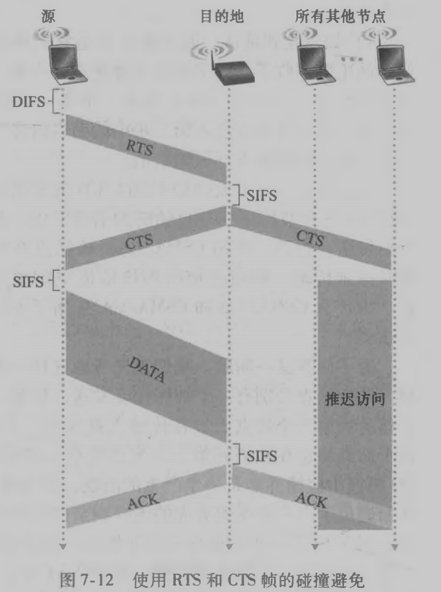

  - 假如使用定向天线实现点对点传输的话,那么802.11可以在数十公里距离提供哦那个无线连接的廉价手段

- IEEE 802.11 帧

  - 有效载荷与CRC,有效载荷一般是IP数据报或者ARP分组组成,通常小于1500字节(尽管最大长度2312字节)

  - 地址,具有4个,每个都可以包含MAC地址

    - 地址1是无线站点的MAC地址,AP的MAC地址

    - 地址2是站点(自身)的MAC地址

    - 地址3是路由器接口的MAC地址

    - 地址4是自组织模式相互转发使用

    - > 路由器与AP之间进行正常的以太网帧传输,AP负责把802.11和802.3进行转换

  - 序号,跟TCP的序号作用一样,用于确认帧是重传还是新传输的

  - 持续期时候RTS和CTS允许节点预约信道的时间

  - 帧控制具有很多子字段,类型和子类型用于区分关联/RTS/CTS/ACK/数据帧,To和From用于定义不同地址字段含义,WEP是否加密

  - 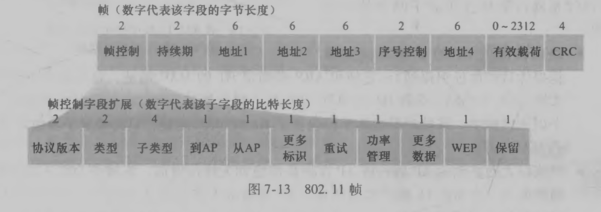

- 相同IP网的移动性

  - 使用交换机连接不同BSS,这样不会重新分配IP,TCP也就不会断开

  - 当站点移动时会检测到更强的信号,收到信标帧时自动关联(这些不同AP具有相同SSID)

    当站点关联新AP时发送一个广播帧给交换机更新路由表(然而并不规范,802.11f标准小组正在开发新协议)

- 高级特色

  - 802.11 速率适应

    - 不同调制技术适合不同SNR情况,距离近则信噪比高,可以使用高传输速率同时维持低BER

      当用户移动导致距离增加,SNR减小,如果不改变的话BER将高到不可接受

    - 如果节点连续两帧没有收到确认,那么传输速率会下降,当连续10个帧得到确认则提到较高速率,类似TCP的拥塞控制

  - 功率管理

    - 移动设备功率是宝贵资源,帧首部可以设置节点休眠,节点会休眠到AP发送信标帧之前(信标帧100ms发送一次),AP会把期间缓存的帧发送给节点,假如没有数据则继续睡眠
    - 唤醒时间只需要250微秒

- 个人域网络:蓝牙和ZigBee

  - 蓝牙

    - Wifi标准主要针对100m左右的设备通信

    - 802.15.1以低功率和低成本在小范围运行,有时也成为无线个人域网络(wireless personal area network,WPAN),速度可以达到4Mbps

    - 以TDM工作于无需许可证的2.4GHz,时隙长度625微秒,每个时隙内利用79个信道中的一个传输,

      同时时隙到时隙会随机变更信道,称为调频扩展频谱(Frequency Hopping Spread Spectrum,FHSS)

    - 属于自组织网络,多个设备可以组成皮可网(piconet),一个设备指定位主设备,确定网络事件,只在奇数时隙发送数据,从设备在前一时隙通信后才可以发送

  - ZigBee

    - IEEE第二个个人域网络标准是 802.14.5,称为ZigBee.目标是低功率/地数据率/低工作周期的应用,比如传感器
    - 定义了20/40/100/250kbps的信道速率,和蓝牙类似,在主设备控制下可以组网

### 4 蜂窝因特网接入

- 概述

  - 使用全球移动通信系统(GSM),第一代(1G)是模拟FDMA系统,专门用于语音通信

  - 2G蜂窝网络体系结构

    - 蜂窝(cellular)是指一个被分为多个小区域(cell)的地理覆盖区域,每个小区包含一个收发基站(base  transceiver station,BTS)

    - 使用了GSM标准对空中接口使用了组合的FDM/TDM,GSM网的基站控制器(Base Station Controller,BSC)通常服务于几十个BTS.

      BSC主要责任是为用户分配BTS信道,执行寻呼,用户切换

    - 移动交换中心(Moblie Switching Center,MSC)管理多达5个BSC

  - 3G:将因特网扩展到蜂窝用户

    - 最早蜂窝网用于语音通信,3G开始支持因特网

    - 3G核心网,将无线电接入网 连接到 公共因特网,不去触动核心语音网,而是增加并行功能

      (IPv6就是遇到挑战)

      - 服务通用分组无线服务支持节点(Serving Generalized packet radio service Support Node, SGSN),负责从无线电网络获取数据

        网关 GPRS 支持节点(Gateway GPRS Support Node, GGSN),起到网管作用,连接到更大因特网 

         (GPRS (General Packet Radio Service)表示通用分组无线服务

    - 无线电网络控制器(Radio Network Controller)通常控制几个小区的BTS,不在使用FDMA/TDMA方案,而是使用TDMA实习中使用直接序列带宽CDMA

    - 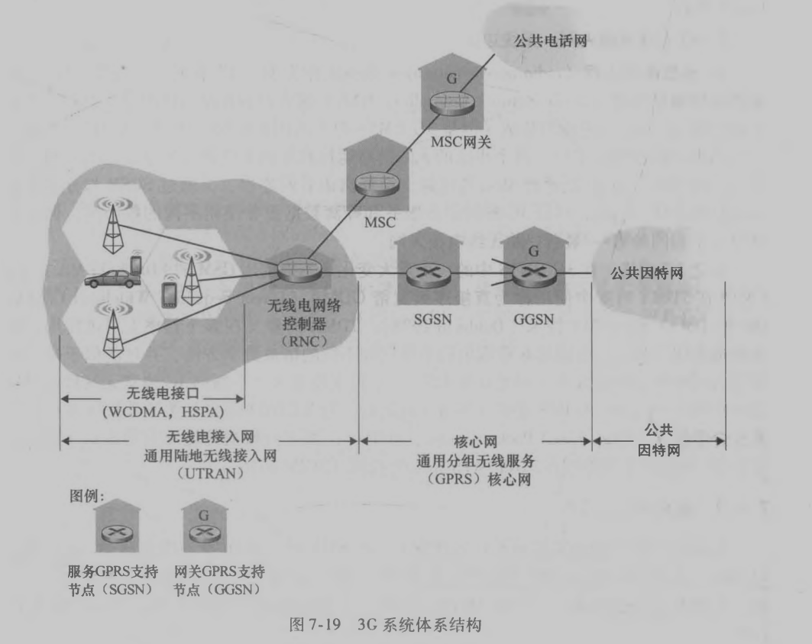

  - 4G:LTE

    - 一个全IP核心网,统一的体系结构,没有保留电话痕迹
    - 4G数据平面和控制平面分离,对比路由器
    - 无线电接入网和IP核心网分离
    - eNodeB是2G/3G控制器的逻辑后代,UE数据报在eNodeB封装,经过EPC传到P-GW
    - 分组数据网络网关(Packet data Network Gateway,P-GW)给UE分配IP地址,保证QoS(保证服务质量)实施4
    - S-GW服务网关是数据平面移动性锚点
    - 移动性管理实体(Mobility Management Entity)代表位于它所控制单元中的UE
    - 归属用户服务(Home  Subscriber Server)包含漫游接入,QoS配置和鉴别信息的UE信息
    - 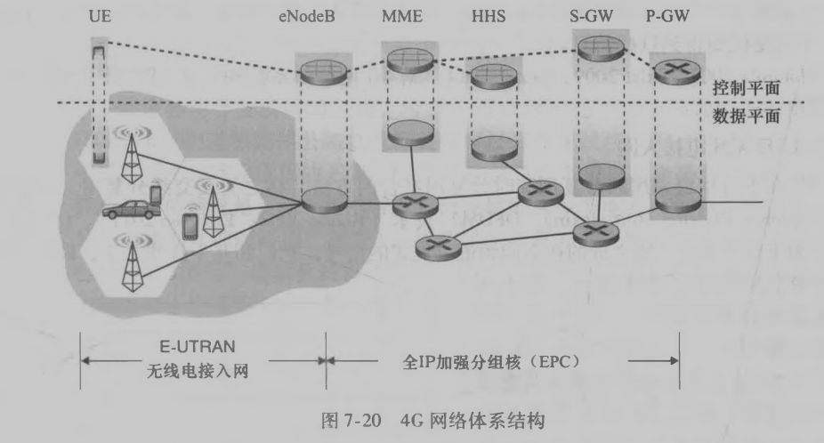
    - 使用了正交频分复用(Orthogonal Frequency Division Multiplexing)

### 5 移动管理

- 移动

  - 当用户移动需要切换不同基站时,如何保证相同IP?

  - 一个移动节点(如一台便携机或智能手机)的永久居所被称为归属网络(home network),

    在归属网络中代表移动节点执行下面讨论的移动管理功能的实体叫归属代理(home agent)。

    移动节点当前所在网络叫作外部网络(foreign network)或被访网络(visited network),

    在外部网络中帮助移动节点做移动管理功能的实体称为外部代理(foreign agent)。

    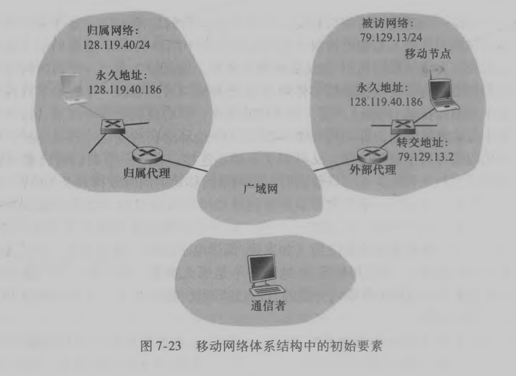

- 寻址

  - 当移动节点位于某个外部网络,该网络向外通告该节点在它这个网络,此时路由选择信息需要更新

    好处是不需要对现有基础做大改变

    坏处是扩展性差,路由器可能要维护数百万个移动节点

  - 将移动功能从网络核心搬运到网络边缘,使用归属网络实现,外部代理的作用就是为移动节点创建一个转交地址(care of address,COA),有时称为外部地址

- 路由选择

  - 间接路由选择,通信这将数据报勋执导移动节点的固定地址,完全不知道移动节点是在归属网络还是外部网络
    - 归属代理除了与外部代理交互跟踪COA外还可以监视到达的数据报,截取并转发到外部代理
    - 跟IPv6的隧道类似
    - 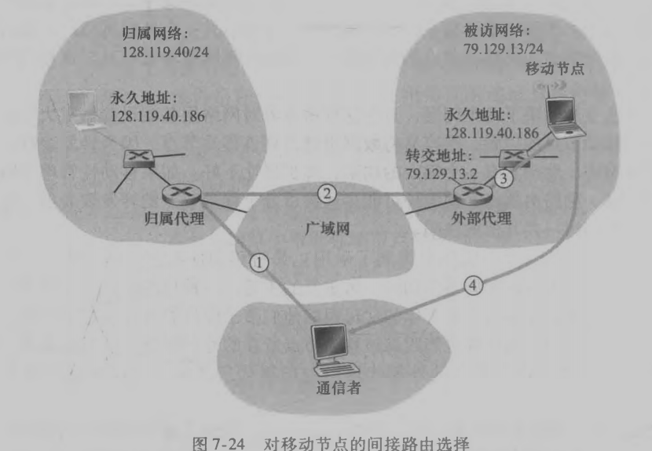
  - 直接路由选择
    - 间接通信多了一个转发的步骤,存在低效的问题(称为 三角路由选择问题)
    - 增加复杂性,需要移动用户定位协议
    - 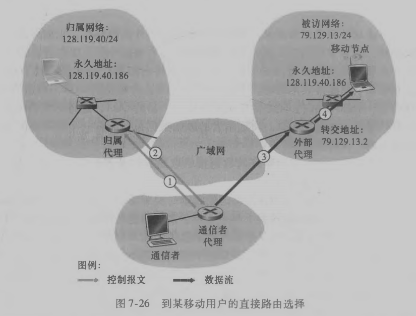

### 6 移动IP

- 标准组成(三部分)

  - 代理发现,移动IP定义了一个归属代理/外部代理用来通告服务的协议,

    到达心网络的移动IP节点必须知道相应的外部代理身份,这个过程称为代理发现(agent discovery)

    - 代理通告(agent advertisement),外部代理使用现在路由器发现协议扩展协议通告,使用类型9的ICMP报文进行周期性广播,
    - 使用代理请求(agent solicitation)IP移动节点可以获取代理通告,类型为10的ICMP报文
    - 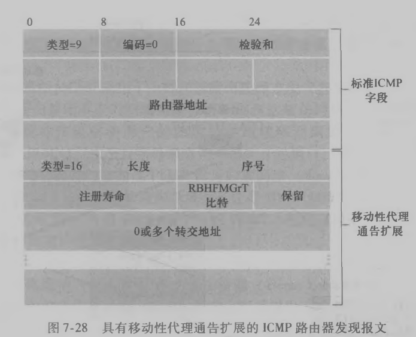

  - 向归属代理注册

    - IP节点收到COA必须向归属代理注册,使用UDP报文承载
    - 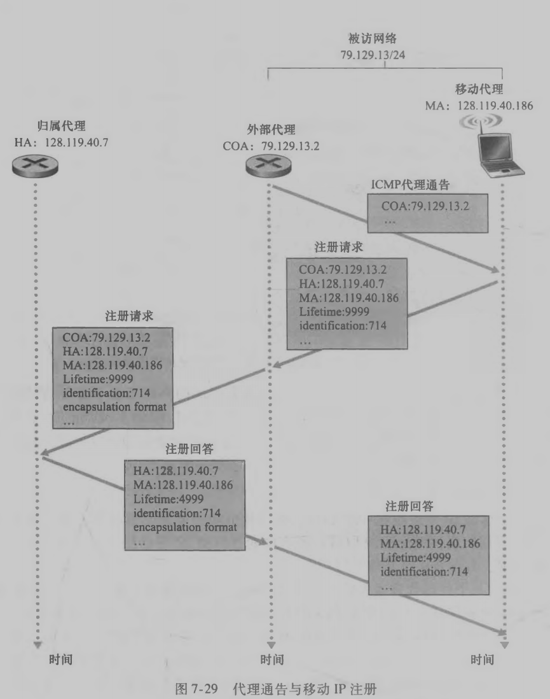

### 7 管理蜂窝网中的移动性

- 间接路由选择

  - 用移动IP类似,GSM采用简介路由,归属网络称为 归属公共低于移动网络(home public land moblie network)

    被访问网络是移动用户当前所在网络

  - 归属网络维护一个归属位置注册器(home location register,HLR)的数据库,包括用户的永久蜂窝号码和当前位置信息

    当一个呼叫定位到用户后,通信这与归属网络中的网管移动服务交换中心(Gateway Mobile services Switching Center)的特殊交换机联系

  - 被访网络维护一个访问者位置注册(Vistor Locator Register)的数据库

- 呼叫路由选择
  - 定位归属网络中的归属MSC,MSC接收到该呼叫查询HLR定位用户,最简单情况下HLR返回移动站点漫游号码(相当于转移地址),如果没有则返回VLR地址
  - 给定漫游号码,归属MSC通过网络访问被访网络MSC检录呼叫
  - 当用户进入新的VLR覆盖网络,移动用户必须向被访网络注册,被访VLR向移动用户的HLR发送更新报文
  - 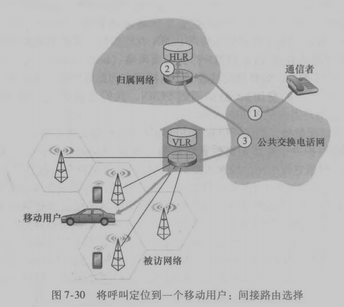

- GSM切换
  - 用户周期性测量当前周围基站信号强度,切换有GSM的就基站发起
  - 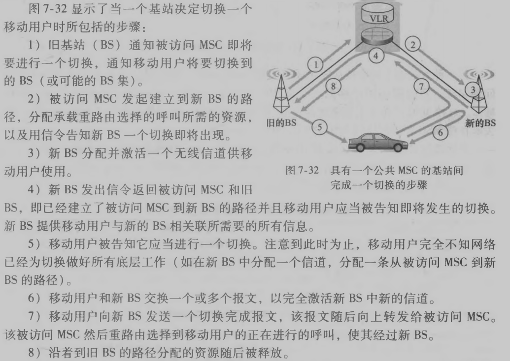

### 8 无线和移动性:对高层协议的影响

- 根据网络的分层模型,理论上传输层/应用层受到的影响很小,

  TCP通常在有线和无线具有很大的性能差异

  - TCP在没有收到确认报文就会重传,不管是拥塞 还是断开网络,出错,

    无线传输的比特错误率更高,TCP就会降低拥塞窗口

    解决方法:

    - 本地恢复,出现差错比特使用ARQ协议(确认/重传机制)
    - TCP发送方知晓无线链路,只对有线链路使用拥塞控制
    - 分离连接方法,移动主机→AP→有线接入点,将一个连接分为两个

## 第8章 计算机网络安全

### 1 什么是网络安全

- 安全意味着AB之间的通信没有被截取/修改,安全通信(secure communication)具有以下特性
  - 机密性(confidentiality),仅有发送/接收方能够理解保温内容
  - 报文完整性(message integrity),传输过程没有被篡改
  - 端点鉴别(end-point authentication),确保通信双方没有被替换
  - 运行安全性(operational security),防止蠕虫/病毒等攻击

### 2 密码学原则

- 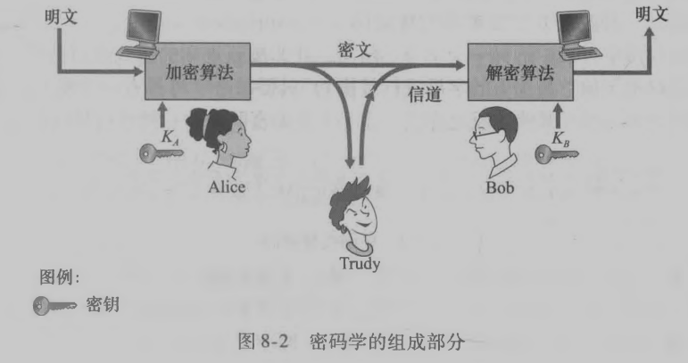

- 对称加密

  - 凯撒密码(Caesar cipher),利用字母移位进行加密,比如a→b,b→c....

  - 改进方案是单码替代密码(monoalphabetic cipher),比如 a→c,b→g

  - 使用多次单码替代密码

    >  简单加密利用统计学可以破解,恩尼格玛密码机可以说是巅峰了

- 破解分类
  - 唯密文攻击(ciphertext-only attack),只得到密文,不了解明文,统计分析有助于破解
  - 已知明文攻击(known-plaintext attack),已知某些字母/单词会出现在明文里
  - 选择明文攻击(chosen-plaintext attack),知道某些单词对应哪些密文

- 对称加密分类

  - 流密码(stream cipher)

  - 块密码(block cipher)用于PGP/SSL/IPsec

    - 密码采用一对一映射,比如 000→101 ,当密码块足够大暴力算法也会很久

      假如采用密码表那么表的大小也会很大,一般采用函数

    - DES(Data Encryption Standard,数据加密标准) 3DES和AES(Advanced Encryption Standard,高级加密标准)

    - 

  - 密码块链接

    - 当相同数据进行加密就会产生相同密文,那么攻击者就很容易猜出明文

    - 可以在密文里面增加某些随机性,使得相同明文出现不同密文, 

      K(m XOR random),K表示加密函数,m表示明文块,random表示随机数

      代价是传输带宽加倍,

    - 块密码一般采用块密码连接(Cipher Block Chaining)技术

      只有第一个报文发送随机数,其余随机数通过计算生成

      CBC需要一种机制保证分发随机数和密钥

- 非对称加密

  - 公钥可以任意获取用于加密,私钥用于解密
  - 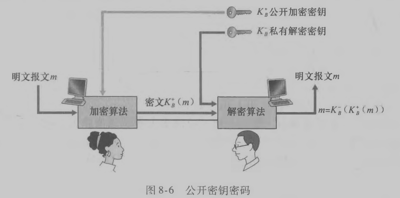

- RSA
  - 利用模算术进行运算
  - 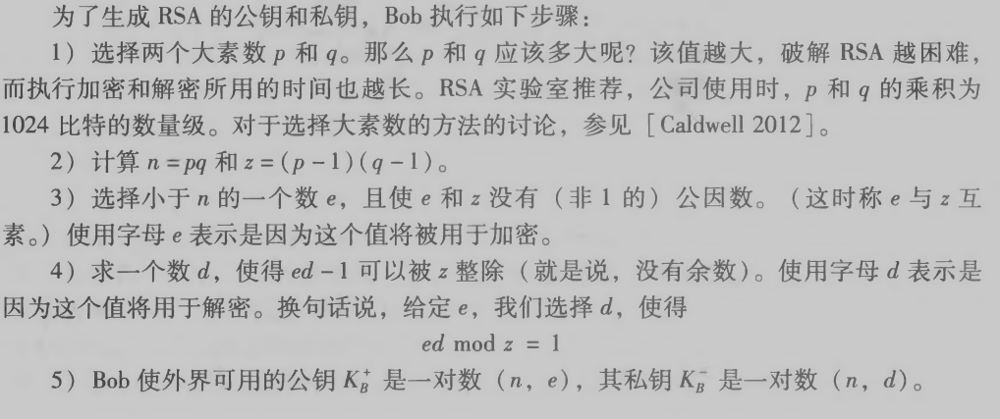
  - 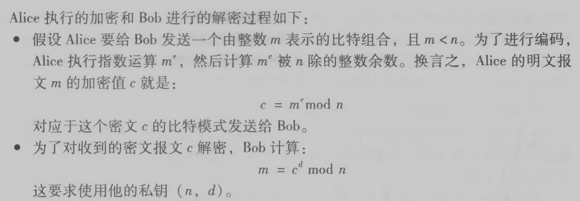

- 会话密钥
  - RSA指数运算十分耗时,DES速度比RSA快得多(100倍),硬件加速的情况下可以达到几千上万倍
  - RSA与对称加密一起使用,A选择对称加密的密钥(称为 会话密钥,Session Key),用RSA进行加密发送给B,之后双方通过对称加密通讯
- RSA工作原理
  
  - 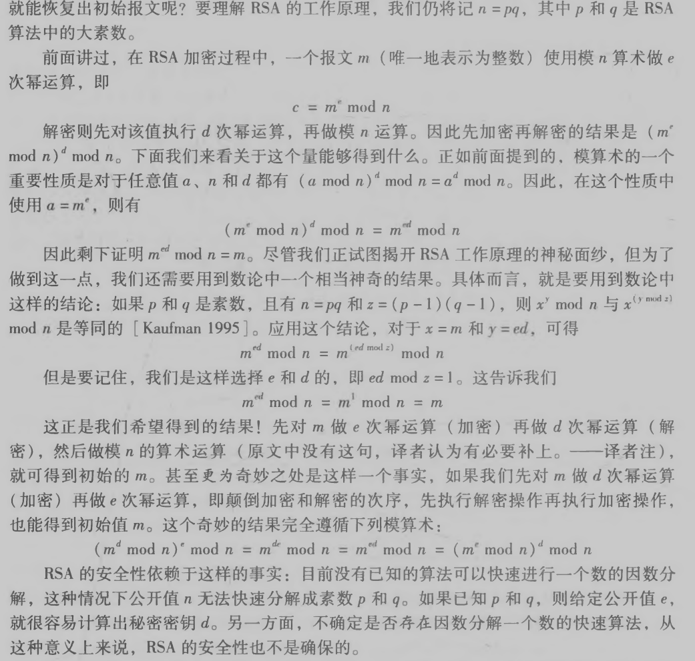

### 3  报文完整性和数字签名

- 密码散列函数(cryptographic hash  function)

  - m作为输入得到固定长度的字符串,CRC/校验和都是
  - 保证输入不同输出不同
  - MD5产生128位散列
    - 填充1直到报文长度满足一定条件
    - 添加64比特报文长度
    - 初始化累加器
    - 循环,对报文16子块进行4轮处理
  - SHA-1也广泛应用,生成160比特散列

- 报文鉴别码

  - 为了报文完整性处理使用密码散列函数,还需要共享比特串,称为鉴别密钥(authentication key)
  - A生成报文m,用密钥s生成m+s,在计算散列H(m+s),称为报文鉴别码(Message Authentication Code)

  - A把 MAC附加到m生成扩展报文发送给B,密钥s可以通过路由器分发
  - 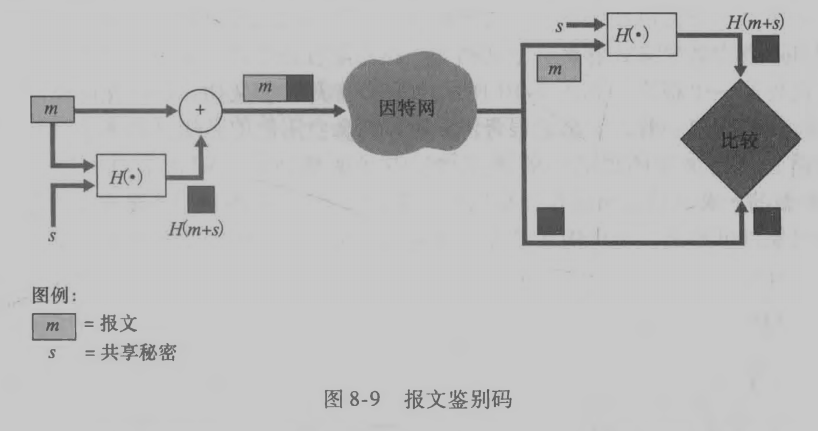

- 数字签名(digital  signature)
  - 通过某种方式加密保证只有作者可以生成的数据,比如非对称加密
  - 数字签名对比之前MAC需要公钥和密钥,需要PKI(公钥基础设置)进行认证支撑
- 公钥认证(public key certification),证明某个公钥属于某个特定实体
  - CA(Certification Center)认证中心使得识别证书合法化
  - 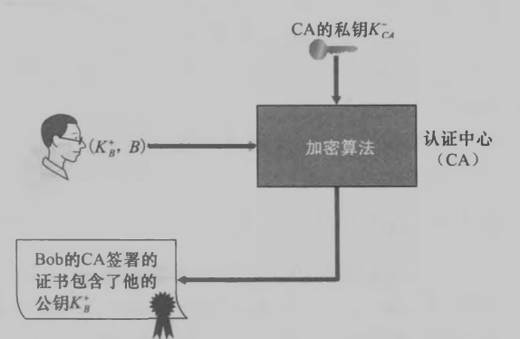


### 4 端点鉴别

- 鉴别协议 (Authentication Protocol)
  - ap1.0,直接发送报文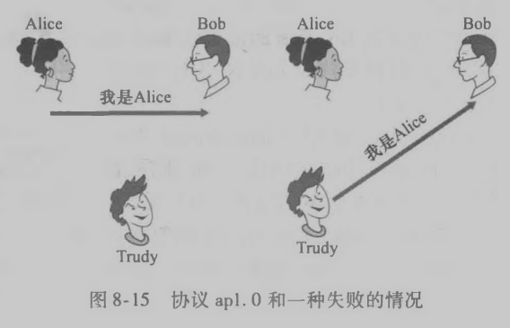
  - ap2.0增加IP地址等,可以使用IP哄骗导致失败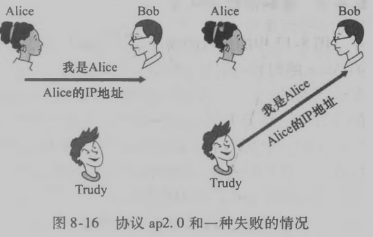
  - ap3.0 使用密令,也就是密码.通过监听等容易被欺骗
  - ap3.1 加密口令,还是无法避免3.0问题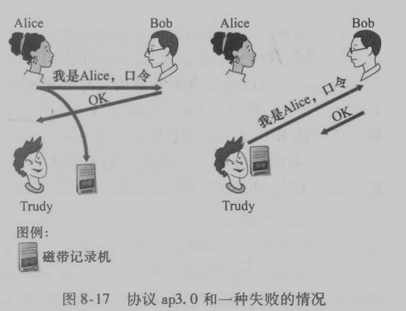
  - ap4.0 
    - 类似三次握手,接收方返回一个不重数(nonse,会话期间不会重复),A/B使用密钥加密不重数
    - 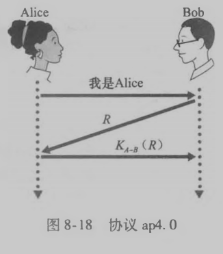

### 5  安全电子邮件

- 设计一个安全电子邮件
  1. Alice对她要发送的报文矶应用一个散列函数H （例如MD5）,从而得到一个报文摘要；
  2. 用她的私钥对散列函数的结果进行签名，从而得到一个数字签名；
  3. 把初始报文（未加密）和该数字签名级联起来生成一个包；
  4. 向Bob的电子邮件地址发送这个包。
- 当Bob接收到这个包时：
  - 他将Alice的公钥 K；应用到被签名的报文摘要上；
  - 将该操作的结果与他自己对该报的散列“进行比较。
  - 如果这两个结果相同，则Bob完全可以确信这个报文来自Alice且未被篡改
  - 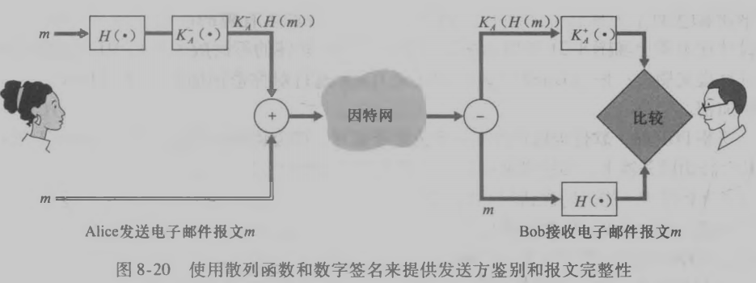

- PGP

  - Pretty Good Privacy软件为用户产生一个公开密钥对。

    该公钥能被张贴到用户的网站上或放置在某台公钥服务器上。

    私钥则使用用户口令进行保护。用户每次访问私钥时都要输入这个口令。

    PGP允许用户 选择是否对报文进行数字签名、加密报文，或同时进行数字签名和加密。 

  - PGP使用可信Web验证,一些PGP用户通过保持密钥签署方（key-signing party）互相签署对方的密钥。用户实际走到一起，交换公钥，并用自己的私钥对对方的公钥签名来互相验证密钥。


### 6 SSL

- 安全套接字层(Security Socket Layer),运输层安全性(Transport Layer Security)
  - 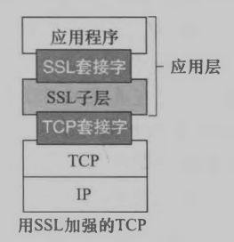


- 宏观描述

  - 三个阶段 握手 密钥导出 数据传输

  - 握手,TCP三次握手,发送hello报文获取证书(由CA认证),产生主密钥加密发给服务器

    

  - 密钥导出

    - Er用于从Bob发送到Alice的数据的会话加密密钥 
    - Mb，用于从Bob发送到Alice的数据的会话MAC密钥 
    - Ea ,用于从Alice发送到Bob的数据的会话加密密钥 
    - Ma用于从Alice发送到Bob的数据的会话MAC密钥

  - 数据传输
    - 对数据分割成记录,对记录进行完整性检查,使用MAC
    - 接收方会维护一个序号计数器,防止重排序/重放报文等攻击
  - SSL记录
    - 前三个字段不加密
    - 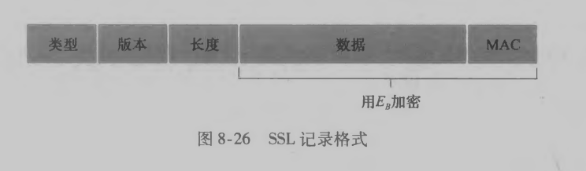

- 完整描述
  - SSL握手(A连接B)
    - A发送支持加密列表和不重数(防止连接重放)
    - 服务器选择一种对称算法,一种公钥加密算法,一种MAC算法,把证书和服务器不重数返回
    - 客户验证该证书,提取公钥,生成前主密钥(Pre-Master Secret),用服务器公钥加密PMS返回
    - 服务器使用相同密钥导出主密钥,切片生成四个密钥
    - 客户发送所有握手报文的一个MAC
    - 服务器发送所有报文的一个MAC(后两步防止被串改握手过程)
  - 关闭连接
    - 如果直接发送TCP FIN终止,很容易遭受 截止攻击(truncation attack)
    - 在类型字段中指明该记录是否用于终止SSL会话,因为会用MAC鉴别

### 7 网络层安全:IPsec和虚拟专用网

- IP安全(IP security )称为 IPsec,很多机构IPsec搭建VPN
- 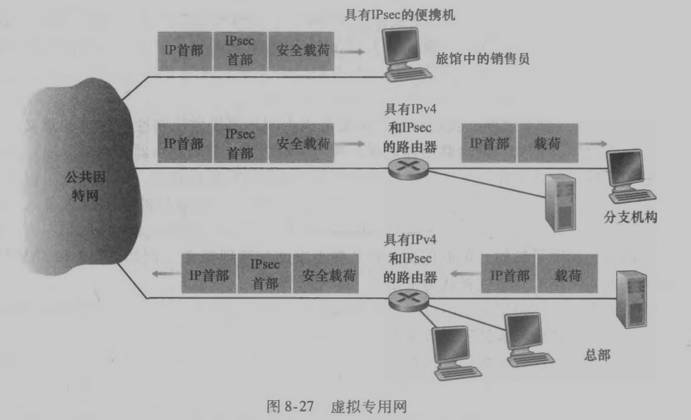

- IPsec有两个主要协议:
  - 鉴别首部(Authentication Header),AH协议提供源鉴别和数据完整性服务，但不提供机密性服务。
  - 封装安全性载荷（Encapsulation Security Payload, ESP）提供了源鉴别、数据完整性和机密性服务

- 安全关联
  - 从源实体向目的实体发送IPsec数据报之前，源和目的实体创建了一个网络层的逻辑连接。这个逻辑连接称为安全关联（Security Association, SA）。所以需要创建两个

- IPsec数据报
  - 具有隧道模式和运输模式,前者更广泛
  - 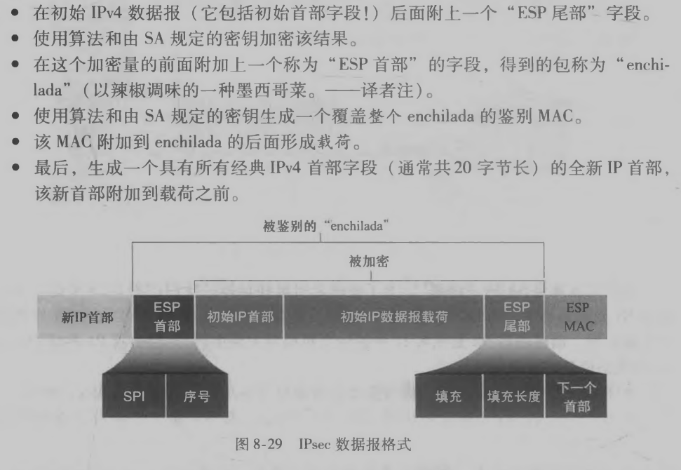


- IKE： IPsec中的密钥管理
  - 大型的、地理上分散的部署要求一个自动的机制来生成SAO IPsec使用因特网密钥交换（Internet Key Exchange, IKE）协议来从事这项工作

### 8 使无线LAN安全

- 有线等效保密
  - 最初在802. 11规范中标准化的安全性机制，该规范统称为 有线等效保密（Wired Equivalent Privacy, WEP）
  - 1） 无线主机通过接入点请求鉴别。 
  - 2） 接入点以一个128字节的不重数值响应该鉴别请求。 
  - 3） 无线主机用它与这个接入点共享的密钥加密这个不重数值。 
  - 4） 接入点解密主机加密的不重数值。


- IEEE 802 11i
  - 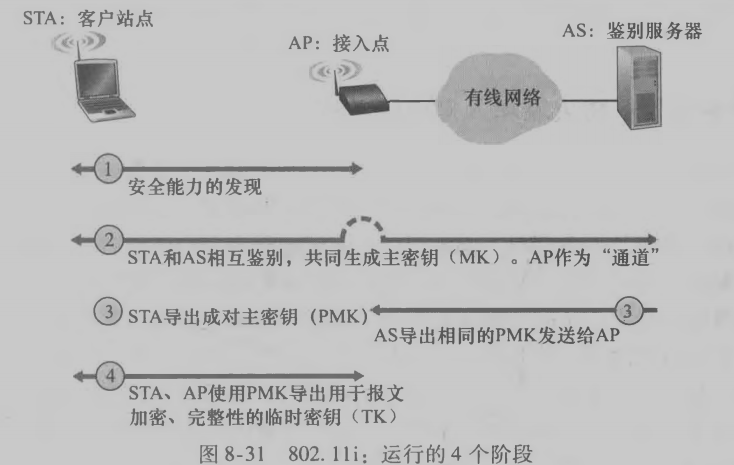


### 9 运行安全性：防火墙和入侵检测系统

- 防火墙
  - 防火墙（firewall）是一个硬件和软件的结合体，它将一个机构的内部网络与整个因特网隔离开，允许一些数据分组通过而阻止另一些分组通过。
  - 对流量进行控制/拦截等,自身免于渗透
  - Linux使用iptables产生防火墙

- 分组过滤器
  - 所有离开和进入内部网络的流量都要经过这个路由器，而这个路由器正是分组过滤（packet filtering）出现的地方
  - 过滤因素有 IP/协议类型/标志位/接口规则等
  - 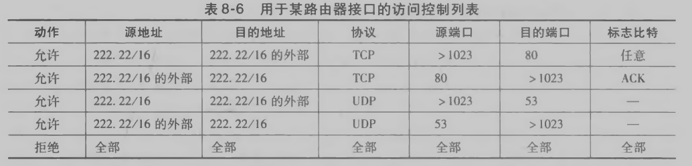
- 状态分组过滤器
  - 状态过滤器通过用一张连接表来跟踪所有进行中的TCP连接来解决分组全部拦截问题
  - 因为防火墙能够通过观察三次握手（SYN、SYNACK和ACK）来观察一条新连接的开始；而且当它看到该连接的一个FIN分组时，它能够观察该连接的结束。 
  - 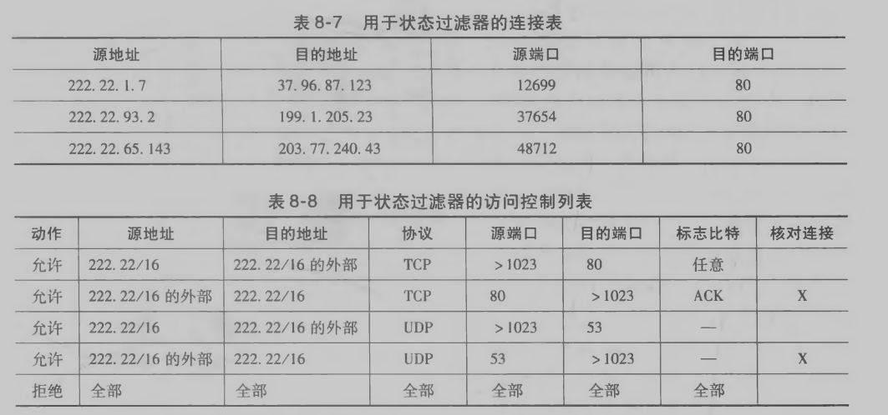

- 应用程序网关
  - 路由器可以阻塞某些Telenett连接,但是从应用程序网关的放行
  - 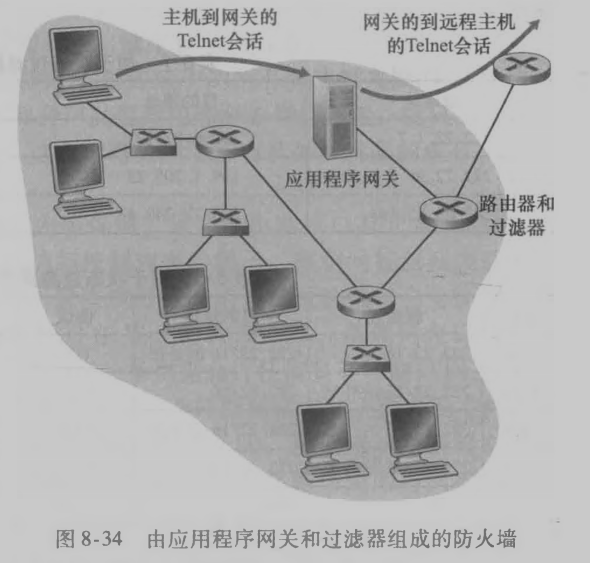

- 代理提供隐私

  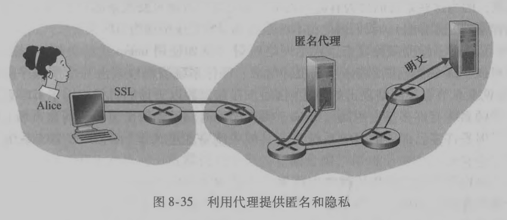

- 入侵检测系统
  - 当观察到潜在恶意流量时能产生告警的设备称为入侵检测系统（Intrusion Detection System, IDS） 
  - 滤除可疑流量的设备 称为入侵防止系统（Intrusion Prevention System, IPS） 
  - IDS可以检测多种攻击,包括网络映射（例如使用rmrnp进行分析）、端口扫描、TCP栈扫描、DoS带宽洪泛攻击、蠕虫和病毒、操作系统脆弱性攻击和应用程序脆弱性攻击。
  - IDS系统大致可分类为基于特征的系统(signature-based system)或基于异常的系统(anomaly-based system) ,基于特征的IDS维护了一个范围广泛的攻击特征数据库。
  - Snort是一种公共域开放源码的IDS

## 第9章 多媒体网络

### 1 多媒体网络应用

- 视频的性质 

  - 高比特率,可被压缩(空间冗余,多个地方颜色相近;时域冗余,前后帧差别小)
  - 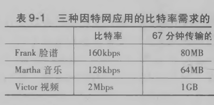

- 音频性质
  - 转换过程
    - 模拟音频信号以某种固定速率采样,比如8000,采样值被量化(quantization)为最节点的有限个数值(比如256),量化值用比特表示
    - 假如采样率8000/s,量化8bit,那么速率64kbps,这种方式称为脉冲编码调制(Pulse Code Modulation,PCM)
  - PCM在语音中很少用,取而代之的是使用压缩后的版本 
    - MPEG2第三层,也就是MP3,128kbps是最常用的编码速率
    - 高级音频编码(advanced audio code,AAC)是苹果的音频编码

- 多媒体应用类型

  - 流式存储音视频

    - 事先录制完成上传到服务器,用户按需请求观看.比如Youtube/Netflix等等
    - 流(streaming),客户接收几秒文件后开始播放,边播放边缓存,不必下载完整个文件
    - 相互作用,用户可以对多媒体内容进行暂停/前进/后退/快进等操作
    - 连续播放
    - 想要连续播放,需要平均吞吐量保持在视频速率之上

  - 会话式IP语音和视频

    - 称为因特网电话(Internet telephone),也成为IP语音(Voice-over-IP,VoIP),

      容忍丢包,时延要低

  - 流式实况音视频

    - 类似于广播的应用,通常使用CDN实现

### 2 流式存储视频

- 类型分类,尽管有UDP流/HTTP流/适应性HTTP流三种,但大部分使用了后两种

  三种共同特点特点是广泛使用了客户端应用缓存，以此来缓解变化的端到端时延和变化的服务器和客户之间可用带宽量的影响

- UDP流,服务器通过UDP以一种稳定的速率记录下视频块，用与客户的视频消耗速率相匹配的速率传输视频

  - 在将视频块传递给UDP之前，服务器将视频块封装在运输分组中，该运输分组是专门为传输音频和视频而设计的，使用了实时传输协议（Real-Time Transport Protocol, RTP）
  - 还并行维护了一个单独的控制连接，通过该连接，客户可发送有关会话状态变化的命

- HTTP流
  - 客户以HTTP Get请求获取视频文件,本地客户端缓存一定数量便开始播放
  - HTTP流穿越防火墙和NAT更容易,消除需要媒体瞳孔服务器的不便
  - 当平均TCP吞吐量大致为媒体比特率的两倍时，TCP流导致最小的饥饿和低缓存时延(缓冲速率比播放速率快)
  - 如果客户应用缓存变满，反向压力将引起TCP缓存变满，这将迫使服务器降低其速率。
  - HTTP流可以使用 HTTP字节范围首部 指明希望获取的视频字节范围,当视频重定位到未来点时很有用
  - 分发存储和实况视频经常使用CDN


### 3 IP语音

- 尽力而为服务的限制

  - 前提,发送方每秒产生8000字节,且每20ms将字节汇聚成块,块和首部封装在UDP,一个块160字节,每20ms发送一个UDP报文

  - 丢包,可能由于用拥塞/队列爆满等IP数据报被丢弃

    - 使用TCP可以避免丢包,但是重传增加时延,拥塞控制会导致缓存饥饿

    - 一般使用UDP,除非用户阻碍了UDP(使用防火墙/NAT进行阻碍)

      即使有部分丢包,也可以通过前向纠错进行恢复

- 端到端时延
  - 对于实时会话式应用，例如VoIP,听电话的人对于小于150ms的端到端时延是觉察不到的；在150ms和400ms之间的时延能够接受,但是不够理想；超过400ms的时延可能严重妨碍语音谈话的交互性。

- 分组时延抖动(jitter)

  - 是一个分组在网络路由器中经历的变化的排队时延。由于这些可变的时延，从在源中产生分组到它在接收方收到的这段时间，对于不同的分组可能会有波动，
  - 通过序号,时间戳,播放时延消除

- 消除时延抖动

  - 为毎个块预先计划一个时间戳(timestamp) ,发送方用每个块产生的时刻为它加上时间印记

  - 接收方延迟播放

    - 固定播放时延,接收方试图在块产生的q ms 后播放

    - 适应性时延,通过之前的加权平均时延来估计时延

      di时平均网络时延估计值,ri时接收时间,ti是发送时间,pi是播放时间

      d~i~ = (1-u)d~i-1~+d(r~i~-t~i~)

      v~i~ = (1-u)v~i-1~+u |r~i~ - t~i~ - d~i~|,表示误差

      p~i~ = t~i~ + d~i~ + Kv~i~,K =4 

- 丢包恢复

  - 丢包恢复方案(loss recovery scheme)

  - 前向纠错(Forward Error Correction)

    - 通过给初始分组流增加冗余信息,第一种每发送n个块,就发一个冗余编码快,由前面n个块异或得到,丢失一个还可以恢复,增加了播放时延和传输速率
    - 发送一个低分辨率音频流作为冗余信息,第n个块携带第n-1个块的低分辨率版本
    - 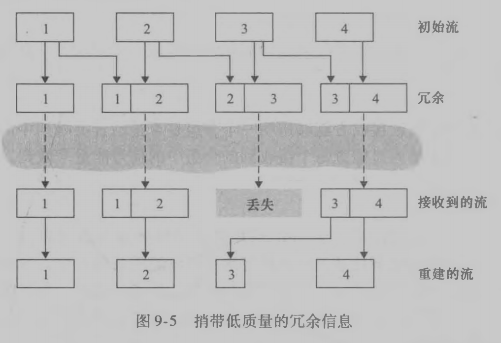

  - 交织(interleaving)

    - 不是按序发送块,而是重新组织排序,交错排序,增加时延,但是不增加带宽

      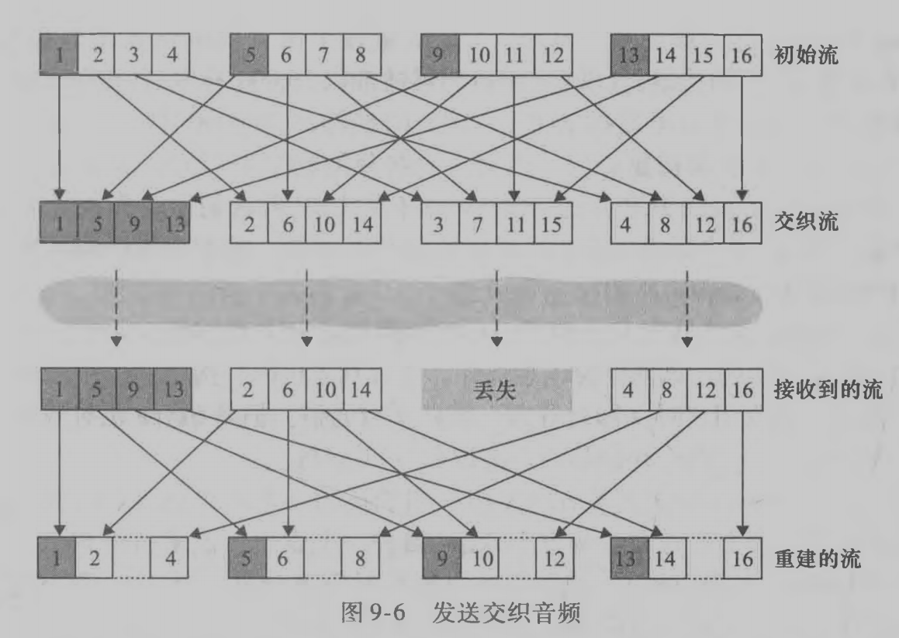

- 差错掩盖
  - 音频信号（特别是语音）呈现出大量的短期自相似性，适合于工作在相对小的丢包率（低于15%）和小分组（4〜40ms）的情况。
  - 简单重复之前分组,或者使用内插法(跟图像处理的图像金字塔类似)

### 4 实时会话式应用的协议

- RTP

  - 能够用于传输通用格式，如用于声音的PCM、ACC和MP3,用于视频的MPEG和H.263。它也可以用于传输专用的声音和视频格式。

  - 运行在 UDP之上,假设采用64kbps的PCM编码,每20ms的块由160字节,

  - RTP首部包含音频编码类型/序号/时间戳,通常是12字节

  - 不确保数据及时交付/丢失/重排序等,可以用于多播,比如视频会可以可以同时产生音频/视频多个流

  - 有效载荷类型,7bit,用于区分不同的音视频格式

    序号,16bit,发送一个加一,用于丢包检测和恢复分组序列

    时间戳,31bit,第一个字节采样时刻

    同步源标识符,32bit,表示RTP流的源,不是IP地址

  - 

  - | 有效载荷类型编号 | 音频格式 | 采样速率 | 速率    |
    | ---------------- | -------- | -------- | ------- |
    | 0                | PCM      | 8kHz     | 64kbps  |
    | 1                | 1016     | 8kHz     | 4.8kbps |
    | 3                | GSM      | 8kHz     | 13kbps  |
    | 14               | MPEG     | 90kHz    | --      |
    |                  | 视频格式 |          |         |
    | 26               | 运动JPEG |          |         |
    | 31               | H.261    |          |         |

    

- SIP

  - 会话发起协议(Session Initiation Protocol, SIP)

    - 提供了在主叫者和被叫者之间经IP网络创建呼叫的机制。
    - 提供了主叫者确定被叫者的当前IP地址的机制
    - 提供了用于呼叫管理的机制，

  - 向已知IP建立呼叫

    - Alice的INVITE报文会携带希望收到音频格式

    - SIP是一个带外协议,即发送和接收SIP报文使用了一个不同于发送和接收媒体数据的套接字

      SIP报文本身是可读ASCII

      SIP报文要求确认,能够在TCP/UDP运行

    - 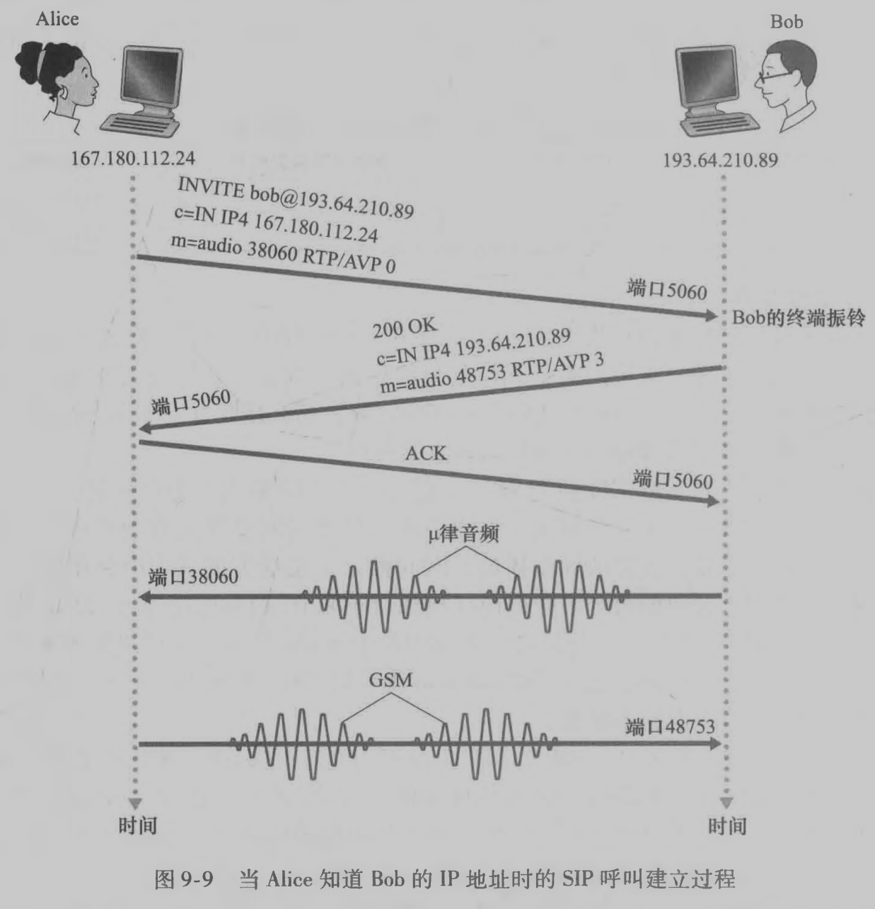

  - SIP地址 

    - SIP地址的一个有趣特点是它们能够被包括在Web页面中

  - SIP报文 ,跟HTTP请求报文差不多,包含SIP版本/源/目的/ID/内容类型/长度/接收编码格式等

  - 名字翻译和用户定位

    - SIP报文通过发给SIP代理可以获取IP地址,每个SIP客户端启动时候通过SIP注册器发送SIP注册报文
    - 每个3600秒更新注册及地址,类似DNS
    - 跟邮件发送原理类似
    - 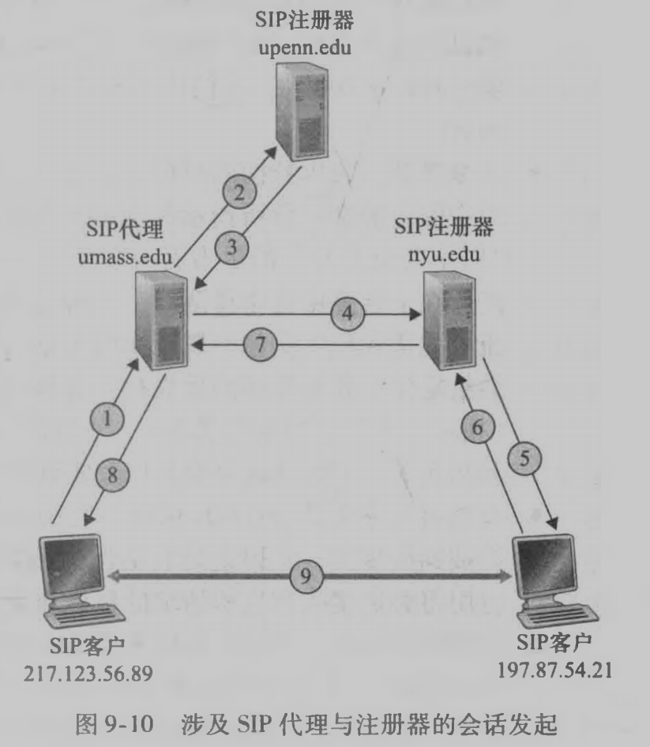

### 5 支持多媒体的网络

- 基础设施
  - 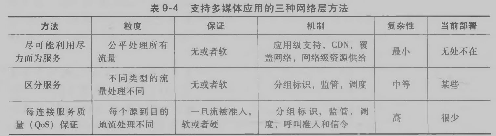

- 定制尽力而为网络
  - 出现时延较大/抖动/丢包,砸钱就能解决
  - 需要注意点点之间的流量需求,定义良好的性能要求,负载模型和带宽分配

- 提供多种类型服务

  - 直接把流会分为不同等级,比如IPv4中由ToS字段

  - 尽力而为模型中HTTP和多媒体类型会相互竞争带宽,假如音频优先的话,会变成专用道路

  - 目标限制流的分组能够发送到网络的平均速率,可以使用漏桶机制,可以限制突发流量和平均流量

  - 漏桶+加权公平队伍=队列可证明的最大时延

    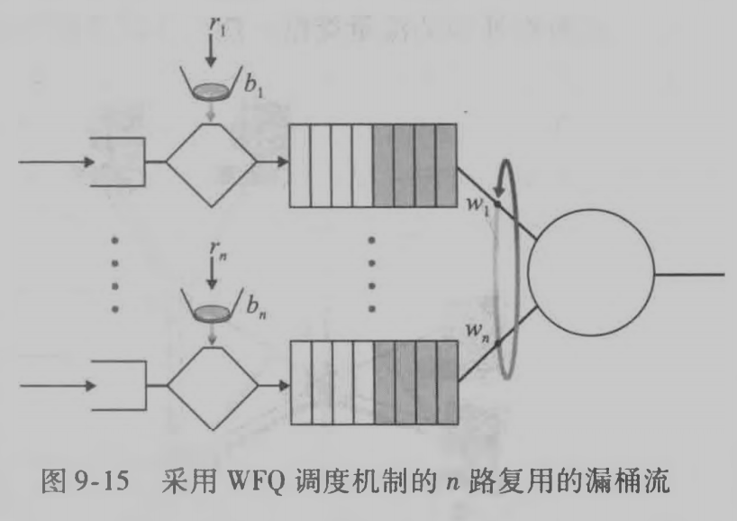


## 附录

### 第5章 控制平面

- Dijstra算法证明

  - 根据算法步骤,当n=0时,也就是初始化,那么两个节点之间最小距离自然是D(v)(直接相连,否则无穷)

  - 当n=k > 0时,所有N'中节点已找到最短路径,当 n = k + 1,寻找具有最小开销且不在N'的节点w,

    此时v必定和N'的某个节点直接相连,(假如不相连则cost时∞,和连通图相矛盾)

    所以更新路径D(v) = min(D(v),D(w)+c(w,v)), N'中最小开销已知,只需要比较经过新节点的路径是否更小

- 常见协议及对应分层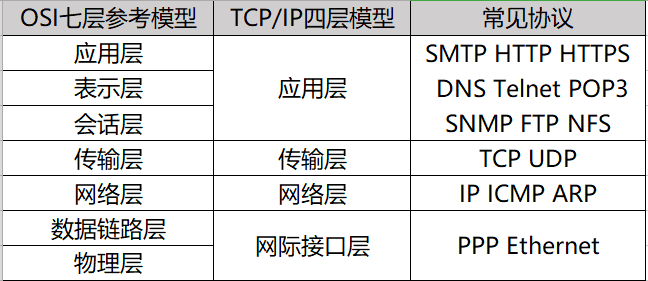