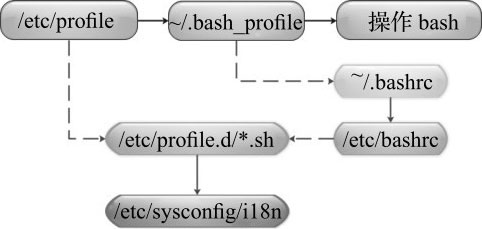
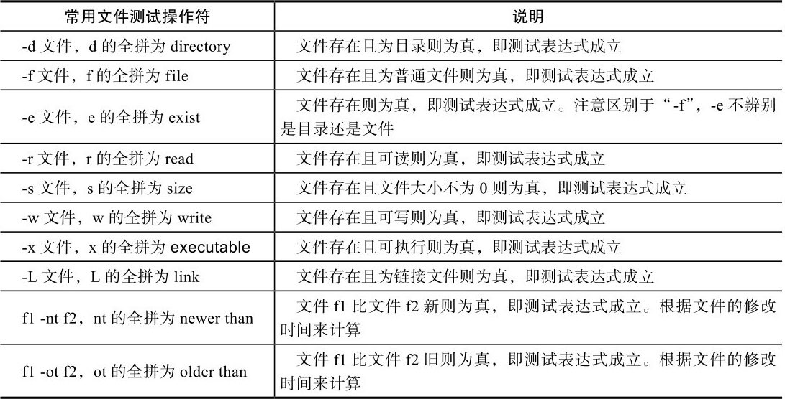
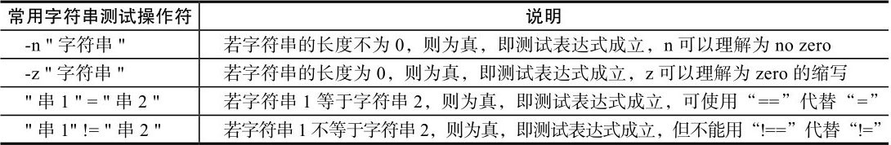
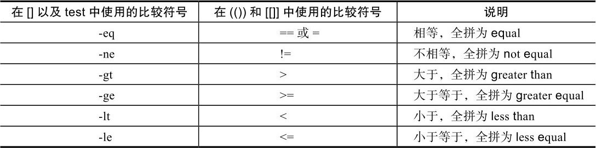
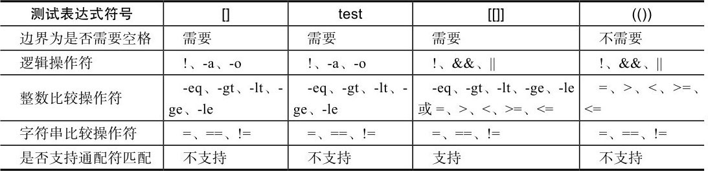
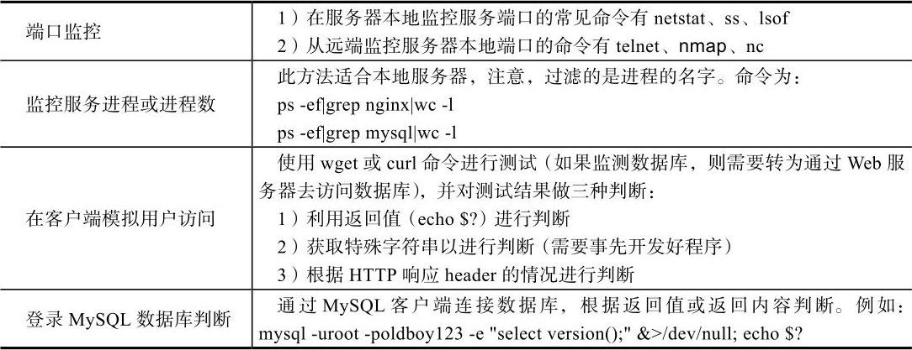

# 跟老男孩学Linux运维：Shell编程实战

- [ ] 书籍作者：老男孩、张耀
- [ ] 笔记时间：2021.8.3

## 第 1 章  如何才能学好Shell编程

### 1.1 为什么要学习Shell编程

- 实现Linux/UNIX系统管理及自动化运维所必备的重要工具
-  Linux/UNIX系统的底层及基础应用软件的核心大都涉及Shell脚本的内容

### 1.2 学好Shell编程所需的基础知识

- vim，ssh需要熟练使用
- 常用命令使用
- 熟练掌握Linux正则表达式及三剑客命令（grep、sed、awk）
- 熟悉常见的Linux网络服务部署、优化、日志分析及排错。

### 1.3 如何才能学好Shell编程之“老鸟”经验谈

- 多看多练
- 规范一些

## 第 2 章 Shell脚本初步入门

### 2.1 什么是Shell

- Shell是一个命令解释器，它的作用是解释执行用户输入的命令及程序等。是交互式

### 2.2 什么是Shell脚本

- 命令写入文件 ，让shell执行该文件，这个文件称为shell脚本

### 2.3 Shell脚本在Linux运维工作中的地位

- 很适合用于处理纯文本类型的数据

### 2.4 脚本语言的种类

- shell有很多种，选一种常用的即可
- 还有其他语言脚本，比如python等

### 2.5 常用操作系统默认的Shell

- ```shell
  echo $SHELL
  grep root /etc/passwd
  # 查看默认shell，常用的是bash（Bourne  Again Shell）
  ```

### 2.6 Shell脚本的建立和执行

- ```shel
  #!/bin/bash #指明使用哪个程序执行该脚本，头两个字符称为幻数，必须在第一行 
  bash --version
  ```

- 脚本执行顺序

  - 查找环境 变量ENV，该变量指定了环境文件（加载顺序通常是/etc/profile、～/.bash_profile、～/.bashrc、/etc/bashrc等）
  - 遇到了脚本嵌套 ，会先执行子脚本内容再返回父脚本。子脚本是一个新进程。

- 脚本执行 
  - bash 脚本名 推荐
  - ./脚本名 具有执行权限的时候，可以直接用
  - source/.  脚本名，可以将自身脚本变量传递到当前父Shell脚本 。（在shell中执行shell脚本的情况）
  - sh \< 脚本名 或 cat 脚本名，出奇制胜
- 总结 -- 子脚本默认继承父脚本变量，父脚本可以通过source加载子脚本获取其变量

## 第 3 章 Shell变量的核心基础知识与实践

### 3.1 什么是Shell变量

- 变量是暂时存储数据的地方及数据标记，shell可以直接使用变量，不用声明，取变量使用＄变量名 。
- 变量不区分类型，一般只分为全局变量和局部变量

### 3.2 环境变量

- 一般是指用export内置命令导出的变量，用于定义Shell的运行环境
  - 如果希望永久保存，可以在 \.bash_profile  或者  .bashrc(非用户登录)，/etc/bashrc(非用户登录)，/etc/profile定义
- 最好使用全大写变量名字，
  - 使用 `env`可以查看已有全局变量。
  - `set`输出所有变量（包括局部变量）
  - `declare`输出所有的变量、函数、整数和已经导出的变量
- 自定义环境变量
  - 设置环境变量使用 `export` 或者 `declare -x`，单次会话生效
  - 用户环境变量配置 -- 用户家目录下的 `.bashrc` 和 `.bash_profile`
  - 全局环境变量配置 -- `/etc/profile`  , `/etc/bashrc` , `/etc/profile.d`，若要在登录后初始化或显示加载内容，则把脚本文件放在最后一个目录下即可，无需执行权限。
- 设置登录提示
  - `/etc/motd`文件修改
  - `/etc/profile.d/`下添加脚本，打印需要输出的字符串
- 打印/删除变量
  - `echo` 或者  `printf`，后者可以格式化打印
  - `unset` 可以删除局部变量或者全局变量
- 环境变量加载顺序
  - 用户登录默认运行shell，
  - 不是登陆启动，只会加载 `.bashrc` 和  `/etc/bashrc`

### 3.3 普通变量

- `key=value`直接使用即可
  - 无包裹，会进行解析
  - 单引号包裹，不解析
  - 双引号，进行解析，推荐使用。
  - 使用 反引号 或者 $(命令) 可以将结果赋值给变量
- sed 和 grep 字符串解析规则是和上面一致的，awk 需要注意，单引号和双引号相反。

### 3.3 普通变量

- 学习和模仿操作系统自带的/etc/init.d/functions函数库脚本的定义思路

## 第 4 章 Shell变量知识进阶与实践

### 4.1 Shell中特殊且重要的变量

- `＄0` 当前执行脚本文件名
  - 可以配合`dirname`和`basename`进行路径和文件名提取
- `＄n` 执行脚本的第 n 个参数，可以使用 `＄{1..15}`进行简写，大于10需要使用花括号
- `＄#` 执行脚本参数个数
- `＄*`执行脚本所有参数，不加引号和下者相同，加双引号则视所有参数为单个字符串
- `＄@` 加双引号视所有参数为不通过的独立字符串
- Shell进程中的特殊状态变量
  - `$?` 执行命令后获取返回值，0成功，其余失败
  - `$$` 获取脚本进程号 PID
  - `$_` 上一条命令的最后参数
  - `$!` 上一次执行脚本的pid

### 4.2 bash Shell内置变量命令

- ```shell
  echo -n \ 	#不换行输出内容 
  	 -e \ 	#解析转义字符串,回车换行等
  eval 		#读入参数并组合成新命令执行
  exec 		#不创建子进程情况下执行该命令
  read		#标准输入读取字符串
  shift		#参数向左位移
  exit		#退出shell,可以给出返回值
  ```

  

### 4.3 Shell变量子串知识及实践

- 字符串的各种操作，查找、过滤、拼接等

- `${param}`返回内容

- `${#param}`返回内容长度，利用 `wc -L` 也可以，或者  `expr length "$param"`

- `${param:begin:length}`，左闭右开，可以利用 `cut -c` 实现

- ```shell
  ${param#pattern}	# 表示从开头删除匹配最短。
  					# ##表示从开头删除匹配最长。
  					# %表示从结尾删除匹配最短
  					# %%表示从结尾删除匹配最长。
  					# pattern 表示正则表达式
  					
  ```

- `${param/ori/replace}` 使用 replace 替换 ori，第一个斜杠变成双斜杠表示全部替换 。

### 4.4 Shell特殊扩展变量的知识与实践

- `${parameter:-word}` 如果parameter变量值为空或未赋值，则会返回word字符串替代变量的值。
- `${parameter:=word}` 如果parameter变量值为空或未赋值，就设置这个变量值为word，并返回其值。位置变量和特殊变量不适用。
- `{parameter:? word}` 如果parameter变量值为空或未赋值，那么word字符串将被作为标准错误输出，否则输出变量的值。
- `${parameter:+word}` 如果parameter变量值为空或未赋值，则什么都不做，否则word字符串将替代变量的值。

## 第 5 章 变量的数值计算实践

### 5.1 算术运算符

### 5.2 双小括号“(())”数值运算命令

- 数值计算，可以计算变量，只能计算整数

### 5.3 let运算命令的用法

- 相当于双括号。

### 5.4 expr命令的用法

- 命令既可以用于整数运算，也可以用于相关字符串长度、匹配等的运算处理。
- expr在Shell中可配合变量进行计算，但需要用反引号将计算表达式括起来。
  - 判断字符串是否为整数，利用expr做计算，将一个未知的变量和一个已知的整数相加，看返回值是否为0，如果为0就认为做加法的变量为整数，否则就不是整数。
- 功能很强大

### 5.5 bc命令的用法

- 可以通过管道传输给计算器，计算小数适合
- `seq -s "+" 10`生成数字序列
- `tr` 替换

### 5.6 awk实现计算

- 调用print，参数运算处理

### 5.7 declare（同typeset）命令的用法

- 需要定义才能生效，比较接近传统编程语言。

### 5.8 $[]符号的运算示例

- 可以在括号里运算，跟双括号接近

### 5.9 基于Shell变量输入read命令的运算实践

- `read` 读入，可以通过参数p设置提示，参数t设置超时。

## 第 6 章  Shell脚本的测试与比较

### 6.1 Shell脚本的条件测试

- 可以使用 test  ，中括号，双中括号 ，双小括号
- test 可以用于测试文件存在等，f文件存在，z长度为零
- []和上者一致
- [[]]可以支持通配符和 && 这种操作

### 6.2 文件测试表达式

- 

- 配合逻辑运算符进行回显，不如if容易理解

### 6.3 字符串测试表达式

- 

### 6.4 整数二元比较操作符

- 

- 除非是特殊的正则匹配等，在[]无法使用的场景下才会考虑使用[[]]。

### 6.5 逻辑操作符

- []中使用-a或-o更常见，[[]]中使用&&或||不常见

### 6.6 测试表达式test、[]、[[]]、(())的区别总结

- 

## 第 7 章  if条件语句的知识与实践

### 7.1 if条件语句

- ```shell
  if [ conditon ]
  	then
  elif [ condition2 ] ; then
  else
  fi
  ```

  

### 7.2 if条件语句企业案例精讲

- 监控web和 数据库案例
  - 

- ```shell
  # 端口监控
  netstat -lntup  # 查看本机tcp服务器端口 
  lsof -i tcp:3306
  # 数据库服务，远程监控
  telnet ip port
  nmap ip -p port
  nc -w 2  ip port
  ```

- ```shell
  # 服务进程监控
  wget --spider  --timeout=10 --tries=2  url
  curl -s -o /dev/null url
  ps -ef | grep -v  grep|grep xxx | wc -l  
  ```

- ```shell
  # 判断使用sed加正则
  # 判断使用字串替换加正则
  # expr
  # 利用“=～”符号判断
  ```

## 第 8 章 Shell函数的知识与实践

### 8.1 Shell函数的概念与作用介绍

### 8.2 Shell函数的语法

### 8.3 Shell函数的执行

- 跟命令一样使用，独立脚本需要用source加载

### 8.4 Shell函数的基础实践

- ```shell
  cat  >> file << EOF	#  添加到file结尾，EOF结束
  source file 		# 加载文件才能使用里面的函数
  ```

### 8.5 利用Shell函数开发企业级URL检测脚本

### 8.6 利用Shell函数开发一键优化系统脚本

- 配置yum源，禁用不需要的服务等操作

## 第 9 章 case条件语句的应用实践

### 9.1 case条件语句的语法

- ```shell
  case "xxx" in
  	con)
  		...
  		;;
  	con)
  		...
  		;;
  	*)
  		...
  		;;
  esac		
  ```

### 9.2 case条件语句实践


