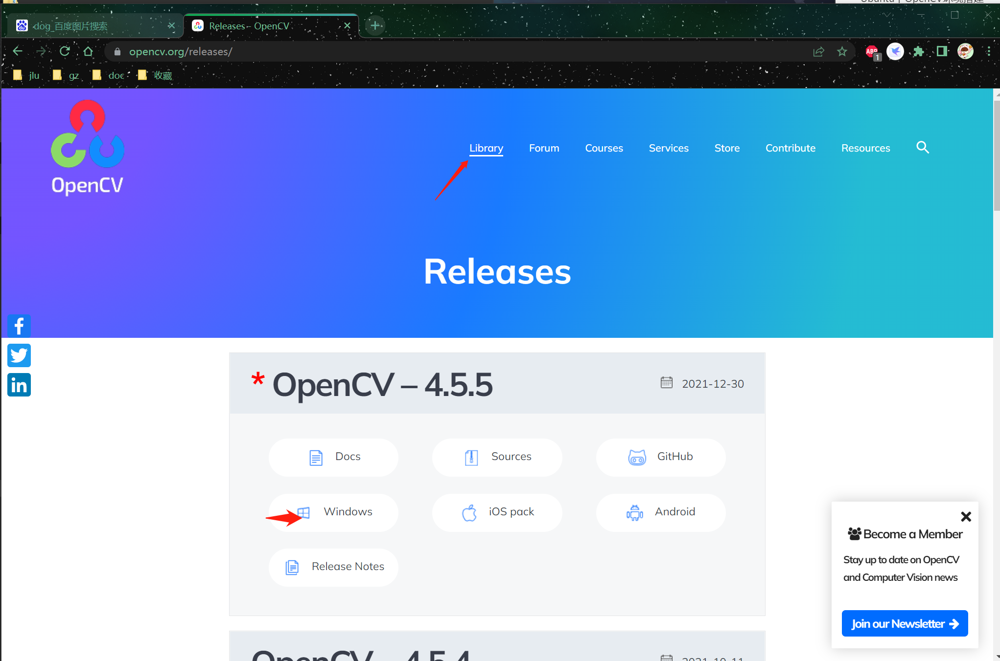
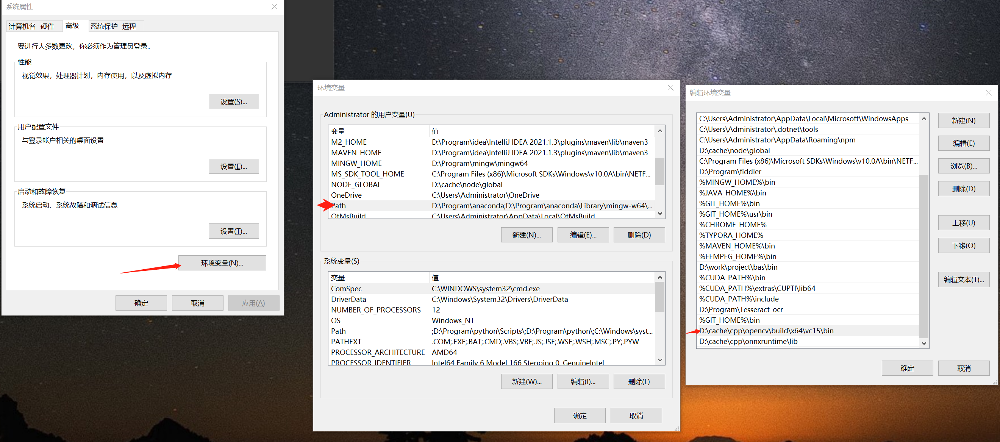
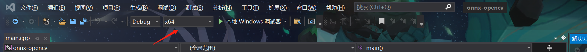
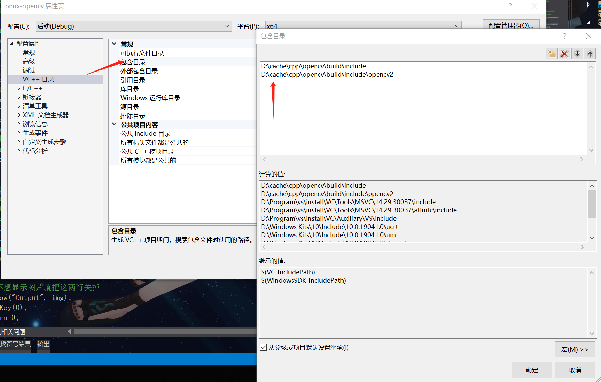
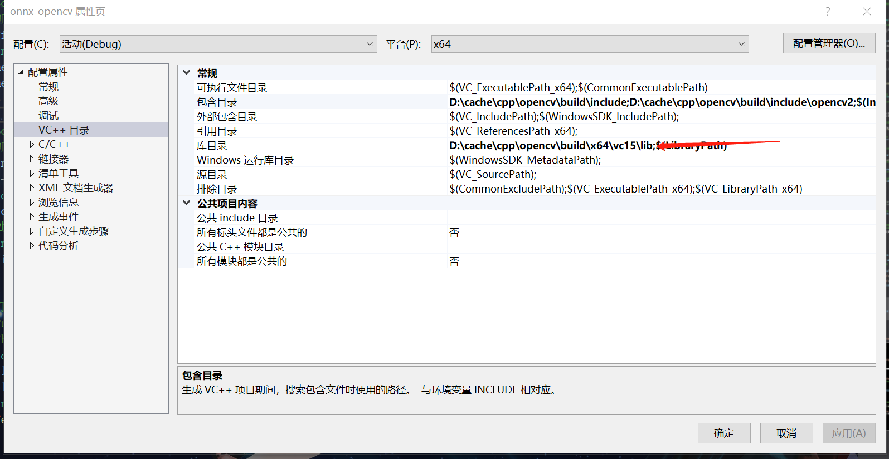
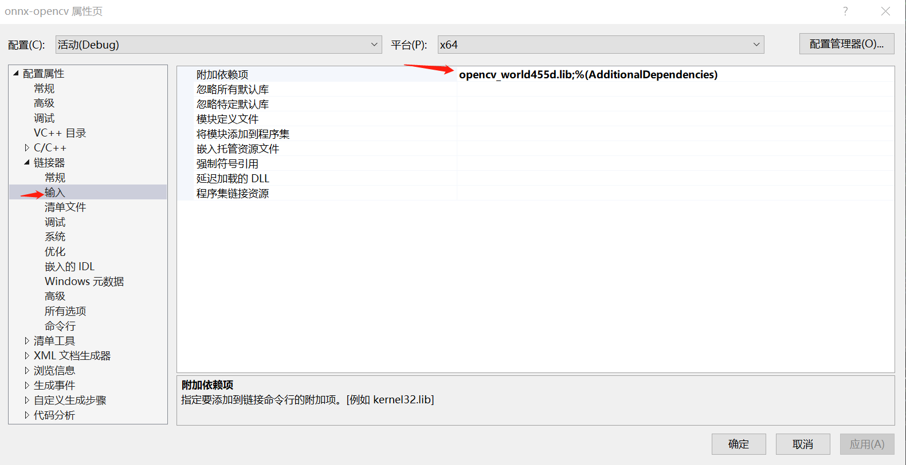

# Ubuntu下OpenCV环境搭建

- 笔记时间:2022.4.14

## 1 步骤

- [官网查看](https://docs.opencv.org/4.5.5/df/d65/tutorial_table_of_content_introduction.html)
- 环境Ubuntu

### 下载并编译Opencv-Linux

- 编译核心模块

- ```shell
  # Install minimal prerequisites (Ubuntu 18.04 as reference)
  # 安装依赖
  sudo apt update && sudo apt install -y cmake g++ wget unzip
  # Download and unpack sources
  #下载源码
  wget -O opencv.zip https://github.com/opencv/opencv/archive/4.x.zip
  unzip opencv.zip
  # Create build directory
  # 创建编译目录并编译
  mkdir -p build && cd build
  # Configure
  cmake  ../opencv-4.x
  # Build
  cmake --build .
  ```

- 安装

- ```shell
  # 安装会把头文件/库安装到 /usr/local/lib , /usr/local/inclue ...,用户需要使用root权限
  sudo make install
  # 默认依赖库是在 /usr/lib查找,所以添加库查找
  vim /etc/ld.so.conf
  # 添加库,内容如下
  include /etc/ld.so.conf.d/*.conf
  /usr/local/lib/
  ```

- 验证是否成功

- ```cpp
  #新建一个cpp文件
  #include <iostream>
  #include <opencv2/opencv.hpp>
  
  int main() {
  	std::cout << "hello world";
  	cv::Mat a(10, 10, CV_8U, 10);
  	std::cout << a << std::endl;
  	return 0;
  }
  ```

- ```shell
   #假如没有错误应该正确生成
   g++ main.cpp\
   -I/usr/local/include/opencv4 \
   -I/usr/local/include/opencv4/opencv2 \
   -L /usr/local/lib \
   -l opencv_core 
   
   #,测试无报错就成功
   ./a.out
   
  ```

  


### Visual Studio 2019 配置

- 建立远程连接跨平台项目,项目配置好需要的头文件和库

- 项目属性 - 配置属性 - VC++目录

  - ```shell
    # 包含目录,头文件的位置,需要先查看一下在哪里
    /usr/local/include/opencv4/
    /usr/local/include/opencv4/opencv2
    ```

  - ```shell
    # 库目录, so文件所在
    /usr/local/lib
    ```

    

- 项目属性 - 配置属性 - 链接器

  - ```shell
    # 输入 - 库依赖项,指定需要用到的库
    opencv_calib3d
    opencv_core
    opencv_features2d
    opencv_flann
    opencv_highgui
    opencv_imgproc
    opencv_ml
    opencv_objdetect
    opencv_photo
    opencv_stitching
    opencv_video
    rt
    pthread
    m
    dl
    ```

    

# Windows OpenCV 环境搭建

## 1 步骤

- [官网](https://opencv.org/releases/)

  

- 下载安装,选择安装目录可以自定义安装即可,不要有中文路径

- 修改环境变量,位置是刚才安装路径中的  opencv/build/x64/vc15/bin

  

- VS配置
  - 项目调试环境改为x64
  - 打开项目属性 - 配置属性 - VC++目录 包含目录,添加对应的include
  - 库目录,跟include同级别的lib
  - 最后链接器-输入-附加依赖项,添加lib

# CentOS CUDA 搭建

- [官方教程](https://docs.nvidia.com/cuda/cuda-installation-guide-linux/index.html) 

- ~~安装驱动检测显卡型号~~

   ELRepo源提供了nvidia-detect命令，会自动帮你寻找合适的驱动，然后根据显示的结果，用yum就能完成安装。参考网址：http://elrepo.org/tiki/HomePage

  - 导入公共密钥，执行命令：rpm --import https://www.elrepo.org/RPM-GPG-KEY-elrepo.org
  - 安装elrepo, 执行命令：yum install https://www.elrepo.org/elrepo-release-7.el7.elrepo.noarch.rpm
  - 安装nvidia驱动，执行命令：yum -y install kmod-nvidia
  - reboot 重启
  - 执行nvidia-smi命令可以查询到gpu相关的一些配置

- 安装对应版本的CUDA
  
  - 直接安装对应版本的CUDA,然后再去官网下载对应的驱动安装
- CUDA的安装的时候驱动版本不可以太高,安装完再装驱动就没事
  
  - 新版本的CUDA对GCC有版本要求
  - 根据系统类型/CUDA[版本选择](https://developer.nvidia.com/cuda-11-6-0-download-archive?target_os=Linux&target_arch=x86_64&Distribution=CentOS&target_version=7&target_type=rpm_local)
  
- 安装cudnn
  
  - [版本选择](http://www.javashuo.com/link?url=https://docs.nvidia.com/deeplearning/sdk/cudnn-install/index.html),解压放到指定路径就可以

# CentOS操作

- 升级gcc

  - yum install centos-release-scl

  - yum install devtoolset-8 # 8就是gcc的大版本

  - scl enable devtoolset-8 bash # 临时激活

    source /opt/rh/devtoolset-8/enable 

  - echo "source /opt/rh/devtoolset-8/enable" >>/etc/profile #加入开机启动激活